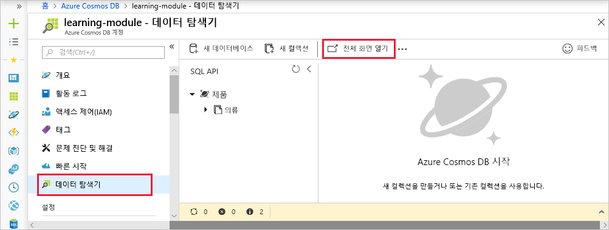
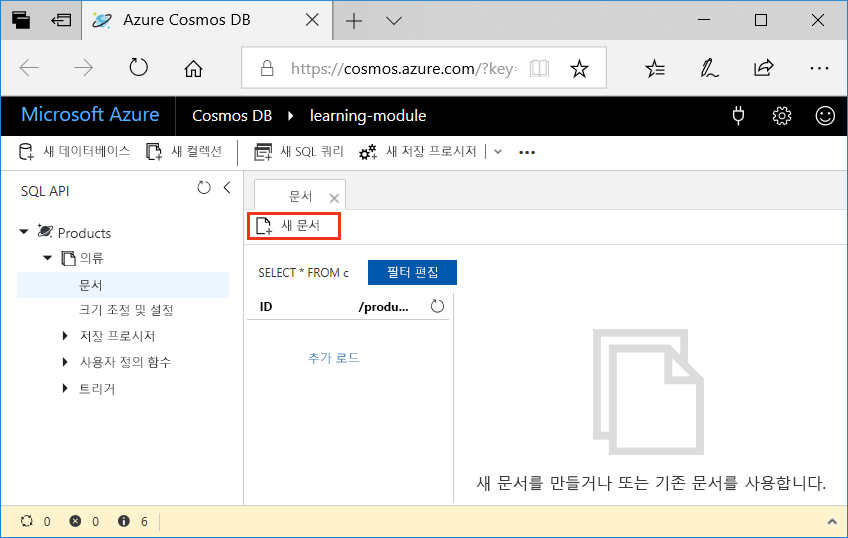
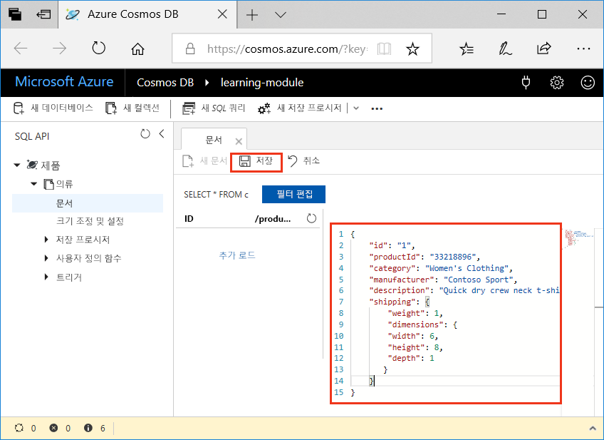

<span data-ttu-id="18129-101">Azure Cosmos DB 데이터베이스에 데이터를 추가하는 작업은 간단합니다.</span><span class="sxs-lookup"><span data-stu-id="18129-101">Adding data to your Azure Cosmos DB database is simple.</span></span> <span data-ttu-id="18129-102">Azure Portal을 열어서 데이터베이스로 이동하고, 데이터 탐색기를 사용하여 JSON 문서를 데이터베이스에 추가합니다.</span><span class="sxs-lookup"><span data-stu-id="18129-102">You open the Azure portal, navigate to your database, and use the Data Explorer to add JSON documents to the database.</span></span> <span data-ttu-id="18129-103">데이터를 추가하는 더 복잡한 방법도 있지만, 여기서는 Azure Cosmos DB에서 제공하는 기능과 내부 작동 방식을 익히는 데 유용한 도구인 데이터 탐색기를 사용하여 데이터 추가 과정을 시작하겠습니다.</span><span class="sxs-lookup"><span data-stu-id="18129-103">There are more advanced ways to add data, but we'll start here because the Data Explorer is a great tool to get you acquainted with the inner workings and functionality provided by Azure Cosmos DB.</span></span>

## <a name="what-is-the-data-explorer"></a><span data-ttu-id="18129-104">데이터 탐색기란?</span><span class="sxs-lookup"><span data-stu-id="18129-104">What is the Data Explorer?</span></span>
<span data-ttu-id="18129-105">Azure Cosmos DB 데이터 탐색기는 Azure Portal에 포함된 도구이며 Azure Cosmos DB에 저장된 데이터를 관리하는 데 사용됩니다.</span><span class="sxs-lookup"><span data-stu-id="18129-105">The Azure Cosmos DB Data Explorer is a tool included in the Azure portal that is used to manage data stored in an Azure Cosmos DB.</span></span> <span data-ttu-id="18129-106">데이터 탐색기에서는 데이터 컬렉션 보기 및 탐색뿐만 아니라 데이터베이스 내 문서 편집, 데이터 쿼리, 저장 프로시저 만들기 및 실행을 위한 UI가 제공됩니다.</span><span class="sxs-lookup"><span data-stu-id="18129-106">It provides a UI for viewing and navigating data collections, as well as for editing documents within the database, querying data, and creating and running stored procedures.</span></span>

## <a name="add-data-using-the-data-explorer"></a><span data-ttu-id="18129-107">데이터 탐색기를 사용하여 데이터 추가하기</span><span class="sxs-lookup"><span data-stu-id="18129-107">Add data using the Data Explorer</span></span>

1. <span data-ttu-id="18129-108">샌드박스를 활성화한 계정과 동일한 계정을 사용하여 [샌드박스용 Azure Portal](https://portal.azure.com/triplecrownlabs.onmicrosoft.com?azure-portal=true)에 로그인합니다.</span><span class="sxs-lookup"><span data-stu-id="18129-108">Sign into the [Azure portal for Sandbox](https://portal.azure.com/triplecrownlabs.onmicrosoft.com?azure-portal=true) using the same account you activated the sandbox with.</span></span>

    > [!IMPORTANT]
    > <span data-ttu-id="18129-109">Azure Portal과 샌드박스에 동일한 계정으로 로그인합니다.</span><span class="sxs-lookup"><span data-stu-id="18129-109">Login to the Azure portal and the sandbox with the same account.</span></span>
    > 
    > <span data-ttu-id="18129-110">위 링크로 Azure Portal에 로그인하여 컨시어지 구독에 액세스를 제공하는 샌드박스에 연결되었는지 확인합니다.</span><span class="sxs-lookup"><span data-stu-id="18129-110">Login to the Azure portal using the link above to ensure you are connected to the sandbox, which provides access to a Concierge Subscription.</span></span>

1. <span data-ttu-id="18129-111">**모든 서비스** > **데이터베이스** > **Azure Cosmos DB**를 클릭합니다.</span><span class="sxs-lookup"><span data-stu-id="18129-111">Click **All services** > **Databases** > **Azure Cosmos DB**.</span></span> <span data-ttu-id="18129-112">그런 다음, 계정을 선택하고 **데이터 탐색기**를 클릭한 다음, **전체 화면 열기**를 클릭합니다.</span><span class="sxs-lookup"><span data-stu-id="18129-112">Then select your account, click **Data Explorer**, and then click **Open Full Screen**.</span></span>
 
   

2. <span data-ttu-id="18129-114">**전체 화면 열기** 상자에서 **열기**를 클릭합니다.</span><span class="sxs-lookup"><span data-stu-id="18129-114">In the **Open Full Screen** box, click **Open**.</span></span>

    <span data-ttu-id="18129-115">웹 브라우저에 새로운 전체 화면 데이터 탐색기가 표시되어 데이터베이스 작업을 위한 더 많은 공간과 전용 환경이 확보됩니다.</span><span class="sxs-lookup"><span data-stu-id="18129-115">The web browser displays the new full-screen Data Explorer, which gives you more space and a dedicated environment for working with your database.</span></span>

3. <span data-ttu-id="18129-116">새 JSON 문서를 만들려면 SQL API 창에서 **Clothing**을 확장하고, **문서**를 클릭한 다음, **새 문서**를 클릭합니다.</span><span class="sxs-lookup"><span data-stu-id="18129-116">To create a new JSON document, in the SQL API pane, expand **Clothing**, click **Documents**, then click **New Document**.</span></span>

   

4. <span data-ttu-id="18129-118">이제 다음의 구조를 사용하여 컬렉션에 문서를 추가합니다.</span><span class="sxs-lookup"><span data-stu-id="18129-118">Now, add a document to the collection with the following structure.</span></span> <span data-ttu-id="18129-119">다음의 코드를 복사하여 **문서** 탭에 붙여넣어 현재 콘텐츠를 덮어씁니다.</span><span class="sxs-lookup"><span data-stu-id="18129-119">Just copy and paste the following code into the **Documents** tab, overwriting the current content:</span></span>

     ```json
    {
        "id": "1",
        "productId": "33218896",
        "category": "Women's Clothing",
        "manufacturer": "Contoso Sport",
        "description": "Quick dry crew neck t-shirt",
        "price": "14.99",
        "shipping": {
            "weight": 1,
            "dimensions": {
            "width": 6,
            "height": 8,
            "depth": 1
           }
        }
    }
     ```

5. <span data-ttu-id="18129-120">**문서** 탭에 JSON을 추가했으면 **저장**을 클릭합니다.</span><span class="sxs-lookup"><span data-stu-id="18129-120">Once you've added the JSON to the **Documents** tab, click **Save**.</span></span>

    

6. <span data-ttu-id="18129-122">**새 문서**를 다시 클릭하고 다음 JSON 개체를 데이터 탐색기에 복사한 후 **저장**을 클릭하여 문서 하나를 더 만들고 저장합니다.</span><span class="sxs-lookup"><span data-stu-id="18129-122">Create and save one more document clicking **New Document** again, and copying the following JSON object into Data Explorer and clicking **Save**.</span></span>

     ```json
    {
        "id": "2",
        "productId": "33218897",
        "category": "Women's Outerwear",
        "manufacturer": "Contoso",
        "description": "Black wool pea-coat",
        "price": "49.99",
        "shipping": {
            "weight": 2,
            "dimensions": {
            "width": 8,
            "height": 11,
            "depth": 3
           }
        }
    }
     ```

7. <span data-ttu-id="18129-123">왼쪽 메뉴에서 **문서**를 클릭하여 문서가 저장되었는지 확인합니다.</span><span class="sxs-lookup"><span data-stu-id="18129-123">Confirm the documents have been saved by clicking **Documents** on the left-hand menu.</span></span>

    <span data-ttu-id="18129-124">데이터 탐색기의 **문서** 탭에 문서 두 개가 표시됩니다.</span><span class="sxs-lookup"><span data-stu-id="18129-124">Data Explorer displays the two documents in the **Documents** tab.</span></span>

<span data-ttu-id="18129-125">이 단원에서는 데이터 탐색기를 사용하여 제품 카탈로그의 각 제품을 나타내는 문서 두 개를 데이터베이스에 추가했습니다.</span><span class="sxs-lookup"><span data-stu-id="18129-125">In this unit, you added two documents, each representing a product in your product catalog, to your database by using the Data Explorer.</span></span> <span data-ttu-id="18129-126">데이터 탐색기는 문서를 만들거나 수정하고 Azure Cosmos DB로 시작하기에 유용합니다.</span><span class="sxs-lookup"><span data-stu-id="18129-126">The Data Explorer is a good way to create documents, modify documents, and get started with Azure Cosmos DB.</span></span>  
