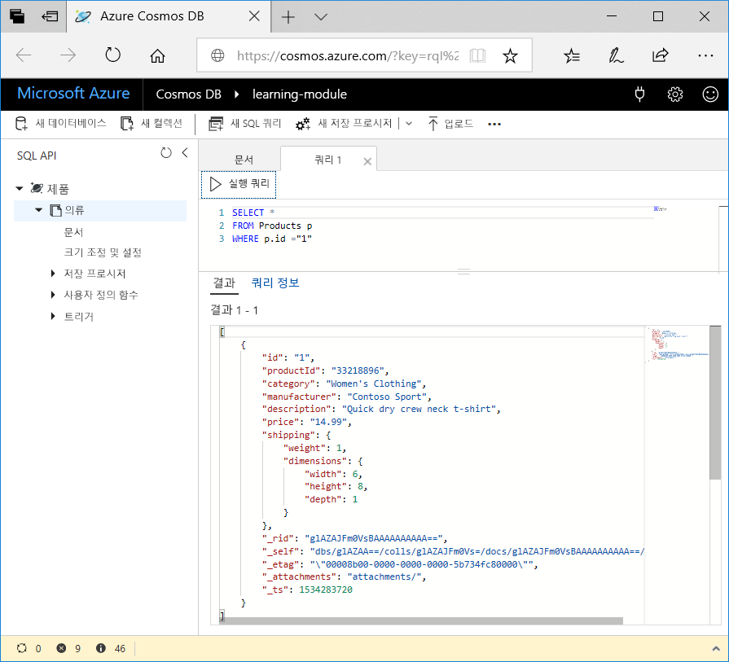

<span data-ttu-id="51df4-101">만들 수 있는 쿼리의 종류에 대해 알아보았으므로 이제 Azure Portal의 데이터 탐색기를 사용하여 제품 데이터를 검색하고 필터링해 보겠습니다.</span><span class="sxs-lookup"><span data-stu-id="51df4-101">Now that you've learned about what kinds of queries you can create, let's use the Data Explorer in the Azure portal to retrieve and filter your product data.</span></span>

<span data-ttu-id="51df4-102">데이터 탐색기 창에서 확인 하는 기본적으로 쿼리에는 **문서** 탭으로 설정 됩니다 `SELECT * FROM c` 다음 그림과에서 같이 합니다.</span><span class="sxs-lookup"><span data-stu-id="51df4-102">In your Data Explorer window, note that by default, the query on the **Document** tab is set to `SELECT * FROM c` as shown in the following image.</span></span> <span data-ttu-id="51df4-103">이 기본 쿼리는 컬렉션에서 모든 문서를 검색하고 표시합니다.</span><span class="sxs-lookup"><span data-stu-id="51df4-103">This default query retrieves and displays all documents in the collection.</span></span>


## <a name="create-a-new-query"></a><span data-ttu-id="51df4-105">새 쿼리 만들기</span><span class="sxs-lookup"><span data-stu-id="51df4-105">Create a new query</span></span>

1. <span data-ttu-id="51df4-106">데이터 탐색기에서 **새 SQL 쿼리** 탭을 클릭합니다. 새 **쿼리 1** 탭의 기본 쿼리가 `SELECT * from c`인지 확인한 다음 **쿼리 실행**합니다.</span><span class="sxs-lookup"><span data-stu-id="51df4-106">In Data Explorer, click the **New SQL Query** tab. Note that the default query on the new  **Query 1** tab is `SELECT * from c`, and then click **Execute Query**.</span></span> <span data-ttu-id="51df4-107">이 쿼리는 데이터베이스의 모든 결과를 반환합니다.</span><span class="sxs-lookup"><span data-stu-id="51df4-107">This query returns all results in the database.</span></span>

    

2. <span data-ttu-id="51df4-109">이제 이전 단원에서 설명했던 쿼리를 몇 개 실행해 보겠습니다.</span><span class="sxs-lookup"><span data-stu-id="51df4-109">Now, let's run some of the queries discussed in the previous unit.</span></span> <span data-ttu-id="51df4-110">쿼리 탭에서 `SELECT * from c`를 삭제하고 다음 쿼리를 복사하여 붙여넣은 후에 **쿼리 실행**을 클릭합니다.</span><span class="sxs-lookup"><span data-stu-id="51df4-110">On the query tab, delete `SELECT * from c`, copy and paste the following query, and then click **Execute Query**:</span></span>

    ```sql
    SELECT * FROM Products p WHERE p.id ="1"
    ```

    <span data-ttu-id="51df4-111">결과로 `productId`가 1인 제품이 반환됩니다.</span><span class="sxs-lookup"><span data-stu-id="51df4-111">The results return the product whose `productId` is 1.</span></span>

    

3. <span data-ttu-id="51df4-113">이전 쿼리를 삭제하고 다음 쿼리를 복사하여 붙여넣은 후에 **쿼리 실행**을 클릭합니다.</span><span class="sxs-lookup"><span data-stu-id="51df4-113">Delete the previous query, copy and paste the following query, and click **Execute Query**.</span></span> <span data-ttu-id="51df4-114">이 쿼리는 가격의 오름차순으로 정렬된 모든 제품의 가격/설명/제품 ID를 반환합니다.</span><span class="sxs-lookup"><span data-stu-id="51df4-114">This query returns the price, description, and product ID for all products, ordered by price, in ascending order.</span></span>
 
    ```sql
    SELECT p.price, p.description, p.productId 
        FROM Products p 
        ORDER BY p.price ASC
    ```

## <a name="summary"></a><span data-ttu-id="51df4-115">요약</span><span class="sxs-lookup"><span data-stu-id="51df4-115">Summary</span></span>

<span data-ttu-id="51df4-116">이제 Azure Cosmos DB의 데이터에 대해 몇 가지 기본적인 쿼리를 완료했습니다.</span><span class="sxs-lookup"><span data-stu-id="51df4-116">You have now completed some basic queries on your data in Azure Cosmos DB.</span></span> 