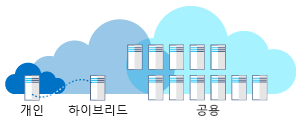

의료 회사에서 일한다고 가정해 봅니다. 레거시 시스템, 사업 부문 시스템 및 새 시스템에 대한 향후 계획이 있습니다. 클라우드 컴퓨팅을 사용하면 장점이 있다고 들었습니다. 공용, 사설 또는 하이브리드 클라우드 중 다양한 솔루션에 가장 적합한 배포 모델을 선택하는 방법은 무엇인가요?

## 클라우드 컴퓨팅이란?

클라우드 컴퓨팅은 인터넷을 통해 요청 시 서비스 및 응용 프로그램을 프로비전하는 것입니다. 서버, 응용 프로그램, 데이터 및 기타 리소스는 서비스로 제공됩니다. 

사용자에게 제공되는 서비스 정보는 추상화됩니다. 컴퓨팅 리소스를 빠르게 프로비전하고 최소한의 관리를 통해 서비스를 사용할 수 있습니다. 클라우드 컴퓨팅은 인터넷을 통해 사용 가능한 데이터 센터로 생각하면 안 됩니다. 클라우드 컴퓨팅은 가상화, 상용 하드웨어 및 자동화된 프로세스를 사용하여 공공 설비와 비슷한 셀프 서비스 사용자 환경을 고객에게 제공합니다.

클라우드 컴퓨팅에 대한 세 가지 배포 모델은 공용 클라우드, 사설 클라우드 및 하이브리드 클라우드입니다. 다음 그림은 이러한 배포 모델에 대한 개요를 보여 줍니다.

#### 사설과 공용 및 하이브리드

> [!VIDEO https://www.microsoft.com/videoplayer/embed/RE2yEv7]

## 공용 클라우드

공용 클라우드는 클라우드 컴퓨팅을 배포하는 가장 일반적인 방법입니다. 서비스는 공용 인터넷을 통해 제공되고 서비스를 구매하려는 누구에게나 제공됩니다. 서버 및 저장소와 같은 클라우드 리소스는 타사 클라우드 서비스 공급자가 소유하고 운영하며 인터넷을 통해 제공됩니다. 서비스는 무료이거나 요청 시 판매될 수 있으므로 고객이 소비하는 CPU 주기, 저장소 또는 대역폭의 사용량만큼만 요금을 결제할 수 있습니다. Microsoft Azure는 공용 클라우드의 예입니다. 

의료 회사에 등록 웹 사이트가 필요하다고 가정해 보겠습니다. 이 사이트는 해당 연도 중에 여러 번 등록량이 가장 많을 때 확장하고 응답해야 합니다. 고객은 전 세계에서 이 사이트에 액세스합니다. 공용 클라우드를 사용하면 등록량이 가장 많을 때 수요를 맞추도록 규모를 자동 확장할 수 있습니다. 사이트 트래픽이 낮으면 사이트 규모를 축소하여 비용을 절약할 수 있습니다. 해당 사이트는 수요가 가장 많을 때 응답하며 필요한 경우 추가 리소스에 대한 요금만 결제합니다. 여러 지리적 지역에 웹 사이트를 배포하여 안정성 및 응답성을 향상할 수도 있습니다.

웹 사이트 개발 중 개발자는 여러 개발 환경을 만들어 개발 프로세스를 신속하게 처리하려고 합니다. 개발자는 공용 클라우드를 사용하여 솔루션을 개발할 샌드박스가 적용된 환경에 대한 가상 머신을 빠르게 프로비전할 수 있습니다. 개발자는 더 이상 환경이 필요하지 않으면 해당 환경을 삭제할 수 있습니다.

### 공용 클라우드를 사용하는 이유

공용 클라우드는 온-프레미스 인프라보다 빠르게 배포되고 거의 무한대의 확장성이 있는 플랫폼을 포함할 수 있습니다. 회사의 모든 직원은 인터넷에 액세스할 수 있는 한 원하는 장치를 사용하여 사무실이나 지사에서 동일한 응용 프로그램을 사용할 수 있습니다. 

공용 클라우드를 사용하는 이유에 대한 예는 다음과 같습니다.

- **주문형 또는 구독 모델을 통한 서비스 소비**: 주문형 또는 구독 모델을 사용하면 사용하거나 예약하는 CPU, 저장소 및 기타 리소스 부분에 대한 요금을 결제할 수 있습니다.
- **하드웨어의 선행 투자 없음**: 온-프레미스 하드웨어 및 응용 프로그램 인프라를 구매, 관리 및 유지 관리할 필요가 없습니다. 클라우드 서비스 공급자가 시스템의 모든 관리 및 유지 관리를 담당합니다. 
- **자동화:** 웹 포털 및 스크립트를 사용하거나 자동화를 통해 인프라 리소스를 빠르게 프로비전합니다. 
- **지리적 분산:** 고유한 데이터 센터를 유지 관리하지 않고도 사용자 근처 또는 원하는 위치에 데이터를 저장합니다.
- **하드웨어 유지 관리 감소**: 서비스 공급자가 하드웨어 유지 관리를 담당합니다.

## 사설 클라우드

사설 클라우드는 하나의 기업 또는 조직의 선택된 사용자만 독점적으로 사용하는 컴퓨팅 리소스로 구성됩니다. 사설 클라우드는 실제로 조직의 온사이트 데이터 센터에 있을 수 있거나, 타사 서비스 공급자가 호스트할 수 있습니다. 사설 클라우드라는 용어를 기존 온-프레미스 데이터 센터의 이름이 바뀐 것으로 간주하면 안 됩니다. 사설 클라우드는 온-프레미스 인프라와 서비스를 사용하여 공용 클라우드와 유사한 혜택을 제공합니다. 추상 플랫폼을 사용하여 Kubernetes 클러스터 같은 ‘클라우드 유사’ 서비스나 Azure Stack 같은 전체 클라우드 환경을 제공합니다. 조직은 하드웨어의 구매, 구성 및 유지 관리를 담당합니다. 시스템 간 통신은 일반적으로 비즈니스가 소유하고 유지 관리하는 네트워크 인프라를 기반으로 합니다. 예를 들어 건물 사이의 개인 내부 네트워크 또는 전용 광섬유 연결이 있습니다.

의료 회사에서 근무하고 데이터 센터 중 하나에서 사용 중인 응용 프로그램이 있다고 가정해 봅니다. 운영 환경은 공용 클라우드에서 복제할 수 없습니다. 데이터 센터 중 다른 데이터 센터에 있는 데이터에 액세스하려면 새로운 요구 사항이 적용됩니다. 데이터를 포함하는 데이터베이스는 규정 준수 때문에 다른 사이트에 남아 있어야 합니다. 이 시나리오는 사설 클라우드입니다. 조직이 소유하는 두 개의 데이터 센터가 있습니다. 인터넷을 통해 공용 클라우드 VPN을 사용하여 데이터 센터를 연결할 수 있습니다. 그러나 이 시나리오는 솔루션이 조직에 전용이므로 사설 클라우드로 간주합니다.

### 사설 클라우드를 사용하는 이유

사설 클라우드는 조직에 더 많은 유연성을 제공할 수 있습니다. 조직은 특정 비즈니스 요구 사항을 충족하도록 클라우드 환경을 사용자 지정할 수 있습니다. 리소스를 다른 사용자와 공유하지 않으므로 높은 수준의 제어 및 보안이 가능합니다. 또한 사설 클라우드는 일정 수준의 확장성과 효율성을 제공할 수 있습니다.

사설 클라우드를 사용하는 이유에 대한 예는 다음과 같습니다.

- **기존 환경:** 공용 클라우드에서 복제할 수 없는 기존 운영 환경. 솔루션 전문 지식을 갖춘 직원 및 하드웨어에 대한 대규모 투자. 대규모 조직에서는 컴퓨팅 리소스를 상용화하도록 선택할 수 있습니다.
- **레거시 응용 프로그램:** 실제로 위치를 쉽게 변경할 수 없는 중요 업무용 레거시 응용 프로그램.
- **데이터 주권 및 보안:** 정치적 경계, 법적 요구 사항에 데이터가 실제로 존재할 수 있는 위치가 명시될 수 있습니다.
- **규정 준수/인증:** PCI 또는 HIPAA 준수. 인증된 온-프레미스 데이터 센터.

## 하이브리드 클라우드

하이브리드 클라우드는 공용 클라우드와 사설 클라우드 간에 데이터 및 응용 프로그램을 공유할 수 있도록 하여 두 클라우드를 결합하는 컴퓨팅 환경입니다. 수요 변동을 계산하고 처리할 때 하이브리드 클라우드 컴퓨팅은 타사 데이터 센터에 전체 데이터에 대한 액세스 권한을 제공하지 않고도 오버플로를 처리하도록 공용 클라우드에 대한 온-프레미스 인프라를 원활하게 강화하는 기능을 비즈니스에 제공합니다. 조직은 기본 및 중요하지 않은 컴퓨팅 작업에 대한 공용 클라우드의 유연성 및 컴퓨팅 기능을 얻는 동시에, 중요 업무용 응용 프로그램과 데이터를 온-프레미스로 회사 방화벽 뒤에 안전하게 유지합니다.

하이브리드 클라우드를 사용하면 단기적인 수요 급증을 처리하기 위해 선행 자본 지출을 만들 필요가 없습니다. 리소스를 로컬로 관리하거나 클라우드에서 관리하는 유연성도 있습니다. 회사는 오랫동안 유휴 상태일 수 있는 추가 리소스 및 장비를 구매, 프로그래밍 및 유지 관리할 필요 없이 일시적으로 사용하는 리소스에 대한 요금만 결제합니다. 일반적으로 통합은 Azure 같은 클라우드 공급자와 온-프레미스 데이터 센터 간의 보안 VPN을 통해 이루어집니다.

의료 회사에서 근무하며 고객이 의료 정보에 액세스할 수 있는 응용 프로그램이 있다고 가정해 봅니다. 규정을 사용하려면 데이터가 실제 위치에 남아 있어야 합니다. 고객 웹 사이트는 전 세계의 많은 사용자에게 응답해야 합니다.  한 가지 솔루션으로, 데이터베이스를 온-프레미스 데이터 센터에 호스트하고 웹 사이트를 공용 클라우드에 호스트할 수 있습니다. VPN은 온-프레미스 데이터 센터와 공용 클라우드 간에 사용됩니다. 이 시나리오는 하이브리드 클라우드로 간주합니다.

### 하이브리드 클라우드를 사용하는 이유

하이브리드 클라우드를 사용하면 조직에서 중요한 자산에 대한 사설 인프라를 제어하고 유지 관리할 수 있습니다. 또한 필요할 때 공용 클라우드의 추가 리소스를 활용하는 유연성도 제공합니다. 공용 클라우드로 확장할 수 있는 기능을 사용하면 필요한 경우에만 추가 컴퓨팅 기능에 대한 요금을 결제합니다. 클라우드로 쉽게 전환할 수도 있습니다. 시간이 지남에 따라 단계적으로 워크로드를 진행하여 점진적으로 마이그레이션할 수 있습니다.

하이브리드 클라우드를 사용하는 이유에 대한 예는 다음과 같습니다.

- **기존 하드웨어 투자:** 비즈니스상 이유로 기존 운영 환경 및 하드웨어를 사용해야 합니다.
- **규정 요구 사항:** 규정을 사용하려면 데이터가 실제 위치에 남아 있어야 합니다.
- **고유 운영 환경:** 공용 클라우드는 레거시 운영 환경을 복제할 수 없습니다.
- **마이그레이션:** 시간이 지남에 따라 워크로드를 클라우드로 이동합니다.
