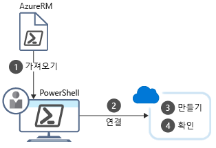

PowerShell을 사용 하 여 명령을 작성 하 고 즉시 실행할 수 있습니다. 이를 **대화형 모드**라고 합니다.

CRM(고객 관계 관리) 예제의 전반적인 목표는 VM을 포함하는 세 개의 테스트 환경을 만드는 것입니다. 리소스 그룹을 사용하여 VM이 유닛 테스트용, 통합 테스트용, 수용 테스트용 개별 환경으로 구성되도록 합니다. 리소스 그룹을 한 번만 만들면 되기 때문에 PowerShell의 대화형 모드를 사용하는 것이 좋습니다.

PowerShell 명령을 입력할 때 되도록 일치는 _cmdlet_ 는 요청한 작업을 수행 합니다. 를 사용 하 고 다음 PowerShell에 대 한 Azure 지원 설치를 확인 하는 일반 명령 알아보겠습니다 하겠습니다.

## <a name="what-are-powershell-cmdlets"></a>PowerShell cmdlet이란?
PowerShell 명령을 **cmdlet**(“커맨드렛”으로 발음)이라고 합니다. cmdlet은 단일 기능을 조작하는 명령입니다. **cmdlet**이란 용어는 “작은 명령”을 의미하는 것입니다. 규칙에 따라 cmdlet 작성자는 cmdlet을 단일 용도로 단순하게 만드는 것이 좋습니다.

기본 PowerShell 제품에는 세션 및 백그라운드 작업과 같은 기능을 사용하는 cmdlet이 포함되어 있습니다. PowerShell 설치에 모듈을 추가하여 다른 기능을 조작하는 cmdlet을 가져옵니다. 예를 들어 ftp 작업, 운영 체제 관리, 파일 시스템 액세스 등을 지원하는 타사 모듈이 있습니다.

cmdlet은 **Get-Process**, **Format-Table**, **Start-Service** 등의 동사-명사 명명 규칙을 따릅니다. 동사 선택 규칙도 있습니다. “get”은 데이터를 검색하고, “set”은 데이터를 삽입하거나 업데이트하고, “format”은 데이터 서식을 지정하고, “out”은 출력을 대상으로 보냅니다.

cmdlet 작성자는 각 cmdlet에 대한 도움말 파일을 포함하는 것이 좋습니다. 합니다 **Get-help** cmdlet은 모든 cmdlet에 대 한 도움말 파일을 표시 합니다. 예를 들어 도움말을 가져올 수는 `Get-ChildItem` 다음 문 사용 하 여 cmdlet:

```powershell
Get-Help Get-ChildItem -detailed
```

## <a name="what-is-a-powershell-module"></a>PowerShell 모듈 이란?

Cmdlet에 제공 됩니다 _모듈_합니다. PowerShell 모듈은 프로세스 코드를 사용할 수 있는 각 cmdlet을 포함 하는 DLL입니다. 에 포함 된 모듈을 로드 하 여 PowerShell에 cmdlet을 로드 합니다. 사용 하 여 로드 된 모듈의 목록을 가져올 수 있습니다는 `Get-Module` 명령:

```powershell
Get-Module
```

비슷하게 출력 됩니다.

```output
ModuleType Version    Name                                ExportedCommands
---------- -------    ----                                ----------------
Manifest   3.1.0.0    Microsoft.PowerShell.Management     {Add-Computer, Add-Content, Checkpoint-Computer, Clear-Con...
Manifest   3.1.0.0    Microsoft.PowerShell.Utility        {Add-Member, Add-Type, Clear-Variable, Compare-Object...}
Binary     1.0.0.1    PackageManagement                   {Find-Package, Find-PackageProvider, Get-Package, Get-Pack...
Script     1.0.0.1    PowerShellGet                       {Find-Command, Find-DscResource, Find-Module, Find-RoleCap...
Script     2.0.0      PSReadline                          {Get-PSReadLineKeyHandler, Get-PSReadLineOption, Remove-PS...
```

## <a name="what-is-azurerm"></a>AzureRM이란?
**AzureRM**은 Azure 기능을 사용하는 cmdlet이 포함된 Azure PowerShell 모듈의 정식 이름입니다(이름에 포함된 **RM**은 **리소스 관리자**를 나타냄). 여기에는 모든 Azure 리소스의 거의 모든 측면을 제어할 수 있는 수백 개의 cmdlet이 포함되어 있습니다. 리소스 그룹, 저장소, 가상 머신, Azure Active Directory, 컨테이너, 기계 학습 등을 사용할 수 있습니다. 이 모듈은 오픈 소스 구성 요소 [GitHub에서 사용할 수 있는](https://github.com/Azure/azure-powershell)합니다.

> [!NOTE]
> Azure PowerShell 모듈은 선택적 설치-cmdlet 모듈을 가져올 때까지 사용할 수 없습니다.

### <a name="install-the-azurerm-module"></a>AzureRM 모듈 설치

AzureRM 모듈은 PowerShell 갤러리 라는 전역 리포지토리에서 사용할 수 있습니다. 통해 로컬 컴퓨터에 모듈을 설치할 수는 `Install-Module` 명령입니다. 관리자 권한 PowerShell 셸을 PowerShell 갤러리에서 모듈을 설치 해야 합니다. 

::: zone pivot="windows"

최신 Azure PowerShell 모듈을 설치 하려면 다음 명령을 실행 합니다.

1. **시작** 메뉴를 열고 **Windows PowerShell**을 입력합니다.

1. **Windows PowerShell** 아이콘을 마우스 오른쪽 단추로 클릭하고 **관리자 권한으로 실행**을 선택합니다.

1. **사용자 계정 컨트롤** 대화 상자에서 **예**를 선택합니다.

1. 다음 명령을 입력하고 Enter 키를 누릅니다.

    ```powershell
    Install-Module -Name AzureRM
    ```

그러면 모든 사용자에 대 한 모듈 (범위 매개 변수에 의해 제어)는 기본적으로 설치 됩니다. 

NuGet 구성 요소를 검색에 의존 하는 명령, 설치한 nuget 버전에 따라 다운로드 하 여 최신 버전의 NuGet 설치 하 라는 메시지가 표시 될 수 있습니다.

```output
NuGet provider is required to continue
PowerShellGet requires NuGet provider version '2.8.5.201' or newer to interact with NuGet-based repositories. The NuGet
 provider must be available in 'C:\Program Files (x86)\PackageManagement\ProviderAssemblies' or
'C:\Users\<username>\AppData\Local\PackageManagement\ProviderAssemblies'. You can also install the NuGet provider by running
'Install-PackageProvider -Name NuGet -MinimumVersion 2.8.5.201 -Force'. Do you want PowerShellGet to install and import
 the NuGet provider now?
```

기본적으로 PowerShell 갤러리는 PowerShellGet에 대한 신뢰할 수 있는 리포지토리로 구성되지 않습니다. PSGallery를 처음 사용할 때는 다음과 같은 메시지가 표시됩니다.

```output
You are installing the modules from an untrusted repository. If you trust this repository, change its
InstallationPolicy value by running the Set-PSRepository cmdlet. Are you sure you want to install the modules from
'PSGallery'?
```

#### <a name="script-execution-failed"></a>스크립트를 실행 하지 못했습니다.
보안 구성에 따라 `Import-Module` 다음과 같이 실패할 수 있습니다.

```output
import-module : File C:\Program Files (x86)\WindowsPowerShell\Modules\azurerm\6.8.1\AzureRM.psm1 cannot be loaded
because running scripts is disabled on this system. For more information, see about_Execution_Policies at
https:/go.microsoft.com/fwlink/?LinkID=135170.
At line:1 char:1
+ import-module azurerm
+ ~~~~~~~~~~~~~~~~~~~~~
    + CategoryInfo          : SecurityError: (:) [Import-Module], PSSecurityException
    + FullyQualifiedErrorId : UnauthorizedAccess,Microsoft.PowerShell.Commands.ImportModuleCommand
```

일반적으로 실행 정책을 "restricted", 즉 PowerShell 갤러리를 포함 하 여-외부 원본에서 다운로드 하는 모듈을 실행할 수 없습니다 되었음을 나타냅니다. 명령을 실행 하 여 대/소문자 인지 여부를 확인할 수 있습니다 `Get-ExecutionPolicy`합니다. "Restricted"를 반환 하는 경우 다음을 수행 합니다.

1. 관리자 권한 PowerShell 명령 프롬프트를 엽니다.
1. 사용 된 `SetExecutionPolicy` 정책을 "RemoteSigned"로 변경 하는 cmdlet:

```powershell
Set-ExecutionPolicy RemoteSigned
```

권한을 묻습니다.

```output
The execution policy helps protect you from scripts that you do not trust. Changing the execution policy might expose
you to the security risks described in the about_Execution_Policies help topic at
https:/go.microsoft.com/fwlink/?LinkID=135170. Do you want to change the execution policy?
[Y] Yes  [A] Yes to All  [N] No  [L] No to All  [S] Suspend  [?] Help (default is "N"): Y
```

사용할 수 있어야 다음 `Import-Module` cmdlet을 로드 합니다.

::: 영역 끝

::: 영역 피벗 = "linux, macos"

MacOS 또는 Linux에서 Azure PowerShell을 설치 하려면 동일한 명령을 사용 합니다.

1. 터미널에서 승격된 권한으로 PowerShell Core를 시작하려면 다음 명령을 입력합니다.

    ```bash
    sudo pwsh
    ```

1. Azure PowerShell을 설치하려면 PowerShell Core 프롬프트에서 다음 명령을 실행합니다.

    ```powershell
    Install-Module AzureRM.NetCore
    ```

1. **PSGallery**의 모듈을 신뢰하는지 묻는 메시지가 표시되면 **예** 또는 **모두 예**를 선택합니다.

::: 영역 끝

### <a name="update-a-module"></a>모듈 업데이트

경고 또는 오류 메시지를 나타내는 Azure PowerShell 모듈의 버전을 이미 설치 되어 있는지를 가져온 경우를 업데이트할 수 있습니다 합니다 _최신_ 명령을 실행 하 여 버전:

::: 영역 피벗 = "windows"

```powershell
Update-Module -Name AzureRM
```

::: 영역 끝

::: 영역 피벗 = "linux, macos"

```powershell
Update-Module -Name AzureRM.NetCore
```

::: 영역 끝

`Install-Module` 명령과 마찬가지로, 모듈을 신뢰하는지 묻는 메시지가 표시되면 **예** 또는 **모두 예**를 선택합니다. 사용할 수도 있습니다는 `Update-Module` 다시이 문제가 발생 하는 경우 모듈을 설치 하는 명령입니다.

## <a name="example-how-to-create-a-resource-group-with-azure-powershell"></a>예: Azure PowerShell을 사용 하 여 리소스 그룹을 만드는 방법
로드 되는 Azure 모듈을 만든 후에 Azure 사용 하 여 작업을 시작할 수 있습니다. 보겠습니다 일반적인 작업을 수행-리소스 그룹을 만듭니다. 아시다시피, 리소스 그룹 관련된 리소스를 함께 관리를 사용 합니다. 새 리소스 그룹을 만드는 새 Azure 솔루션을 시작할 때 수행할 첫 번째 작업 중 하나입니다.

수행 해야 네 단계가 있습니다.

1. Azure cmdlet을 가져옵니다.

1. Azure 구독에 연결합니다.

1. 리소스 그룹을 만듭니다.

1. 생성이 성공했는지 확인합니다(아래 참조).

다음 그림은 이러한 단계의 개요를 보여줍니다.



각 단계는 다른 cmdlet에 해당합니다.

### <a name="import-the-azure-cmdlets"></a>Azure cmdlet 가져오기
시작 시 PowerShell은 기본적으로 핵심 cmdlet만 로드합니다. 따라서 Azure에서 작업해야 하는 cmdlet은 로드되지 않습니다. 필요한 cmdlet을 로드하는 가장 신뢰할 수 있는 방법은 PowerShell 세션을 시작할 때 수동으로 가져오는 것입니다.

**Import-Module** cmdlet을 사용하여 모듈을 로드합니다. 이 cmdlet에는 다양한 상황을 처리하는 많은 매개 변수가 있습니다. 예를 들어 여러 모듈, 특정 모듈 버전, 모듈의 일부 등을 로드할 수 있습니다.

예를 들어, 로드할 수 있습니다 모든 cmdlet AzureRM에 대해 다음 명령을 사용 하 여 **관리자 권한 PowerShell 세션에서**:

::: 영역 피벗 = "windows"

```powershell
Import-Module AzureRM
```

::: 영역 끝

::: 영역 피벗 = "linux, macos"

```powershell
Import-Module AzureRM.NetCore
```

::: 영역 끝

> [!TIP]
> Azure PowerShell을 자주 사용하는 경우 모듈 로드 프로세스를 자동화하는 두 가지 방법이 있습니다. PowerShell 프로필에 항목을 추가하여 시작 시 Azure 모듈을 가져오거나, cmdlet을 사용할 때 자동으로 포함된 모듈을 로드하는 최신 버전의 PowerShell을 사용할 수 있습니다.

### <a name="connect"></a>연결
Azure PowerShell의 로컬 설치를 사용 하 여 작업 하는 경우 Azure 명령을 실행 하기 전에 인증 해야 합니다. **Connect-AzureRmAccount** cmdlet은 Azure 자격 증명을 묻는 메시지를 표시하고 Azure 구독에 연결합니다. 여기에는 많은 선택적 매개 변수가 있지만, 대화형 프롬프트만 필요한 경우에는 매개 변수가 필요하지 않습니다.

```powershell
Connect-AzureRmAccount
```

이 모듈의 핵심 집합의 일부가 아니므로 먼저 모든 새 PowerShell 세션에 대해 이러한 단계를 반복 해야 합니다.


### <a name="working-with-subscriptions"></a>구독 작업
Azure를 처음 접하는 경우 있습니다 것만 단일 구독만 가집니다. 하지만 한동안 Azure를 사용해 오신 분들 중에는 Azure 구독을 여러 개 만든 분도 있을 것입니다. 특정 구독에 대해 명령을 실행하도록 Azure PowerShell을 구성할 수 있습니다.

한 번에 하나의 구독에만 가능 합니다. 사용 된 `Get-AzureRmContext` 활성 구독을 확인 하려면 cmdlet. 이 올바른 경우에이 변경할 수 있습니다.

1. 모든 구독 이름 목록을 사용 하 여 계정에 가져오기는 `Get-AzureRmSubscription` 명령입니다. 

2. 선택의 이름을 전달 하 여 구독을 변경 합니다.

```powershell
Select-AzureRmSubscription -Subscription "Visual Studio Enterprise"
```

### <a name="get-a-list-of-all-resource-groups"></a>모든 리소스 그룹 목록을 가져옵니다.

활성 구독에서 모든 리소스 그룹 목록을 검색할 수 있습니다.

```powershell
Get-AzureRmResourceGroup
```

더 간결한 뷰를 가져오려면의 출력을 보낼 수 있습니다 합니다 `Get-AzureRmResourceGroup` 에 `Format-Table` 파이프를 사용 하 여 cmdlet ' |'입니다.

```powershell
Get-AzureRmResourceGroup | Format-Table
```

비슷하게 출력 됩니다.

```output
ResourceGroupName                  Location       ProvisioningState Tags TagsTable ResourceId
-----------------                  --------       ----------------- ---- --------- ----------
cloud-shell-storage-southcentralus southcentralus Succeeded                        /subscriptions/xxxxxxxx-d3ce-4172...
ExerciseResources                  eastus         Succeeded                        /subscriptions/xxxxxxxx-d3ce-4172...
```

### <a name="create-a-resource-group"></a>리소스 그룹 만들기

했 듯이 Azure에서 리소스를 만드는 경우 항상 관리 목적을 위해 리소스 그룹에 배치 됩니다. 리소스 그룹은 종종 새 응용 프로그램을 시작할 때 만들려는 첫 번째 작업 중 하나입니다.

사용 하 여 리소스 그룹을 만들 수 있습니다는 `New-AzureRmResourceGroup` cmdlet. 이름 및 위치를 지정해야 합니다. 이름은 구독 내에서 고유해야 합니다. 위치는 리소스 그룹의 메타데이터가 저장되는 위치를 결정합니다(규정 준수에 중요할 수 있음). “미국 서부”, “북유럽” 또는 “인도 서부”와 같은 문자열을 사용하여 위치를 지정합니다. 그러나 대부분의 Azure cmdlet와 마찬가지로 `New-AzureRmResourceGroup` 많은 선택적 매개 변수에는 핵심 구문은:

```powershell
New-AzureRmResourceGroup -Name <name> -Location <location>
```

> [!NOTE]
> 리소스 그룹을 만드는 Azure 샌드박스에서 사용할 것 기억 하십시오. 위의 명령은 자신의 구독에서 작업 하는 경우 사용 됩니다.

### <a name="verify-the-resources"></a>리소스를 확인 합니다.
`Get-AzureRmResource` Azure 리소스를 나열 합니다. 이 cmdlet은 리소스 그룹 생성에 성공했는지 여부를 확인하는 데 유용합니다.

```powershell
Get-AzureRmResource
```

같은 합니다 `Get-AzureRmResourceGroup` 명령을 좀 더 간략 한 보기를 가져올 수 있습니다는 `Format-Table` cmdlet. 약식 버전 사용 여기 `ft`:

```powershell
Get-AzureRmResource | ft
```

만 리소스를 나열 하는 그룹과 연결 된 특정 리소스 그룹으로 필터링 할 수 있습니다.

```powershell
Get-AzureRmResource -ResourceGroup ExerciseResources
```

### <a name="creating-an-azure-virtual-machine"></a>Azure 가상 컴퓨터 만들기

PowerShell을 사용 하 여 수행할 수 있는 일반적인 작업을 다른 Vm을 만드는 것입니다.

Azure PowerShell은 제공 된 `New-AzureRmVm` 가상 머신을 만드는 cmdlet입니다. 이 cmdlet에는 많은 VM 구성 설정을 처리할 수 있는 여러 매개 변수가 있습니다. 대부분의 매개 변수에 적절한 기본값이 있으므로 다음 5개 매개 변수만 지정하면 됩니다.

- **ResourceGroupName**: 새 VM이 배치될 리소스 그룹입니다.
- **Name**: Azure의 VM 이름입니다.
- **Location**: VM이 프로비전될 지리적 위치입니다.
- **Credential**: VM 관리자 계정의 사용자 이름과 암호를 포함하는 개체입니다. 사용 된 `Get-Credential` cmdlet. 이 cmdlet은 사용자 이름 및 암호를 묻는 메시지를 자격 증명 개체를 패키지 합니다.
- **이미지**: VM에 사용할 운영 체제 이미지입니다. 이 경우 대개는 Linux 배포 또는 Windows Server

```powershell
   New-AzureRmVm 
       -ResourceGroupName <resource group name> 
       -Name <machine name> 
       -Credential <credentials object> 
       -Location <location> 
       -Image <image name>
```

위에 표시 된 대로 이러한 매개 변수를 cmdlet에 직접 제공할 수 있습니다. 또는 같은 가상 컴퓨터를 구성 하려면 다른 cmdlet를 사용할 수 있습니다 `Set-AzureRmVMOperatingSystem`, `Set-AzureRmVMSourceImage`를 `Add-AzureRmVMNetworkInterface`, 및 `Set-AzureRmVMOSDisk`합니다.

문자열 예로 `Get-Credential` 와 함께 cmdlet을 `-Credential` 매개 변수:

```powershell
New-AzureRmVM -Name MyVm -ResourceGroupName ExerciseResources -Credential (Get-Credential) ...
```

`AzureRmVM` 접미사 PowerShell에서 VM 기반 명령에 따라 다릅니다. 사용할 수 있습니다 다른는 몇 가지 있습니다.

| 명령 | 설명 |
|---------|-------------|
| `Remove-AzureRmVM` | Azure VM을 삭제합니다. |
| `Start-AzureRmVM` | 중지 된 VM을 시작 합니다. |
| `Stop-AzureRmVM` | 실행 중인 VM을 중지 합니다. |
| `Restart-AzureRmVM` | VM 다시 시작 합니다. |
| `Update-AzureRmVM` | VM에 대 한 구성을 업데이트합니다. |

#### <a name="example-getting-the-information-for-a-vm"></a>예: VM에 대 한 정보 가져오기

구독에서 Vm을 표시 하는 `Get-AzureRmVM -Status` 명령입니다. 이 사용 하 여 VM을 지정할 수도 있습니다는 `-Name` 속성입니다. 여기에서는 할당할 PowerShell 변수:

```powershell
$vm = Get-AzureRmVM  -Name MyVM -ResourceGroupName ExerciseResources
```

흥미로운 것은이 _개체_ 상호 작용할 수 있습니다. 예를 들어, 수 개체를 가져와, 변경 하 고 다음 사용 하 여 Azure에 변경 내용 다시 적용 합니다 `Update-AzureRmVM` 명령:

```powershell
$ResourceGroupName = "ExerciseResources"
$vm = Get-AzureRmVM  -Name MyVM -ResourceGroupName $ResourceGroupName
$vm.HardwareProfile.vmSize = "Standard_DS3_v2"

Update-AzureRmVM -ResourceGroupName $ResourceGroupName  -VM $vm
```

## <a name="summary"></a>요약
PowerShell의 대화형 모드는 일회성 작업에 적합합니다. 예제에서는 대화형으로 만드는 것은 합리적이 지는 프로젝트의 수명 동안 동일한 리소스 그룹을 사용할 수 있습니다 됩니다. 대체로, 이 작업에는 스크립트를 작성하고 해당 스크립트를 한 번만 실행하는 것보다 대화형 모드를 사용하는 것이 더 빠르고 편리합니다.