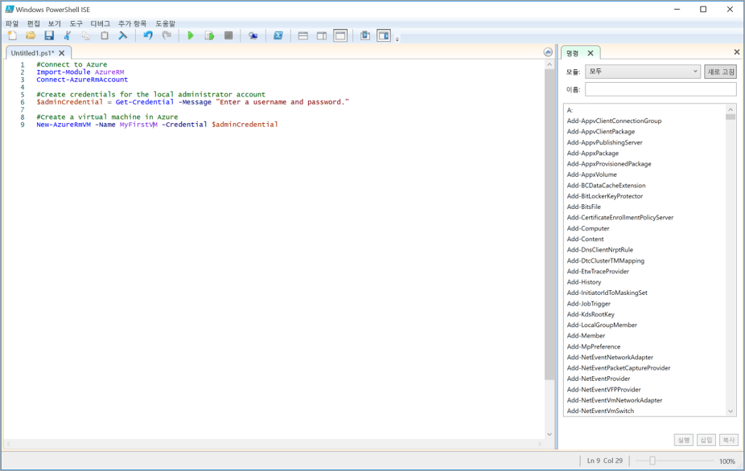

<span data-ttu-id="76bd4-101">대체로, 복잡하거나 반복적인 작업을 관리하려면 오랜 시간이 걸립니다.</span><span class="sxs-lookup"><span data-stu-id="76bd4-101">Complex or repetitive tasks often take a great deal of administrative time.</span></span> <span data-ttu-id="76bd4-102">조직은 이러한 작업을 자동화하여 비용을 줄이고 오류를 방지하려고 합니다.</span><span class="sxs-lookup"><span data-stu-id="76bd4-102">Organizations prefer to automate these tasks to reduce costs and avoid errors.</span></span>

<span data-ttu-id="76bd4-103">이는 CRM(고객 관계 관리) 회사 예제에서 중요합니다.</span><span class="sxs-lookup"><span data-stu-id="76bd4-103">This is important in the Customer Relationship Management (CRM) company example.</span></span> <span data-ttu-id="76bd4-104">해당 예제에서는 계속해서 삭제하고 다시 만들어야 하는 소프트웨어를 여러 Linux VM(Virtual Machines)에서 테스트합니다.</span><span class="sxs-lookup"><span data-stu-id="76bd4-104">There, you test your software on multiple Linux Virtual Machines (VMs) that you need to continuously delete and recreate.</span></span> <span data-ttu-id="76bd4-105">PowerShell 스크립트를 사용하여 VM 생성을 자동화하거나 방금 전에 수행한 대로 그 때마다 수동으로 만듭니다.</span><span class="sxs-lookup"><span data-stu-id="76bd4-105">You want to use a PowerShell script to automate the creation of the VMs vs. creating them manually each time like we just did.</span></span>

<span data-ttu-id="76bd4-106">VM을 만드는 핵심 작업 외에도 스크립트에 대한 몇 가지 추가 요구 사항이 있습니다.</span><span class="sxs-lookup"><span data-stu-id="76bd4-106">Beyond the core operation of creating a VM you have a few additional requirements for your script.</span></span> 
- <span data-ttu-id="76bd4-107">여러 개의 VM을 만들기 때문에 생성 작업을 루프 안에 넣으려고 합니다.</span><span class="sxs-lookup"><span data-stu-id="76bd4-107">You will create multiple VMs, so you want to put the creation inside a loop</span></span>
- <span data-ttu-id="76bd4-108">세 개의 리소스 그룹에 VM을 만들어야 하므로 리소스 그룹 이름이 스크립트에 매개 변수로 전달되어야 합니다.</span><span class="sxs-lookup"><span data-stu-id="76bd4-108">You need to create VMs in three different resource groups, so the name of the resource group should be passed to the script as a parameter</span></span>

<span data-ttu-id="76bd4-109">이 섹션에서는 이러한 요구 사항을 충족하는 Azure PowerShell 스크립트를 작성하고 실행하는 방법을 설명합니다.</span><span class="sxs-lookup"><span data-stu-id="76bd4-109">In this section, you will see how to write and execute an Azure PowerShell script that meets these requirements.</span></span>

## <a name="what-is-a-powershell-script"></a><span data-ttu-id="76bd4-110">PowerShell 스크립트란?</span><span class="sxs-lookup"><span data-stu-id="76bd4-110">What is a PowerShell script?</span></span>
<span data-ttu-id="76bd4-111">PowerShell 스크립트는 명령 및 제어 구문을 포함하는 텍스트 파일입니다.</span><span class="sxs-lookup"><span data-stu-id="76bd4-111">A PowerShell script is a text file containing commands and control constructs.</span></span> <span data-ttu-id="76bd4-112">명령은 cmdlet 호출입니다.</span><span class="sxs-lookup"><span data-stu-id="76bd4-112">The commands are invocations of cmdlets.</span></span> <span data-ttu-id="76bd4-113">제어 구문은 PowerShell에서 제공하는 루프, 변수, 매개 변수, 주석 등의 프로그래밍 기능입니다.</span><span class="sxs-lookup"><span data-stu-id="76bd4-113">The control constructs are programming features like loops, variables, parameters, comments, etc. supplied by PowerShell.</span></span>

<span data-ttu-id="76bd4-114">PowerShell 스크립트 파일에는 **.ps1** 파일 확장명이 있습니다.</span><span class="sxs-lookup"><span data-stu-id="76bd4-114">PowerShell script files have a **.ps1** file extension.</span></span> <span data-ttu-id="76bd4-115">텍스트 편집기를 사용하여 이러한 파일을 만들고 저장할 수 있습니다.</span><span class="sxs-lookup"><span data-stu-id="76bd4-115">You can create and save these files with any text editor.</span></span> 

> [!TIP]
> <span data-ttu-id="76bd4-116">Windows에서 PowerShell 스크립트를 작성하는 경우 Windows PowerShell ISE(통합 스크립팅 환경)를 사용할 수 있습니다.</span><span class="sxs-lookup"><span data-stu-id="76bd4-116">If you’re writing PowerShell scripts under Windows, you can use the Windows PowerShell Integrated Scripting Environment (ISE).</span></span> <span data-ttu-id="76bd4-117">이 편집기는 구문 색 지정, 사용 가능한 cmdlet 목록 등의 기능을 제공합니다.</span><span class="sxs-lookup"><span data-stu-id="76bd4-117">This editor provides features such as syntax coloring and a list of available cmdlets.</span></span>
>
<span data-ttu-id="76bd4-118">다음 스크린샷은 Azure에 연결하고 Azure에서 가상 머신을 만들기 위한 샘플 스크립트를 포함하는 Windows PowerShell ISE(통합 스크립팅 환경)를 보여 줍니다.</span><span class="sxs-lookup"><span data-stu-id="76bd4-118">The following screenshot shows the Windows PowerShell Integrated Scripting Environment (ISE) with a sample script to connect to Azure and create a virtual machine in Azure.</span></span>

>

<span data-ttu-id="76bd4-120">스크립트를 작성한 후 파일 이름 앞에 점과 백슬래시를 추가해서 전달하여 PowerShell 명령줄에서 스크립트를 실행합니다.</span><span class="sxs-lookup"><span data-stu-id="76bd4-120">Once you have written the script, execute it from the PowerShell command line by passing the name of the file preceded by a dot and a backslash:</span></span>

```powershell
.\myScript.ps1
```

## <a name="powershell-techniques"></a><span data-ttu-id="76bd4-121">PowerShell 기술</span><span class="sxs-lookup"><span data-stu-id="76bd4-121">PowerShell techniques</span></span>
<span data-ttu-id="76bd4-122">PowerShell에는 일반 프로그래밍 언어에서 제공되는 많은 기능이 있습니다.</span><span class="sxs-lookup"><span data-stu-id="76bd4-122">PowerShell has many features found in typical programming languages.</span></span> <span data-ttu-id="76bd4-123">변수를 정의하고, 분기 및 루프를 사용하고, 명령줄 매개 변수를 캡처하고, 함수를 작성하고, 주석을 추가할 수 있습니다.</span><span class="sxs-lookup"><span data-stu-id="76bd4-123">You can define variables, use branches and loops, capture command-line parameters, write functions, add comments, and so on.</span></span> <span data-ttu-id="76bd4-124">예제 스크립트에는 변수, 루프 및 매개 변수의 세 가지 기능이 필요합니다.</span><span class="sxs-lookup"><span data-stu-id="76bd4-124">We will need three features for our script: variables, loops, and parameters.</span></span>

### <a name="variables"></a><span data-ttu-id="76bd4-125">변수</span><span class="sxs-lookup"><span data-stu-id="76bd4-125">Variables</span></span>
<span data-ttu-id="76bd4-126">지난 단원에서 살펴본 것처럼 PowerShell에서는 변수를 지원합니다.</span><span class="sxs-lookup"><span data-stu-id="76bd4-126">As you saw in the last unit, PowerShell supports variables.</span></span> <span data-ttu-id="76bd4-127">**$** 를 사용하여 변수를 선언하고, **=** 를 사용하여 값을 할당합니다.</span><span class="sxs-lookup"><span data-stu-id="76bd4-127">Use **$** to declare a variable and **=** to assign a value.</span></span> <span data-ttu-id="76bd4-128">예:</span><span class="sxs-lookup"><span data-stu-id="76bd4-128">For example:</span></span>

```powershell
$loc = "East US"
$iterations = 3
```

<span data-ttu-id="76bd4-129">변수는 개체 포함할 수 있습니다.</span><span class="sxs-lookup"><span data-stu-id="76bd4-129">Variables can hold objects.</span></span> <span data-ttu-id="76bd4-130">예를 들어 다음 정의는 **adminCredential** 변수를 **Get-Credential** cmdlet에서 반환된 개체로 설정합니다.</span><span class="sxs-lookup"><span data-stu-id="76bd4-130">For example, the following definition sets the **adminCredential** variable to the object returned by the **Get-Credential** cmdlet.</span></span>

```powershell
$adminCredential = Get-Credential
```

<span data-ttu-id="76bd4-131">변수에 저장된 값을 얻으려면 아래와 같이 **$** 접두어 및 해당 이름을 사용하세요.</span><span class="sxs-lookup"><span data-stu-id="76bd4-131">To obtain the value stored in a variable, use the **$** prefix and its name as shown below:</span></span> 

```powershell
$loc = "East US"
New-AzureRmResourceGroup -Name "MyResourceGroup" -Location $loc
```

### <a name="loops"></a><span data-ttu-id="76bd4-132">루프</span><span class="sxs-lookup"><span data-stu-id="76bd4-132">Loops</span></span>
<span data-ttu-id="76bd4-133">PowerShell에는 **For**, **Do...While**, **For...Each** 등의 여러 루프가 있습니다.</span><span class="sxs-lookup"><span data-stu-id="76bd4-133">PowerShell has several loops: **For**, **Do...While**, **For...Each**, and so on.</span></span> <span data-ttu-id="76bd4-134">예제에서는 고정된 횟수만큼 cmdlet을 실행하므로 **For** 루프가 요구에 가장 적합합니다.</span><span class="sxs-lookup"><span data-stu-id="76bd4-134">The **For** loop is the best match for our needs because we will execute a cmdlet a fixed number of times.</span></span>

<span data-ttu-id="76bd4-135">코어 구문은 아래에 나와 있습니다. 예제는 두 개의 반복을 실행하고 매번 **i** 값을 출력합니다.</span><span class="sxs-lookup"><span data-stu-id="76bd4-135">The core syntax is shown below; the example runs for two iterations and prints the value of **i** each time.</span></span> <span data-ttu-id="76bd4-136">비교 연산자는 **-lt**(“보다 작음”), **-le**(“작거나 같음”), **eq**(“같음”), **ne**(“같지 않음”) 등으로 작성됩니다.</span><span class="sxs-lookup"><span data-stu-id="76bd4-136">The comparison operators are written **-lt** for "less than", **-le** for "less than or equal", **eq** for "equal", **ne** for "not equal", etc.</span></span>

```powershell
For ($i = 1; $i -lt 3; $i++)
{
    $i
}
```

### <a name="parameters"></a><span data-ttu-id="76bd4-137">매개 변수</span><span class="sxs-lookup"><span data-stu-id="76bd4-137">Parameters</span></span>
<span data-ttu-id="76bd4-138">스크립트를 실행할 때 명령줄에서 인수를 전달할 수 있습니다.</span><span class="sxs-lookup"><span data-stu-id="76bd4-138">When you execute a script, you can pass arguments on the command line.</span></span> <span data-ttu-id="76bd4-139">스크립트가 값을 추출하는 데 도움이 되도록 각 매개 변수의 이름을 지정할 수 있습니다.</span><span class="sxs-lookup"><span data-stu-id="76bd4-139">You can provide names for each parameter to help the script extract the values.</span></span> <span data-ttu-id="76bd4-140">예: </span><span class="sxs-lookup"><span data-stu-id="76bd4-140">For example:</span></span>

```powershell
.\setupEnvironment.ps1 -size 5 -location "East US"
```

<span data-ttu-id="76bd4-141">스크립트 내에서 값을 변수에 캡처합니다.</span><span class="sxs-lookup"><span data-stu-id="76bd4-141">Inside the script, you capture the values into variables.</span></span> <span data-ttu-id="76bd4-142">이 예제에서는 매개 변수가 이름으로 일치됩니다.</span><span class="sxs-lookup"><span data-stu-id="76bd4-142">In this example, the parameters are matched by name:</span></span>

```powershell
param([string]$location, [int]$size)
```

<span data-ttu-id="76bd4-143">명령줄에서 이름을 생략할 수 있습니다.</span><span class="sxs-lookup"><span data-stu-id="76bd4-143">You can omit the names from the command line.</span></span> <span data-ttu-id="76bd4-144">예: </span><span class="sxs-lookup"><span data-stu-id="76bd4-144">For example:</span></span>

```powershell
.\setupEnvironment.ps1 5 "East US"
```

<span data-ttu-id="76bd4-145">스크립트 내에서 매개 변수가 명명되지 않은 경우 일치시키기 위해 위치를 사용합니다.</span><span class="sxs-lookup"><span data-stu-id="76bd4-145">Inside the script, you rely on position for matching when the parameters are unnamed:</span></span>

```powershell
param([int]$size, [string]$location)
```

<span data-ttu-id="76bd4-146">입력으로 이러한 매개 변수를 사용하고, 루프를 사용하여 지정된 매개 변수에서 VM 집합을 만들 수 있습니다.</span><span class="sxs-lookup"><span data-stu-id="76bd4-146">We could take these parameters as input, and use a loop to create a set of VMs from the given parameters.</span></span> <span data-ttu-id="76bd4-147">다음에 시도하겠습니다.</span><span class="sxs-lookup"><span data-stu-id="76bd4-147">We'll try that next.</span></span>

<span data-ttu-id="76bd4-148">PowerShell과 Azure PowerShell을 조합하면 Azure를 자동화하는 데 필요한 모든 도구가 제공됩니다.</span><span class="sxs-lookup"><span data-stu-id="76bd4-148">The combination of PowerShell and Azure PowerShell gives you all the tools you need to automate Azure.</span></span> <span data-ttu-id="76bd4-149">CRM 예제에서는 매개 변수를 사용해서 스크립트를 제네릭으로 유지하고 루프를 사용해서 반복 코드를 방지하여 여러 개의 Linux VM을 만들 수 있습니다.</span><span class="sxs-lookup"><span data-stu-id="76bd4-149">In our CRM example, we will be able to create multiple Linux VMs using a parameter to keep the script generic and a loop to avoid repeated code.</span></span> <span data-ttu-id="76bd4-150">이는 이전의 복잡한 작업을 이제 하나의 단계로 실행할 수 있음을 의미합니다.</span><span class="sxs-lookup"><span data-stu-id="76bd4-150">This means that a formerly complex operation can now be executed in a single step.</span></span>