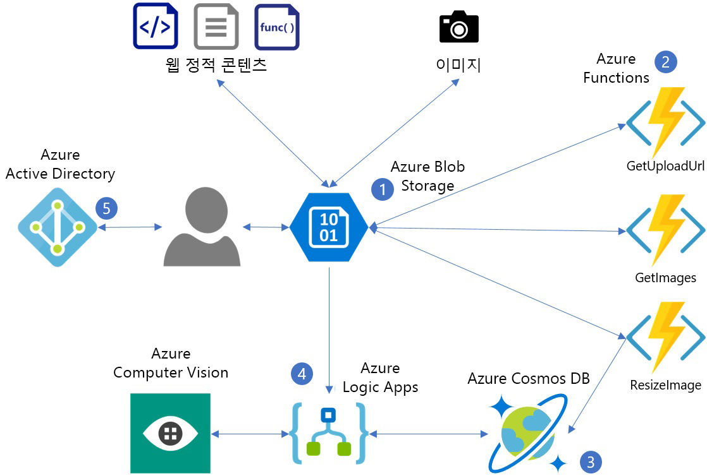
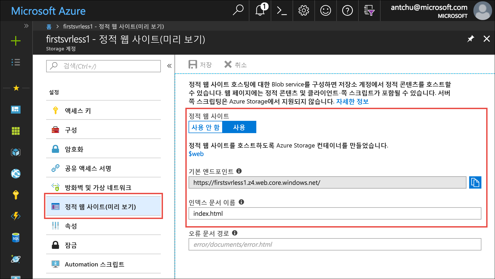
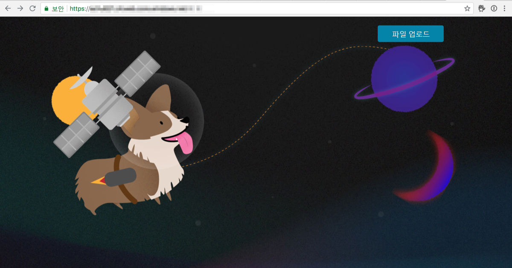

<span data-ttu-id="cc55d-101">이 모듈에서는 HTML 기반 사용자 인터페이스를 표시하는 간단한 웹 응용 프로그램을 배포합니다.</span><span class="sxs-lookup"><span data-stu-id="cc55d-101">In this module, you will deploy a simple web application that presents an HTML-based user interface.</span></span> <span data-ttu-id="cc55d-102">서버리스 백 엔드를 사용하면 응용 프로그램에서 이미지를 업로드하고 자동으로 설명하는 캡션을 가져올 수 있습니다.</span><span class="sxs-lookup"><span data-stu-id="cc55d-102">A serverless back end enables the application to upload images and automatically get captions that describe them.</span></span>


<span data-ttu-id="cc55d-104">다음 다이어그램에서는 응용 프로그램에서 사용하는 Azure 서비스를 보여 줍니다.</span><span class="sxs-lookup"><span data-stu-id="cc55d-104">The following diagram shows the Azure services that are used by the application.</span></span>

1. <span data-ttu-id="cc55d-105">Azure Blob Storage는 정적 웹 콘텐츠(HTML, CSS, JS)를 제공하고 이미지를 저장합니다.</span><span class="sxs-lookup"><span data-stu-id="cc55d-105">Azure Blob storage serves static web content (HTML, CSS, JS) and stores images.</span></span>
2. <span data-ttu-id="cc55d-106">Azure Functions는 이미지 업로드, 크기 조정 및 메타데이터 저장을 관리합니다.</span><span class="sxs-lookup"><span data-stu-id="cc55d-106">Azure Functions manages image uploads, resizing, and metadata storage.</span></span>
3. <span data-ttu-id="cc55d-107">Azure Cosmos DB는 이미지 메타데이터를 저장합니다.</span><span class="sxs-lookup"><span data-stu-id="cc55d-107">Azure Cosmos DB stores image metadata.</span></span>
4. <span data-ttu-id="cc55d-108">Azure Logic Apps는 Cognitive Services Computer Vision API의 이미지 캡션을 가져옵니다.</span><span class="sxs-lookup"><span data-stu-id="cc55d-108">Azure Logic Apps gets image captions from the Cognitive Services Computer Vision API.</span></span>
5. <span data-ttu-id="cc55d-109">Azure Active Directory는 사용자 인증을 관리합니다.</span><span class="sxs-lookup"><span data-stu-id="cc55d-109">Azure Active Directory manages user authentication.</span></span>



<span data-ttu-id="cc55d-111">이 단원에서는 다음을 수행하는 방법을 알아봅니다.</span><span class="sxs-lookup"><span data-stu-id="cc55d-111">In this unit, you will learn how to:</span></span>
> [!div class="checklist"]
> * <span data-ttu-id="cc55d-112">정적 웹 사이트 및 업로드된 이미지를 호스트하도록 Azure Blob Storage를 구성합니다.</span><span class="sxs-lookup"><span data-stu-id="cc55d-112">Configure Azure Blob storage to host a static website and uploaded images.</span></span>
> * <span data-ttu-id="cc55d-113">Azure Functions를 사용하여 Azure Blob Storage에 이미지를 업로드합니다.</span><span class="sxs-lookup"><span data-stu-id="cc55d-113">Upload images to Azure Blob storage using Azure Functions.</span></span>
> * <span data-ttu-id="cc55d-114">Azure Functions를 사용하여 이미지의 크기를 조정합니다.</span><span class="sxs-lookup"><span data-stu-id="cc55d-114">Resize images using Azure Functions.</span></span>
> * <span data-ttu-id="cc55d-115">Azure Cosmos DB에서 이미지 메타데이터를 저장합니다.</span><span class="sxs-lookup"><span data-stu-id="cc55d-115">Store image metadata in Azure Cosmos DB.</span></span>
> * <span data-ttu-id="cc55d-116">Cognitive Services Vision API를 사용하여 이미지 캡션을 자동 생성합니다.</span><span class="sxs-lookup"><span data-stu-id="cc55d-116">Use the Cognitive Services Vision API to auto-generate image captions.</span></span>
> * <span data-ttu-id="cc55d-117">사용자를 인증하여 웹앱을 보호하도록 Azure Active Directory를 사용할 수 있습니다.</span><span class="sxs-lookup"><span data-stu-id="cc55d-117">Use Azure Active Directory to secure the web app by authenticating users.</span></span>

<span data-ttu-id="cc55d-118">Azure Blob Storage는 정적 파일을 호스트하는 데 사용할 수 있는 저렴한 비용의 확장성이 매우 뛰어난 서비스입니다.</span><span class="sxs-lookup"><span data-stu-id="cc55d-118">Azure Blob storage is a low-cost and massively scalable service that can be used to host static files.</span></span> <span data-ttu-id="cc55d-119">이 자습서에서는 이 기능을 사용하여 빌드하는 웹앱에 대한 정적 콘텐츠(예: HTML, JavaScript, CSS)를 제공합니다.</span><span class="sxs-lookup"><span data-stu-id="cc55d-119">For this tutorial, you use it to serve static content (for example, HTML, JavaScript, CSS) for the web app that you build.</span></span>

## <a name="create-an-azure-storage-account"></a><span data-ttu-id="cc55d-120">Azure Storage 계정 만들기</span><span class="sxs-lookup"><span data-stu-id="cc55d-120">Create an Azure Storage account</span></span>

<span data-ttu-id="cc55d-121">Azure Storage 계정은 테이블, 큐, 파일, Blob(개체) 및 가상 머신 디스크를 저장하도록 허용하는 Azure 리소스입니다.</span><span class="sxs-lookup"><span data-stu-id="cc55d-121">An Azure Storage account is an Azure resource that allows you to store tables, queues, files, blobs (objects), and virtual machine disks.</span></span>

1. <span data-ttu-id="cc55d-122">**포커스 모드로 전환** 단추를 선택하여 Azure Cloud Shell(Bash)을 시작합니다.</span><span class="sxs-lookup"><span data-stu-id="cc55d-122">Select the **Enter focus mode** button to launch Azure Cloud Shell (Bash).</span></span> <span data-ttu-id="cc55d-123">이 단추는 브라우저 창의 너비에 따라 페이지의 오른쪽 상단 또는 맨 아래에 위치합니다.</span><span class="sxs-lookup"><span data-stu-id="cc55d-123">This button is at the top right or the bottom of the page, depending on how wide your browser window is.</span></span> <span data-ttu-id="cc55d-124">포커스 모드는 자습서에 표시된 명령을 쉽게 실행할 수 있도록 브라우저 창의 오른쪽에 있는 Cloud Shell 창에 연결합니다.</span><span class="sxs-lookup"><span data-stu-id="cc55d-124">Focus mode docks a Cloud Shell window on the right side of your browser window, so you can easily execute commands that are shown in the tutorial.</span></span>

1. <span data-ttu-id="cc55d-125">용이한 관리를 위해 Azure에서 리소스 그룹은 관련 Azure 솔루션을 보유하는 컨테이너입니다.</span><span class="sxs-lookup"><span data-stu-id="cc55d-125">In Azure, a resource group is a container that holds related Azure resources for ease of management.</span></span> <span data-ttu-id="cc55d-126">**first-serverless-app**이라는 새 리소스 그룹을 만듭니다.</span><span class="sxs-lookup"><span data-stu-id="cc55d-126">Create a new resource group named **first-serverless-app**.</span></span>

    ```azurecli
    az group create -n first-serverless-app -l westcentralus
    ```

1. <span data-ttu-id="cc55d-127">이 자습서에 대한 정적 콘텐츠(HTML, CSS 및 JavaScript 파일)는 Blob Storage에서 호스트됩니다.</span><span class="sxs-lookup"><span data-stu-id="cc55d-127">The static content (HTML, CSS, and JavaScript files) for this tutorial is hosted in Blob storage.</span></span> <span data-ttu-id="cc55d-128">Blob Storage를 사용하려면 저장소 계정이 필요합니다.</span><span class="sxs-lookup"><span data-stu-id="cc55d-128">Blob storage requires a Storage account.</span></span> <span data-ttu-id="cc55d-129">리소스 그룹에서 저장소 계정(범용 V2)을 만듭니다.</span><span class="sxs-lookup"><span data-stu-id="cc55d-129">Create a Storage account (general-purpose V2) in the resource group.</span></span> <span data-ttu-id="cc55d-130">`<storage account name>`을 고유한 이름으로 바꿉니다.</span><span class="sxs-lookup"><span data-stu-id="cc55d-130">Replace `<storage account name>` with a unique name.</span></span>

    ```azurecli
    az storage account create -n <storage account name> -g first-serverless-app --kind StorageV2 -l westcentralus --https-only true --sku Standard_LRS
    ```
    
1. <span data-ttu-id="cc55d-131">[Azure Portal](https://portal.azure.com)의 맨 위에 있는 검색 표시줄을 사용하여 방금 만든 저장소 계정을 찾습니다.</span><span class="sxs-lookup"><span data-stu-id="cc55d-131">Use the Search bar at the top of the [Azure portal](https://portal.azure.com) to find the storage account that you just created.</span></span> <span data-ttu-id="cc55d-132">계정을 엽니다.</span><span class="sxs-lookup"><span data-stu-id="cc55d-132">Open the account.</span></span>

1. <span data-ttu-id="cc55d-133">왼쪽 탐색 영역에서 **정적 웹 사이트(미리 보기)** 를 선택하고 정적 웹 사이트 호스팅을 위한 컨테이너를 구성합니다.</span><span class="sxs-lookup"><span data-stu-id="cc55d-133">On the left navigation, select **Static website (preview)** to configure a container for static website hosting.</span></span>
    - <span data-ttu-id="cc55d-134">**사용**을 선택하여 정적 웹 사이트를 사용하도록 설정합니다.</span><span class="sxs-lookup"><span data-stu-id="cc55d-134">Select **Enabled** to enable a static website.</span></span>
    - <span data-ttu-id="cc55d-135">**index.html**을 인덱스 문서 이름으로 입력합니다.</span><span class="sxs-lookup"><span data-stu-id="cc55d-135">Enter **index.html** as the index document name.</span></span> <span data-ttu-id="cc55d-136">상자에는 이미 회색 글꼴로 *index.html*이 있지만 예제 텍스트일 뿐입니다.</span><span class="sxs-lookup"><span data-stu-id="cc55d-136">The box already has *index.html* in a gray font, but this is only example text.</span></span> <span data-ttu-id="cc55d-137">상자에 **index.html**을 입력해야 합니다.</span><span class="sxs-lookup"><span data-stu-id="cc55d-137">You still have to enter **index.html** in the box.</span></span>
    - <span data-ttu-id="cc55d-138">**저장**을 클릭합니다.</span><span class="sxs-lookup"><span data-stu-id="cc55d-138">Click **Save**.</span></span>
    
    

1. <span data-ttu-id="cc55d-140">자습서를 진행하면서 편리하게 복사할 수 있는 위치에 **기본 엔드포인트**를 저장합니다.</span><span class="sxs-lookup"><span data-stu-id="cc55d-140">Save the **Primary Endpoint** in a place where you can conveniently copy it from while working through the tutorial.</span></span> <span data-ttu-id="cc55d-141">이 엔드포인트는 웹 응용 프로그램의 URL입니다.</span><span class="sxs-lookup"><span data-stu-id="cc55d-141">This endpoint is the URL of your web application.</span></span>

## <a name="upload-the-web-application"></a><span data-ttu-id="cc55d-142">웹 응용 프로그램 업로드</span><span class="sxs-lookup"><span data-stu-id="cc55d-142">Upload the web application</span></span>

1. <span data-ttu-id="cc55d-143">이 자습서에서 빌드한 응용 프로그램에 대한 원본 파일은 [GitHub 리포지토리](https://github.com/Azure-Samples/functions-first-serverless-web-application)에 위치합니다.</span><span class="sxs-lookup"><span data-stu-id="cc55d-143">The source files for the application that you build in this tutorial are located in a [GitHub repository](https://github.com/Azure-Samples/functions-first-serverless-web-application).</span></span> <span data-ttu-id="cc55d-144">Cloud Shell의 홈 디렉터리에서 이 리포지토리를 복제했는지 확인합니다.</span><span class="sxs-lookup"><span data-stu-id="cc55d-144">Make sure that you're in your home directory in Cloud Shell and clone this repository.</span></span>

    ```azurecli
    cd ~
    git clone https://github.com/Azure-Samples/functions-first-serverless-web-application
    ```

    <span data-ttu-id="cc55d-145">리포지토리는 `/home/<username>/functions-first-serverless-web-application`에 복제됩니다.</span><span class="sxs-lookup"><span data-stu-id="cc55d-145">The repository is cloned to `/home/<username>/functions-first-serverless-web-application`.</span></span>

1. <span data-ttu-id="cc55d-146">클라이언트 쪽 웹 응용 프로그램은 **www** 폴더에 위치하고 Vue.js JavaScript 프레임워크를 사용하여 빌드됩니다.</span><span class="sxs-lookup"><span data-stu-id="cc55d-146">The client-side web application is located in the **www** folder and is built using the Vue.js JavaScript framework.</span></span> <span data-ttu-id="cc55d-147">폴더로 변경하고 **npm** 명령을 실행하여 응용 프로그램의 종속성을 설치하고 응용 프로그램을 빌드합니다.</span><span class="sxs-lookup"><span data-stu-id="cc55d-147">Change into the folder and run **npm** commands to install the application dependencies and build the application.</span></span> <span data-ttu-id="cc55d-148">이러한 명령 중 마지막을 완료하려면 몇 분 정도 걸릴 수 있습니다.</span><span class="sxs-lookup"><span data-stu-id="cc55d-148">The last of these commands might take several minutes to complete.</span></span>

    ```azurecli
    cd ~/functions-first-serverless-web-application/www
    npm install
    npm run generate
    ```

    <span data-ttu-id="cc55d-149">응용 프로그램은 **dist** 폴더에서 생성됩니다.</span><span class="sxs-lookup"><span data-stu-id="cc55d-149">The application is generated in the **dist** folder.</span></span>

1. <span data-ttu-id="cc55d-150">현재 디렉터리를 **dist** 폴더로 변경하고 응용 프로그램을 **$web** Blob 컨테이너로 업로드합니다.</span><span class="sxs-lookup"><span data-stu-id="cc55d-150">Change the current directory to the **dist** folder and upload the application to the **$web** blob container.</span></span>

    ```azurecli
    cd dist
    az storage blob upload-batch -s . -d \$web --account-name <storage account name>
    ```

1. <span data-ttu-id="cc55d-151">응용 프로그램을 보려면 웹 브라우저에서 Storage 정적 웹 사이트 기본 엔드포인트 URL을 엽니다.</span><span class="sxs-lookup"><span data-stu-id="cc55d-151">To view the application, open the Storage static websites primary endpoint URL in a web browser.</span></span>

    


## <a name="summary"></a><span data-ttu-id="cc55d-153">요약</span><span class="sxs-lookup"><span data-stu-id="cc55d-153">Summary</span></span>

<span data-ttu-id="cc55d-154">이 단원에서 저장소 계정을 포함하는 **first-serverless-app**이라는 리소스 그룹을 만들었습니다.</span><span class="sxs-lookup"><span data-stu-id="cc55d-154">In this unit, you created a resource group named **first-serverless-app** that contains a Storage account.</span></span> <span data-ttu-id="cc55d-155">저장소 계정에서 **$web**이라는 Blob 컨테이너는 웹 응용 프로그램에 대한 정적 콘텐츠를 저장하고 콘텐츠를 공개적으로 사용할 수 있도록 합니다.</span><span class="sxs-lookup"><span data-stu-id="cc55d-155">A blob container named **$web** in the Storage account stores the static content for your web application and makes the content publicly available.</span></span> <span data-ttu-id="cc55d-156">다음으로, 서버를 사용하지 않는 함수를 사용하여 이 웹 응용 프로그램에서 Blob Storage에 이미지를 업로드하는 방법을 알아봅니다.</span><span class="sxs-lookup"><span data-stu-id="cc55d-156">Next, you learn how to use a serverless function to upload images to Blob storage from this web application.</span></span>