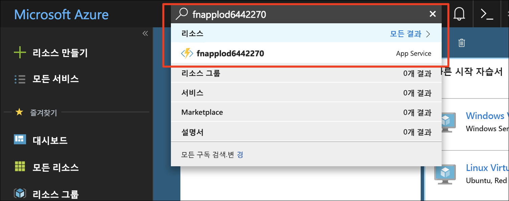
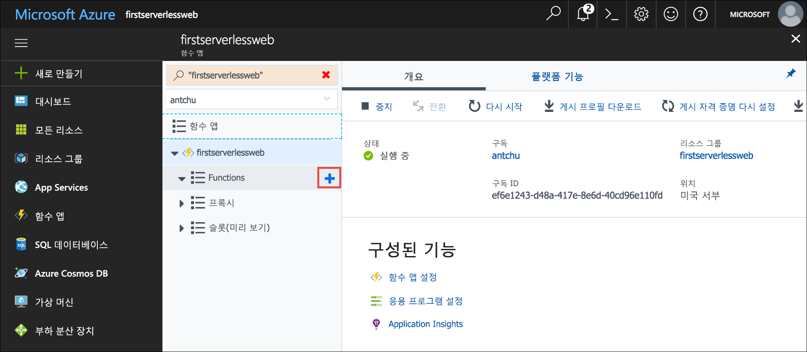
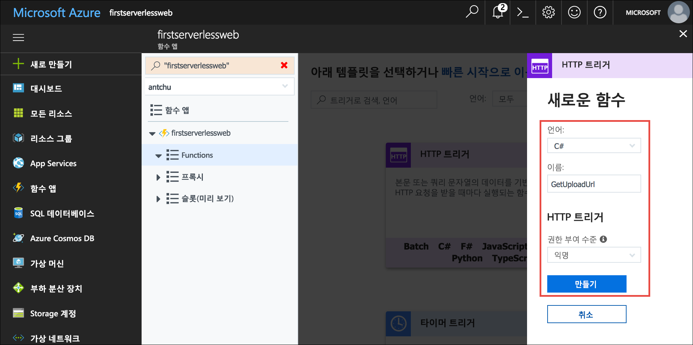
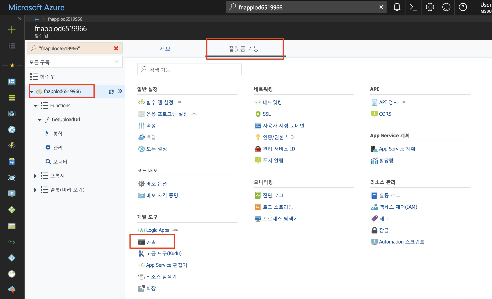
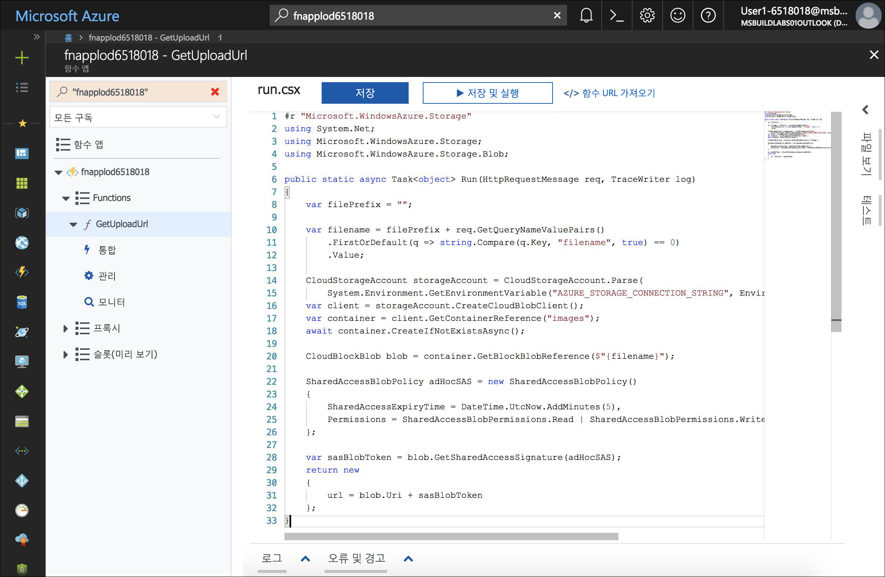
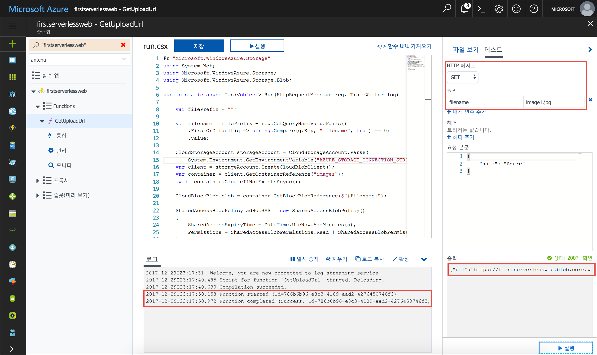
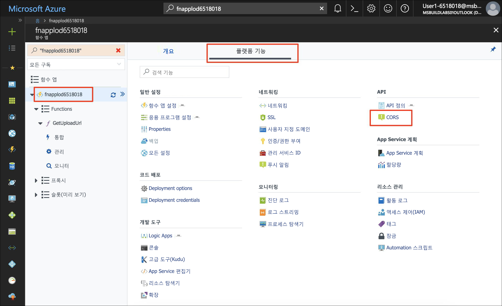

<span data-ttu-id="fffe1-101">빌드 중인 응용 프로그램은 사진 갤러리입니다.</span><span class="sxs-lookup"><span data-stu-id="fffe1-101">The application that you're building is a photo gallery.</span></span> <span data-ttu-id="fffe1-102">API를 호출하는 클라이언트 쪽 JavaScript를 사용하여 이미지를 업로드하고 표시합니다.</span><span class="sxs-lookup"><span data-stu-id="fffe1-102">It uses client-side JavaScript to call APIs to upload and display images.</span></span> <span data-ttu-id="fffe1-103">이 모듈에서 이미지를 업로드하려면 시간이 제한된 URL을 생성하는 서버를 사용하지 않는 함수를 사용하여 API를 만듭니다.</span><span class="sxs-lookup"><span data-stu-id="fffe1-103">In this module, you create an API using a serverless function that generates a time-limited URL to upload an image.</span></span> <span data-ttu-id="fffe1-104">웹 응용 프로그램은 [Blob Storage REST API](https://docs.microsoft.com/rest/api/storageservices/blob-service-rest-api)를 사용하여 Blob Storage에 이미지를 업로드하기 위해 생성된 URL을 사용합니다.</span><span class="sxs-lookup"><span data-stu-id="fffe1-104">The web application uses the generated URL to upload an image to Blob storage using the [Blob storage REST API](https://docs.microsoft.com/rest/api/storageservices/blob-service-rest-api).</span></span>

## <a name="create-a-blob-storage-container-for-images"></a><span data-ttu-id="fffe1-105">이미지에 대한 Blob Storage 컨테이너 만들기</span><span class="sxs-lookup"><span data-stu-id="fffe1-105">Create a Blob storage container for images</span></span>

<span data-ttu-id="fffe1-106">이미지를 업로드하고 호스트하기 위해 응용 프로그램에는 별도 저장소 컨테이너가 필요합니다.</span><span class="sxs-lookup"><span data-stu-id="fffe1-106">The application requires a separate storage container to upload and host images.</span></span>

1. <span data-ttu-id="fffe1-107">Azure Cloud Shell(Bash)에 로그인했는지 확인합니다.</span><span class="sxs-lookup"><span data-stu-id="fffe1-107">Ensure that you're still signed in to Azure Cloud Shell (Bash).</span></span> <span data-ttu-id="fffe1-108">그러지 않은 경우 **포커스 모드로 전환**을 선택하여 Cloud Shell 창을 엽니다.</span><span class="sxs-lookup"><span data-stu-id="fffe1-108">If not, select **Enter focus mode** to open a Cloud Shell window.</span></span>

1.  <span data-ttu-id="fffe1-109">모든 Blob에 대한 공용 액세스 권한이 있는 저장소 계정에서 **images**라는 새 컨테이너를 만듭니다.</span><span class="sxs-lookup"><span data-stu-id="fffe1-109">Create a new container named **images** in your Storage account with public access to all blobs.</span></span>

    ```azurecli
    az storage container create -n images --account-name <storage account name> --public-access blob
    ```

## <a name="create-an-azure-functions-app"></a><span data-ttu-id="fffe1-110">Azure Functions 앱 만들기</span><span class="sxs-lookup"><span data-stu-id="fffe1-110">Create an Azure Functions app</span></span>

<span data-ttu-id="fffe1-111">Azure Functions는 서버를 사용하지 않는 함수를 실행하기 위한 서비스입니다.</span><span class="sxs-lookup"><span data-stu-id="fffe1-111">Azure Functions is a service for running serverless functions.</span></span> <span data-ttu-id="fffe1-112">HTTP 요청과 같은 이벤트에 의해 또는 저장소 컨테이너에서 Blob을 만들 때 서버리스 함수를 트리거(호출)할 수 있습니다.</span><span class="sxs-lookup"><span data-stu-id="fffe1-112">A serverless function can be triggered (called) by events, such as an HTTP request, or when a blob is created in a storage container.</span></span>

<span data-ttu-id="fffe1-113">Azure Functions 앱은 하나 이상의 서버리스 함수에 대한 컨테이너입니다.</span><span class="sxs-lookup"><span data-stu-id="fffe1-113">An Azure Functions app is a container for one or more serverless functions.</span></span>

- <span data-ttu-id="fffe1-114">**first-serverless-app**이라는 이전에 만든 리소스 그룹에서 고유한 이름의 새 Functions 앱을 만듭니다.</span><span class="sxs-lookup"><span data-stu-id="fffe1-114">Create a new Functions app with a unique name in the **first-serverless-app** resource group that you created earlier.</span></span> <span data-ttu-id="fffe1-115">Functions 앱에는 저장소 계정이 필요합니다.</span><span class="sxs-lookup"><span data-stu-id="fffe1-115">Functions apps require a Storage account.</span></span> <span data-ttu-id="fffe1-116">이 자습서에서는 기존 저장소 계정을 사용합니다.</span><span class="sxs-lookup"><span data-stu-id="fffe1-116">In this tutorial, you use the existing storage account.</span></span>

    ```azurecli
    az functionapp create -n <function app name> -g first-serverless-app -s <storage account name> -c westcentralus
    ```

## <a name="create-an-http-triggered-serverless-function"></a><span data-ttu-id="fffe1-117">HTTP 트리거 서버를 사용하지 않는 함수 만들기</span><span class="sxs-lookup"><span data-stu-id="fffe1-117">Create an HTTP-triggered serverless function</span></span>

<span data-ttu-id="fffe1-118">Blob Storage에 이미지를 안전하게 업로드하기 위해 사진 갤러리 웹앱을 통해 서버리스 함수에 HTTP를 요청하여 시간이 제한된 URL을 생성할 수 있습니다.</span><span class="sxs-lookup"><span data-stu-id="fffe1-118">To securely upload an image to Blob storage, the photo gallery web app makes an HTTP request to the serverless function to generate a time-limited URL.</span></span> <span data-ttu-id="fffe1-119">이 함수는 HTTP 요청에 의해 트리거되고 Azure Storage SDK를 사용하여 보안 URL을 생성하고 반환합니다.</span><span class="sxs-lookup"><span data-stu-id="fffe1-119">The function is triggered by an HTTP request and uses the Azure Storage SDK to generate and return the secure URL.</span></span>

1. <span data-ttu-id="fffe1-120">Functions 앱을 만든 후에 **검색** 상자를 사용하여 Azure Portal에서 검색합니다.</span><span class="sxs-lookup"><span data-stu-id="fffe1-120">After the Functions app is created, search for it in the Azure portal using the **Search** box.</span></span> <span data-ttu-id="fffe1-121">앱을 클릭하여 엽니다.</span><span class="sxs-lookup"><span data-stu-id="fffe1-121">Click on the app to open it.</span></span>

    


1. <span data-ttu-id="fffe1-123">Functions 앱 창의 왼쪽 탐색에서 **함수**를 가리키고 더하기 기호(+)를 클릭하여 새 서버리스 함수를 만듭니다.</span><span class="sxs-lookup"><span data-stu-id="fffe1-123">In the Functions app window, in the left navigation, point to **Functions** and click the plus sign (+) to create a new serverless function.</span></span>

    

1. <span data-ttu-id="fffe1-125">**사용자 지정 함수**를 클릭하여 함수 템플릿 목록을 확인합니다.</span><span class="sxs-lookup"><span data-stu-id="fffe1-125">Click **Custom function** to see a list of function templates.</span></span>

1. <span data-ttu-id="fffe1-126">**HttpTrigger** 템플릿을 찾고 사용할 언어를 클릭합니다(C# 또는 JavaScript).</span><span class="sxs-lookup"><span data-stu-id="fffe1-126">Find the **HttpTrigger** template and click the language to use (C# or JavaScript).</span></span>

1. <span data-ttu-id="fffe1-127">다음 값을 사용하여 Blob 업로드 URL을 생성하는 함수를 만듭니다.</span><span class="sxs-lookup"><span data-stu-id="fffe1-127">Use the following values to create a function that generates a blob upload URL:</span></span>

    | <span data-ttu-id="fffe1-128">설정</span><span class="sxs-lookup"><span data-stu-id="fffe1-128">Setting</span></span>      |  <span data-ttu-id="fffe1-129">제안 값</span><span class="sxs-lookup"><span data-stu-id="fffe1-129">Suggested value</span></span>   | <span data-ttu-id="fffe1-130">설명</span><span class="sxs-lookup"><span data-stu-id="fffe1-130">Description</span></span>                                        |
    | --- | --- | ---|
    | <span data-ttu-id="fffe1-131">**언어**</span><span class="sxs-lookup"><span data-stu-id="fffe1-131">**Language**</span></span> | <span data-ttu-id="fffe1-132">C# 또는 JavaScript</span><span class="sxs-lookup"><span data-stu-id="fffe1-132">C# or JavaScript</span></span> | <span data-ttu-id="fffe1-133">사용할 언어를 선택합니다.</span><span class="sxs-lookup"><span data-stu-id="fffe1-133">Select the language that you want to use.</span></span> |
    | <span data-ttu-id="fffe1-134">**함수 이름 지정**</span><span class="sxs-lookup"><span data-stu-id="fffe1-134">**Name your function**</span></span> | <span data-ttu-id="fffe1-135">GetUploadUrl</span><span class="sxs-lookup"><span data-stu-id="fffe1-135">GetUploadUrl</span></span> | <span data-ttu-id="fffe1-136">응용 프로그램이 함수를 검색할 수 있도록 표시된 대로 이 이름을 정확히 입력합니다.</span><span class="sxs-lookup"><span data-stu-id="fffe1-136">Enter this name exactly as shown, so the application can discover the function.</span></span> |
    | <span data-ttu-id="fffe1-137">**권한 부여 수준**</span><span class="sxs-lookup"><span data-stu-id="fffe1-137">**Authorization level**</span></span> | <span data-ttu-id="fffe1-138">익명</span><span class="sxs-lookup"><span data-stu-id="fffe1-138">Anonymous</span></span> | <span data-ttu-id="fffe1-139">함수가 공개적으로 액세스될 수 있습니다.</span><span class="sxs-lookup"><span data-stu-id="fffe1-139">Allow the function to be accessed publicly.</span></span> |

    

1. <span data-ttu-id="fffe1-141">**만들기**를 클릭하여 함수를 만듭니다.</span><span class="sxs-lookup"><span data-stu-id="fffe1-141">Click **Create** to create the function.</span></span>

<span data-ttu-id="fffe1-142">::: zone pivot="csharp"</span><span class="sxs-lookup"><span data-stu-id="fffe1-142">::: zone pivot="csharp"</span></span>
1. <span data-ttu-id="fffe1-143">**C#**</span><span class="sxs-lookup"><span data-stu-id="fffe1-143">**C#**</span></span> 

    <span data-ttu-id="fffe1-144">함수의 소스 코드가 표시되면 **run.csx** 파일의 모든 콘텐츠를 [**csharp/GetUploadUrl/run.csx**](https://raw.githubusercontent.com/Azure-Samples/functions-first-serverless-web-application/master/csharp/GetUploadUrl/run.csx)의 콘텐츠로 바꿉니다.</span><span class="sxs-lookup"><span data-stu-id="fffe1-144">When the function's source code appears, replace all of the content in the **run.csx** file with the content in the [**csharp/GetUploadUrl/run.csx**](https://raw.githubusercontent.com/Azure-Samples/functions-first-serverless-web-application/master/csharp/GetUploadUrl/run.csx) file.</span></span>

<span data-ttu-id="fffe1-145">::: zone-end</span><span class="sxs-lookup"><span data-stu-id="fffe1-145">::: zone-end</span></span>

<span data-ttu-id="fffe1-146">::: zone pivot="javascript"</span><span class="sxs-lookup"><span data-stu-id="fffe1-146">::: zone pivot="javascript"</span></span>
1. <span data-ttu-id="fffe1-147">**JavaScript**</span><span class="sxs-lookup"><span data-stu-id="fffe1-147">**JavaScript**</span></span> 

    1. <span data-ttu-id="fffe1-148">(JavaScript) 이 함수에는 npm의 `azure-storage` 패키지가 필요합니다.</span><span class="sxs-lookup"><span data-stu-id="fffe1-148">(JavaScript) This function requires the `azure-storage` package from npm.</span></span> <span data-ttu-id="fffe1-149">이 패키지는 보안 URL을 빌드하는 데 필요한 SAS(공유 액세스 서명) 토큰을 생성합니다.</span><span class="sxs-lookup"><span data-stu-id="fffe1-149">The package generates the shared access signature (SAS) token that's required to build the secure URL.</span></span> <span data-ttu-id="fffe1-150">npm 패키지를 설치하려면 왼쪽 탐색 창에서 Functions 앱을 클릭하고, **플랫폼 기능**을 클릭합니다.</span><span class="sxs-lookup"><span data-stu-id="fffe1-150">To install the npm package, click on the Functions app on the left navigation and click **Platform features**.</span></span>

    1. <span data-ttu-id="fffe1-151">(JavaScript) **콘솔**을 클릭하여 콘솔 창을 표시합니다.</span><span class="sxs-lookup"><span data-stu-id="fffe1-151">(JavaScript) Click **Console** to reveal a console window.</span></span>

        

    1. <span data-ttu-id="fffe1-153">(JavaScript) `cd d:\home\site\wwwroot` 명령을 실행하여 현재 디렉터리가 **d:\home\site\wwwroot**인지 확인합니다.</span><span class="sxs-lookup"><span data-stu-id="fffe1-153">(JavaScript) Ensure the current directory is **d:\home\site\wwwroot** by running the command `cd d:\home\site\wwwroot`.</span></span>

    1. <span data-ttu-id="fffe1-154">(JavaScript) `npm init -y` 명령을 실행하여 빈 **package.json** 파일을 만듭니다.</span><span class="sxs-lookup"><span data-stu-id="fffe1-154">(JavaScript) Run the command `npm init -y` to create an empty **package.json** file.</span></span>

    1. <span data-ttu-id="fffe1-155">(JavaScript) 패키지를 설치하려면 콘솔에서 `npm install --save azure-storage` 명령을 실행합니다.</span><span class="sxs-lookup"><span data-stu-id="fffe1-155">(JavaScript) To install the package, run the command `npm install --save azure-storage` in the console.</span></span> <span data-ttu-id="fffe1-156">패키지를 **package.json**으로 저장합니다.</span><span class="sxs-lookup"><span data-stu-id="fffe1-156">Save the package as **package.json**.</span></span> <span data-ttu-id="fffe1-157">작업을 완료하는 데 몇 분 정도 걸릴 수 있습니다.</span><span class="sxs-lookup"><span data-stu-id="fffe1-157">It may take a few minutes to complete the operation.</span></span>

    1. <span data-ttu-id="fffe1-158">(JavaScript) 왼쪽 탐색에서 함수(**GetUploadUrl**)를 클릭하여 함수를 표시합니다.</span><span class="sxs-lookup"><span data-stu-id="fffe1-158">(JavaScript) Click on the function (**GetUploadUrl**) in the left navigation to reveal the function.</span></span> <span data-ttu-id="fffe1-159">**index.js** 파일의 모든 콘텐츠를 [**javascript/GetUploadUrl/index.js**](https://raw.githubusercontent.com/Azure-Samples/functions-first-serverless-web-application/master/javascript/GetUploadUrl/index.js) 파일의 콘텐츠로 바꿉니다.</span><span class="sxs-lookup"><span data-stu-id="fffe1-159">Replace all of the content in the **index.js** file with the content in the [**javascript/GetUploadUrl/index.js**](https://raw.githubusercontent.com/Azure-Samples/functions-first-serverless-web-application/master/javascript/GetUploadUrl/index.js) file.</span></span>
    
        

<span data-ttu-id="fffe1-161">::: zone-end</span><span class="sxs-lookup"><span data-stu-id="fffe1-161">::: zone-end</span></span>

1. <span data-ttu-id="fffe1-162">코드 창 아래에서 **로그**를 클릭하여 [로그] 패널을 확장합니다.</span><span class="sxs-lookup"><span data-stu-id="fffe1-162">Click **Logs** below the code window to expand the logs panel.</span></span>

1. <span data-ttu-id="fffe1-163">**저장**을 클릭합니다.</span><span class="sxs-lookup"><span data-stu-id="fffe1-163">Click **Save**.</span></span> <span data-ttu-id="fffe1-164">로그 패널을 확인하여 함수가 성공적으로 컴파일되었는지 확인합니다.</span><span class="sxs-lookup"><span data-stu-id="fffe1-164">Check the logs panel to ensure the function is successfully compiled.</span></span>

<span data-ttu-id="fffe1-165">함수는 Blob Storage에 파일을 업로드하는 데 사용되는 SAS(공유 액세스 서명) URL이라는 항목을 생성합니다.</span><span class="sxs-lookup"><span data-stu-id="fffe1-165">The function generates what's called a shared access signature (SAS) URL that's used to upload a file to Blob storage.</span></span> <span data-ttu-id="fffe1-166">SAS URL은 단기간 유효하고 단일 파일만을 업로드하도록 허용합니다.</span><span class="sxs-lookup"><span data-stu-id="fffe1-166">The SAS URL is valid for a short period of time and only allows a single file to be uploaded.</span></span> <span data-ttu-id="fffe1-167">[공유 액세스 서명을 사용하는 방법](https://docs.microsoft.com/azure/storage/common/storage-dotnet-shared-access-signature-part-1)에 대한 자세한 내용은 Blob Storage 설명서를 참조하세요.</span><span class="sxs-lookup"><span data-stu-id="fffe1-167">Consult the Blob storage documentation, for more information on [how to use shared access signatures](https://docs.microsoft.com/azure/storage/common/storage-dotnet-shared-access-signature-part-1).</span></span>


## <a name="add-an-environment-variable-for-the-storage-connection-string"></a><span data-ttu-id="fffe1-168">저장소 연결 문자열에 대한 환경 변수 추가</span><span class="sxs-lookup"><span data-stu-id="fffe1-168">Add an environment variable for the storage connection string</span></span>

<span data-ttu-id="fffe1-169">SAS URL을 생성할 수 있도록 직접 만든 함수에는 저장소 계정에 대한 연결 문자열이 필요합니다.</span><span class="sxs-lookup"><span data-stu-id="fffe1-169">The function that you created requires a connection string for the Storage account so that it can generate the SAS URL.</span></span> <span data-ttu-id="fffe1-170">함수의 본문에서 연결 문자열을 하드 코드하는 대신 응용 프로그램 설정으로 저장할 수 있습니다.</span><span class="sxs-lookup"><span data-stu-id="fffe1-170">Instead of hardcoding the connection string in the function body, it can be stored as an application setting.</span></span> <span data-ttu-id="fffe1-171">Functions 앱의 모든 함수에서 환경 변수로 응용 프로그램 설정에 액세스할 수 있습니다.</span><span class="sxs-lookup"><span data-stu-id="fffe1-171">Application settings are accessible as environment variables by all functions in the Functions app.</span></span>

1. <span data-ttu-id="fffe1-172">Cloud Shell에서 저장소 계정 연결 문자열을 쿼리하고 **STORAGE_CONNECTION_STRING**이라는 Bash 변수에 저장합니다.</span><span class="sxs-lookup"><span data-stu-id="fffe1-172">In Cloud Shell, query the Storage account connection string and save it to a Bash variable named **STORAGE_CONNECTION_STRING**.</span></span>

    ```azurecli
    export STORAGE_CONNECTION_STRING=$(az storage account show-connection-string -n <storage account name> -g first-serverless-app --query "connectionString" --output tsv)
    ```

    <span data-ttu-id="fffe1-173">변수를 성공적으로 설정되었는지 확인합니다.</span><span class="sxs-lookup"><span data-stu-id="fffe1-173">Confirm the variable is set successfully.</span></span>

    ```azurecli
    echo $STORAGE_CONNECTION_STRING
    ```

1. <span data-ttu-id="fffe1-174">이전 단계에서 저장된 값을 사용하여 **AZURE_STORAGE_CONNECTION_STRING**이라는 새 응용 프로그램 설정을 만듭니다.</span><span class="sxs-lookup"><span data-stu-id="fffe1-174">Create a new application setting named **AZURE_STORAGE_CONNECTION_STRING** using the value saved from the previous step.</span></span>

    ```azurecli
    az functionapp config appsettings set -n <function app name> -g first-serverless-app --settings AZURE_STORAGE_CONNECTION_STRING=$STORAGE_CONNECTION_STRING -o table
    ```

    <span data-ttu-id="fffe1-175">명령의 출력에 올바른 값을 가진 새 응용 프로그램 설정이 포함되는지 확인합니다.</span><span class="sxs-lookup"><span data-stu-id="fffe1-175">Confirm that the command's output contains the new application setting with the correct value.</span></span>


## <a name="test-the-serverless-function"></a><span data-ttu-id="fffe1-176">서버를 사용하지 않는 함수 테스트</span><span class="sxs-lookup"><span data-stu-id="fffe1-176">Test the serverless function</span></span>

<span data-ttu-id="fffe1-177">함수를 만들고 편집하는 것 외에도 Azure Portal에서는 함수를 테스트하기 위한 기본 제공 도구를 제공합니다.</span><span class="sxs-lookup"><span data-stu-id="fffe1-177">In addition to creating and editing functions, the Azure portal also provides a built-in tool for testing functions.</span></span>

1. <span data-ttu-id="fffe1-178">HTTP 서버리스 함수를 테스트하려면 코드 창의 오른쪽에서 **테스트** 탭을 클릭하여 테스트 패널을 확장합니다.</span><span class="sxs-lookup"><span data-stu-id="fffe1-178">To test the HTTP serverless function, on the right of the code window, click on the **Test** tab to expand the test panel.</span></span>

1. <span data-ttu-id="fffe1-179">**Http 메서드**를 **GET**으로 변경합니다.</span><span class="sxs-lookup"><span data-stu-id="fffe1-179">Change the **Http method** to **GET**.</span></span>

1. <span data-ttu-id="fffe1-180">**쿼리** 아래에서 **매개 변수 추가**를 클릭하고 다음 매개 변수를 추가합니다.</span><span class="sxs-lookup"><span data-stu-id="fffe1-180">Under **Query**, click **Add parameter** and add the following parameter:</span></span>

    | <span data-ttu-id="fffe1-181">Name</span><span class="sxs-lookup"><span data-stu-id="fffe1-181">Name</span></span>      |  <span data-ttu-id="fffe1-182">값</span><span class="sxs-lookup"><span data-stu-id="fffe1-182">Value</span></span>   | 
    | --- | --- |
    | <span data-ttu-id="fffe1-183">**filename**</span><span class="sxs-lookup"><span data-stu-id="fffe1-183">**filename**</span></span> | <span data-ttu-id="fffe1-184">image1.jpg</span><span class="sxs-lookup"><span data-stu-id="fffe1-184">image1.jpg</span></span> |

1. <span data-ttu-id="fffe1-185">테스트 패널에서 **실행**을 클릭하여 함수에 HTTP 요청을 보냅니다.</span><span class="sxs-lookup"><span data-stu-id="fffe1-185">In the test panel, click **Run** to send an HTTP request to the function.</span></span>

1. <span data-ttu-id="fffe1-186">함수는 출력에서 업로드 URL을 반환합니다.</span><span class="sxs-lookup"><span data-stu-id="fffe1-186">The function returns an upload URL in the output.</span></span> <span data-ttu-id="fffe1-187">함수 실행이 [로그] 패널에 표시됩니다.</span><span class="sxs-lookup"><span data-stu-id="fffe1-187">The function execution appears in the Logs panel.</span></span>

    


## <a name="configure-cors-in-the-functions-app"></a><span data-ttu-id="fffe1-189">Functions 앱에서 CORS 구성</span><span class="sxs-lookup"><span data-stu-id="fffe1-189">Configure CORS in the Functions app</span></span>

<span data-ttu-id="fffe1-190">함수 프런트 엔드가 Blob Storage에서 호스트되기 때문에 Azure Functions 앱과 도메인 이름이 다릅니다.</span><span class="sxs-lookup"><span data-stu-id="fffe1-190">Because the function front end is hosted in Blob storage, it has a different domain name than the Azure Functions app.</span></span> <span data-ttu-id="fffe1-191">클라이언트 쪽 JavaScript에서 성공적으로 만든 함수를 호출하려면 Functions 앱은 CORS(원본 간 리소스 공유)를 사용하도록 구성되어야 합니다.</span><span class="sxs-lookup"><span data-stu-id="fffe1-191">For the client-side JavaScript to successfully call the function that you created, the Functions app has to be configured for cross-origin resource sharing (CORS).</span></span>

1. <span data-ttu-id="fffe1-192">Functions 앱 창의 왼쪽 탐색에서 Functions 앱의 이름을 클릭합니다.</span><span class="sxs-lookup"><span data-stu-id="fffe1-192">In the left navigation of the Functions app window, click on the name of your Functions app.</span></span>

1. <span data-ttu-id="fffe1-193">**플랫폼 기능**을 클릭하여 고급 기능 목록을 확인합니다.</span><span class="sxs-lookup"><span data-stu-id="fffe1-193">Click on **Platform features** to view a list of advanced features.</span></span>

1. <span data-ttu-id="fffe1-194">**API** 아래에서 **CORS**를 클릭합니다.</span><span class="sxs-lookup"><span data-stu-id="fffe1-194">Under **API**, click **CORS**.</span></span>

    

1. <span data-ttu-id="fffe1-196">이전 모듈의 응용 프로그램 URL에 대한 허용 원본을 추가하고 후행 슬래시(/)를 생략합니다.</span><span class="sxs-lookup"><span data-stu-id="fffe1-196">Add an allow origin for the application URL from the previous module and omit the trailing slash (/).</span></span> <span data-ttu-id="fffe1-197">예: `https://firstserverlessweb.z4.web.core.windows.net`.</span><span class="sxs-lookup"><span data-stu-id="fffe1-197">For example, `https://firstserverlessweb.z4.web.core.windows.net`.</span></span>

    

1. <span data-ttu-id="fffe1-199">**저장**을 클릭합니다.</span><span class="sxs-lookup"><span data-stu-id="fffe1-199">Click **Save**.</span></span>

1. <span data-ttu-id="fffe1-200">**C#**:</span><span class="sxs-lookup"><span data-stu-id="fffe1-200">**C#**:</span></span>

   1. <span data-ttu-id="fffe1-201">(C#) `GetUploadUrl` 함수로 다시 이동한 다음, **통합** 탭을 선택합니다.</span><span class="sxs-lookup"><span data-stu-id="fffe1-201">(C#) Navigate back to the `GetUploadUrl` function and select the **Integrate** tab.</span></span>

   1. <span data-ttu-id="fffe1-202">(C#) **선택한 HTTP 메서드** 아래에서 **OPTIONS**를 선택합니다.</span><span class="sxs-lookup"><span data-stu-id="fffe1-202">(C#) Under **Selected HTTP methods**, select **OPTIONS**.</span></span>

      <span data-ttu-id="fffe1-203">**GET**, **POST** 및 **OPTIONS**를 모두 선택해야 합니다.</span><span class="sxs-lookup"><span data-stu-id="fffe1-203">**GET**, **POST**, and **OPTIONS** should all be selected.</span></span> <span data-ttu-id="fffe1-204">CORS에서는 C# 함수에 기본적으로 선택되지 않은 **OPTIONS** 메서드를 사용합니다.</span><span class="sxs-lookup"><span data-stu-id="fffe1-204">CORS uses the **OPTIONS** method, which isn't selected by default for C# functions.</span></span>  

   1. <span data-ttu-id="fffe1-205">(C#) **저장**을 클릭합니다.</span><span class="sxs-lookup"><span data-stu-id="fffe1-205">(C#) Click **Save**.</span></span>

1. <span data-ttu-id="fffe1-206">계속 Azure Portal에서 Functions 앱으로 이동합니다.</span><span class="sxs-lookup"><span data-stu-id="fffe1-206">Still in the Azure portal, navigate to the Functions app.</span></span> <span data-ttu-id="fffe1-207">**개요** 탭을 선택합니다. **다시 시작**을 클릭하여 CORS에 대한 변경 내용이 적용되는지 확인합니다.</span><span class="sxs-lookup"><span data-stu-id="fffe1-207">Select the **Overview** tab. Click **Restart** to make sure that the changes for CORS take effect.</span></span>

## <a name="configure-cors-in-the-storage-account"></a><span data-ttu-id="fffe1-208">저장소 계정에서 CORS 구성</span><span class="sxs-lookup"><span data-stu-id="fffe1-208">Configure CORS in the Storage account</span></span>

<span data-ttu-id="fffe1-209">Functions 앱이 파일을 업로드하기 위해 Blob Storage에 대한 클라이언트 쪽 JavaScript를 호출하기 때문에 CORS에 대한 저장소 계정을 구성해야 합니다.</span><span class="sxs-lookup"><span data-stu-id="fffe1-209">Because the Functions app also makes client-side JavaScript calls to Blob storage to upload files, you have to configure the Storage account for CORS.</span></span>

- <span data-ttu-id="fffe1-210">다음 명령을 실행하여 모든 원본이 저장소 계정에 파일을 업로드하도록 허용합니다.</span><span class="sxs-lookup"><span data-stu-id="fffe1-210">Run the following command to allow all origins to upload files to the Storage account:</span></span>

    ```azurecli
    az storage cors add --methods OPTIONS PUT --origins '*' --exposed-headers '*' --allowed-headers '*' --services b --account-name <storage account name>
    ```


## <a name="modify-the-web-app-to-upload-images"></a><span data-ttu-id="fffe1-211">이미지를 업로드하도록 웹앱 수정</span><span class="sxs-lookup"><span data-stu-id="fffe1-211">Modify the web app to upload images</span></span>

<span data-ttu-id="fffe1-212">웹앱은 **settings.js**라는 파일에서 설정을 검색합니다.</span><span class="sxs-lookup"><span data-stu-id="fffe1-212">The web app retrieves settings from a file named **settings.js**.</span></span> <span data-ttu-id="fffe1-213">다음 단계에서는 Cloud Shell을 사용하여 파일을 만듭니다.</span><span class="sxs-lookup"><span data-stu-id="fffe1-213">In the following steps, you create the file using Cloud Shell.</span></span> <span data-ttu-id="fffe1-214">`window.apiBaseUrl`을 Functions 앱의 URL로 설정하고 `window.blobBaseUrl`을 Azure Blob Storage 엔드포인트의 URL로 설정합니다.</span><span class="sxs-lookup"><span data-stu-id="fffe1-214">You set `window.apiBaseUrl` to the URL of the Functions app, and `window.blobBaseUrl` to the URL of the Azure Blob storage endpoint.</span></span>

1. <span data-ttu-id="fffe1-215">Cloud Shell에서 현재 디렉터리가 **www/dist** 폴더인지를 확인합니다.</span><span class="sxs-lookup"><span data-stu-id="fffe1-215">In Cloud Shell, ensure that the current directory is the **www/dist** folder.</span></span>

    ```azurecli
    cd ~/functions-first-serverless-web-application/www/dist
    ```

1. <span data-ttu-id="fffe1-216">Functions 앱의 URL을 쿼리하고 **FUNCTION_APP_URL**이라는 Bash 변수에 저장합니다.</span><span class="sxs-lookup"><span data-stu-id="fffe1-216">Query the URL of the Functions app and store it in a Bash variable named **FUNCTION_APP_URL**.</span></span>

    ```azurecli
    export FUNCTION_APP_URL="https://"$(az functionapp show -n <function app name> -g first-serverless-app --query "defaultHostName" --output tsv)
    ```

    <span data-ttu-id="fffe1-217">변수가 올바르게 설정되었는지 확인합니다.</span><span class="sxs-lookup"><span data-stu-id="fffe1-217">Confirm the variable is correctly set.</span></span>

    ```azurecli
    echo $FUNCTION_APP_URL
    ```

1. <span data-ttu-id="fffe1-218">Functions 앱에 대한 API 호출의 기본 URI를 설정하려면 **settings.js** 파일을 만듭니다.</span><span class="sxs-lookup"><span data-stu-id="fffe1-218">To set the base URI of API calls to your Functions app, create the **settings.js** file.</span></span> <span data-ttu-id="fffe1-219">다음 예제와 같은 Functions 앱 URL을 추가합니다.</span><span class="sxs-lookup"><span data-stu-id="fffe1-219">Add the URL of the Functions app like the following example:</span></span>

    `window.apiBaseUrl = 'https://fnapp@lab.GlobalLabInstanceId.azurewebsites.net'`

    <span data-ttu-id="fffe1-220">다음 명령을 실행하거나 VIM과 같은 명령줄 편집기를 사용하여 변경할 수 있습니다.</span><span class="sxs-lookup"><span data-stu-id="fffe1-220">You can make the change by running the following command or by using a command-line editor like VIM.</span></span>

    ```azurecli
    echo "window.apiBaseUrl = '$FUNCTION_APP_URL'" > settings.js
    ```

    <span data-ttu-id="fffe1-221">파일을 성공적으로 작성했는지 확인합니다.</span><span class="sxs-lookup"><span data-stu-id="fffe1-221">Confirm the file was successfully written.</span></span>

    ```azurecli
    cat settings.js
    ```

1. <span data-ttu-id="fffe1-222">Blob Storage의 기준 URL을 쿼리하고 **BLOB_BASE_URL**이라는 Bash 변수에 저장합니다.</span><span class="sxs-lookup"><span data-stu-id="fffe1-222">Query the base URL for the Blob storage and store it in a Bash variable named **BLOB_BASE_URL**.</span></span>

    ```azurecli
    export BLOB_BASE_URL=$(az storage account show -n <storage account name> -g first-serverless-app --query primaryEndpoints.blob -o tsv | sed 's/\/$//')
    ```

    <span data-ttu-id="fffe1-223">변수가 올바르게 설정되었는지 확인합니다.</span><span class="sxs-lookup"><span data-stu-id="fffe1-223">Confirm the variable is correctly set.</span></span>

    ```azurecli
    echo $BLOB_BASE_URL
    ```

1. <span data-ttu-id="fffe1-224">Functions 앱에 대한 API 호출의 기본 URI를 설정하려면 다음 예제와 같이 Blob Storage URL을 **settings.js** 파일에 추가합니다.</span><span class="sxs-lookup"><span data-stu-id="fffe1-224">To set the base URI of API calls to your Functions app, append the Blob storage URL to the **settings.js** file like the following example:</span></span>

    `window.blobBaseUrl = 'https://mystorage.blob.core.windows.net'`

    <span data-ttu-id="fffe1-225">다음 명령을 실행하거나 VIM과 같은 명령줄 편집기를 사용하여 변경할 수 있습니다.</span><span class="sxs-lookup"><span data-stu-id="fffe1-225">You can make the change by running the following command or by using a command-line editor like VIM.</span></span>

    ```azurecli
    echo "window.blobBaseUrl = '$BLOB_BASE_URL'" >> settings.js
    ```

    <span data-ttu-id="fffe1-226">이제 파일이 성공적으로 작성되고 2개의 줄을 포함하는지 확인합니다.</span><span class="sxs-lookup"><span data-stu-id="fffe1-226">Confirm the file was successfully written and now contains two lines.</span></span>

    ```azurecli
    cat settings.js
    ```

1. <span data-ttu-id="fffe1-227">Blob Storage에 파일을 업로드합니다.</span><span class="sxs-lookup"><span data-stu-id="fffe1-227">Upload the file to Blob storage.</span></span>

    ```azurecli
    az storage blob upload -c \$web --account-name <storage account name> -f settings.js -n settings.js
    ```


## <a name="test-the-web-application"></a><span data-ttu-id="fffe1-228">웹 응용 프로그램 테스트</span><span class="sxs-lookup"><span data-stu-id="fffe1-228">Test the web application</span></span>

<span data-ttu-id="fffe1-229">이 시점에서 갤러리 응용 프로그램은 이미지를 Blob Storage에 업로드할 수 있지만 아직 이미지를 표시할 수 없습니다.</span><span class="sxs-lookup"><span data-stu-id="fffe1-229">At this point, the gallery application is able to upload an image to Blob storage, but it can't display images yet.</span></span> <span data-ttu-id="fffe1-230">이후 모듈에서 만들 수 있으므로 아직 존재하지 않는 `GetImages` 함수를 호출하려고 합니다.</span><span class="sxs-lookup"><span data-stu-id="fffe1-230">It will try to call a `GetImages` function that doesn't exist yet because you create it in a later module.</span></span> <span data-ttu-id="fffe1-231">해당 호출에 실패하고 웹 페이지가 “분석 중...” 상태에서 중단된 것으로 표시되지만 선택한 이미지는 성공적으로 업로드됩니다.</span><span class="sxs-lookup"><span data-stu-id="fffe1-231">The call will fail and the web page will appear to be stuck on "Analyzing...," but the image you select will be successfully uploaded.</span></span>

<span data-ttu-id="fffe1-232">Azure Portal에서 **images** 컨테이너의 콘텐츠를 확인하여 이미지가 성공적으로 업로드되었는지 확인할 수 있습니다.</span><span class="sxs-lookup"><span data-stu-id="fffe1-232">You can verify that an image is successfully uploaded by checking the contents of the **images** container in the Azure portal.</span></span>

1. <span data-ttu-id="fffe1-233">브라우저 창에서 응용 프로그램을 찾습니다.</span><span class="sxs-lookup"><span data-stu-id="fffe1-233">In a browser window, browse to the application.</span></span> <span data-ttu-id="fffe1-234">이미지 파일을 선택하고 업로드합니다.</span><span class="sxs-lookup"><span data-stu-id="fffe1-234">Select an image file and upload it.</span></span> <span data-ttu-id="fffe1-235">업로드가 완료되지만 아직 이미지를 표시하는 기능을 추가하지 않았으므로 앱은 업로드한 사진을 표시하지 않습니다.</span><span class="sxs-lookup"><span data-stu-id="fffe1-235">The upload completes, but because we haven't added the ability to display images yet, the app doesn't show the uploaded photo.</span></span> <span data-ttu-id="fffe1-236">(웹 페이지가 “이미지 분석 중...”에서 중단된 것으로 표시됩니다. 나중에 수정합니다.)</span><span class="sxs-lookup"><span data-stu-id="fffe1-236">(The web page appears to be stuck on "Analyzing image..." You'll fix that later.)</span></span>

1. <span data-ttu-id="fffe1-237">Cloud Shell에서 이미지를 **images** 컨테이너로 업로드했는지 확인합니다.</span><span class="sxs-lookup"><span data-stu-id="fffe1-237">In Cloud Shell, confirm the image was uploaded to the **images** container.</span></span>

    ```azurecli
    az storage blob list --account-name <storage account name> -c images -o table
    ```

1. <span data-ttu-id="fffe1-238">다음 자습서로 넘어가기 전에 **images** 컨테이너에서 모든 파일을 삭제합니다.</span><span class="sxs-lookup"><span data-stu-id="fffe1-238">Before moving on to the next tutorial, delete all files in the **images** container.</span></span>

    ```azurecli
    az storage blob delete-batch -s images --account-name <storage account name>
    ```


## <a name="summary"></a><span data-ttu-id="fffe1-239">요약</span><span class="sxs-lookup"><span data-stu-id="fffe1-239">Summary</span></span>

<span data-ttu-id="fffe1-240">이 단원에서는 Azure Functions 앱을 만들고 서버리스 함수를 사용하여 웹 응용 프로그램이 Blob Storage에 이미지를 업로드하도록 하는 방법을 알아보았습니다.</span><span class="sxs-lookup"><span data-stu-id="fffe1-240">In this unit, you created an Azure Functions app and learned how to use a serverless function to allow a web application to upload images to Blob storage.</span></span> <span data-ttu-id="fffe1-241">다음으로, Blob 트리거 서버리스 함수를 사용하여 업로드된 이미지에 대한 썸네일을 만드는 방법을 알아봅니다.</span><span class="sxs-lookup"><span data-stu-id="fffe1-241">Next, you learn how to create thumbnails for the uploaded images using a blob-triggered serverless function.</span></span>