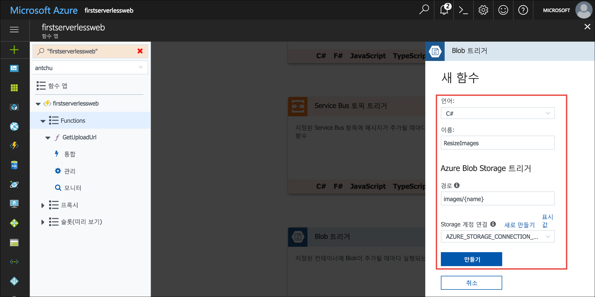
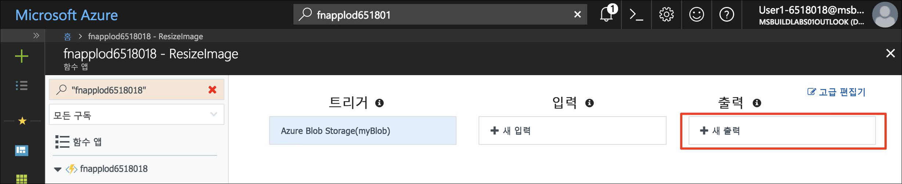
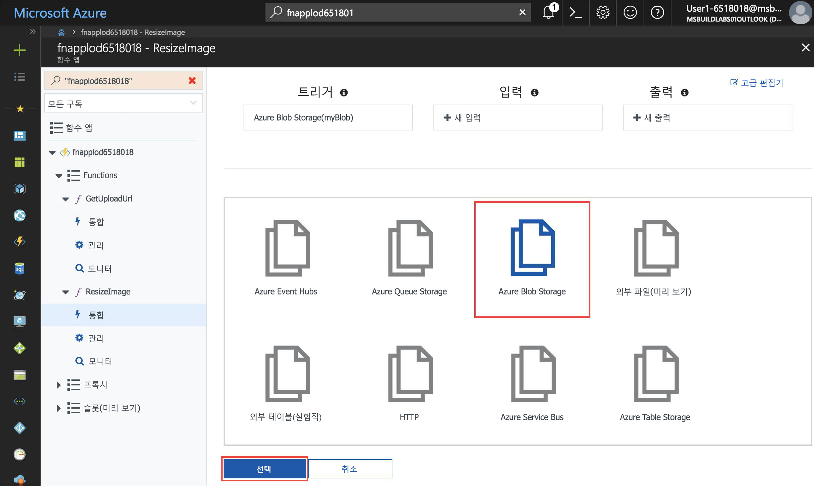
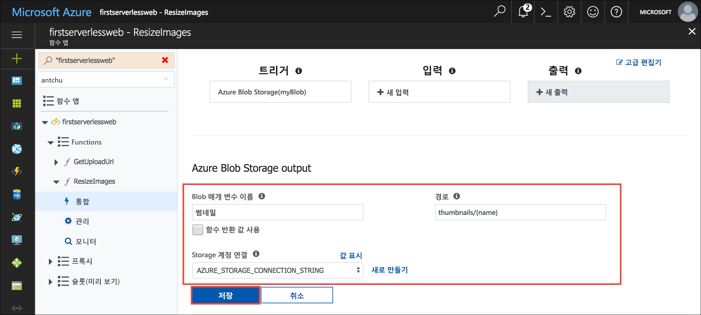
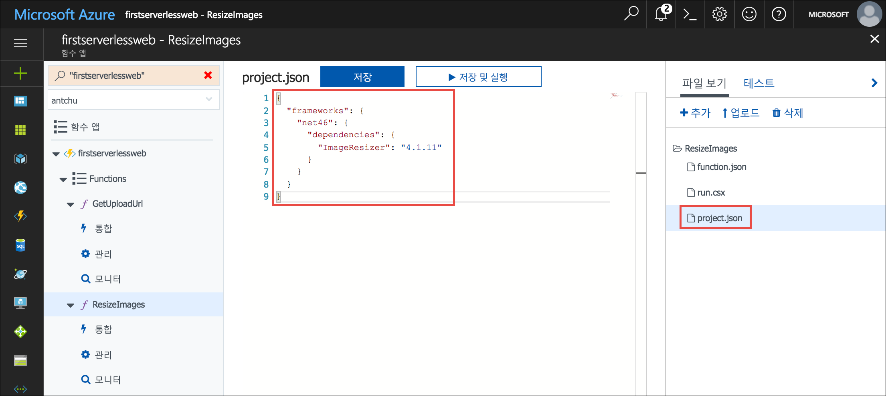

이전 단원에서는 서버리스 함수가 웹 응용 프로그램에서 Blob Storage로 이미지의 안전한 업로드를 용이하게 할 수 있는 방법을 살펴보았습니다. 이 모듈에서는 서버를 사용하지 않는 다른 함수를 만들어서 업로드된 이미지를 감시하고 썸네일을 만듭니다.

## <a name="create-a-blob-storage-container-for-thumbnails"></a>썸네일에 대한 Blob Storage 컨테이너 만들기

전체 크기 이미지는 **images**라는 컨테이너에 저장됩니다. 다른 컨테이너가 해당 이미지의 썸네일을 저장해야 합니다.

1. Cloud Shell(Bash)에 로그인했는지 확인합니다. 그러지 않은 경우 **포커스 모드로 전환**을 선택하여 Cloud Shell 창을 엽니다. 

1. 모든 Blob에 대한 공용 액세스 권한이 있는 저장소 계정에서 **thumbnails**라는 새 컨테이너를 만듭니다.

    ```azurecli
    az storage container create -n thumbnails --account-name <storage account name> --public-access blob
    ```

## <a name="create-a-blob-triggered-serverless-function"></a>Blob 트리거 서버를 사용하지 않는 함수 만들기

트리거는 함수가 호출되는 방식을 정의합니다. 다음에 만든 함수는 Blob 트리거를 사용합니다. Blob(이미지 파일)을 **images** 컨테이너에 업로드하면 함수가 자동으로 호출됩니다. 함수에는 하나의 트리거만 있어야 합니다. 트리거 함수를 트리거한 페이로드는 일반적으로 데이터를 연결 합니다.

바인딩은 함수가 Azure 또는 타사 서비스에서 데이터를 읽고 기록하는 방법을 정의합니다. 이 함수는 트리거하는 이미지의 썸네일 버전을 만들고 *thumbnails* 컨테이너에서 썸네일을 저장합니다.

1. 함수 앱을 엽니다는 [Azure portal](https://portal.azure.com/?azure-portal=true)합니다.

1. Functions 앱 창의 왼쪽 탐색에서 **함수**를 가리키고 더하기 기호(+)를 클릭하여 새 서버리스 함수를 만듭니다. 빠른 시작 페이지가 표시되면 **사용자 지정 함수**를 클릭하여 함수 템플릿 목록을 확인합니다.

1. **BlobTrigger** 템플릿을 찾아 선택합니다.

1. 이러한 값을 사용하여 이미지를 업로드하는 경우 썸네일을 생성하는 함수를 만듭니다.

    | 설정      |  제안 값   | 설명                                        |
    | --- | --- | ---|
    | **언어** | C# 또는 JavaScript | 기본 설정 언어를 선택합니다. |
    | **함수 이름 지정** | ResizeImage | 응용 프로그램이 함수를 검색할 수 있도록 표시된 대로 이 이름을 정확히 입력합니다. |
    | **Path** | images/{name} | 파일이 **images** 컨테이너에 표시되면 함수를 실행합니다. |
    | **저장소 계정 정보** | AZURE_STORAGE_CONNECTION_STRING | 연결 문자열을 사용하여 이전에 만든 환경 변수를 사용합니다. |

    

1. **만들기**를 클릭하여 함수를 만듭니다.

1. 함수를 만들면 **통합**을 클릭하여 해당 트리거, 입력 및 출력 바인딩을 봅니다.

1. **새 출력**을 클릭하여 새 출력 바인딩을 만듭니다.

    

1. **Azure Blob Storage**를 선택하고 **선택**을 클릭합니다. **선택** 단추를 보려면 아래로 스크롤해야 합니다.

    

1. 다음 값을 입력합니다.

    | 설정      |  제안 값   | 설명                                        |
    | --- | --- | ---|
    | **Blob 매개 변수 이름** | 썸네일 | 함수는 이 이름을 가진 매개 변수를 사용하여 썸네일을 작성합니다. |
    | **함수 반환 값 사용** | 아니요 |  |
    | **Path** | thumbnails/{name} | 썸네일은 **thumbnails**라는 컨테이너에 기록됩니다. |
    | **저장소 계정 연결** | AZURE_STORAGE_CONNECTION_STRING | 연결 문자열을 사용하여 이전에 만든 환경 변수를 사용합니다. |

    

::: zone pivot="javascript"
1. (JavaScript) 창의 오른쪽 위 모서리에서 **고급 편집기**를 클릭하여 바인딩을 나타내는 JSON을 표시합니다.

1. (JavaScript) `blobTrigger` 바인딩에서 `binary`의 값을 포함한 `dataType`이라는 속성을 추가합니다. 이 Blob 콘텐츠를 이진 데이터로 함수에 전달하도록 바인딩을 구성합니다.

```json
{
    "name": "myBlob",
    "type": "blobTrigger",
    "direction": "in",
    "path": "images/{name}",
    "connection": "AZURE_STORAGE_CONNECTION_STRING",
    "dataType": "binary"
}
```

::: zone-end

1. **저장**을 클릭하여 새 바인딩을 만듭니다.

::: zone pivot="csharp"

1. (C#) 왼쪽 탐색에서 **ResizeImage** 함수 이름을 선택하여 함수의 소스 코드를 엽니다.

1. (C#) 썸네일을 생성하기 위해 함수에는 **ImageResizer**라는 NuGet 패키지가 필요합니다. **project.json** 파일을 사용하여 NuGet 패키지를 C# 함수에 추가합니다. 파일을 만들려면 오른쪽에서 **파일 보기**를 클릭하여 함수를 구성하는 파일을 표시합니다.

1. (C#) **추가**를 클릭하여 **project.json**이라는 새 파일을 추가합니다.

1. (C#) [**/csharp/ResizeImage/project.json**](https://raw.githubusercontent.com/Azure-Samples/functions-first-serverless-web-application/master/csharp/ResizeImage/project.json)의 콘텐츠를 새로 만든 파일에 복사합니다. 파일을 저장합니다. 파일이 업데이트될 때 패키지가 자동으로 복원됩니다.

    

1. (C#) **파일 보기** 아래에서 **run.csx**를 선택합니다. 해당 콘텐츠를 [**/csharp/ResizeImage/run.csx**](https://raw.githubusercontent.com/Azure-Samples/functions-first-serverless-web-application/master/csharp/ResizeImage/run.csx) 파일의 콘텐츠로 바꿉니다.

::: zone-end

::: zone pivot="javascript"

1. (JavaScript) 사진의 크기를 조정하기 위해 이 함수에는 npm의 `jimp` 패키지가 필요합니다. npm 패키지를 설치하려면 왼쪽 탐색 창에서 Functions 앱의 이름을 클릭하고, **플랫폼 기능**을 클릭합니다.

1. (JavaScript) **콘솔**을 클릭하여 콘솔 창을 표시합니다.

1. (JavaScript) 콘솔에서 `npm install jimp` 명령을 실행합니다. 작업을 완료하는 데 몇 분 정도 걸릴 수 있습니다.

1. (JavaScript) 왼쪽 탐색에서 **ResizeImage** 함수 이름을 클릭하여 함수를 표시합니다. **index.js** 파일의 모든 콘텐츠를 [**/javascript/ResizeImage/index.js**](https://raw.githubusercontent.com/Azure-Samples/functions-first-serverless-web-application/master/javascript/ResizeImage/index.js) 파일의 콘텐츠로 바꿉니다.

::: zone-end

1. [로그] 패널을 확장하려면 코드 창 아래에서 **로그**를 클릭합니다.

1. **저장**을 클릭합니다. [로그] 패널을 확인하여 함수가 성공적으로 저장되고 오류가 없는지 확인합니다.

## <a name="test-the-serverless-function"></a>서버를 사용하지 않는 함수 테스트

1. 브라우저에서 응용 프로그램을 엽니다. 이미지 파일을 선택하고 업로드합니다. 업로드가 완료되지만 아직 이미지를 표시하는 기능을 추가하지 않았으므로 앱은 업로드한 사진을 표시하지 않습니다.

1. Cloud Shell에서 이미지를 **images** 컨테이너로 업로드했는지 확인합니다.

    ```azurecli
    az storage blob list --account-name <storage account name> -c images -o table
    ```

1. **thumbnails**라는 컨테이너에서 썸네일이 생성되었는지 확인합니다.

    ```azurecli
    az storage blob list --account-name <storage account name> -c thumbnails -o table
    ```

1. 썸네일의 URL을 가져옵니다.

    ```azurecli
    az storage blob url --account-name <storage account name> -c thumbnails -n <filename> --output tsv
    ```

    브라우저에서 URL을 열고 썸네일이 제대로 생성되었는지 확인합니다.

1. 다음 자습서로 계속하기 전에 **images** 및 **thumbnails** 컨테이너에서 모든 파일을 삭제합니다.

    ```azurecli
    az storage blob delete-batch -s images --account-name <storage account name>
    ```

    ```azurecli
    az storage blob delete-batch -s thumbnails --account-name <storage account name>
    ```

## <a name="summary"></a>요약

이 단원에서는 이미지를 Blob Storage 컨테이너에 업로드할 때마다 썸네일을 만드는 서버리스 함수를 만들었습니다. 다음으로, Azure Cosmos DB를 사용 하 여 저장 하는 방법 및 목록 이미지 메타 데이터에서는 알아봅니다.