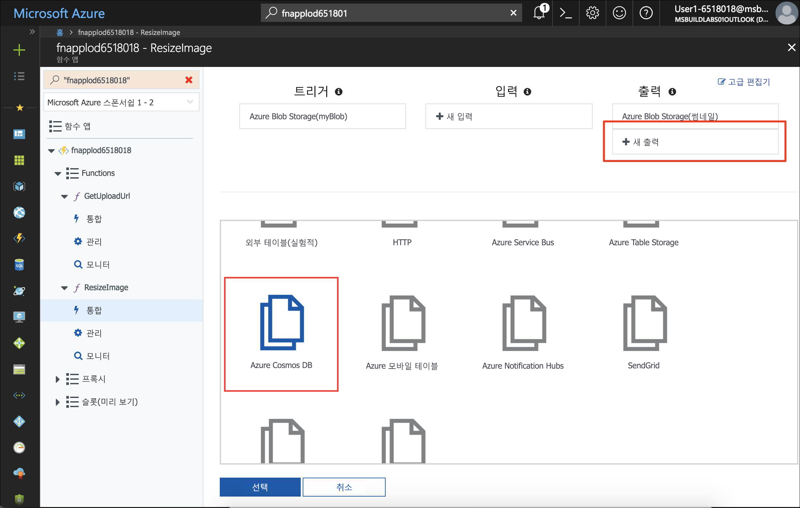
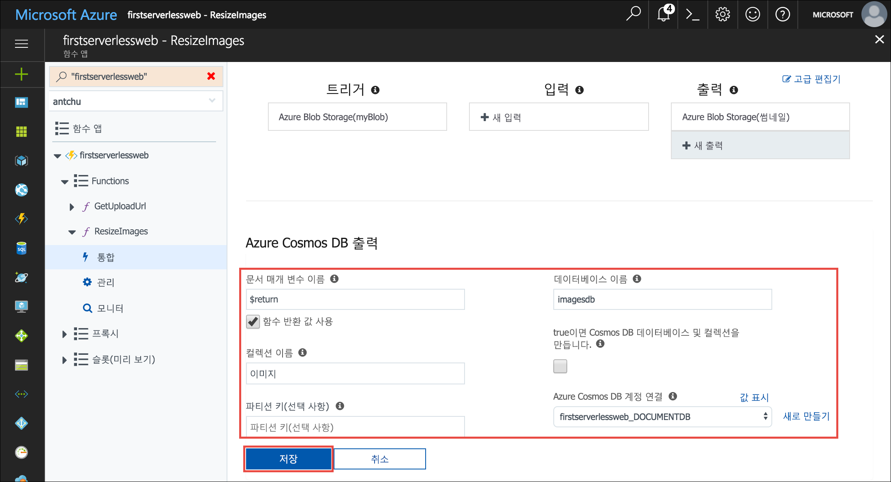
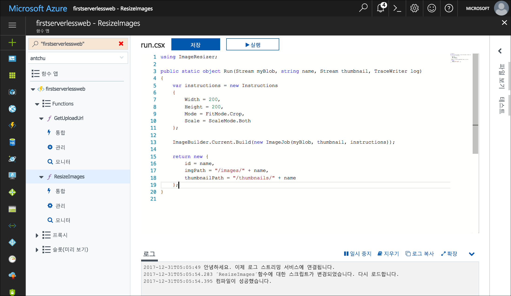
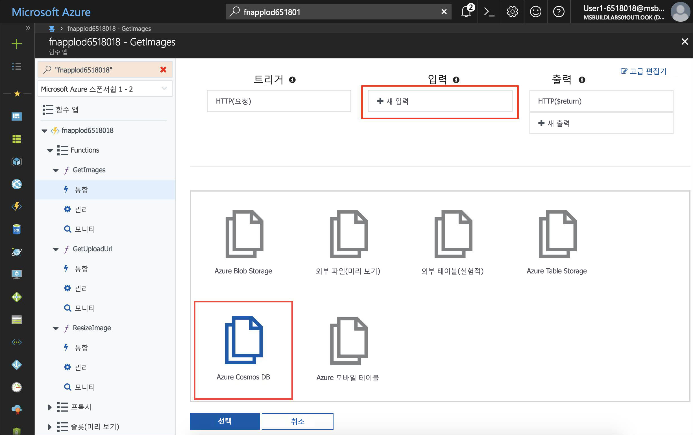
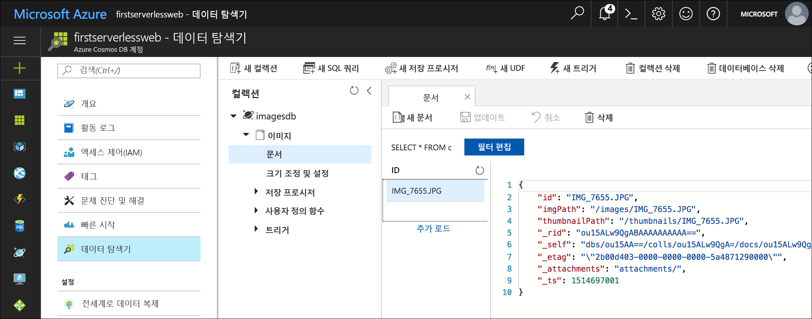

<span data-ttu-id="5b353-101">Azure Cosmos DB는 서버를 사용하지 않는 전 세계에 배포된 Microsoft의 다중 모델 데이터베이스입니다.</span><span class="sxs-lookup"><span data-stu-id="5b353-101">Azure Cosmos DB is Microsoft's serverless, globally distributed, multi-model database.</span></span> <span data-ttu-id="5b353-102">이 모듈에서는 Azure Functions를 사용하여 Azure Cosmos DB에서 JSON 문서로 이미지 메타데이터를 저장하고 검색하는 방법을 알아봅니다.</span><span class="sxs-lookup"><span data-stu-id="5b353-102">In this module, you learn how to use Azure Functions to store and retrieve image metadata as JSON documents in Azure Cosmos DB.</span></span>

## <a name="create-an-azure-cosmos-db-account-database-and-collection"></a><span data-ttu-id="5b353-103">Azure Cosmos DB 계정, 데이터베이스 및 컬렉션 만들기</span><span class="sxs-lookup"><span data-stu-id="5b353-103">Create an Azure Cosmos DB account, database, and collection</span></span>

<span data-ttu-id="5b353-104">Azure Cosmos DB 계정은 Azure Cosmos DB 데이터베이스를 포함하는 Azure 리소스입니다.</span><span class="sxs-lookup"><span data-stu-id="5b353-104">An Azure Cosmos DB account is an Azure resource that contains Azure Cosmos DB databases.</span></span>

1. <span data-ttu-id="5b353-105">이 모듈의 다른 리소스와 동일한 리소스 그룹에서 고유한 이름을 사용하여 Azure Cosmos DB 계정을 만듭니다.</span><span class="sxs-lookup"><span data-stu-id="5b353-105">Create an Azure Cosmos DB account with a unique name in the same resource group as the other resources in this module.</span></span> <span data-ttu-id="5b353-106">이 명령을 완료하는 데 1~2분 정도 걸릴 수 있습니다.</span><span class="sxs-lookup"><span data-stu-id="5b353-106">This command may take a minute or two to complete.</span></span>

    ```azurecli
    az cosmosdb create \
        -g <rgn>[Sandbox resource group name]</rgn> \
        -n <cosmos db account name>
    ```

1. <span data-ttu-id="5b353-107">Azure Cosmos DB 계정을 만든 후에 계정에서 **imagesdb**라는 새 데이터베이스를 만듭니다.</span><span class="sxs-lookup"><span data-stu-id="5b353-107">After the Azure Cosmos DB account is created, create a new database named **imagesdb** in the account.</span></span>

    ```azurecli
    az cosmosdb database create \
        -g <rgn>[Sandbox resource group name]</rgn> \
        -n <cosmos db account name> \
        --db-name imagesdb
    ```

1. <span data-ttu-id="5b353-108">데이터베이스를 만든 후에 데이터베이스에서 400RU(요청 단위)의 처리량을 가진 **images**라는 새 컬렉션을 만듭니다.</span><span class="sxs-lookup"><span data-stu-id="5b353-108">After the database is created, create a new collection named **images** in the database with a throughput of 400 request units (RUs).</span></span>

    ```azurecli
    az cosmosdb collection create \
        -g <rgn>[Sandbox resource group name]</rgn> \
        -n <cosmos db account name> \
        --db-name imagesdb \
        --collection-name images \
        --throughput 400
    ```

## <a name="save-a-document-to-azure-cosmos-db-when-a-thumbnail-is-created"></a><span data-ttu-id="5b353-109">썸네일을 만들 때 Azure Cosmos DB에 문서를 저장합니다.</span><span class="sxs-lookup"><span data-stu-id="5b353-109">Save a document to Azure Cosmos DB when a thumbnail is created</span></span>

<span data-ttu-id="5b353-110">Azure Cosmos DB 출력 바인딩을 통해 Azure Functions의 Azure Cosmos DB 컬렉션에서 문서를 만들 수 있습니다.</span><span class="sxs-lookup"><span data-stu-id="5b353-110">The Azure Cosmos DB output binding lets you create documents in an Azure Cosmos DB collection from Azure Functions.</span></span> <span data-ttu-id="5b353-111">다음 단계에서는 **ResizeImage** 함수에서 Azure Cosmos DB 출력 바인딩을 구성하고, 저장할 문서(개체)를 반환하도록 함수를 수정합니다.</span><span class="sxs-lookup"><span data-stu-id="5b353-111">In the following steps, you configure an Azure Cosmos DB output binding in the **ResizeImage** function and modify the function to return a document (object) to be saved.</span></span>

1. <span data-ttu-id="5b353-112">샌드박스를 활성화한 동일한 계정을 사용하여 [Azure Portal](https://portal.azure.com/triplecrownlabs.onmicrosoft.com?azure-portal=true)에 로그인합니다.</span><span class="sxs-lookup"><span data-stu-id="5b353-112">Sign into the [Azure portal](https://portal.azure.com/triplecrownlabs.onmicrosoft.com?azure-portal=true) using the same account you activated the sandbox with.</span></span>

1. <span data-ttu-id="5b353-113">함수 앱을 엽니다.</span><span class="sxs-lookup"><span data-stu-id="5b353-113">Open the function app.</span></span>

1. <span data-ttu-id="5b353-114">왼쪽 탐색에서 **ResizeImage** 함수를 확장한 다음, **통합**을 선택합니다.</span><span class="sxs-lookup"><span data-stu-id="5b353-114">In the left navigation, expand the **ResizeImage** function, and then select **Integrate**.</span></span>

1. <span data-ttu-id="5b353-115">**출력**에서 **새 출력**을 클릭합니다.</span><span class="sxs-lookup"><span data-stu-id="5b353-115">Under **Outputs**, click **New Output**.</span></span>

1. <span data-ttu-id="5b353-116">**Azure Cosmos DB** 항목을 찾아 선택합니다.</span><span class="sxs-lookup"><span data-stu-id="5b353-116">Find the **Azure Cosmos DB** item and select it.</span></span> <span data-ttu-id="5b353-117">그런 다음, **선택**을 클릭합니다.</span><span class="sxs-lookup"><span data-stu-id="5b353-117">Then click **Select**.</span></span>

    

1. <span data-ttu-id="5b353-119">다음 값으로 **Azure Cosmos DB 출력** 아래에 있는 필드를 채웁니다.</span><span class="sxs-lookup"><span data-stu-id="5b353-119">Fill out the fields under **Azure Cosmos DB output** with the following values.</span></span>

    | <span data-ttu-id="5b353-120">설정</span><span class="sxs-lookup"><span data-stu-id="5b353-120">Setting</span></span>      |  <span data-ttu-id="5b353-121">제안 값</span><span class="sxs-lookup"><span data-stu-id="5b353-121">Suggested value</span></span>   | <span data-ttu-id="5b353-122">설명</span><span class="sxs-lookup"><span data-stu-id="5b353-122">Description</span></span>                                        |
    | --- | --- | ---|
    | <span data-ttu-id="5b353-123">**문서 매개 변수 이름**</span><span class="sxs-lookup"><span data-stu-id="5b353-123">**Document parameter name**</span></span> | <span data-ttu-id="5b353-124">**함수 반환 값 사용**을 선택합니다.</span><span class="sxs-lookup"><span data-stu-id="5b353-124">Select **Use function return value**.</span></span> | <span data-ttu-id="5b353-125">상자의 값은 자동으로 **$return**으로 설정됩니다.</span><span class="sxs-lookup"><span data-stu-id="5b353-125">The value in the box is automatically set to **$return**.</span></span> |
    | <span data-ttu-id="5b353-126">**데이터베이스 이름**</span><span class="sxs-lookup"><span data-stu-id="5b353-126">**Database name**</span></span> | <span data-ttu-id="5b353-127">imagesdb</span><span class="sxs-lookup"><span data-stu-id="5b353-127">imagesdb</span></span> | <span data-ttu-id="5b353-128">사용자가 만든 데이터베이스의 이름을 사용합니다.</span><span class="sxs-lookup"><span data-stu-id="5b353-128">Use the name of the database that you created.</span></span> |
    | <span data-ttu-id="5b353-129">**컬렉션 이름**</span><span class="sxs-lookup"><span data-stu-id="5b353-129">**Collection name**</span></span> | <span data-ttu-id="5b353-130">images</span><span class="sxs-lookup"><span data-stu-id="5b353-130">images</span></span> | <span data-ttu-id="5b353-131">사용자가 만든 컬렉션의 이름을 사용합니다.</span><span class="sxs-lookup"><span data-stu-id="5b353-131">Use the name of the collection that you created.</span></span> |

1. <span data-ttu-id="5b353-132">**Azure Cosmos DB 계정 연결** 옆에 있는 **새로 만들기**를 클릭합니다.</span><span class="sxs-lookup"><span data-stu-id="5b353-132">Next to **Azure Cosmos DB account connection**, click **new**.</span></span> <span data-ttu-id="5b353-133">이전에 만든 Azure Cosmos DB 계정을 선택합니다.</span><span class="sxs-lookup"><span data-stu-id="5b353-133">Select the Azure Cosmos DB account that you previously created.</span></span>

    

1. <span data-ttu-id="5b353-135">**저장**을 클릭하여 Azure Cosmos DB 출력 바인딩을 만듭니다.</span><span class="sxs-lookup"><span data-stu-id="5b353-135">Click **Save** to create the Azure Cosmos DB output binding.</span></span>

1. <span data-ttu-id="5b353-136">왼쪽에서 **ResizeImage** 함수 이름을 클릭하여 함수를 엽니다.</span><span class="sxs-lookup"><span data-stu-id="5b353-136">Click on the **ResizeImage** function name on the left to open the function.</span></span>

<span data-ttu-id="5b353-137">::: zone pivot="csharp"</span><span class="sxs-lookup"><span data-stu-id="5b353-137">::: zone pivot="csharp"</span></span>

10. <span data-ttu-id="5b353-138">오류 팝업을 닫고 함수의 반환 형식을 **void**에서 **object**로 변경합니다.</span><span class="sxs-lookup"><span data-stu-id="5b353-138">Close the error popup and change the return type of the function from **void** to **object**.</span></span>

1. <span data-ttu-id="5b353-139">함수 끝에 저장할 문서를 반환하도록 다음 코드 블록을 추가합니다.</span><span class="sxs-lookup"><span data-stu-id="5b353-139">At the end of the function, add the following code block to return the document to be saved:</span></span>

    ```csharp
    return new {
        id = name,
        imgPath = "/images/" + name,
        thumbnailPath = "/thumbnails/" + name
    };
    ```

    

1. <span data-ttu-id="5b353-141">코드 창 아래에서 **로그**를 클릭하여 로그 패널을 확장합니다.</span><span class="sxs-lookup"><span data-stu-id="5b353-141">Click **Logs** below the code window to expand the logs panel.</span></span>

1. <span data-ttu-id="5b353-142">**저장**을 클릭합니다.</span><span class="sxs-lookup"><span data-stu-id="5b353-142">Click **Save**.</span></span> <span data-ttu-id="5b353-143">[로그] 패널을 확인하여 함수가 성공적으로 저장되고 오류가 없는지 확인합니다.</span><span class="sxs-lookup"><span data-stu-id="5b353-143">Check the logs panel to ensure the function is successfully saved and there are no errors.</span></span>

<span data-ttu-id="5b353-144">::: zone-end</span><span class="sxs-lookup"><span data-stu-id="5b353-144">::: zone-end</span></span>

<span data-ttu-id="5b353-145">::: zone pivot="javascript"</span><span class="sxs-lookup"><span data-stu-id="5b353-145">::: zone pivot="javascript"</span></span>

10. <span data-ttu-id="5b353-146">`else` 절에서 `context.done()` 문을 변경하여 Azure Cosmos DB에 저장할 문서를 반환합니다.</span><span class="sxs-lookup"><span data-stu-id="5b353-146">Change the `context.done()` statement in the `else` clause to return the document to be saved to Azure Cosmos DB.</span></span>

    ```javascript
    if (error) {
        context.done(error);
    } else {
        context.bindings.thumbnail = stream;
        context.done(null, {
            id: context.bindingData.name,
            imgPath: "/images/" + context.bindingData.name,
            thumbnailPath: "/thumbnails/" + context.bindingData.name
        });
    }
    ```
1. <span data-ttu-id="5b353-147">코드 창 아래에서 **로그**를 클릭하여 로그 패널을 확장합니다.</span><span class="sxs-lookup"><span data-stu-id="5b353-147">Click **Logs** below the code window to expand the logs panel.</span></span>

1. <span data-ttu-id="5b353-148">**저장**을 클릭합니다.</span><span class="sxs-lookup"><span data-stu-id="5b353-148">Click **Save**.</span></span> <span data-ttu-id="5b353-149">[로그] 패널을 확인하여 함수가 성공적으로 저장되고 오류가 없는지 확인합니다.</span><span class="sxs-lookup"><span data-stu-id="5b353-149">Check the logs panel to ensure the function is successfully saved and there are no errors.</span></span>

<span data-ttu-id="5b353-150">::: zone-end</span><span class="sxs-lookup"><span data-stu-id="5b353-150">::: zone-end</span></span>

## <a name="create-a-function-to-list-images-from-azure-cosmos-db"></a><span data-ttu-id="5b353-151">Azure Cosmos DB에서 이미지를 나열하는 함수 만들기</span><span class="sxs-lookup"><span data-stu-id="5b353-151">Create a function to list images from Azure Cosmos DB</span></span>

<span data-ttu-id="5b353-152">Azure Cosmos DB에서 이미지 메타데이터를 검색하기 위해 웹 응용 프로그램에는 API가 필요합니다.</span><span class="sxs-lookup"><span data-stu-id="5b353-152">The web application requires an API to retrieve image metadata from Azure Cosmos DB.</span></span> <span data-ttu-id="5b353-153">다음 단계에서는 Azure Cosmos DB 입력 바인딩을 사용하는 HTTP 트리거 함수를 만들어서 데이터베이스 컬렉션을 쿼리합니다.</span><span class="sxs-lookup"><span data-stu-id="5b353-153">In the following steps, you create an HTTP-triggered function that uses an Azure Cosmos DB input binding to query the database collection.</span></span>

1. <span data-ttu-id="5b353-154">함수 앱에서 왼쪽에 있는 **함수**를 가리키고 더하기 기호(+)를 클릭하여 새 함수를 만듭니다.</span><span class="sxs-lookup"><span data-stu-id="5b353-154">In your function app, point to **Functions** on the left and click the plus sign (+) to create a new function.</span></span>

1. <span data-ttu-id="5b353-155">**HttpTrigger** 템플릿을 찾아 선택합니다.</span><span class="sxs-lookup"><span data-stu-id="5b353-155">Find the **HttpTrigger** template and select it.</span></span>

1. <span data-ttu-id="5b353-156">이러한 값을 사용하여 이미지 가져오기 URL을 생성하는 함수를 만듭니다.</span><span class="sxs-lookup"><span data-stu-id="5b353-156">Use these values to create a function that generates a get images URL:</span></span>

    | <span data-ttu-id="5b353-157">설정</span><span class="sxs-lookup"><span data-stu-id="5b353-157">Setting</span></span>      |  <span data-ttu-id="5b353-158">제안 값</span><span class="sxs-lookup"><span data-stu-id="5b353-158">Suggested value</span></span>   | <span data-ttu-id="5b353-159">설명</span><span class="sxs-lookup"><span data-stu-id="5b353-159">Description</span></span>                                        |
    | --- | --- | ---|
    | <span data-ttu-id="5b353-160">**함수 이름 지정**</span><span class="sxs-lookup"><span data-stu-id="5b353-160">**Name your function**</span></span> | <span data-ttu-id="5b353-161">GetImages</span><span class="sxs-lookup"><span data-stu-id="5b353-161">GetImages</span></span> | <span data-ttu-id="5b353-162">응용 프로그램이 함수를 검색할 수 있도록 표시된 대로 이 이름을 정확히 입력합니다.</span><span class="sxs-lookup"><span data-stu-id="5b353-162">Enter this name exactly as shown, so the application can discover the function.</span></span> |
    | <span data-ttu-id="5b353-163">**권한 부여 수준**</span><span class="sxs-lookup"><span data-stu-id="5b353-163">**Authorization level**</span></span> | <span data-ttu-id="5b353-164">익명</span><span class="sxs-lookup"><span data-stu-id="5b353-164">Anonymous</span></span> | <span data-ttu-id="5b353-165">함수가 공개적으로 액세스될 수 있습니다.</span><span class="sxs-lookup"><span data-stu-id="5b353-165">Allow the function to be accessed publicly.</span></span> |

1. <span data-ttu-id="5b353-166">**만들기**를 클릭합니다.</span><span class="sxs-lookup"><span data-stu-id="5b353-166">Click **Create**.</span></span>

1. <span data-ttu-id="5b353-167">새 함수를 만들면 왼쪽 탐색에 있는 함수의 이름에서 **통합**을 클릭합니다.</span><span class="sxs-lookup"><span data-stu-id="5b353-167">When the new function is created, click **Integrate** under the function name on the left navigation.</span></span>

1. <span data-ttu-id="5b353-168">**새 입력**을 클릭하고 **Azure Cosmos DB**를 선택합니다.</span><span class="sxs-lookup"><span data-stu-id="5b353-168">Click **New Input** and select **Azure Cosmos DB**.</span></span>

    

1. <span data-ttu-id="5b353-170">**선택**을 클릭합니다.</span><span class="sxs-lookup"><span data-stu-id="5b353-170">Click **Select**.</span></span>

1. <span data-ttu-id="5b353-171">다음 값을 입력합니다.</span><span class="sxs-lookup"><span data-stu-id="5b353-171">Fill out the following values:</span></span>

    | <span data-ttu-id="5b353-172">설정</span><span class="sxs-lookup"><span data-stu-id="5b353-172">Setting</span></span>      |  <span data-ttu-id="5b353-173">제안 값</span><span class="sxs-lookup"><span data-stu-id="5b353-173">Suggested value</span></span>   | <span data-ttu-id="5b353-174">설명</span><span class="sxs-lookup"><span data-stu-id="5b353-174">Description</span></span>                                        |
    | --- | --- | ---|
    | <span data-ttu-id="5b353-175">**문서 매개 변수 이름**</span><span class="sxs-lookup"><span data-stu-id="5b353-175">**Document parameter name**</span></span> | <span data-ttu-id="5b353-176">documents</span><span class="sxs-lookup"><span data-stu-id="5b353-176">documents</span></span> | <span data-ttu-id="5b353-177">함수에서 매개 변수 이름과 일치합니다.</span><span class="sxs-lookup"><span data-stu-id="5b353-177">Matches the parameter name in the function.</span></span> |
    | <span data-ttu-id="5b353-178">**데이터베이스 이름**</span><span class="sxs-lookup"><span data-stu-id="5b353-178">**Database name**</span></span> | <span data-ttu-id="5b353-179">imagesdb</span><span class="sxs-lookup"><span data-stu-id="5b353-179">imagesdb</span></span> |  |
    | <span data-ttu-id="5b353-180">**컬렉션 이름**</span><span class="sxs-lookup"><span data-stu-id="5b353-180">**Collection name**</span></span> | <span data-ttu-id="5b353-181">images</span><span class="sxs-lookup"><span data-stu-id="5b353-181">images</span></span> |  |
    | <span data-ttu-id="5b353-182">**SQL 쿼리**</span><span class="sxs-lookup"><span data-stu-id="5b353-182">**SQL query**</span></span> | <span data-ttu-id="5b353-183">select \* from c order by c._ts desc</span><span class="sxs-lookup"><span data-stu-id="5b353-183">select \* from c order by c._ts desc</span></span> | <span data-ttu-id="5b353-184">먼저 최신 문서를 가져옵니다.</span><span class="sxs-lookup"><span data-stu-id="5b353-184">Get documents, latest documents first.</span></span> |
    | <span data-ttu-id="5b353-185">**Azure Cosmos DB 계정 연결**</span><span class="sxs-lookup"><span data-stu-id="5b353-185">**Azure Cosmos DB account connection**</span></span> | <span data-ttu-id="5b353-186">기존 연결 문자열을 선택합니다.</span><span class="sxs-lookup"><span data-stu-id="5b353-186">Select the existing connection string.</span></span> |  |

1. <span data-ttu-id="5b353-187">**저장**을 클릭하여 입력 바인딩을 만듭니다.</span><span class="sxs-lookup"><span data-stu-id="5b353-187">Click **Save** to create the input binding.</span></span>

<span data-ttu-id="5b353-188">::: zone pivot="csharp"</span><span class="sxs-lookup"><span data-stu-id="5b353-188">::: zone pivot="csharp"</span></span>

10. <span data-ttu-id="5b353-189">함수 이름을 클릭하여 코드 창을 엽니다.</span><span class="sxs-lookup"><span data-stu-id="5b353-189">Click the function name to open the code window.</span></span> <span data-ttu-id="5b353-190">**run.csx** 파일의 모든 내용을 [**/csharp/GetImages/run.csx**](https://raw.githubusercontent.com/Azure-Samples/functions-first-serverless-web-application/master/csharp/GetImages/run.csx) 파일의 콘텐츠로 바꿉니다.</span><span class="sxs-lookup"><span data-stu-id="5b353-190">Replace all of the **run.csx** file with the content in the [**/csharp/GetImages/run.csx**](https://raw.githubusercontent.com/Azure-Samples/functions-first-serverless-web-application/master/csharp/GetImages/run.csx) file.</span></span>

<span data-ttu-id="5b353-191">::: zone-end</span><span class="sxs-lookup"><span data-stu-id="5b353-191">::: zone-end</span></span>

<span data-ttu-id="5b353-192">::: zone pivot="javascript"</span><span class="sxs-lookup"><span data-stu-id="5b353-192">::: zone pivot="javascript"</span></span>

10. <span data-ttu-id="5b353-193">함수 이름을 클릭하여 코드 창을 엽니다.</span><span class="sxs-lookup"><span data-stu-id="5b353-193">Click the function name to open the code window.</span></span> <span data-ttu-id="5b353-194">**index.js** 파일의 모든 내용을 [**/javascript/GetImages/index.js**](https://raw.githubusercontent.com/Azure-Samples/functions-first-serverless-web-application/master/javascript/GetImages/index.js) 파일의 콘텐츠로 바꿉니다.</span><span class="sxs-lookup"><span data-stu-id="5b353-194">Replace all of the **index.js** file with the content in the [**/javascript/GetImages/index.js**](https://raw.githubusercontent.com/Azure-Samples/functions-first-serverless-web-application/master/javascript/GetImages/index.js) file.</span></span>

<span data-ttu-id="5b353-195">::: zone-end</span><span class="sxs-lookup"><span data-stu-id="5b353-195">::: zone-end</span></span>

11. <span data-ttu-id="5b353-196">코드 창 아래에서 **로그**를 클릭하여 [로그] 패널을 확장합니다.</span><span class="sxs-lookup"><span data-stu-id="5b353-196">Click **Logs** below the code window to expand the Logs panel.</span></span>

1. <span data-ttu-id="5b353-197">**저장**을 클릭합니다.</span><span class="sxs-lookup"><span data-stu-id="5b353-197">Click **Save**.</span></span> <span data-ttu-id="5b353-198">[로그] 패널을 확인하여 함수가 성공적으로 저장되고 오류가 없는지 확인합니다.</span><span class="sxs-lookup"><span data-stu-id="5b353-198">Check the Logs panel to ensure the function is successfully saved and there are no errors.</span></span>

## <a name="test-the-application"></a><span data-ttu-id="5b353-199">응용 프로그램 테스트</span><span class="sxs-lookup"><span data-stu-id="5b353-199">Test the application</span></span>

1. <span data-ttu-id="5b353-200">브라우저에서 응용 프로그램을 엽니다.</span><span class="sxs-lookup"><span data-stu-id="5b353-200">Open the application in a browser.</span></span> <span data-ttu-id="5b353-201">이미지 파일을 선택하고 업로드합니다.</span><span class="sxs-lookup"><span data-stu-id="5b353-201">Select an image file and upload it.</span></span>

1. <span data-ttu-id="5b353-202">몇 초 후에 새 이미지의 썸네일이 페이지에 표시됩니다.</span><span class="sxs-lookup"><span data-stu-id="5b353-202">After a few seconds, the thumbnail of the new image appears on the page.</span></span>

1. <span data-ttu-id="5b353-203">Azure Portal에서 **검색** 상자를 사용하여 이름으로 Azure Cosmos DB 계정을 검색합니다.</span><span class="sxs-lookup"><span data-stu-id="5b353-203">In the Azure portal, use the **Search** box to search for your Azure Cosmos DB account by name.</span></span> <span data-ttu-id="5b353-204">이름을 클릭하여 계정을 엽니다.</span><span class="sxs-lookup"><span data-stu-id="5b353-204">Click on the name to open the account.</span></span>

1. <span data-ttu-id="5b353-205">왼쪽에서 **데이터 탐색기**를 클릭하여 컬렉션 및 문서를 찾아봅니다.</span><span class="sxs-lookup"><span data-stu-id="5b353-205">Click **Data Explorer** on the left to browse collections and documents.</span></span>

1. <span data-ttu-id="5b353-206">**imagesdb** 데이터베이스 아래에서 **images** 컬렉션을 선택합니다.</span><span class="sxs-lookup"><span data-stu-id="5b353-206">Under the **imagesdb** database, select the **images** collection.</span></span>

1. <span data-ttu-id="5b353-207">업로드된 이미지에 대한 문서가 생성되었는지 확인합니다.</span><span class="sxs-lookup"><span data-stu-id="5b353-207">Confirm that a document was created for the uploaded image.</span></span>

    

## <a name="summary"></a><span data-ttu-id="5b353-209">요약</span><span class="sxs-lookup"><span data-stu-id="5b353-209">Summary</span></span>

<span data-ttu-id="5b353-210">이 단원에서는 Azure Cosmos DB 계정, 데이터베이스 및 컬렉션을 만드는 방법을 알아보았습니다.</span><span class="sxs-lookup"><span data-stu-id="5b353-210">In this unit, you learned how to create an Azure Cosmos DB account, database, and collection.</span></span> <span data-ttu-id="5b353-211">Azure Cosmos DB 바인딩을 사용하여 Azure Cosmos DB 컬렉션에서 이미지 메타데이터를 저장하고 검색하는 방법을 알아보았습니다.</span><span class="sxs-lookup"><span data-stu-id="5b353-211">You also learned how to use the Azure Cosmos DB bindings to save and retrieve image metadata in the Azure Cosmos DB collection.</span></span> <span data-ttu-id="5b353-212">다음으로, Microsoft Cognitive Services를 사용하여 각 업로드된 이미지에 대한 캡션을 자동으로 생성하는 방법을 알아봅니다.</span><span class="sxs-lookup"><span data-stu-id="5b353-212">Next, you will learn how to automatically generate a caption for each uploaded image using Microsoft Cognitive Services.</span></span>