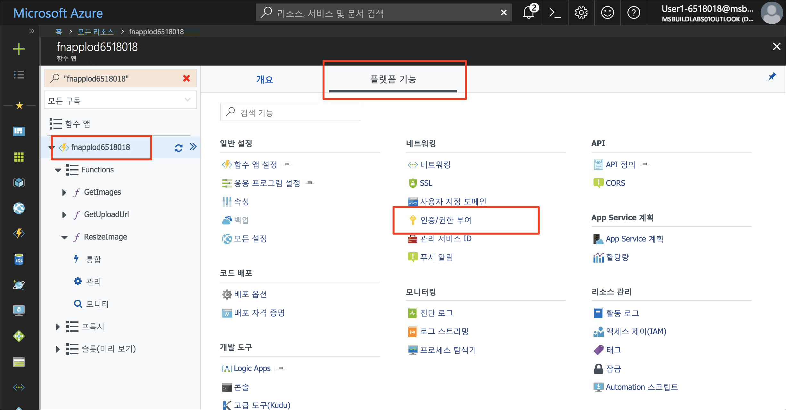
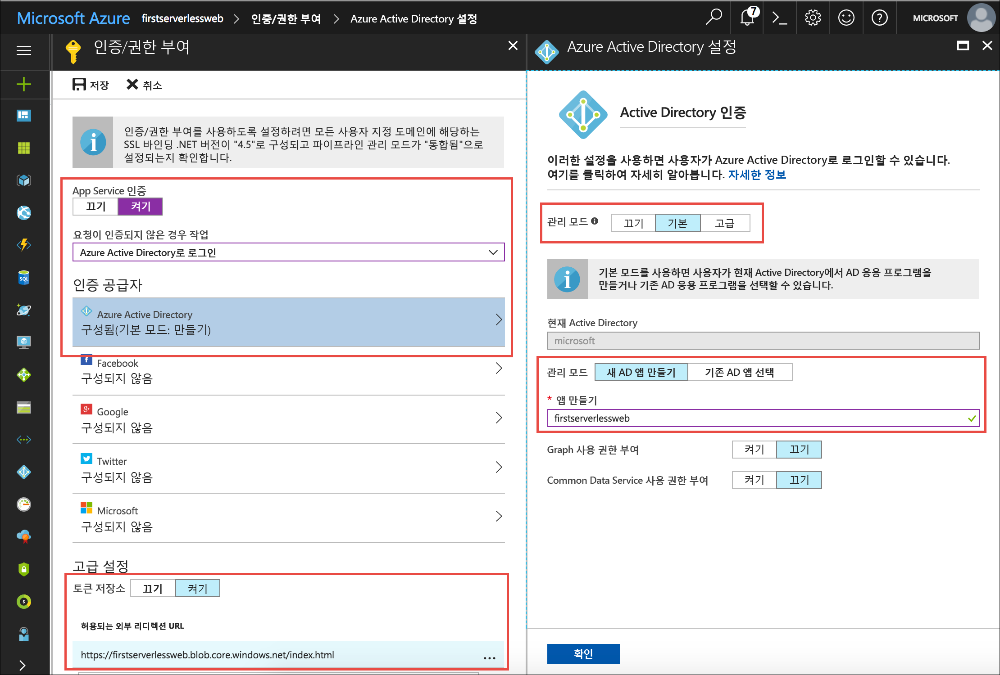
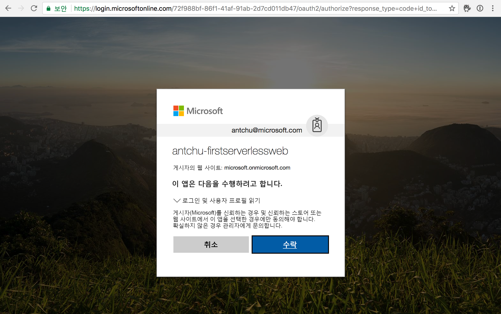

Azure App Service 인증을 사용하면 Azure Functions 앱에서 턴키 인증을 지원할 수 있습니다. Facebook, Twitter, Microsoft 계정, Google 및 Azure Active Directory와 원활하게 통합합니다. App Service 인증을 추가하여 웹앱의 백 엔드 API를 보호합니다.

## <a name="enable-app-service-authentication"></a>App Service 인증을 사용하도록 설정

1. [Azure Portal](https://portal.azure.com/?azure-portal=true)에서 함수 앱을 엽니다.

1. **플랫폼 기능** 아래에서 **인증/권한 부여**를 선택합니다.

    

1. 다음 값을 선택합니다.
    
    | 설정      |  제안 값   | 설명                                        |
    | --- | --- | ---|
    | **App Service 인증** | 다른 | 인증을 사용하도록 설정합니다. |
    | **요청이 인증되지 않은 경우 작업** | Azure Active Directory로 로그인합니다. | 구성된 인증 방법을 선택합니다(아래 참조). |
    | **인증 공급자** | 아래 내용을 참조하세요. | 아래 내용을 참조하세요. |
    | **토큰 저장소** | 다른 | App Service가 토큰을 저장하고 관리할 수 있습니다. |
    | **허용되는 외부 리디렉션 URL** | 응용 프로그램의 URL(예: https://firstserverlessweb.z4.web.core.windows.net/). | 사용자가 인증된 후에 App Service가 리디렉션할 수 있는 URL입니다. |

1. **Azure Active Directory**를 선택하여 **Azure Active Directory 설정**을 표시합니다.

    1. **Express**를 **관리 모드**로 선택하고 다음 정보를 입력합니다.
    
        | 설정      |  제안 값   | 설명                                        |
        | --- | --- | ---|
        | **관리 모드** | Express, 새 AD 앱 만들기 | 서비스 주체 및 Azure Active Directory 인증을 자동으로 설정합니다. |
        | **앱 만들기** | my-serverless-webapp | 고유한 응용 프로그램 이름을 입력합니다. |
    
    1. **확인**을 클릭하여 Azure Active Directory 설정을 저장합니다.

    


1. **저장**을 클릭합니다.


## <a name="modify-the-web-app-to-enable-authentication"></a>인증을 사용하도록 웹앱 수정

1. Cloud Shell에서 현재 디렉터리가 **www/dist** 폴더인지를 확인합니다.

    ```azurecli
    cd ~/functions-first-serverless-web-application/www/dist
    ```

1. 함수 앱에서 인증을 사용하려면 다음 코드 줄을 **settings.js** 파일에 추가합니다.

    `window.authEnabled = true`

    다음 명령을 사용하거나 VIM과 같은 명령줄 편집기를 사용하여 결과를 변경하고 확인합니다.

    ```azurecli
    echo "window.authEnabled = true" >> settings.js
    ```

    파일의 변경 내용을 확인합니다.

    ```azurecli
    cat settings.js
    ```

1. Blob Storage에 파일을 업로드합니다.

    ```azurecli
    az storage blob upload -c \$web --account-name <storage account name> -f settings.js -n settings.js
    ```


## <a name="test-the-application"></a>응용 프로그램 테스트

1. 브라우저에서 응용 프로그램을 엽니다. **로그인**을 클릭하여 로그인합니다.

1. 이미지 파일을 선택하고 업로드합니다.

    
    

## <a name="summary"></a>요약

이 단원에서는 Azure App Service 인증을 사용하여 응용 프로그램에 인증을 추가하는 방법을 알아보았습니다.