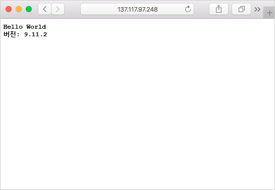

컨테이너 이미지는 Azure Container Instances, Azure Kubernetes Registry 및 Windows 또는 Mac용 Docker 등과 같은 여러 컨테이너 관리 플랫폼을 사용하여 Azure Container Registry에서 끌어올 수 있습니다. Azure Container Registry에서 컨테이너 이미지를 실행하는 경우 인증 자격 증명이 필요할 수 있습니다. 

Container Registry에서의 인증에는 Azure 서비스 주체를 사용하는 것이 좋습니다. 또한 Azure Key Vault에서 Azure 서비스 주체 자격 증명을 보호하는 것이 좋습니다. 이 단원에서는 권장 접근 방식을 따릅니다.

그러나 실제 연습에서는 모든 Azure Container Registries에서 사용할 수 있는 기본 제공 관리자 계정을 사용합니다. 관리자 계정은 무료 샌드박스 리소스에서 동작합니다.

<!-- Activate the sandbox -->
[!include[](../../../includes/azure-sandbox-activate.md)]

소문자(예를 들어, “MyContainer” 대신 “mycontainer” 값 설정)로 된 컨테이너 레지스트리 이름으로 변수를 만듭니다. 이 변수는 이 단원 전체에서 사용됩니다.

```azurecli
ACR_NAME=<acrName>
```

### <a name="service-principal"></a>서비스 주체

프로덕션 응용 프로그램의 경우 여기에 서비스 주체를 만들려고 합니다. **이 방법은 샌드박스 환경에서는 작동하지 않지만** 사용자 시스템에서는 따라야 할 모범 사례입니다. 실제 연습에서는 아래의 관리자 계정 지침을 사용합니다.

`az ad sp create-for-rbac` 명령을 사용하여 서비스 주체를 만들 수 있습니다. `--role` 인수는 ‘읽기 권한자’ 역할을 사용하여 서비스 주체를 구성하고, 레지스트리에 대해 끌어오기 전용 액세스 권한을 부여합니다. 밀어넣기 및 끌어오기 액세스 권한을 부여하려면 `--role` 인수를 *contributor*로 변경합니다.

```azurecli
az ad sp create-for-rbac --scopes $(az acr show --name $ACR_NAME --query id --output tsv) --role reader
```

서비스 주체 만들기 출력은 다음과 유사합니다. `appId` 및 `password` 값을 기록해 둡니다. 이러한 값은 Azure Key Vault에 저장됩니다.

```output
{
  "appId": "1fa05179-0000-0000-0000-e269a4e97c41",
  "displayName": "azure-cli-2018-08-19-22-35-26",
  "name": "http://azure-cli-2018-08-19-22-35-26",
  "password": "72377509-0000-0000-0000-c8edbcb2d950",
  "tenant": "00000000-0000-0000-0000-000000000000"
}
```

### <a name="admin-account"></a>관리자 계정

Azure 컨테이너 레지스트리에는 기본 제공 관리자 계정이 제공됩니다. 이것은 Azure AD 또는 역할 기반 액세스 제어와 연결되어 있지 않으므로 **테스트에만 사용해야 합니다**. 

1. 관리자 계정을 사용하도록 설정합니다.
    ```azurecli
      az acr update -n $ACR_NAME --admin-enabled true
    ```

2. 자동 생성된 사용자 이름과 암호를 가져오기 위한 쿼리

    ```azurecli
      az acr credential show --name $ACR_NAME
    ```

아래와 유사하게 출력됩니다. `username` 및 `name` “password”와 쌍을 이루는 `value`를 기록해 둡니다. 키 자격 증명 모음에 이를 저장합니다.

```output
{  "passwords": [
    {
      "name": "password",
      "value": "aaaaa"
    },
    {
      "name": "password2",
      "value": "bbbbb"
    }
  ],
  "username": "ccccc"
}
```

### <a name="save-the-username-and-password-to-the-key-vault"></a>키 자격 증명 모음에 사용자 이름 및 암호 저장

1. `az keyvault create` 명령을 사용하여 Azure Key Vault를 만듭니다.

    ```azurecli
    az keyvault create --resource-group <rgn>[sandbox resource group name]</rgn> --name $ACR_NAME-keyvault
    ```

1. `az keyvault secret set` 명령을 사용하여 ACR에 대한 사용자 이름을 자격 증명 모음에 저장합니다. 서비스 주체를 사용하고 있었다면 이 값의 appId를 사용합니다. 지금은 관리자 계정을 사용하고 있으므로 위 쿼리의 사용자 이름을 저장합니다. 아래 명령을 입력합니다. 잊지 말고 `<username>`을 바꾸세요.

    ```azurecli
    az keyvault secret set --vault-name $ACR_NAME-keyvault --name $ACR_NAME-pull-usr --value <username>
    ```

1. `az keyvault secret set` 명령을 사용하여 *암호*를 자격 증명 모음에 저장합니다. `<password>`를 위 쿼리의 `password`로 바꿉니다.

    ```azurecli
    az keyvault secret set --vault-name $ACR_NAME-keyvault --name $ACR_NAME-pull-pwd --value <password>
    ```

Azure Key Vault를 만들고 다음 두 비밀을 저장했습니다.

* `$ACR_NAME-pull-usr`: 컨테이너 레지스트리 **사용자 이름**.
* `$ACR_NAME-pull-pwd`: 컨테이너 레지스트리 **암호**.

이제 사용자나 응용 프로그램 및 서비스가 레지스트리에서 이미지를 끌어올 때 이러한 비밀을 이름으로 참조할 수 있습니다.

### <a name="deploy-a-container-with-azure-cli"></a>Azure CLI를 사용하여 컨테이너 배포

서비스 주체 자격 증명은 Azure Key Vault에 저장되므로, 응용 프로그램 및 서비스는 해당 자격 증명을 사용하여 개인 레지스트리에 액세스할 수 있습니다.

다음 `az container create` 명령을 실행하여 컨테이너 인스턴스를 배포합니다. 이 명령은 Azure Key Vault에 저장된 서비스 주체의 자격 증명을 사용하여 컨테이너 레지스트리를 인증합니다.

```azurecli
az container create \
    --resource-group <rgn>[sandbox resource group name]</rgn> \
    --name acr-tasks \
    --image $ACR_NAME.azurecr.io/helloacrtasks:v1 \
    --registry-login-server $ACR_NAME.azurecr.io \
    --ip-address Public \
    --location eastus \
    --registry-username $(az keyvault secret show --vault-name $ACR_NAME-keyvault --name $ACR_NAME-pull-usr --query value -o tsv) \
    --registry-password $(az keyvault secret show --vault-name $ACR_NAME-keyvault --name $ACR_NAME-pull-pwd --query value -o tsv)
```

Azure 컨테이너 인스턴스의 IP 주소를 가져옵니다.

```azurecli
az container show --resource-group  <rgn>[sandbox resource group name]</rgn> --name acr-tasks --query ipAddress.ip --output table
```

브라우저를 열고 컨테이너의 IP 주소로 이동합니다. 모든 항목이 올바르게 구성되면 다음 결과가 표시됩니다.



