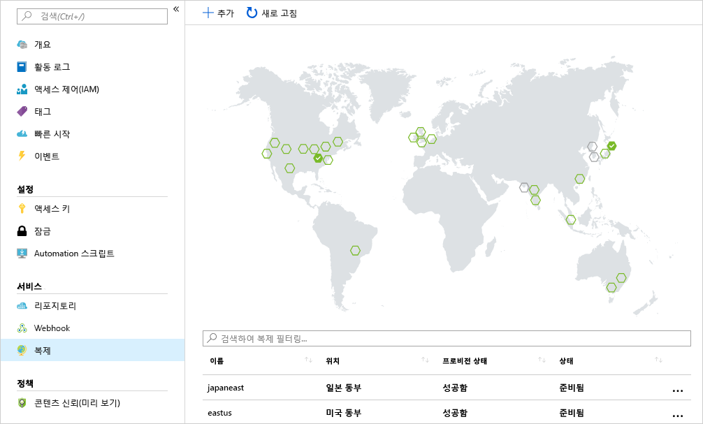

<span data-ttu-id="5f33f-101">회사가 계산 워크로드를 여러 지역에 배포하여 분산된 고객층에게 제공하는 로컬 서비스가 있다고 가정해 보겠습니다.</span><span class="sxs-lookup"><span data-stu-id="5f33f-101">Suppose your company has compute workloads deployed to several regions to make sure you have a local presence to serve your distributed customer base.</span></span> 

<span data-ttu-id="5f33f-102">이미지를 실행하는 각 지역에 컨테이너 레지스트리를 배치하려고 합니다.</span><span class="sxs-lookup"><span data-stu-id="5f33f-102">Your aim is to place a container registry in each region where images are run.</span></span> <span data-ttu-id="5f33f-103">네트워크에 가까운 작업에 대해 이 전략을 허용하면 신속하게 신뢰할 수 있는 이미지 계층을 전송할 수 있습니다.</span><span class="sxs-lookup"><span data-stu-id="5f33f-103">This strategy will allow for network-close operations, enabling fast, reliable image layer transfers.</span></span> 

<span data-ttu-id="5f33f-104">지역 복제를 사용하면 Azure Container Registry가 단일 레지스트리로 기능하여 다중 마스터 지역 레지스트리가 있는 여러 지역에 서비스를 제공할 수 있습니다.</span><span class="sxs-lookup"><span data-stu-id="5f33f-104">Geo-replication enables an Azure container registry to function as a single registry, serving several regions with multi-master regional registries.</span></span>

<span data-ttu-id="5f33f-105">지역에서 복제된 레지스트리는 다음과 같은 이점을 제공합니다.</span><span class="sxs-lookup"><span data-stu-id="5f33f-105">A geo-replicated registry provides the following benefits:</span></span>

- <span data-ttu-id="5f33f-106">둘 이상의 지역에서 단일 레지스트리/이미지/태그 이름 사용 가능</span><span class="sxs-lookup"><span data-stu-id="5f33f-106">Single registry/image/tag names can be used across multiple regions</span></span>
- <span data-ttu-id="5f33f-107">지역별 배포 환경에서 네트워크와 가까운 곳에 위치한 레지스트리에 액세스 가능</span><span class="sxs-lookup"><span data-stu-id="5f33f-107">Network-close registry access from regional deployments</span></span>
- <span data-ttu-id="5f33f-108">컨테이너 호스트와 동일한 지역에 있는 복제된 로컬 레지스트리에서 이미지를 가져오므로 추가 송신 요금이 부과되지 않음</span><span class="sxs-lookup"><span data-stu-id="5f33f-108">No additional egress fees, as images are pulled from a local, replicated registry in the same region as your container host</span></span>
- <span data-ttu-id="5f33f-109">둘 이상의 지역에서 레지스트리를 단일하게 관리</span><span class="sxs-lookup"><span data-stu-id="5f33f-109">Single management of a registry across multiple regions</span></span>

## <a name="replicate-an-image-to-multiple-locations"></a><span data-ttu-id="5f33f-110">여러 위치에 이미지 복제</span><span class="sxs-lookup"><span data-stu-id="5f33f-110">Replicate an image to multiple locations</span></span>

<span data-ttu-id="5f33f-111">`az acr replication create` Azure CLI 명령을 사용하여 컨테이너 이미지를 지역 간에 복제합니다.</span><span class="sxs-lookup"><span data-stu-id="5f33f-111">You'll use the `az acr replication create` Azure CLI command to replicate your container images from one region to another.</span></span> <span data-ttu-id="5f33f-112">이 예제에서는 `japaneast` 지역에 대한 복제를 만듭니다.</span><span class="sxs-lookup"><span data-stu-id="5f33f-112">In this example, you'll create a replication for the `japaneast` region.</span></span> <span data-ttu-id="5f33f-113">Container Registry 이름으로 `<acrName>`을 업데이트합니다.</span><span class="sxs-lookup"><span data-stu-id="5f33f-113">Update `<acrName>` with the name of your Container Registry.</span></span>

```azurecli
az acr replication create --registry <acrName> --location japaneast
```

<span data-ttu-id="5f33f-114">출력은 다음과 비슷해야 합니다.</span><span class="sxs-lookup"><span data-stu-id="5f33f-114">The output should look similar to the following:</span></span>

```output
{
  "id": "/subscriptions/00000000-0000-0000-0000-000000000000/resourceGroups/myresourcegroup/providers/Microsoft.ContainerRegistry/registries/myACR0007/replications/japaneast",
  "location": "japaneast",
  "name": "japaneast",
  "provisioningState": "Succeeded",
  "resourceGroup": "myresourcegroup",
  "status": {
    "displayStatus": "Syncing",
    "message": null,
    "timestamp": "2018-08-15T20:22:09.275792+00:00"
  },
  "tags": {},
  "type": "Microsoft.ContainerRegistry/registries/replications"
}
```

<span data-ttu-id="5f33f-115">마지막으로, 생성된 모든 컨테이너 이미지 복제본을 검색할 수 있습니다.</span><span class="sxs-lookup"><span data-stu-id="5f33f-115">As a final step, you're able to retrieve all container image replicas created.</span></span> <span data-ttu-id="5f33f-116">`az acr replication list` 명령을 사용하여 이 목록을 검색합니다.</span><span class="sxs-lookup"><span data-stu-id="5f33f-116">You'll use the `az acr replication list` command to retrieve this list.</span></span> <span data-ttu-id="5f33f-117">Container Registry 이름으로 `<acrName>`을 업데이트합니다.</span><span class="sxs-lookup"><span data-stu-id="5f33f-117">Update `<acrName>` with the name of your Container Registry.</span></span>

```azurecli
az acr replication list --registry <acrName> --output table
```

<span data-ttu-id="5f33f-118">출력은 다음과 비슷해야 합니다.</span><span class="sxs-lookup"><span data-stu-id="5f33f-118">The output should look similar to the following:</span></span>

```console
NAME       LOCATION    PROVISIONING STATE    STATUS
---------  ----------  --------------------  --------
japaneast  japaneast   Succeeded             Ready
eastus     eastus      Succeeded             Ready
```

<span data-ttu-id="5f33f-119">이미지 복제본을 나열하는 Azure CLI로 제한되지 않습니다.</span><span class="sxs-lookup"><span data-stu-id="5f33f-119">Keep in mind that you are not limited to the Azure CLI to list your image replicas.</span></span> <span data-ttu-id="5f33f-120">Azure Portal 내에서 Azure Container Registry에 대해 `Replications`를 선택하면 현재 복제를 자세히 설명하는 맵이 표시됩니다.</span><span class="sxs-lookup"><span data-stu-id="5f33f-120">From within the Azure portal, selecting `Replications` for an Azure Container Registry displays a map that details current replications.</span></span> <span data-ttu-id="5f33f-121">맵에서 지역을 선택하여 컨테이너 이미지를 추가 지역으로 복제할 수 있습니다.</span><span class="sxs-lookup"><span data-stu-id="5f33f-121">Container images can be replicated to additional regions by selecting the regions on the map.</span></span>



<!-- Cleanup sandbox -->
[!include[](../../../includes/azure-sandbox-cleanup.md)]
 

## <a name="summary"></a><span data-ttu-id="5f33f-123">요약</span><span class="sxs-lookup"><span data-stu-id="5f33f-123">Summary</span></span>

<span data-ttu-id="5f33f-124">이제 Azure CLI를 사용하여 여러 Azure 데이터 센터에 컨테이너 이미지를 성공적으로 복제했습니다.</span><span class="sxs-lookup"><span data-stu-id="5f33f-124">You've now successfully replicated a container image to multiple Azure datacenters using the Azure CLI.</span></span> 