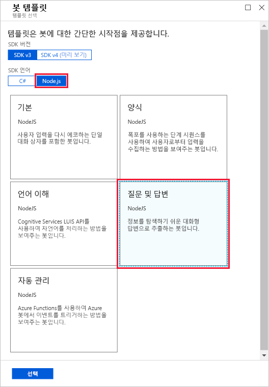
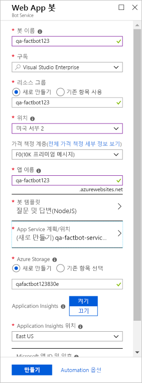

봇을 만드는 첫 번째 단계는 Azure에서 봇이 호스트되는 위치를 제공하는 것입니다.The first step in creating a bot is to provide a location for the bot to be hosted in Azure. Azure App Service의 [웹앱](https://azure.microsoft.com/services/app-service/web/) 기능은 봇 응용 프로그램을 호스트하는 데 적합하며 Azure Bot Service는 이러한 응용 프로그램을 자동으로 프로비전하도록 디자인되었습니다.The [Web Apps](https://azure.microsoft.com/services/app-service/web/) feature of Azure App Service is perfect for hosting bot applications, and the Azure Bot Service is designed to provision them for you. 이 단원에서는 Azure Portal을 사용하여 Azure Web App 봇을 프로비전합니다.In this unit, you will use the Azure portal to provision an Azure web app bot.

<!---TODO: Update for sandbox?--->
1. 브라우저에서 [Azure Portal](https://portal.azure.com/?azure-portal=true)을 엽니다.Open the [Azure portal](https://portal.azure.com/?azure-portal=true) in your browser. 로그인하라는 메시지가 표시되면 Microsoft 계정을 사용하여 로그인합니다.If you are asked to sign in, do so using your Microsoft account.

1. **+ 리소스 만들기**, **AI + 기계 학습** 및 **웹앱 봇**을 차례로 클릭합니다.Click **+ Create a resource**, followed by **AI + Machine Learning**, and then **Web App Bot**.

    

1. **앱 이름** 상자에 “qa-factbot”와 같은 이름을 입력합니다.Enter a name, such as "qa-factbot", into the **App name** box. *이 이름은 Azure 내에서 고유해야 하므로 녹색 확인 표시가 옆에 표시되는지 확인합니다.**This name must be unique within Azure, so make sure a green check mark appears next to it.* **리소스 그룹** 아래에서 **새로 만들기**를 선택하고 리소스 그룹 이름으로 “factbot-rg”를 입력합니다.Select **Create new** under **Resource group** and enter the resource group name "factbot-rg." 가장 가까운 위치를 선택하고 무료 **F0** 가격 책정 계층을 선택합니다.Select the location nearest you and select the free **F0** pricing tier. 그런 다음, **봇 템플릿**을 클릭합니다.Then, click **Bot template**.

1. SDK 언어로 **Node.js**를 선택하고 템플릿 유형으로 **질문 및 답변**을 선택합니다.Select **Node.js** as the SDK language and **Question and Answer** as the template type. 그런 다음, 블레이드 아래쪽의 **선택**을 클릭합니다.Then, click **Select** at the bottom of the blade.

    

1. 이제 **App Service 계획/위치**, **새로 만들기**를 차례로 클릭하고 3단계에서 선택한 것과 동일한 지역에서 이름이 “qa-factbot-service-plan”이거나 비슷한 이름을 갖는 App Service 계획을 만듭니다.Now, click **App service plan/Location**, followed by **Create New**, and then create an App Service plan named "qa-factbot-service-plan" or something similar in the same region that you selected in Step 3. 완료되면 “웹앱 봇” 블레이드 아래쪽의 **만들기**를 클릭하여 배포를 시작합니다.Once that's done, click **Create** at the bottom of the "Web App Bot" blade to start the deployment.

    

1. 포털 왼쪽에 있는 리본에서 **리소스 그룹**을 클릭합니다.Click **Resource groups** in the ribbon on the left side of the portal. 그런 다음, **factbot-rg**를 클릭하여 Azure Web App 봇용으로 만든 리소스 그룹을 엽니다.Then, click **factbot-rg** to open the resource group created for the Azure web app bot. 블레이드 위쪽에서 Azure Web App 봇이 성공적으로 배포되었음을 나타내기 위해 “배포 중”이 “성공”으로 바뀔 때까지 기다립니다.Wait until "Deploying" changes to "Succeeded" at the top of the blade, which indicates that the Azure web app bot was successfully deployed. 배포에는 일반적으로 2분 정도의 시간이 필요합니다.Deployment generally requires two minutes or less. 블레이드 위쪽에 있는 **새로 고침**을 주기적으로 클릭하여 배포 상태를 새로 고칩니다.Periodically click **Refresh** at the top of the blade to refresh the deployment status.

Azure Web App 봇이 배포될 때 내부적으로 많은 작업이 수행되었습니다.Behind the scenes, a lot happened when the Azure web app bot was deployed. 봇이 만들어지고 등록되었으며, 봇을 호스트하기 위해 [Azure Web App](https://azure.microsoft.com/services/app-service/web/)이 만들어지고, 봇이 [Microsoft QnA Maker](https://www.qnamaker.ai/)를 사용하도록 구성되었습니다.A bot was created and registered, an [Azure web app](https://azure.microsoft.com/services/app-service/web/) was created to host it, and the bot was configured to work with [Microsoft QnA Maker](https://www.qnamaker.ai/). 다음 단계는 QnA Maker를 사용하여 봇에 인텔리전스를 주입하기 위한 질문과 답변 기술 자료를 만드는 것입니다.The next step is to use QnA Maker to create a knowledge base of questions and answers to infuse the bot with intelligence.
