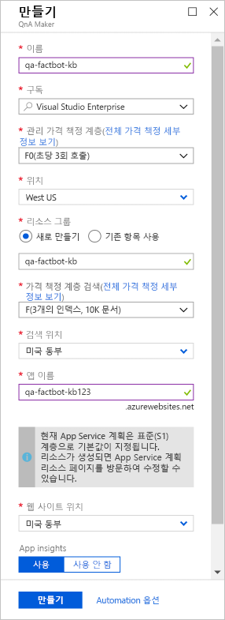
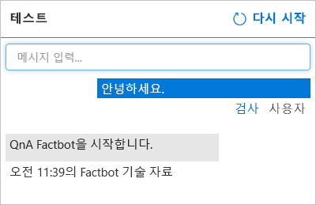

[QnA Maker](https://www.qnamaker.ai/)는 AI(인공 지능) 및 기계 학습으로 지원되는 지능형 앱을 빌드하기 위한 서비스 및 API 제품군인 [Azure Cognitive Services](https://www.microsoft.com/cognitive-services/)의 일부입니다.[QnA Maker](https://www.qnamaker.ai/) is part of [Azure Cognitive Services](https://www.microsoft.com/cognitive-services/), which is a suite of services and APIs for building intelligent apps backed by artificial intelligence (AI) and machine learning. 사용자가 제시할 수 있는 모든 질문을 예상하고 응답을 제공하도록 봇을 코딩하기보다, QnA Maker로 만든 질문과 답변으로 이루어진 기술 자료에 연결할 수 있습니다.Rather than code a bot to anticipate every question a user might ask and provide a response, you can connect it to a knowledge base of questions and answers created with QnA Maker. 일반적인 사용 시나리오는 FAQ에서 기술 자료를 만들어 봇이 “Windows 제품 키를 찾으려면 어떻게 하나요?” 또는 “Visual Studio Code는 어디에서 다운로드할 수 있나요?”와 같은 영역별 질문에 답변할 수 있도록 하는 것입니다.A common usage scenario is to create a knowledge base from an FAQ so the bot can answer domain-specific questions such as "How do I find my Windows product key" or "Where can I download Visual Studio Code?"

이 단원에서는 QnA Maker를 사용하여 “NFL 역사상 슈퍼볼 최다 우승 팀은 어디일까요?” 및 “세계에서 가장 큰 도시는 어디일까요?”와 같은 질문을 포함하는 기술 자료를 만듭니다.In this unit, you will use QnA Maker to create a knowledge base containing questions such as "What NFL teams have won the most Super Bowls" and "What is the largest city in the world?" 그런 다음, HTTPS 엔드포인트를 통해 액세스할 수 있도록 Azure Web App에 기술 자료를 배포합니다.Then, you will deploy the knowledge base in an Azure web app so it can be accessed via an HTTPS endpoint.

1. 브라우저에서 [QnA Maker 포털](https://www.qnamaker.ai/)을 열고 아직 로그인하지 않은 경우 Microsoft 계정으로 로그인합니다.Open the [QnA Maker portal](https://www.qnamaker.ai/) in your browser and sign in with your Microsoft account if you aren't already signed in. 그런 다음, 페이지 위쪽의 메뉴 모음에서 **기술 자료 만들기**를 클릭합니다.Then, click **Create a knowledge base** in the menu bar at the top of the page.

1. **QnA 서비스 만들기**를 클릭합니다.Click **Create a QnA service**.

1. **이름** 상자에 “qa-factbot-kb”와 같은 이름을 입력합니다.Enter a name, such as "qa-factbot-kb", into the **Name** box. 이 이름은 Azure 내에서 고유해야 하므로 이름 *및* 블레이드 좀 더 아래쪽에 있는 **앱 이름** 상자에 옆에 녹색 확인 표시가 나타나야 합니다.This name must be unique within Azure, so make sure a green check mark appears next to it *and* in the **App name** box further down the blade. **리소스 그룹** 아래의 **기존 항목 사용**을 선택하고 이전 연습에서 Azure 웹앱 봇을 배포할 때 만든 “factbot-rg” 리소스 그룹을 선택합니다.Select **Use existing** under **Resource group**, and then select the "factbot-rg" resource group that you created when you deployed the Azure web app bot in the prior exercise. 가격 책정 계층으로 **F0** 및 **F**를 선택합니다.Select **F0** and **F** as the pricing tiers. (둘 다 봇을 시험하기에 좋은 무료 계층입니다.) 두 위치 드롭다운에서 본인에게 가장 가까운 위치를 선택한 다음, 블레이드 아래쪽의 **만들기** 단추를 클릭합니다.(Both are free tiers that are ideal for experimenting with bots.) Select the location nearest you in both location drop-downs, and then click the **Create** button at the bottom of the blade.

    

1. 포털 왼쪽에 있는 리본에서 **리소스 그룹**을 클릭하고 “factbot-rg” 리소스 그룹을 엽니다.Click **Resource groups** in the ribbon on the left side of the portal and open the "factbot-rg" resource group. 블레이드 위쪽에서 QnA 서비스 및 관련 리소스가 성공적으로 배포되었음을 나타내기 위해 “배포 중”이 “성공”으로 바뀔 때까지 기다립니다.Wait until "Deploying" changes to "Succeeded" at the top of the blade, indicating that the QnA service and the resources associated with it were successfully deployed. 블레이드 위쪽에 있는 **새로 고침**을 한 번 더 클릭하여 배포 상태를 새로 고칩니다.Once more, you can click **Refresh** at the top of the blade to refresh the deployment status.

1. QnA Maker 포털의 [기술 자료 만들기](https://www.qnamaker.ai/Create) 페이지로 돌아갑니다.Return to the [Create a knowledge base](https://www.qnamaker.ai/Create) page in the QnA Maker portal. **Azure QnA 서비스** 아래에서 3단계에서 지정한 QnA 서비스 이름을 선택합니다.Under **Azure QnA service**, select the QnA service name you specified in Step 3. 그런 다음, 기술 자료에 “Factbot Knowledge Base”와 같은 이름을 할당합니다.Then, assign the knowledge base a name, such as "Factbot Knowledge Base."

1. 질문과 답변을 QnA Maker 기술 자료에 수동으로 입력하거나 온라인 FAQ 또는 로컬 파일에서 가져올 수 있습니다.You can enter questions and answers into a QnA Maker knowledge base manually, or you can import them from online FAQs or local files. 지원되는 형식에는 탭으로 구분된 텍스트 파일, Microsoft Word 문서, Excel 스프레드시트 및 PDF 파일이 포함됩니다.Supported formats include tab-delimited text files, Microsoft Word documents, Excel spreadsheets, and PDF files.

    데모를 보려면 [여기를 클릭](https://topcs.blob.core.windows.net/public/bots-resources.zip)하여 **Factbot.tsv**라는 텍스트 파일이 포함된 zip 파일을 다운로드하고 해당 파일을 컴퓨터에 복사합니다.To demonstrate, [click here](https://topcs.blob.core.windows.net/public/bots-resources.zip) to download a zip file containing a text file named **Factbot.tsv**, and then copy the file to your computer. 그런 다음, QnA Maker 포털에서 아래로 스크롤하고 **+파일 추가**를 클릭한 이후 **Factbot.tsv**를 선택합니다.Then, scroll down in the QnA Maker portal, click **+ Add file**, and select **Factbot.tsv**. 이 파일에는 20개의 질문과 답변이 탭으로 구분된 형식으로 포함되어 있습니다.This file contains 20 questions and answers in tab-delimited format.

1. 페이지 맨 아래에서 **KB 만들기**를 클릭하고 기술 자료가 만들어질 때까지 기다립니다.Click **Create your KB** at the bottom of the page and wait for the knowledge base to be created. 이 설치는 1분 이내에 완료되어야 합니다.It should take less than a minute.

1. **Factbot.tsv**에서 가져온 질문과 답변이 기술 자료에 나타나는지 확인합니다.Confirm that the questions and answers imported from **Factbot.tsv** appear in the knowledge base. 그런 다음, **저장 후 학습**을 클릭하고 학습이 완료될 때까지 기다립니다.Then, click **Save and train** and wait for training to complete.

    

1. **저장 후 학습** 단추 오른쪽에 있는 **테스트** 단추를 클릭합니다.Click the **Test** button to the right of the **Save and train** button. 메시지 상자에 “Hi”를 입력하고 **Enter** 키를 누릅니다.Type "Hi" into the message box and press **Enter**. 아래 그림과 같이 응답이 “QnA Factbot 시작”인지 확인합니다.Confirm that the response is "Welcome to the QnA Factbot," as shown below.

    

1. “가장 많이 팔린 책은 어느 것인가요?”라고Type "What book has sold the most copies?" 메시지 상자에 입력하고 **Enter** 키를 누릅니다.into the message box and press **Enter**. 응답은 무엇인가요?What is the response?

1. **테스트** 단추를 다시 클릭하여 테스트 패널을 접습니다.Click the **Test** button again to collapse the Test panel. 그런 다음, 페이지 위쪽 메뉴에서 **게시**를 클릭하고 페이지 아래쪽의 **게시** 단추를 클릭하여 기술 자료를 게시합니다.Then, click **Publish** in the menu at the top of the page and click the **Publish** button at the bottom of the page to publish the knowledge base. *게시*를 수행하면 HTTPS 엔드포인트에서 해당 기술 자료를 사용할 수 있게 됩니다.*Publishing* makes the knowledge base available at an HTTPS endpoint.

게시 프로세스가 완료될 때까지 기다린 후 QnA 서비스가 배포되었다는 메시지가 표시되는지 확인합니다.Wait for the publication process to complete and confirm that you are told the QnA service has been deployed. 이제 Azure Web App에 자체 기술 자료가 호스트되었므로 다음 단계는 해당 기술 자료를 사용할 수 있는 봇을 배포하는 것입니다.With the knowledge base now hosted in an Azure web app of its own, the next step is to deploy a bot that can use it.
