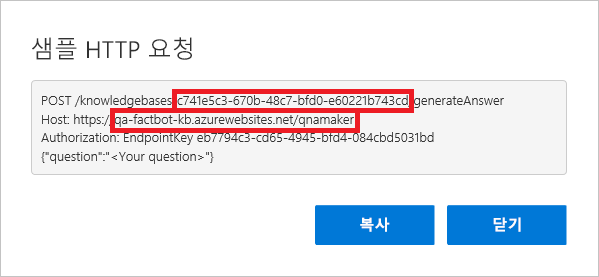

이 단원에서는 이전에 빌드한 QnA Maker 기술 자료에 봇을 연결하여 봇이 지능적인 대화를 수행할 수 있도록 합니다. 기술 자료에 연결하려면 QnA Maker 포털에서 일부 정보를 검색하여 Azure Portal에 복사하고 봇 코드를 업데이트한 후 Azure에 봇을 다시 배포합니다.

1. [QnA Maker 포털](https://www.qnamaker.ai/)로 돌아가서 오른쪽 위에 있는 이름을 클릭합니다. 드롭다운 메뉴에서 **엔드포인트 키 관리**를 선택합니다. **표시**를 클릭하여 기본 엔드포인트 키를 표시하고 **복사**를 클릭하여 키를 클립보드에 복사합니다. 그런 다음, 쉽게 바로 검색할 수 있도록 키를 텍스트 파일에 붙여넣습니다.

1. 페이지 맨 위 메뉴에서 **내 기술 자료**를 클릭합니다. 그런 다음, 이전에 만든 기술 자료에 대한 **코드 보기**를 클릭합니다.

1. 첫 번째 줄의 기술 자료 ID와 두 번째 줄의 호스트 이름을 복사하여 텍스트 파일에도 붙여넣습니다. 그런 다음, 대화 상자를 닫습니다. 복사하는 호스트 이름에 “https://” 접두사를 포함시키지 **마세요**.

    

1. Azure Portal의 웹앱 봇으로 돌아갑니다. 왼쪽의 메뉴에서 **응용 프로그램 설정**을 클릭하고 “QnAKnowledgebaseId”, “QnAAuthKey” 및 “QnAEndpointHostName”이라는 응용 프로그램 설정을 찾을 때까지 아래로 스크롤합니다. 3단계에서 얻은 지식 기반 ID 및 호스트 이름과 1단계에서 얻은 엔드포인트 키를 이러한 필드에 붙여넣습니다. 그런 다음, **저장**을 클릭합니다.

    

1. Visual Studio Code로 돌아가서 **app.js**의 콘텐츠를 아래 코드로 바꿉니다. 그런 다음, 파일을 저장합니다.

    ```JavaScript
    var restify = require('restify');
    var builder = require('botbuilder');
    var botbuilder_azure = require("botbuilder-azure");
    var builder_cognitiveservices = require("botbuilder-cognitiveservices");

    // Setup Restify Server
    var server = restify.createServer();
    server.listen(process.env.port || process.env.PORT || 3978, function () {
        console.log('%s listening to %s', server.name, server.url);
    });

    // Create chat connector for communicating with the Bot Framework Service
    var connector = new builder.ChatConnector({
        appId: process.env.MicrosoftAppId,
        appPassword: process.env.MicrosoftAppPassword
    });

    // Listen for messages from users
    server.post('/api/messages', connector.listen());

    // Create your bot with a function to receive messages from the user
    var bot = new builder.UniversalBot(connector);

    var recognizer = new builder_cognitiveservices.QnAMakerRecognizer({
        knowledgeBaseId: process.env.QnAKnowledgebaseId,
        authKey: process.env.QnAAuthKey,
        endpointHostName: process.env.QnAEndpointHostName
    });

    var basicQnAMakerDialog = new builder_cognitiveservices.QnAMakerDialog({
        recognizers: [recognizer],
        defaultMessage: "I'm not quite sure what you're asking. Please ask your question again.",
        qnaThreshold: 0.3
    });

    bot.dialog('basicQnAMakerDialog', basicQnAMakerDialog);

    bot.dialog('/',
    [
        function (session) {
            session.replaceDialog('basicQnAMakerDialog');
        }
    ]);
    ```

    > [!Note]
    > 만들기에 대 한 호출을 `QnAMakerDialog` 30 줄에는 인스턴스. Azure Bot Service로 빌드된 봇과 기술 자료로 빌드된 Microsoft QnA Maker를 통합하는 대화 상자가 만들어집니다.

1. Visual Studio Code의 작업 막대에서 **소스 제어** 단추를 클릭합니다. 메시지 상자에 “기술 자료에 연결됨”을 입력하고 확인 표시를 클릭하여 변경 내용을 커밋합니다. 그런 다음, 줄임표를 클릭하고 **분기 게시** 명령을 사용하여 이러한 변경 내용을 원격 리포지토리로(따라서, Azure 웹앱으로) 푸시합니다.

1. Azure Portal의 웹앱 봇으로 돌아가서 왼쪽의 **웹 채팅에서 테스트**를 클릭하여 테스트 콘솔을 엽니다. “세계에서 가장 인기 있는 소프트웨어 프로그래밍 언어는 무엇인가요?”를 채팅창 아래쪽에 있는 상자에 입력하고 **Enter** 키를 누릅니다. 봇 응답 하는지 확인 합니다.

이제 봇이 기술 자료에 연결되었으므로 마지막 단계로 실제 환경에서 봇을 자유롭게 테스트합니다. Skype를 사용하면 그 어떤 환경보다도 자유롭게 테스트할 수 있습니다.
