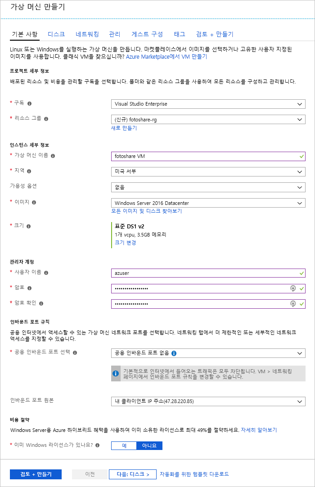

SQL Server 및 사용자 지정 응용 프로그램을 실행하는 Azure VM(Virtual Machines)에 저장된 데이터를 사용하여 사진 공유 사이트를 실행한다고 가정합니다. 다음 조정을 수행하려고 합니다.

- VM에서 디스크 캐시 설정을 변경해야 합니다.
- 캐싱을 사용하도록 설정한 VM에 새 데이터 디스크를 추가하려고 합니다.

Azure Portal을 통해 이렇게 변경하기로 결정했습니다.

이 연습에서는 위에서 설명한 VM을 변경하는 방법을 살펴봅니다. 먼저 포털에 로그인하고 VM을 만들겠습니다.

[!include]

## 가상 머신 만들기

이 단계에서는 다음 속성을 사용하여 VM을 만들려고 합니다.

| 속성        | 값   |
|-----------------|---------|
| 이미지           | **Windows Server 2016 Datacenter** |
| 이름            | **fotoshareVM** |
| 리소스 그룹  |   **<rgn>[샌드박스 리소스 그룹 이름]</rgn>** |
| 위치        | 아래 내용을 참조하세요. |

1. 샌드박스를 활성화한 동일한 계정을 사용하여 [Azure Portal](https://portal.azure.com/learn.docs.microsoft.com?azure-portal=true)에 로그인합니다.

1. 왼쪽에 있는 사이드바 메뉴에서 **리소스 만들기**를 선택합니다.

1. _Windows Server 2016 VM_은 **인기 있는** Marketplace 요소 목록에 표시됩니다. 그렇지 않으면 위쪽의 검색 상자를 사용하여 "Windows Server 2016 DataCenter"를 검색하세요.

1. Windows VM을 선택하고, **만들기**를 클릭하여 VM 만들기 프로세스를 시작합니다.

1. **기본 사항** 패널에서 선택한 **구독**이 _컨시어지 구독_인지 확인합니다.

1. **리소스 그룹**에서 **기존 리소스 그룹 사용**을 선택하고 _<rgn>[샌드박스 리소스 그룹 이름]</rgn>_ 을 선택합니다.

1. **가상 머신 이름** 상자에 _fotoshareVM_을 입력합니다.

1. **위치** 드롭다운 목록에서 다음 목록 중 가장 가까운 지역을 선택합니다.

    [!include]

1. VM **크기**에서 기본값은 **DS1 v2**이며 단일 CPU 및 3.5GB의 메모리를 제공합니다. 이 예제에서는 괜찮습니다.

1. **관리자 계정** 섹션에서 새 VM에서 관리자 계정의 **사용자 이름** 및 **암호**/**암호 확인**을 입력합니다.

1. 작성 시 **기본 사항** 구성이 다음 이미지와 같이 표시될 수 있습니다. 나머지 탭 및 필드에 대한 기본값을 그대로 두고, **검토 + 만들기**를 클릭합니다.

    

1. 새 VM 설정을 검토한 후에 **만들기**를 클릭하여 새 VM을 배포하기 시작합니다.

모든 다양한 리소스(저장소, 네트워크 인터페이스 등)를 만들어서 가상 머신을 지원하므로 VM을 만드는 데 몇 분 정도 걸릴 수 있습니다. VM이 배포될 때까지 기다렸다가 연습을 계속 진행합니다.

## 포털에서 OS 디스크 캐시 상태 보기

VM이 배포되면 다음 단계를 사용하여 OS 디스크의 캐싱 상태를 확인할 수 있습니다.

1. **fotoshareVM** 리소스를 선택하여 포털에서 VM 세부 정보를 엽니다. 또는 왼쪽 사이드바에서 **모든 리소스**를 클릭한 다음, **fotoshareVM** VM을 선택할 수 있습니다.

1. **설정**에서 **디스크**를 선택합니다.

1. **디스크** 창에서 VM에는 하나의 OS 디스크가 있습니다. 캐시 형식은 현재 **읽기/쓰기**의 기본값으로 설정되어 있습니다.

## 포털에서 OS 디스크의 캐시 설정 변경

1. **디스크** 창의 화면 왼쪽 위에 있는 **편집**을 선택합니다.

1. 드롭다운 목록을 사용하여 OS 디스크의 **호스트 캐싱** 값을 **읽기 전용**으로 변경한 다음, 화면 왼쪽 위에서 **저장**을 선택합니다.

1. 이 업데이트에 다소 시간이 걸릴 수 있습니다. 그 이유는 Azure 디스크의 캐시 설정이 변경되면 대상 디스크를 분리하고 다시 연결하기 때문입니다. 운영 체제 디스크인 경우 VM도 다시 시작됩니다. 작업이 완료되면 VM 디스크가 업데이트되었다는 알림을 받게 됩니다.

1. 작업이 완료되면 OS 디스크 캐시 형식이 **읽기 전용**으로 설정됩니다.

데이터 디스크 캐시 구성으로 이동하겠습니다. 디스크를 구성하려면 먼저 디스크를 만들어야 합니다.

## VM에 데이터 디스크 추가 및 캐싱 형식 설정

1. 포털에서 VM의 **디스크** 보기로 돌아가서 **데이터 디스크 추가**를 클릭합니다. 필드가 비어 있을 수 없음을 알리는 오류가 **이름** 필드에 바로 나타납니다. 아직 데이터 디스크가 없으므로 만들어 보겠습니다.

1. **이름** 목록을 클릭하고 **디스크 만들기**를 클릭합니다.

1. **관리 디스크 만들기** 창의 **이름** 상자에 **fotosharesVM-data**를 입력합니다.

1. **리소스 그룹**에서 **기존 항목 사용**을 선택하고 _<rgn>[샌드박스 리소스 그룹 이름]</rgn>_ 을 선택합니다.

1. 나머지 필드의 기본값을 적어둡니다.
    - 프리미엄 SSD
    - 크기 1023GB
    - VM과 동일한 위치(변경할 수 없음)
    - IOPS 제한 - 5000
    - 처리량 제한(MB/s) - 200

1. 화면의 맨 아래에서 **만들기**를 클릭합니다.

    디스크가 만들어질 때까지 기다렸다가 계속 진행합니다.

1. 드롭다운 목록을 사용하여 새 데이터 디스크의 **호스트 캐싱** 값을 **읽기 전용**으로 변경한 다음(이미 설정되었을 수 있음), 화면 왼쪽 위에서 **저장**을 클릭합니다.

    VM이 새 데이터 디스크의 업데이트를 완료할 때까지 기다립니다. 작업이 완료되면 가상 머신에 새 데이터 디스크가 설치됩니다.

이 연습에서는 Azure Portal을 사용하여 새 VM에서 캐싱을 구성하고, 기존 디스크에서 캐시 설정을 변경하고, 새 데이터 디스크에서 캐싱을 구성했습니다. 다음 스크린샷은 최종 구성을 보여줍니다.

