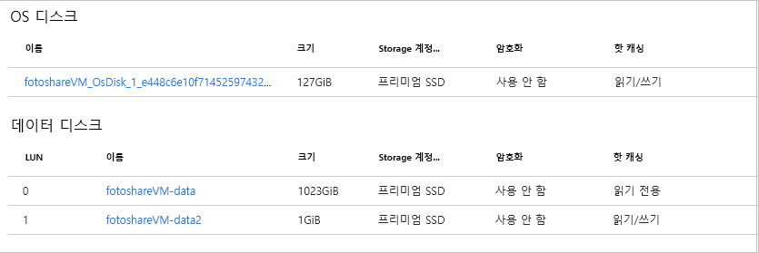

<span data-ttu-id="bff27-101">이전 연습에서는 Azure Portal을 사용하여 다음 작업을 수행했습니다.</span><span class="sxs-lookup"><span data-stu-id="bff27-101">In the previous exercise, we performed the following tasks using the Azure portal:</span></span>

- <span data-ttu-id="bff27-102">OS 디스크 캐시 상태 보기</span><span class="sxs-lookup"><span data-stu-id="bff27-102">View OS disk cache status</span></span>
- <span data-ttu-id="bff27-103">OS 디스크 캐시 설정 변경</span><span class="sxs-lookup"><span data-stu-id="bff27-103">Change the cache settings of the OS disk</span></span>
- <span data-ttu-id="bff27-104">VM에 데이터 디스크 추가</span><span class="sxs-lookup"><span data-stu-id="bff27-104">Add a data disk to the VM</span></span>
- <span data-ttu-id="bff27-105">새 데이터 디스크의 캐싱 유형 변경</span><span class="sxs-lookup"><span data-stu-id="bff27-105">Change caching type on a new data disk</span></span>

<span data-ttu-id="bff27-106">이제 Azure PowerShell을 사용하여 이러한 작업을 연습해 보겠습니다.</span><span class="sxs-lookup"><span data-stu-id="bff27-106">Let's practice these operations using Azure PowerShell.</span></span> 

> [!NOTE]
> <span data-ttu-id="bff27-107">Azure PowerShell을 사용하려고 하지만 콘솔 기반 도구와 유사한 기능을 제공하는 Azure CLI를 사용할 수도 있습니다.</span><span class="sxs-lookup"><span data-stu-id="bff27-107">We're going to use Azure PowerShell, but you could also use the Azure CLI which provides similar functionality as a console-based tool.</span></span> <span data-ttu-id="bff27-108">이것은 macOS, Linux 및 Windows에서 실행됩니다.</span><span class="sxs-lookup"><span data-stu-id="bff27-108">It runs on macOS, Linux, and Windows.</span></span> <span data-ttu-id="bff27-109">Azure CLI에 대해 자세히 알아보려면 **Azure CLI를 사용하여 가상 머신 관리** 모듈를 체크 아웃하세요.</span><span class="sxs-lookup"><span data-stu-id="bff27-109">If you are interested in learning more about the Azure CLI, check out the **Manage Virtual Machines with the Azure CLI** module.</span></span>

<span data-ttu-id="bff27-110">이전 연습에서 만든 VM을 사용하겠습니다.</span><span class="sxs-lookup"><span data-stu-id="bff27-110">We're going to use the VM we created in the previous exercise.</span></span> <span data-ttu-id="bff27-111">이 랩의 작업은 다음을 가정합니다.</span><span class="sxs-lookup"><span data-stu-id="bff27-111">The operations in this lab assume:</span></span>

- <span data-ttu-id="bff27-112">**fotoshareVM**이라고 하는 VM이 있습니다.</span><span class="sxs-lookup"><span data-stu-id="bff27-112">Our VM exists and is called **fotoshareVM**</span></span>
- <span data-ttu-id="bff27-113">VM은 **<rgn>[샌드박스 리소스 그룹 이름]</rgn>** 라는 리소스 그룹에 있습니다.</span><span class="sxs-lookup"><span data-stu-id="bff27-113">Our VM lives in a resource group called **<rgn>[Sandbox resource group name]</rgn>**</span></span>

<span data-ttu-id="bff27-114">다른 이름 집합을 사용한 경우 이러한 값을 사용자 고유의 값으로 바꿉니다.</span><span class="sxs-lookup"><span data-stu-id="bff27-114">If you've gone with a different set of names, replace these values with yours.</span></span>

<span data-ttu-id="bff27-115">마지막 연습에서 VM 디스크의 현재 상태는 다음과 같습니다.</span><span class="sxs-lookup"><span data-stu-id="bff27-115">Here's the current state of our VM disks from the last exercise:</span></span>


<span data-ttu-id="bff27-117">포털을 사용하여 OS 디스크와 데이터 디스크 모두에 대해 \***호스트 캐싱** 필드를 설정했습니다.</span><span class="sxs-lookup"><span data-stu-id="bff27-117">We used the portal to set the **HOST CACHING** field for both the OS and data disks.</span></span> <span data-ttu-id="bff27-118">다음 단계를 진행하면서 이 초기 상태를 명심하세요.</span><span class="sxs-lookup"><span data-stu-id="bff27-118">Keep this initial state in mind as we work through the following steps.</span></span>

### <a name="set-up-some-variables"></a><span data-ttu-id="bff27-119">일부 변수 설정</span><span class="sxs-lookup"><span data-stu-id="bff27-119">Set up some variables</span></span>

<span data-ttu-id="bff27-120">먼저, 나중에 사용할 수 있도록 일부 리소스 이름을 저장하겠습니다.</span><span class="sxs-lookup"><span data-stu-id="bff27-120">First, let's store some resource names so we can use them later.</span></span>

1. <span data-ttu-id="bff27-121">오른쪽에 있는 Azure Cloud Shell 터미널을 사용하여 다음 PowerShell 명령을 실행합니다.</span><span class="sxs-lookup"><span data-stu-id="bff27-121">Use the Azure Cloud Shell terminal on the right to run the following PowerShell commands:</span></span>

    > [!NOTE]
    > <span data-ttu-id="bff27-122">해당 명령을 실행하기 전에 Cloud Shell 세션을 **PowerShell**로 전환하세요.</span><span class="sxs-lookup"><span data-stu-id="bff27-122">Switch your Cloud Shell session to **PowerShell** before trying these commands, if it isn't already.</span></span>
    
    ```powershell
    $myRgName = "<rgn>[Sandbox resource group name]</rgn>"
    $myVMName = "fotoshareVM"
    ```
    
    > [!TIP]
    > <span data-ttu-id="bff27-123">Cloud Shell 세션의 시간이 초과되면 이러한 변수를 다시 설정해야 합니다. 따라서 가능하다면 이 전체 랩을 단일 세션에서 작업합니다.</span><span class="sxs-lookup"><span data-stu-id="bff27-123">You'll have to set these variables again if your Cloud Shell session times out. So, if possible, work through this entire lab in a single session.</span></span>
    
### <a name="get-info-about-our-vm"></a><span data-ttu-id="bff27-124">VM에 대한 정보 가져오기</span><span class="sxs-lookup"><span data-stu-id="bff27-124">Get info about our VM</span></span>

1. <span data-ttu-id="bff27-125">다음 명령을 실행하여 VM의 속성을 다시 가져옵니다.</span><span class="sxs-lookup"><span data-stu-id="bff27-125">Run the following command to get back the properties of our VM:</span></span>

    ```powershell
    $myVM = Get-AzureRmVM -ResourceGroupName $myRgName -VMName $myVmName
    ```
    
1. <span data-ttu-id="bff27-126">응답을 `$myVM` 변수에 저장합니다.</span><span class="sxs-lookup"><span data-stu-id="bff27-126">We store the response in our `$myVM` variable.</span></span> <span data-ttu-id="bff27-127">출력을 `select-object` cmdlet으로 전달하여 디스플레이를 특정 속성으로 필터링할 수 있습니다.</span><span class="sxs-lookup"><span data-stu-id="bff27-127">We can pipe the output into the `select-object` cmdlet to filter the display to specific properties:</span></span>

    ```powershell
    $myVM | select-object -property ResourceGroupName, Name, Type, Location
    ```
    
1. <span data-ttu-id="bff27-128">다음과 유사한 출력이 표시됩니다.</span><span class="sxs-lookup"><span data-stu-id="bff27-128">You should get something like the following.</span></span>

    ```output
    ResourceGroupName Name        Type                              Location
    ----------------- ----        ----                              --------
    <rgn>[Sandbox resource group name]</rgn> fotoshareVM Microsoft.Compute/virtualMachines eastus
    ```
    
### <a name="view-os-disk-cache-status"></a><span data-ttu-id="bff27-129">OS 디스크 캐시 상태 보기</span><span class="sxs-lookup"><span data-stu-id="bff27-129">View OS disk cache status</span></span>

1. <span data-ttu-id="bff27-130">다음과 같이 `StorageProfile` 개체를 통해 캐싱 설정을 확인할 수 있습니다.</span><span class="sxs-lookup"><span data-stu-id="bff27-130">We can check the caching  setting through  the `StorageProfile` object, as follows:</span></span>

    ```powershell
    $myVM.StorageProfile.OsDisk.Caching
    ```

    ```output
    ReadOnly
    ```
   
1. <span data-ttu-id="bff27-131">_ReadWrite_인 OS 디스크에 대한 기본값으로 다시 변경해 보겠습니다.</span><span class="sxs-lookup"><span data-stu-id="bff27-131">Let's change it back to the default for an OS disk which is _ReadWrite_.</span></span>

### <a name="change-the-cache-settings-of-the-os-disk"></a><span data-ttu-id="bff27-132">OS 디스크 캐시 설정 변경</span><span class="sxs-lookup"><span data-stu-id="bff27-132">Change the cache settings of the OS disk</span></span>

1. <span data-ttu-id="bff27-133">다음과 같이 동일한 `StorageProfile` 개체를 사용하여 캐시 유형에 대한 값을 설정할 수 있습니다.</span><span class="sxs-lookup"><span data-stu-id="bff27-133">We can set the value for the cache type using the same `StorageProfile` object, as follows:</span></span>

    ```powershell
    $myVM.StorageProfile.OsDisk.Caching = "ReadWrite"
    ```
    
    <span data-ttu-id="bff27-134">이 명령은 빠르게 실행되며, 작업을 로컬로 수행하고 있음을 알려줍니다.</span><span class="sxs-lookup"><span data-stu-id="bff27-134">This command runs fast, which should tell you it's doing something locally.</span></span> <span data-ttu-id="bff27-135">이 명령은 `myVM` 개체의 속성만 변경합니다.</span><span class="sxs-lookup"><span data-stu-id="bff27-135">The command only changes the property on the `myVM` object.</span></span> <span data-ttu-id="bff27-136">다음 스크린샷에서 볼 수 있듯이 `Get-AzureRmVM` cmdlet을 사용하여 `$myVM` 변수를 다시 지정하여 새로 고치더라도 VM에서 캐싱 값이 변경되지 않습니다.</span><span class="sxs-lookup"><span data-stu-id="bff27-136">As the following screenshot shows, if you refresh the `$myVM` variable by reassigning it using the `Get-AzureRmVM` cmdlet, the caching value won't have changed on the VM.</span></span>

1. <span data-ttu-id="bff27-137">VM 자체를 변경하려면 다음과 같이 `Update-AzureRmVM`을 호출합니다.</span><span class="sxs-lookup"><span data-stu-id="bff27-137">To make the change on the VM itself, call `Update-AzureRmVM`, as follows:</span></span>

    ```powershell
    Update-AzureRmVM -ResourceGroupName $myRGName -VM $myVM
    ```
    
    <span data-ttu-id="bff27-138">이 호출은 완료하는 데 시간이 걸립니다.</span><span class="sxs-lookup"><span data-stu-id="bff27-138">Notice that this call takes a while to complete.</span></span> <span data-ttu-id="bff27-139">이는 실제 VM을 업데이트하고 Azure에서 변경하기 위해 VM을 다시 시작하기 때문입니다.</span><span class="sxs-lookup"><span data-stu-id="bff27-139">That's because we're updating the actual VM, and Azure restarts the VM  to make the change.</span></span>

    ```output
    RequestId IsSuccessStatusCode StatusCode ReasonPhrase
    --------- ------------------- ---------- ------------
                             True         OK OK
    ```
    
1. <span data-ttu-id="bff27-140">`$myVM` 변수를 다시 새로 고치면 개체에 대한 변경 내용이 표시됩니다.</span><span class="sxs-lookup"><span data-stu-id="bff27-140">If you refresh the `$myVM` variable again, you'll see the change on the object.</span></span> <span data-ttu-id="bff27-141">또한 포털에서 디스크를 살펴볼 때도 변경 내용이 표시됩니다.</span><span class="sxs-lookup"><span data-stu-id="bff27-141">Looking at the disk in the portal, you'd also see the change there.</span></span> 

    ```powershell
    $myVM = Get-AzureRmVM -ResourceGroupName $myRgName -VMName $myVmName
    $myVM.StorageProfile.OsDisk.Caching
    ```
    
    ```output
    ReadWrite
    ```
    
### <a name="list-data-disk-info"></a><span data-ttu-id="bff27-142">데이터 디스크 정보 나열</span><span class="sxs-lookup"><span data-stu-id="bff27-142">List data disk info</span></span>

1. <span data-ttu-id="bff27-143">VM에 있는 데이터 디스크를 확인하려면 다음 명령을 실행합니다.</span><span class="sxs-lookup"><span data-stu-id="bff27-143">To see what data disks we have on our VM, run the following command:</span></span>

    ```powershell
    $myVM.StorageProfile.DataDisks
    ```
    
    ```output
    Name            : fotosharesVM-data
    DiskSizeGB      : 1023
    Lun             : 0
    Caching         : ReadOnly
    CreateOption    : Attach
    SourceImage     :
    VirtualHardDisk :
    ```
    
<span data-ttu-id="bff27-144">현재 하나의 데이터 디스크만 있습니다.</span><span class="sxs-lookup"><span data-stu-id="bff27-144">We have only one data disk at the moment.</span></span> <span data-ttu-id="bff27-145">`Lun` 필드가 중요합니다.</span><span class="sxs-lookup"><span data-stu-id="bff27-145">The `Lun` field is important.</span></span> <span data-ttu-id="bff27-146">고유한 LUN(**논리** **단위** **번호**)입니다.</span><span class="sxs-lookup"><span data-stu-id="bff27-146">It's the unique **L**ogical **U**nit **N**umber.</span></span> <span data-ttu-id="bff27-147">다른 데이터 디스크를 추가하는 경우 고유한 `Lun` 값을 지정합니다.</span><span class="sxs-lookup"><span data-stu-id="bff27-147">When we add another data disk, we'll give it a unique `Lun` value.</span></span>

### <a name="add-a-new-data-disk-to-our-vm"></a><span data-ttu-id="bff27-148">VM에 새 데이터 디스크 추가</span><span class="sxs-lookup"><span data-stu-id="bff27-148">Add a new data disk to our VM</span></span>

1. <span data-ttu-id="bff27-149">편의상 새 디스크 이름을 저장합니다.</span><span class="sxs-lookup"><span data-stu-id="bff27-149">For convenience, we'll store our new disk name:</span></span>

    ```powershell
    $newDiskName = "fotoshareVM-data2"
    ```
    
1. <span data-ttu-id="bff27-150">다음 `Add-AzureRmVMDataDisk` 명령을 실행하여 비어 있는 새 1GB 데이터 디스크를 새로 정의합니다.</span><span class="sxs-lookup"><span data-stu-id="bff27-150">Run the following `Add-AzureRmVMDataDisk` command to define a new empty 1 GB data disk:</span></span>

    ```powershell
    Add-AzureRmVMDataDisk -VM $myVM -Name $newDiskName  -LUN 1  -DiskSizeinGB 1 -CreateOption Empty
    ```
    <span data-ttu-id="bff27-151">다음과 같은 응답을 받게 됩니다.</span><span class="sxs-lookup"><span data-stu-id="bff27-151">You'll get a response like:</span></span>

    ```output
    ResourceGroupName  : xxxxxxxx-xxxx-xxxx-xxxx-xxxxxxxx
    Id                 : /subscriptions/xxxxxxxx-xxxx-xxxx-xxx-xxxxxxx/resourceGroups/<rgn>[Sandbox resource group name]</rgn>/providers/Microsoft.Compute/virtualMachines/fotoshareVM
    VmId               : xxxxxxxx-xxxx-xxxx-xxxx-xxxxxxxxxxx
    Name               : fotoshareVM
    Type               : Microsoft.Compute/virtualMachines
    Location           : eastus
    Tags               : {}
    DiagnosticsProfile : {BootDiagnostics}
    HardwareProfile    : {VmSize}
    NetworkProfile     : {NetworkInterfaces}
    OSProfile          : {ComputerName, AdminUsername, WindowsConfiguration, Secrets}
    ProvisioningState  : Succeeded
    StorageProfile     : {ImageReference, OsDisk, DataDisks}
        ```
    
1. We've given this disk a `Lun` value of `1` because it's not taken. We defined the disk we want to create, so it's time to run `Update-AzureRmVM` to make the actual change:

    ```powershell
    Update-AzureRmVM -ResourceGroupName $myRGName -VM $myVM
    ```
    
1. <span data-ttu-id="bff27-152">데이터 디스크 정보를 다시 살펴보겠습니다.</span><span class="sxs-lookup"><span data-stu-id="bff27-152">Let's look at our data disk info again:</span></span>

    ```powershell
    $myVM.StorageProfile.DataDisks
    ```
    
    ```output
    Name            : fotosharesVM-data
    DiskSizeGB      : 1023
    Lun             : 0
    Caching         : ReadOnly
    CreateOption    : Attach
    SourceImage     :
    VirtualHardDisk :
    
    Name            : fotoshareVM-data2
    DiskSizeGB      : 1
    Lun             : 1
    Caching         : None
    CreateOption    : Empty
    SourceImage     :
    VirtualHardDisk :
    ```

<span data-ttu-id="bff27-153">이제 두 개의 디스크가 있습니다.</span><span class="sxs-lookup"><span data-stu-id="bff27-153">We now have two disks.</span></span> <span data-ttu-id="bff27-154">새 디스크의 `Lun`은 `1`이며 `Caching`의 기본값은 `None`입니다.</span><span class="sxs-lookup"><span data-stu-id="bff27-154">Our new disk has a `Lun` of `1` and the default value for `Caching` is `None`.</span></span> <span data-ttu-id="bff27-155">해당 값을 변경해 보겠습니다.</span><span class="sxs-lookup"><span data-stu-id="bff27-155">Let's change that value.</span></span>

### <a name="change-cache-settings-of-new-data-disk"></a><span data-ttu-id="bff27-156">새 데이터 디스크의 캐시 설정 변경</span><span class="sxs-lookup"><span data-stu-id="bff27-156">Change cache settings of new data disk</span></span>

1. <span data-ttu-id="bff27-157">다음과 같이 `Set-AzureRmVMDataDisk` cmdlet을 사용하여 가상 머신 데이터 디스크의 속성을 수정합니다.</span><span class="sxs-lookup"><span data-stu-id="bff27-157">We modify properties of a virtual machine data disk with the `Set-AzureRmVMDataDisk` cmdlet, as follows:</span></span>

    ```powershell
    Set-AzureRmVMDataDisk -VM $myVM -Lun "1" -Caching ReadWrite
    ```
    
1. <span data-ttu-id="bff27-158">언제나 그렇듯이 `Update-AzureRmVM`을 사용하여 변경 내용을 커밋합니다.</span><span class="sxs-lookup"><span data-stu-id="bff27-158">As always, commit the changes with `Update-AzureRmVM`:</span></span>

    ```powershell
    Update-AzureRmVM -ResourceGroupName $myRGName -VM $myVM
    ```
    
<span data-ttu-id="bff27-159">다음은 이 연습에서 수행한 작업을 보여 주는 포털의 보기입니다.</span><span class="sxs-lookup"><span data-stu-id="bff27-159">Here's a view from the portal of what we've accomplished in this exercise.</span></span> <span data-ttu-id="bff27-160">VM에는 이제 두 개의 데이터 디스크가 있고, 모든 **호스트 캐싱** 설정을 조정했습니다.</span><span class="sxs-lookup"><span data-stu-id="bff27-160">Our VM now has two data disks, and we've adjusted all **HOST CACHING** settings.</span></span> <span data-ttu-id="bff27-161">이 모든 작업은 단지 몇 가지 명령을 사용하여 수행했습니다.</span><span class="sxs-lookup"><span data-stu-id="bff27-161">We did all of that with just a few commands.</span></span> <span data-ttu-id="bff27-162">이것이 Azure PowerShell의 능력입니다.</span><span class="sxs-lookup"><span data-stu-id="bff27-162">That's the power of Azure PowerShell.</span></span>


