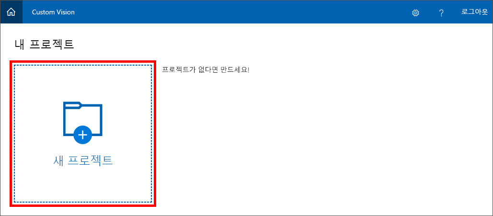
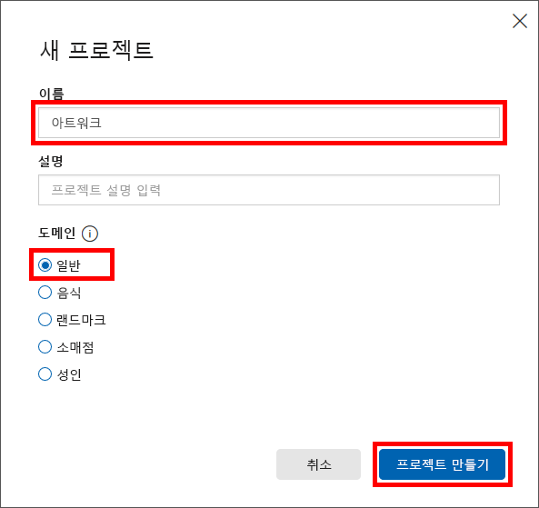

Custom Vision Service로 이미지 분류 모델을 빌드하는 첫 번째 단계는 프로젝트를 만드는 것입니다. 이 단원에서는 Custom Vision Service 포털을 사용하여 Custom Vision Service 프로젝트를 만듭니다.

1. 브라우저에서 [Custom Vision Service 포털](https://www.customvision.ai/)을 엽니다. 그런 다음, **로그인**을 클릭합니다.

    

1. 로그인하라는 메시지가 표시되면 Microsoft 계정의 자격 증명을 사용하여 로그인합니다. 이 앱에서 사용자 정보에 액세스하도록 허용할지 묻는 메시지가 표시되면 **예**를 클릭하고, 서비스 약관에 동의할지 묻는 메시지가 표시되면 동의합니다.

1. **새 프로젝트**를 클릭하여 새 프로젝트를 만듭니다.

    

1. "새 프로젝트" 대화 상자에서 프로젝트 이름을 "Artworks"로 지정하고, 도메인으로 **일반**이 선택되었는지 확인하고, **프로젝트 만들기**를 클릭합니다.

    > 도메인은 특정 유형의 이미지에 맞게 모델을 최적화합니다. 예를 들어, 사용자의 목표가 음식 이미지를 포함된 음식 유형 또는 음식의 전통을 기준으로 분류하는 것이면 Food 도메인을 선택하는 것이 유용할 수 있습니다. 제공된 어떤 도메인과도 일치하지 않거나 어떤 도메인을 선택할지 잘 모르는 경우 일반 도메인을 선택합니다.

   

다음 단계에서는 프로젝트에 이미지를 업로드하고 해당 이미지에 태그를 할당하여 분류합니다.