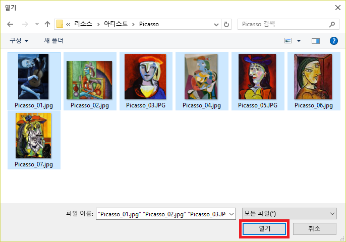

이 섹션에서는 피카소, 폴록, 렘브란트의 유명 회화 이미지를 Artists 프로젝트에 추가할 것입니다. Custom Vision Service가 아티스트를 구별하는 방법을 학습할 수 있도록 이미지에 태그를 지정할 것입니다.

1. 앞에서 만든 **Artists** 프로젝트에서, 측면 패널의 **태그** 오른쪽에서 더하기 기호(**+**)를 선택합니다.

     ![[태그 추가] 단추 선택](../media/2-add-tags.png)

1. **태그 이름 지정** 대화 상자가 표시됩니다. 태그 이름 필드에 *painting*을 입력하고 **저장**을 선택합니다. 그러면 태그 목록에 *painting*이라는 태그가 생성됩니다. 좀 더 추가해 보겠습니다. 

1. 2단계를 반복하여 *피카소*, *폴록*, *렘브란트* 값으로 태그를 추가합니다. 모두 마치면 태그 목록이 다음과 비슷할 것입니다.

    ![[태그 추가] 단추 선택](../media/2-tag-list.png)

    보시다시피, 프로젝트에서 이러한 태그가 지정된 이미지 수는 0입니다. 프로젝트에 이미지를 추가하고 태그를 할당해 보겠습니다.

1. 이 모듈에 대한 이미지 리소스를 포함하는 [cvs-resources.zip](https://github.com/MicrosoftDocs/mslearn-classify-images-with-the-custom-vision-service/raw/master/cvs-resources.zip)을 다운로드하여 로컬 머신에 압축을 풉니다. 

1. 포털로 돌아가서 **이미지 추가**를 선택하여 이미지를 프로젝트에 추가합니다.

    

1. 4단계에서 로컬로 다운로드한 **cvs-resources** 폴더에서 "Artists\Picasso" 폴더로 이동합니다.

1. "Artists\Picasso"에서 모든 파일을 선택한 다음, **열기**를 선택합니다.

    

1. 업로드 중인 모든 이미지의 미리 보기를 표시하는 **이미지 업로드** 대화 상자가 나타납니다. **내 태그** 필드를 선택합니다. 그러면 이러한 이미지를 할당할 수 있는 태그 드롭다운이 열립니다. 

    

1. *painting* 및 *Picasso* 태그를 선택한 다음, **7개 파일 업로드**를 선택하여 업로드를 완료합니다. 

1. 업로드한 이미지가 Artworks 프로젝트에 있는지, 태그 목록이 업데이트되어 7개 이미지에 *Picasso* 및 *painting* 태그가 지정되었는지 확인합니다.

    

1. Custom Vision Service는 7개의 Picasso 이미지를 사용하여 Picasso 그림을 제대로 식별할 수 있습니다. 하지만 지금 모델을 학습한 경우에는 Picasso 그림이 어떻게 보이는지만 이해하고 다른 아티스트의 그림은 식별할 수 없습니다. 다음 단계에서는 다른 아티스트의 일부 그림을 업로드합니다. 

1. **이미지 추가**를 선택하고, 랩 리소스의 "Artists\Rembrandt" 폴더에 있는 이미지를 모두 선택합니다. "painting" 및 "Rembrandt"("Picasso"가 아님) 레이블을 사용하여 태그를 지정하고, **6개 파일 업로드**를 선택하여 프로젝트에 업로드합니다.

    

1. 프로젝트에서 Rembrandt 이미지가 Picasso 이미지와 함께 표시되는지, "Rembrandt"가 태그 목록에 표시되는지 확인합니다.

    

1. 이제 수수께끼 같은 아티스트 Jackson Pollock의 그림을 추가하여 Custom Vision Service가 Pollock의 그림도 인식할 수 있도록 합니다. 랩 리소스의 "Artists\Pollock" 폴더에 있는 이미지를 모두 선택하고 "painting" 및 "Pollock" 용어로 태그를 지정하고, 프로젝트에 업로드합니다.

태그 지정된 이미지가 업로드되면 다음 단계는 Picasso, Rembrandt 및 Pollock의 그림을 서로 구별하고 그림이 이러한 유명한 아티스트 중 하나의 작품인지 확인할 수 있도록 해당 이미지가 포함된 모델을 학습하는 것입니다.