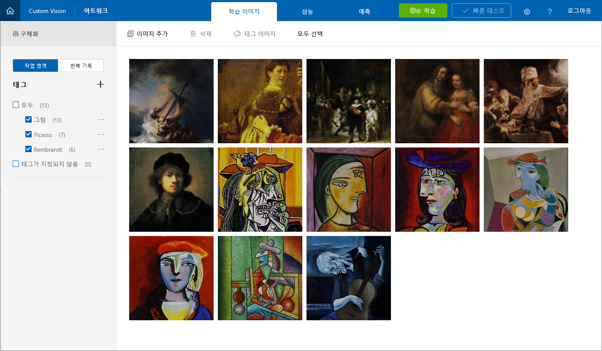

이 단원에서는 Picasso, Pollock 및 Rembrandt의 유명한 그림 이미지를 Artworks 프로젝트에 추가하고, 이미지 태그를 지정하여 Custom Vision Service가 학습하고 아티스트를 서로 구별할 수 있도록 합니다.

1. **이미지 추가**를 클릭하여 프로젝트에 이미지를 추가합니다.

    

1. **로컬 파일 찾아보기**를 클릭합니다.

    

    _로컬 이미지 찾아보기_

1. [이 모듈과 함께 제공되는 리소스](https://a4r.blob.core.windows.net/public/cvs-resources.zip)에서 "Artists\Picasso" 폴더를 찾아, 해당 폴더의 모든 파일을 선택하고, **열기**를 클릭합니다.

    

1. **일부 태그 추가...** 상자에 "painting"(따옴표 제외)을 입력합니다. 그런 다음, **+** 를 클릭하여 이미지에 태그를 할당합니다.

    

1. 4단계를 반복하여 이미지에 "Picasso" 태그를 추가합니다.

1. **7개 파일 업로드**를 클릭하여 이미지를 업로드합니다. 업로드가 완료되면 **완료**를 클릭합니다.

    

1. 업로드한 이미지가 할당된 태그와 함께 포털에 표시되는지 확인합니다.

    

1. Custom Vision Service는 7개의 Picasso 이미지를 사용하여 Picasso 그림을 제대로 식별할 수 있습니다. 하지만 지금 모델을 학습한 경우에는 Picasso 그림이 어떻게 보이는지만 이해하고 다른 아티스트의 그림은 식별할 수 없습니다.

    다음 단계에서는 다른 아티스트의 일부 그림을 업로드합니다. **이미지 추가**를 클릭하고, 랩 리소스의 "Artists\Rembrandt" 폴더에 있는 이미지를 모두 선택합니다. 레이블이 "painting" 및 "Rembrandt"("Picasso"가 아님) 레이블로 태그를 지정하고 프로젝트에 업로드합니다.

    > “painting” 태그를 추가하는 경우 다시 입력할 필요가 없습니다. 아래 표시된 것처럼 **일부 태그 추가...** 상자에 연결된 드롭다운 목록에서 선택할 수 있습니다. “Rembrandt”를 입력하고 **+** 를 클릭하여 “Rembrandt” 태그를 추가해야 **합니다**.

    

1. 프로젝트에서 Rembrandt 이미지가 Picasso 이미지와 함께 표시되는지 및 "Rembrandt"가 태그 목록에 표시되는지 확인합니다.

    

1. 이제 수수께끼 같은 아티스트 Jackson Pollock의 그림을 추가하여 Custom Vision Service가 Pollock의 그림도 인식할 수 있도록 합니다. 랩 리소스의 "Artists\Pollock" 폴더에 있는 이미지를 모두 선택하고 "painting" 및 "Pollock" 용어로 태그를 지정하고, 프로젝트에 업로드합니다.

태그 지정된 이미지가 업로드되면 다음 단계는 Picasso, Rembrandt 및 Pollock의 그림을 서로 구별하고 그림이 이러한 유명한 아티스트 중 하나의 작품인지 확인할 수 있도록 해당 이미지가 포함된 모델을 학습하는 것입니다.