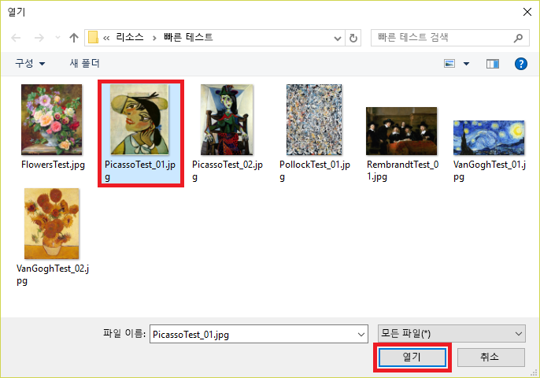

이 모듈의 뒷부분에서는 모델을 사용하여 제시된 그림의 아티스트를 식별하는 Node.js 앱을 만듭니다.Later in this module, you will create a Node.js app that uses the model to identify the artist of paintings presented to it. 그러나 모델을 테스트하기 위해 앱을 작성할 필요는 없습니다. 포털에서 테스트할 수 있으며 테스트하는 이미지를 사용하여 모델을 더 구체화할 수 있습니다.But you don't have to write an app to test the model; you can do your testing in the portal, and you can further refine the model using the images that you test with. 이 단원에서는 제공된 테스트 이미지를 사용하여 그림의 아티스트를 식별하는 모델의 기능을 테스트합니다.In this unit, you will test the model's ability to identify the artist of a painting using test images provided for you.

1. 페이지 맨 위에서 **빠른 테스트**를 클릭합니다.Click **Quick Test** at the top of the page.

    

1. **로컬 파일 찾아보기**를 클릭한 다음, 모듈 리소스의 "Quick Tests" 폴더를 찾습니다.Click **Browse local files**, and then browse to the "Quick Tests" folder in the module resources. **PicassoTest_01.jpg**를 선택하고 **열기**를 클릭합니다.Select **PicassoTest_01.jpg**, and click **Open**.

    

1. "빠른 테스트" 대화 상자에서 테스트 결과를 검사합니다.Examine the results of the test in the "Quick Test" dialog. Picasso 그림일 가능성은 얼마인가요?What is the probability that the painting is a Picasso? Rembrandt 또는 Pollock 그림일 가능성은 얼마인가요?What is the probability that it is a Rembrandt or Pollock?

1. “빠른 테스트” 대화 상자를 닫습니다.Close the "Quick Test" dialog. 그런 다음, 페이지 맨 위에서 **예측**을 클릭합니다.Then click **Predictions** at the top of the page.

    

1. 업로드한 테스트 이미지를 클릭하여 세부 정보를 표시합니다.Click the test image that you uploaded to show a detail of it. 그런 다음, 드롭다운 목록에서 **Picasso**를 선택하고 **저장 및 닫기**를 클릭하여 “Picasso”로 이미지 태그를 지정합니다.Then tag the image as a "Picasso" by selecting **Picasso** from the drop-down list and clicking **Save and close**.

    > 이 방식으로 테스트 이미지 태그를 지정하면 추가 학습 이미지를 업로드하지 않고 모델을 구체화할 수 있습니다.By tagging test images this way, you can refine the model without uploading additional training images.

    

1. "Quick Test" 폴더에 있는 **FlowersTest.jpg** 파일을 사용하여 또 다른 빠른 테스트를 수행합니다.Perform another quick test using the file named **FlowersTest.jpg** in the "Quick Test" folder. 이 이미지가 Picasso, Rembrandt 또는 Pollock일 가능성이 작은지 확인합니다.Confirm that this image is assigned a low probability of being a Picasso, a Rembrandt, or a Pollock.

모델이 학습되어 사용할 준비가 되면 특정 아티스트별로 그림을 능숙하게 가려냅니다.The model is trained and ready to go and appears to be adept at identifying paintings by certain artists. 이제 한 단계 더 나아가 모델 인텔리전스를 앱에 통합해 보겠습니다.Now let's go a step further and incorporate the model's intelligence into an app.