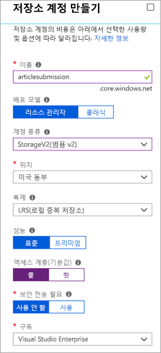

<span data-ttu-id="4785c-101">분산 응용 프로그램 구성 요소 간 직접 통신은 네트워크 대역폭이 낮거나 수요가 많은 경우 중단될 수 있으므로 문제가 될 수 있습니다.</span><span class="sxs-lookup"><span data-stu-id="4785c-101">Direct communication between the components of a distributed application can be problematic because it might be disrupted when network bandwidth is low or when demand is high.</span></span>

<span data-ttu-id="4785c-102">이 시스템에도 해당 문제가 나타난 적이 있습니다. 웹 포털이 웹 서비스를 호출하는 경우 서비스가 제시간에 응답하면 제대로 호출됩니다.</span><span class="sxs-lookup"><span data-stu-id="4785c-102">We've seen this in our system: the web portal calls a web service, which works great if the service responds in a timely manner.</span></span> <span data-ttu-id="4785c-103">트래픽이 많으면 문제가 발생하므로 큐를 사용하여 프런트 엔드 앱과 중간 계층 웹 서비스 간 직접 링크를 제거하려고 합니다.</span><span class="sxs-lookup"><span data-stu-id="4785c-103">High traffic causes problems and so the plan is to use a queue to eliminate the direct link between the front-end apps and your middle-tier web service.</span></span>

## <a name="what-is-azure-queue-storage"></a><span data-ttu-id="4785c-104">Azure Queue Storage란?</span><span class="sxs-lookup"><span data-stu-id="4785c-104">What is Azure Queue storage?</span></span>

<span data-ttu-id="4785c-105">Azure Queue Storage는 클라우드 기반 큐를 구현하는 Azure 서비스입니다.</span><span class="sxs-lookup"><span data-stu-id="4785c-105">Azure Queue storage is an Azure service that implements cloud-based queues.</span></span> <span data-ttu-id="4785c-106">각 큐는 메시지 목록을 유지 관리합니다.</span><span class="sxs-lookup"><span data-stu-id="4785c-106">Each queue maintains a list of messages.</span></span> <span data-ttu-id="4785c-107">응용 프로그램 구성 요소는 REST API 또는 Azure 제공 클라이언트 라이브러리를 사용하여 큐에 액세스합니다.</span><span class="sxs-lookup"><span data-stu-id="4785c-107">Application components access a queue using a REST API or an Azure-supplied client library.</span></span> <span data-ttu-id="4785c-108">일반적으로 하나 이상의 _송신기_ 구성 요소와 하나 이상의 _수신기_ 구성 요소가 있습니다.</span><span class="sxs-lookup"><span data-stu-id="4785c-108">Typically, you will have one or more _sender_ components and one or more _receiver_ components.</span></span> <span data-ttu-id="4785c-109">송신기 구성 요소는 큐에 메시지를 추가합니다.</span><span class="sxs-lookup"><span data-stu-id="4785c-109">Sender components add messages to the queue.</span></span> <span data-ttu-id="4785c-110">수신기 구성 요소는 큐의 앞에서 처리할 메시지를 검색합니다.</span><span class="sxs-lookup"><span data-stu-id="4785c-110">Receiver components retrieve messages from the front of the queue for processing.</span></span> <span data-ttu-id="4785c-111">다음 그림은 Azure 큐에 메시지를 추가하는 여러 송신기 응용 프로그램과 메시지를 검색하는 하나의 수신기 응용 프로그램을 보여 줍니다.</span><span class="sxs-lookup"><span data-stu-id="4785c-111">The following illustration shows multiple sender applications adding messages to the Azure Queue and one receiver application retrieving the messages.</span></span>


<span data-ttu-id="4785c-113">가격은 큐 크기와 작업 수를 기반으로 합니다.</span><span class="sxs-lookup"><span data-stu-id="4785c-113">Pricing is based on queue size and number of operations.</span></span> <span data-ttu-id="4785c-114">메시지 큐가 크면 작은 큐보다 비용이 더 많이 듭니다.</span><span class="sxs-lookup"><span data-stu-id="4785c-114">Larger message queues cost more than smaller queues.</span></span> <span data-ttu-id="4785c-115">메시지 추가 및 메시지 삭제와 같은 개별 작업에 대해서도 요금이 발생합니다.</span><span class="sxs-lookup"><span data-stu-id="4785c-115">Charges are also incurred for each operation, such as adding a message and deleting a message.</span></span> <span data-ttu-id="4785c-116">가격 책정에 대한 자세한 내용은 [Azure Queue Storage 가격](https://azure.microsoft.com/pricing/details/storage/queues/)을 참조하세요.</span><span class="sxs-lookup"><span data-stu-id="4785c-116">For pricing details, see [Azure Queue storage pricing](https://azure.microsoft.com/pricing/details/storage/queues/).</span></span>

## <a name="why-use-queues"></a><span data-ttu-id="4785c-117">큐를 사용하는 이유</span><span class="sxs-lookup"><span data-stu-id="4785c-117">Why use queues?</span></span>

<span data-ttu-id="4785c-118">큐는 대기 중인 메시지를 임시로 저장하여 복원력을 높입니다.</span><span class="sxs-lookup"><span data-stu-id="4785c-118">A queue increases resiliency by temporarily storing waiting messages.</span></span> <span data-ttu-id="4785c-119">수요가 낮거나 정상인 경우 대상 구성 요소는 메시지가 추가되는 속도보다 더 빠르게 큐에서 메시지를 제거하므로 큐 크기가 작게 유지됩니다.</span><span class="sxs-lookup"><span data-stu-id="4785c-119">At times of low or normal demand, the size of the queue remains small because the destination component removes messages from the queue faster than they are added.</span></span> <span data-ttu-id="4785c-120">수요가 높은 경우에는 큐 크기가 증가할 수 있지만 메시지는 손실되지 않습니다.</span><span class="sxs-lookup"><span data-stu-id="4785c-120">At times of high demand, the queue may increase in size, but messages are not lost.</span></span> <span data-ttu-id="4785c-121">수요가 정상으로 돌아가면 대상 구성 요소가 큐를 따라잡아 비울 수 있습니다.</span><span class="sxs-lookup"><span data-stu-id="4785c-121">The destination component can catch up and empty the queue as demand returns to normal.</span></span>

<span data-ttu-id="4785c-122">단일 큐의 크기는 최대 **500TB**이므로 잠재적으로 _수백만_ 개의 메시지를 저장할 수 있습니다.</span><span class="sxs-lookup"><span data-stu-id="4785c-122">A single queue can be up to **500 TB** in size, so it can potentially store _millions_ of messages.</span></span> <span data-ttu-id="4785c-123">단일 큐의 대상 처리량은 초당 2,000개의 메시지이므로 대규모 시나리오를 처리할 수 있습니다.</span><span class="sxs-lookup"><span data-stu-id="4785c-123">The target throughput for a single queue is 2000 messages per second, allowing it to handle high-volume scenarios.</span></span>

<span data-ttu-id="4785c-124">큐를 사용하면 수요 변경 시 응용 프로그램이 자동적이며 즉각적으로 크기를 조정할 수 있습니다.</span><span class="sxs-lookup"><span data-stu-id="4785c-124">Queues let your application scale automatically and immediately when demand changes.</span></span> <span data-ttu-id="4785c-125">따라서 손실되면 위험한 중요 비즈니스 데이터에 유용합니다.</span><span class="sxs-lookup"><span data-stu-id="4785c-125">This makes them useful for critical business data that would be damaging to lose.</span></span> <span data-ttu-id="4785c-126">Azure는 자동으로 크기가 조정되는 많은 다른 서비스를 제공합니다.</span><span class="sxs-lookup"><span data-stu-id="4785c-126">Azure offers many other services that scale automatically.</span></span> <span data-ttu-id="4785c-127">예를 들어 Azure Virtual Machine Scale Sets, 클라우드 서비스, Azure App Service 계획 및 App Service 환경에서는 **자동 크기 조정** 기능을 사용할 수 있습니다.</span><span class="sxs-lookup"><span data-stu-id="4785c-127">For example, the **Autoscale** feature is available on Azure virtual machine scale sets, cloud services, Azure App Service plans, and App Service environments.</span></span> <span data-ttu-id="4785c-128">이를 통해 Azure에서 수요가 높은 기간을 파악하여 관리자의 개입 없이 자동으로 용량을 추가하는 데 사용하는 규칙을 정의할 수 있습니다.</span><span class="sxs-lookup"><span data-stu-id="4785c-128">This lets you define rules that Azure uses to identify periods of high demand and automatically add capacity without involving an administrator.</span></span> <span data-ttu-id="4785c-129">자동 크기 조정은 수요에 빠르게 대처하지만 즉각적이지는 않습니다.</span><span class="sxs-lookup"><span data-stu-id="4785c-129">Autoscaling responds to demand quickly, but not instantaneously.</span></span> <span data-ttu-id="4785c-130">반대로 Azure Queue Storage는 처리 리소스를 사용할 수 있을 때까지 메시지를 저장하여 즉각적으로 높은 수요를 처리합니다.</span><span class="sxs-lookup"><span data-stu-id="4785c-130">By contrast, Azure Queue storage instantaneously handles high demand by storing messages until processing resources are available.</span></span>

## <a name="what-is-a-message"></a><span data-ttu-id="4785c-131">메시지란?</span><span class="sxs-lookup"><span data-stu-id="4785c-131">What is a message?</span></span>

<span data-ttu-id="4785c-132">큐의 메시지는 최대 64KB의 바이트 배열입니다.</span><span class="sxs-lookup"><span data-stu-id="4785c-132">A message in a queue is a byte array of up to 64 KB.</span></span> <span data-ttu-id="4785c-133">메시지 콘텐츠는 어떤 Azure 구성 요소에서도 전혀 해석되지 않습니다.</span><span class="sxs-lookup"><span data-stu-id="4785c-133">Message contents are not interpreted at all by any Azure component.</span></span>

<span data-ttu-id="4785c-134">구조적 메시지를 만들려는 경우 XML 또는 JSON을 사용하여 메시지 콘텐츠를 형식 지정할 수 있습니다.</span><span class="sxs-lookup"><span data-stu-id="4785c-134">If you want to create a structured message, you could format the message content using XML or JSON.</span></span> <span data-ttu-id="4785c-135">코드는 사용자 지정 형식을 생성하고 해석하는 작업을 담당합니다.</span><span class="sxs-lookup"><span data-stu-id="4785c-135">Your code is responsible for generating and interpreting your custom format.</span></span> <span data-ttu-id="4785c-136">예를 들어 다음과 같은 사용자 지정 JSON 메시지를 작성할 수 있습니다.</span><span class="sxs-lookup"><span data-stu-id="4785c-136">For example, you could make a custom JSON message that looks like the following:</span></span>

```json
{
    "Message": {
        "To": "news@contoso.com",
        "From": "writer@contoso.com",
        "Subject": "Support request",
        "Body": "Send me a photographer!"
    }
}
```

## <a name="creating-a-storage-account"></a><span data-ttu-id="4785c-137">저장소 계정 만들기</span><span class="sxs-lookup"><span data-stu-id="4785c-137">Creating a storage account</span></span>

<span data-ttu-id="4785c-138">큐는 저장소 계정의 일부여야 합니다.</span><span class="sxs-lookup"><span data-stu-id="4785c-138">A queue must be part of a storage account.</span></span> <span data-ttu-id="4785c-139">Azure CLI(또는 PowerShell) 또는 Azure Portal을 사용하여 저장소 계정을 만들 수 있습니다.</span><span class="sxs-lookup"><span data-stu-id="4785c-139">You can create a storage account using the Azure CLI (or PowerShell), or Azure portal.</span></span> <span data-ttu-id="4785c-140">모두 단계별로 이루어져 있고 각각의 정보에 대해 메시지가 표시되므로 포털을 사용하는 것이 가장 쉽습니다.</span><span class="sxs-lookup"><span data-stu-id="4785c-140">The portal is easiest because it's all guided and prompts you for each piece of information.</span></span> 

<span data-ttu-id="4785c-141">다음 스크린샷은 저장소 계정 범주의 위치를 보여 줍니다.</span><span class="sxs-lookup"><span data-stu-id="4785c-141">The following screenshot shows the location of the Storage accounts category.</span></span>


<span data-ttu-id="4785c-143">계정을 만들 때 제공할 수 있는 옵션은 여러 가지가 있습니다. 이러한 옵션은 대부분 기본 선택을 사용할 수 있습니다.</span><span class="sxs-lookup"><span data-stu-id="4785c-143">There are several options you can supply when you create the account, most of which you can use the default selection.</span></span> <span data-ttu-id="4785c-144">이전 모듈에서는 이러한 옵션을 다뤘지만 각 옵션과 연결된 `(i)` 팁에 마우스를 올리면 해당 옵션의 기능에 대한 미리 알림을 확인할 수 있습니다.</span><span class="sxs-lookup"><span data-stu-id="4785c-144">We covered these options in a previous module, but you can hover over the `(i)` tip associated with each option to get a reminder of what it does.</span></span> <span data-ttu-id="4785c-145">다음은 포털 블레이드를 채우는 예제입니다.</span><span class="sxs-lookup"><span data-stu-id="4785c-145">Here's an example of filling out the portal blade.</span></span>

<span data-ttu-id="4785c-146">다음 스크린샷은 저장소 계정 만들기 블레이드와 저장소 계정을 만드는 데 필요한 정보를 보여 줍니다.</span><span class="sxs-lookup"><span data-stu-id="4785c-146">The following screenshot displays the Create storage account blade and the information required to create a storage account.</span></span>



### <a name="settings-for-queues"></a><span data-ttu-id="4785c-148">큐에 대한 설정</span><span class="sxs-lookup"><span data-stu-id="4785c-148">Settings for queues</span></span>
<span data-ttu-id="4785c-149">큐가 포함될 저장소 계정을 만드는 경우 다음 설정을 고려해야 합니다.</span><span class="sxs-lookup"><span data-stu-id="4785c-149">When you create a storage account that will contain queues, you should consider the following settings:</span></span>

- <span data-ttu-id="4785c-150">큐는 Azure 범용 저장소 계정(v1 또는 v2)의 일부로만 사용할 수 있습니다.</span><span class="sxs-lookup"><span data-stu-id="4785c-150">Queues are only available as part of Azure general-purpose storage accounts (v1 or v2).</span></span> <span data-ttu-id="4785c-151">Blob Storage 계정에 추가할 수 없습니다.</span><span class="sxs-lookup"><span data-stu-id="4785c-151">You cannot add them to Blob storage accounts.</span></span>
- <span data-ttu-id="4785c-152">StorageV2 계정에 대해 표시되는 **액세스 계층** 설정은 Blob Storage에만 적용되며 큐에는 영향을 주지 않습니다.</span><span class="sxs-lookup"><span data-stu-id="4785c-152">The **Access tier** setting which is shown for StorageV2 accounts applies only to Blob storage and does not affect queues.</span></span>
- <span data-ttu-id="4785c-153">소스 구성 요소 또는 대상 구성 요소 또는 둘 다(권장)에 가까운 위치를 선택해야 합니다.</span><span class="sxs-lookup"><span data-stu-id="4785c-153">You should choose a location that is close to either the source components or destination components or (preferably) both.</span></span>
- <span data-ttu-id="4785c-154">데이터는 디스크 장애 및 기타 하드웨어 문제를 방지하기 위해 항상 여러 서버로 복제됩니다.</span><span class="sxs-lookup"><span data-stu-id="4785c-154">Data is always replicated to multiple servers to guard against disk failures and other hardware problems.</span></span> <span data-ttu-id="4785c-155">복제 전략은 선택할 수 있습니다. **LRS(로컬 중복 저장소)** 는 비용이 저렴하지만 전체 데이터 센터에 영향을 주는 재해에 취약하고 **GRS(지역 중복 저장소)** 는 다른 Azure 데이터 센터로 데이터를 복제합니다.</span><span class="sxs-lookup"><span data-stu-id="4785c-155">You have a choice of replication strategies: **Locally Redundant Storage (LRS)** is low-cost but vulnerable to disasters that affect an entire data center while **Geo-Redundant Storage (GRS)** replicates data to other Azure data centers.</span></span> <span data-ttu-id="4785c-156">중복 요구 사항을 충족하는 복제 전략을 선택하세요.</span><span class="sxs-lookup"><span data-stu-id="4785c-156">Choose the replication strategy that meets your redundancy needs.</span></span>
- <span data-ttu-id="4785c-157">성능 계층은 메시지가 저장되는 방식을 결정합니다. **표준**은 자기 드라이브를 사용하고 **프리미엄**은 반도체 드라이브를 사용합니다.</span><span class="sxs-lookup"><span data-stu-id="4785c-157">The performance tier determines how your message are stored: **Standard** uses magnetic drives while **Premium** uses solid-state drives.</span></span> <span data-ttu-id="4785c-158">최대 수요가 짧을 것으로 예상되는 경우 표준을 선택합니다.</span><span class="sxs-lookup"><span data-stu-id="4785c-158">Choose Standard if you expect peaks in demand to be short.</span></span> <span data-ttu-id="4785c-159">큐 길이가 길어지는 경우가 있으며 메시지에 액세스하는 시간을 최소화해야 하는 경우 프리미엄을 고려합니다.</span><span class="sxs-lookup"><span data-stu-id="4785c-159">Consider Premium if queue length sometimes becomes long and you need to minimize the time to access messages.</span></span>
- <span data-ttu-id="4785c-160">민감한 정보가 큐를 통해 전달될 수 있는 경우 보안 전송이 필요합니다.</span><span class="sxs-lookup"><span data-stu-id="4785c-160">Require secure transfer if sensitive information may pass through the queue.</span></span> <span data-ttu-id="4785c-161">이 설정은 큐에 대한 모든 연결이 SSL(Secure Sockets Layer)을 사용하여 암호화되도록 합니다.</span><span class="sxs-lookup"><span data-stu-id="4785c-161">This setting ensures that all connections to the queue are encrypted using Secure Sockets Layer (SSL).</span></span>