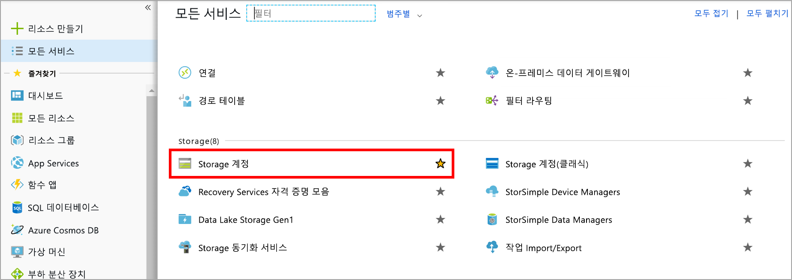

분산 응용 프로그램 구성 요소 간 직접 통신은 네트워크 대역폭이 낮거나 수요가 많은 경우 중단될 수 있으므로 문제가 될 수 있습니다.

이 시스템에도 해당 문제가 나타난 적이 있습니다. 웹 포털이 웹 서비스를 호출하는 경우 서비스가 제시간에 응답하면 제대로 호출됩니다. 트래픽이 많으면 문제가 발생하므로 큐를 사용하여 프런트 엔드 앱과 중간 계층 웹 서비스 간 직접 링크를 제거하려고 합니다.

## <a name="what-is-azure-queue-storage"></a>Azure Queue Storage란?

Azure Queue Storage는 클라우드 기반 큐를 구현하는 Azure 서비스입니다. 각 큐는 메시지 목록을 유지 관리합니다. 응용 프로그램 구성 요소는 REST API 또는 Azure 제공 클라이언트 라이브러리를 사용하여 큐에 액세스합니다. 일반적으로 하나 이상의 _송신기_ 구성 요소와 하나 이상의 _수신기_ 구성 요소가 있습니다. 송신기 구성 요소는 큐에 메시지를 추가합니다. 수신기 구성 요소는 큐의 앞에서 처리할 메시지를 검색합니다. 다음 그림은 Azure 큐에 메시지를 추가하는 여러 송신기 응용 프로그램과 메시지를 검색하는 하나의 수신기 응용 프로그램을 보여 줍니다.


가격은 큐 크기와 작업 수를 기반으로 합니다. 메시지 큐가 크면 작은 큐보다 비용이 더 많이 듭니다. 메시지 추가 및 메시지 삭제와 같은 개별 작업에 대해서도 요금이 발생합니다. 가격 책정에 대한 자세한 내용은 [Azure Queue Storage 가격](https://azure.microsoft.com/pricing/details/storage/queues/)을 참조하세요.

## <a name="why-use-queues"></a>큐를 사용하는 이유

큐는 대기 중인 메시지를 임시로 저장하여 복원력을 높입니다. 수요가 낮거나 정상인 경우 대상 구성 요소는 메시지가 추가되는 속도보다 더 빠르게 큐에서 메시지를 제거하므로 큐 크기가 작게 유지됩니다. 수요가 높은 경우에는 큐 크기가 증가할 수 있지만 메시지는 손실되지 않습니다. 수요가 정상으로 돌아가면 대상 구성 요소가 큐를 따라잡아 비울 수 있습니다.

단일 큐의 크기는 최대 **500TB**이므로 잠재적으로 _수백만_ 개의 메시지를 저장할 수 있습니다. 단일 큐의 대상 처리량은 초당 2,000개의 메시지이므로 대규모 시나리오를 처리할 수 있습니다.

큐를 사용하면 수요 변경 시 응용 프로그램이 자동적이며 즉각적으로 크기를 조정할 수 있습니다. 따라서 손실되면 위험한 중요 비즈니스 데이터에 유용합니다. Azure는 자동으로 크기가 조정되는 많은 다른 서비스를 제공합니다. 예를 들어 Azure Virtual Machine Scale Sets, 클라우드 서비스, Azure App Service 계획 및 App Service 환경에서는 **자동 크기 조정** 기능을 사용할 수 있습니다. 이를 통해 Azure에서 수요가 높은 기간을 파악하여 관리자의 개입 없이 자동으로 용량을 추가하는 데 사용하는 규칙을 정의할 수 있습니다. 자동 크기 조정은 수요에 빠르게 대처하지만 즉각적이지는 않습니다. 반대로 Azure Queue Storage는 처리 리소스를 사용할 수 있을 때까지 메시지를 저장하여 즉각적으로 높은 수요를 처리합니다.

## <a name="what-is-a-message"></a>메시지란?

큐의 메시지는 최대 64KB의 바이트 배열입니다. 메시지 콘텐츠는 어떤 Azure 구성 요소에서도 전혀 해석되지 않습니다.

구조적 메시지를 만들려는 경우 XML 또는 JSON을 사용하여 메시지 콘텐츠를 형식 지정할 수 있습니다. 코드는 사용자 지정 형식을 생성하고 해석하는 작업을 담당합니다. 예를 들어 다음과 같은 사용자 지정 JSON 메시지를 작성할 수 있습니다.

```json
{
    "Message": {
        "To": "news@contoso.com",
        "From": "writer@contoso.com",
        "Subject": "Support request",
        "Body": "Send me a photographer!"
    }
}
```

## <a name="creating-a-storage-account"></a>저장소 계정 만들기

큐는 저장소 계정의 일부여야 합니다. Azure CLI(또는 PowerShell) 또는 Azure Portal을 사용하여 저장소 계정을 만들 수 있습니다. 모두 단계별로 이루어져 있고 각각의 정보에 대해 메시지가 표시되므로 포털을 사용하는 것이 가장 쉽습니다. 

다음 스크린샷은 저장소 계정 범주의 위치를 보여 줍니다.



계정을 만들 때 제공할 수 있는 옵션은 여러 가지가 있습니다. 이러한 옵션은 대부분 기본 선택을 사용할 수 있습니다. 이전 모듈에서는 이러한 옵션을 다뤘지만 각 옵션과 연결된 `(i)` 팁에 마우스를 올리면 해당 옵션의 기능에 대한 미리 알림을 확인할 수 있습니다. 다음은 포털 블레이드를 채우는 예제입니다.

다음 스크린샷은 저장소 계정 만들기 블레이드와 저장소 계정을 만드는 데 필요한 정보를 보여 줍니다.


### <a name="settings-for-queues"></a>큐에 대한 설정
큐가 포함될 저장소 계정을 만드는 경우 다음 설정을 고려해야 합니다.

- 큐는 Azure 범용 저장소 계정(v1 또는 v2)의 일부로만 사용할 수 있습니다. Blob Storage 계정에 추가할 수 없습니다.
- StorageV2 계정에 대해 표시되는 **액세스 계층** 설정은 Blob Storage에만 적용되며 큐에는 영향을 주지 않습니다.
- 소스 구성 요소 또는 대상 구성 요소 또는 둘 다(권장)에 가까운 위치를 선택해야 합니다.
- 데이터는 디스크 장애 및 기타 하드웨어 문제를 방지하기 위해 항상 여러 서버로 복제됩니다. 복제 전략은 선택할 수 있습니다. **LRS(로컬 중복 저장소)** 는 비용이 저렴하지만 전체 데이터 센터에 영향을 주는 재해에 취약하고 **GRS(지역 중복 저장소)** 는 다른 Azure 데이터 센터로 데이터를 복제합니다. 중복 요구 사항을 충족하는 복제 전략을 선택하세요.
- 성능 계층은 메시지가 저장되는 방식을 결정합니다. **표준**은 자기 드라이브를 사용하고 **프리미엄**은 반도체 드라이브를 사용합니다. 최대 수요가 짧을 것으로 예상되는 경우 표준을 선택합니다. 큐 길이가 길어지는 경우가 있으며 메시지에 액세스하는 시간을 최소화해야 하는 경우 프리미엄을 고려합니다.
- 민감한 정보가 큐를 통해 전달될 수 있는 경우 보안 전송이 필요합니다. 이 설정은 큐에 대한 모든 연결이 SSL(Secure Sockets Layer)을 사용하여 암호화되도록 합니다.