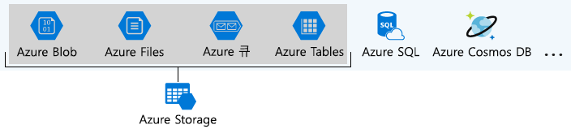
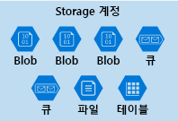
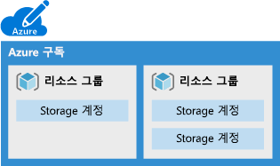
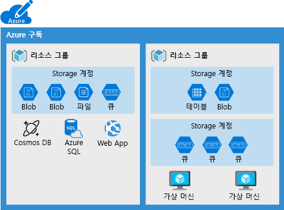
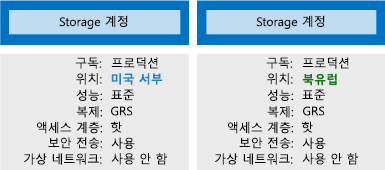

조직에서는 종종 여러 저장소 계정이 여러 요구 사항 집합을 구현할 수 있는 경구가 있습니다. 초콜릿 제조업체 예제에는 개인 비즈니스 데이터에 대해 하나의 저장소 계정 및 소비자 지향 파일에 대해 하나의 저장소 계정이 있습니다. 여기에서는 필요한 계정 수를 결정하는 데 도움이 되는 저장소 계정에 의해 제어되는 정책 요소를 알아봅니다.

## Azure Storage란?

Azure에서는 데이터를 저장하는 여러 방법을 제공합니다. Azure SQL Server, Azure Cosmos DB, Azure Tables 등 여러 데이터베이스 옵션이 있습니다. Azure는 Azure Queues, Event Hubs 등 메시지를 저장하고 보내는 여러 방법을 제공합니다. Azure Files 및 Azure Blob 같은 서비스를 사용하여 느슨한 파일도 저장할 수 있습니다.

Azure는 이러한 4개의 데이터 서비스를 선택하고 _Azure Storage_ 이름 아래에 배치합니다. 네 가지 서비스는 Azure Blob, Azure Files, Azure Queues 및 Azure Tables입니다. 다음 일러스트레이션은 Azure Storage의 요소를 보여줍니다.

이러한 네 가지 서비스가 기본 클라우드 기반 저장소 서비스이며 동일한 응용 프로그램에서 함께 자주 사용되기 때문에 특별하게 취급되었습니다.

## 저장소 계정이란?

_저장소 계정_은 Azure Storage 서비스의 집합을 함께 그룹화하는 컨테이너입니다. Azure Storage에서 데이터 서비스에만 저장소 계정(Azure Blob, Azure Files, Azure Queues 및 Azure Tables)이 포함될 수 있습니다. 다음 일러스트레이션에서는 여러 데이터 서비스를 포함하는 저장소 계정을 보여줍니다.

저장소 계정에 데이터 서비스를 결합하면 해당 항목을 그룹으로 관리할 수 있습니다. 계정을 만들 때 지정한 설정 또는 생성 후에 변경한 설정은 계정의 모든 항목에 적용됩니다. 저장소 계정을 삭제하면 그 안에 모든 저장된 데이터를 삭제합니다.

저장소 계정은 Azure 리소스이며 리소스 그룹에 포함됩니다. 다음 일러스트레이션에서는 각각에 하나 이상의 저장소 계정이 포함된 여러 리소스 그룹을 포함하는 Azure 구독을 보여 줍니다.

Azure SQL 및 Cosmos DB와 같은 다른 Azure 데이터 서비스는 독립적인 Azure 리소스로 관리되고 저장소 계정에 포함될 수 없습니다. 다음 일러스트레이션에서는 일반적인 배열을 보여 줍니다. Blob, Files, Queues 및 Tables는 저장소 계정 내에 있지만 다른 서비스는 그렇지 않습니다.

## 저장소 계정 설정

저장소 계정은 계정에서 모든 저장소 서비스에 적용되는 정책을 정의합니다. 예를 들어 포함된 모든 서비스가 미국 서부 데이터 센터에 저장되고, https를 통해서만 액세스할 수 있고, 영업부의 구독에 청구되도록 지정할 수 있습니다.

저장소 계정에 의해 제어되는 설정은 다음과 같습니다.

- **구독**: 계정의 서비스에 대한 요금이 청구되는 Azure 구독입니다.

- **위치**: 서비스를 계정에 저장하는 데이터 센터입니다.

- **성능**: 저장소 계정에 사용할 수 있는 데이터 서비스와 데이터 저장에 사용되는 하드웨어 디스크 종류를 결정합니다. **표준**을 사용하면 사용자가 모든 데이터 서비스(Blob, File, Queue, Table)에서 디스크 드라이브를 사용할 수 있습니다. **프리미엄**에서는 _페이지 Blob_이라는 특정 형식의 Blob으로 제한하고 저장소에 SSD(반도체 드라이브)를 사용합니다.

- **복제**: 하드웨어 오류 또는 자연 재해로부터 보호하기 위해 데이터의 복사본을 만드는 데 사용되는 전략을 결정합니다. 최소한 Azure에서는 저장소 계정과 연결된 데이터 센터 내의 데이터 복사본을 자동으로 유지합니다. 이것을 LRS(로컬 중복 저장소)라고 하고, 하드웨어 오류로부터 보호하지만 전체 데이터 센터를 무력화하는 이벤트로부터는 보호할 수 없습니다. GRS(지역 중복 저장소)와 같은 다른 옵션 중 하나를 업그레이드하여 전세계의 여러 데이터 센터에서 복제를 가져올 수 있습니다.

- **액세스 계층**: 이 저장소 계정에서 Blob에 액세스할 수 있는 속도를 제어합니다. 핫은 쿨보다 빠른 액세스를 제공하지만 비용이 증가합니다. 이 기능은 Blob에만 적용되며 새 Blob에 대한 기본값으로 제공됩니다.

- **보안 전송 필요**: 액세스에 대해 지원되는 프로토콜을 결정하는 보안 기능입니다. 활성화하면 HTTP가 필요하고, 비활성화하면 HTTP가 허용됩니다.

- **가상 네트워크**: 지정한 가상 네트워크에서 인바운드 액세스 요청만을 허용하는 보안 기능입니다.

## 필요한 저장소 계정 수

저장소 계정은 위치, 복제 전략, 구독 소유자 등과 같은 설정 컬렉션을 나타냅니다. 데이터에 적용하려는 모든 설정 그룹에 하나의 저장소 계정이 필요합니다. 다음 일러스트레이션에서는 하나의 설정이 다른 두 개의 저장소 계정을 보여줍니다. 한 가지 차이점으로 인해 별도 저장소 계정이 필요합니다.

필요한 저장소 계정 수는 일반적으로 데이터 다양성, 비용 구분 및 관리 오버헤드에 대한 허용치에 의해 결정됩니다.

### 데이터 다양성

조직에서는 사용되는 위치, 구분 정도 및 요금을 지불하는 그룹 등이 다른 데이터를 자주 생성합니다. 이러한 벡터의 다양성으로 인해 여러 저장소 계정이 발생할 수 있습니다. 두 가지 예제를 살펴보겠습니다.

1. 국가 또는 지역에 관련된 데이터가 있나요? 그렇다면 성능 또는 규정 준수 상 해당 국가의 데이터 센터에서 찾는 것이 좋습니다. 각 위치에 하나의 저장소 계정이 필요합니다.

1. 갖고 있는 데이터 중 일부는 독점이고 일부는 공용인가요? 그렇다면 독점 데이터에 가상 네트워크를 사용하도록 설정하고 공용 데이터에는 사용하지 않도록 할 수 있습니다. 별도 저장소 계정도 필요합니다.

일반적으로 다양성이 증가하면 저장소 계정 수도 증가합니다.

### 비용 구분

저장소 계정 자체에는 재무 비용이 들지 않지만 계정에 대해 선택한 설정은 계정의 서비스 비용에 영향을 줍니다. 지역 중복 저장소는 로컬 중복 저장소보다 큰 비용이 듭니다. 프리미엄 성능 및 핫 액세스 계층은 Blob 비용을 증가시킵니다.

비용을 줄이기 위해 여러 저장소 계정을 사용할 수 있습니다. 예를 들어 중요 및 중요하지 않은 범주로 데이터를 분할할 수 있습니다. 지역 중복 저장소를 사용하여 저장소 계정에 중요 데이터를 배치하고, 로컬 중복 저장소를 사용하여 다른 저장소 계정에 중요하지 않은 데이터를 배치할 수 있습니다.

### 관리 오버헤드에 대한 허용치

관리자가 각 저장소 계정을 만들고 유지 관리하기 위해서는 시간과 관심이 필요합니다. 클라우드 저장소에 데이터를 추가하는 사용자에 대한 복잡성도 증가합니다. 이 역할의 모든 사용자는 각 저장소 계정의 용도를 이해해야 하므로 올바른 계정에 새 데이터를 추가합니다.

저장소 계정은 비용을 최소화하면서 필요한 성능과 보안을 얻을 수 있는 강력한 도구입니다. 일반적인 전략은 데이터 분석을 시작하고 위치, 청구, 복제 전략 등과 같은 특성을 공유하는 파티션을 만든 다음, 각 파티션에 대해 하나의 저장소 계정을 만드는 것입니다.