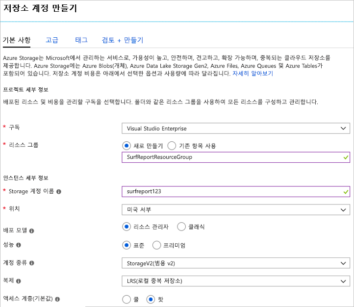
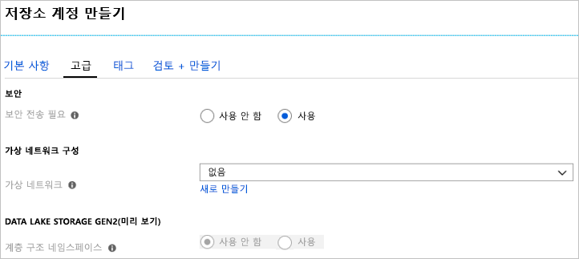

이 단원에서는 Azure Portal을 사용하여 가상의 남부 캘리포니아 서핑 보고서 웹앱에 적절한 저장소 계정을 만듭니다.

서핑 보고서 사이트를 통해 사용자가 로컬 해변 조건의 사진 및 비디오를 업로드할 수 있습니다. 보는 사람은 이 콘텐츠를 사용하여 가장 좋은 서핑 조건을 갖는 해변을 선택할 수 있습니다. 디자인 및 기능 목표 목록을 다음과 같습니다.

- 비디오 콘텐츠를 신속하게 로드해야 합니다.
- 사이트에서 업로드 볼륨이 예기치 않게 급증하는 상황을 처리해야 합니다.
- 서핑 조건이 수시로 변하기 때문에 항상 현재 조건을 표시하도록 오래된 콘텐츠를 제거해야 합니다.

이러한 요구 사항을 충족하기 위해, 여러분은 업로드된 콘텐츠를 Azure 큐에 버퍼링하여 처리한 다음, Azure Blob으로 전송하여 영구적으로 저장하기로 결정합니다. 큐와 Blob을 모두 저장할 수 있는 동시에 콘텐츠에 대한 대기 시간이 짧은 액세스를 제공하는 저장소 계정이 필요합니다.

[!include]

## Azure Portal을 사용하여 저장소 계정 만들기

1. 샌드박스를 활성화한 동일한 계정을 사용하여 [Azure Portal](https://portal.azure.com/learn.docs.microsoft.com?azure-portal=true)에 로그인합니다.

1. Azure Portal의 왼쪽 위에서 **리소스 만들기**를 선택합니다.

1. 표시되는 선택 창에서 **저장소**를 선택합니다.

1. 해당 창의 오른쪽에서 **저장소 계정 - Blob, 파일, 테이블, 큐**를 선택합니다.

    

### 기본 옵션 구성

[!include]

**프로젝트 세부 정보** 아래에서 다음을 수행합니다.

1. 적합한 **구독**을 선택합니다.

1. 드롭다운 목록에서 기존 리소스 그룹("**<rgn>[샌드박스 리소스 그룹 이름]</rgn>**")을 선택합니다.

    > [!NOTE]
    > 이 무료 리소스 그룹은 Microsoft에서 학습 체험의 일부로 제공한 것입니다. 실제 응용 프로그램의 계정을 만들 때에는 앱의 모든 리소스를 보관할 새 리소스 그룹을 구독에 만듭니다.

**인스턴스 세부 정보** 아래에서 다음을 수행합니다.

1. **저장소 계정 이름**을 입력합니다. 이름은 계정의 데이터에 액세스하는 데 사용되는 공용 URL을 생성하는 데 사용됩니다. 이 이름은 Azure의 모든 기존 저장소 계정 이름에서 고유해야 합니다. 3~24자여야 하며, 소문자와 숫자만 포함할 수 있습니다.

1. 위의 목록에서 가까운 **위치**를 선택합니다.

1. **배포 모델**은 _Resource Manager_로 유지합니다. 이것은 Azure의 모든 리소스 배포에서 선호되는 모델이며, 앱과 관련된 모든 리소스를 _리소스 그룹_으로 그룹화하여 간편하게 관리할 수 있습니다.

1. _성능_ 옵션으로 **표준**을 선택합니다. Storage 계정에 데이터를 보관하는 데 사용할 디스크 저장소 유형이 표준으로 결정됩니다. 표준은 기존 하드 디스크를 사용하고, 프리미엄은 액세스 속도가 빠른 SSD(반도체 드라이브)를 사용합니다. 그러나 프리미엄은 _페이지 Blob_만 지원합니다. 비디오에는 _블록 Blob_이 필요하고 버퍼링에는 큐가 필요한데, 둘 다 _표준_ 옵션에서만 사용할 수 있습니다.

1. _계정 종류_로 **StorageV2(범용 v2)** 를 선택합니다. 이렇게 하면 최신 기능 및 가격 책정 정보에 액세스할 수 있습니다. 특히 Blob 저장소 계정은 이 계정 유형에서 더 많은 옵션을 사용할 수 있습니다. Blob 및 큐를 조합해야 하므로 _Blob 저장소_ 옵션이 작동하지 않습니다. 이 응용 프로그램의 경우 _Storage(범용 v1)_ 계정을 선택해도 별 다른 이점이 없습니다. 사용 가능한 기능이 제한되고 예상 워크로드의 비용을 줄일 가능성이 높지 않기 때문입니다.

1. _복제 옵션_으로 **LRS(로컬 중복 저장소)** 를 선택합니다. Azure 저장소 계정의 데이터는 고가용성을 위해 항상 복제됩니다. 이 옵션을 통해 내구성 요구 사항에 적합한 복제 간격을 선택할 수 있습니다. 이 예에서 이미지와 비디오는 빠르게 만료되고 사이트에서 제거됩니다. 결과적으로, 글로벌 백업을 위해 추가 비용을 지불하는 것은 의미가 없습니다. 재해로 인해 데이터 손실이 발생한 경우 사용자의 최신 콘텐츠를 사용하여 사이트를 다시 시작할 수 있습니다.

1. **액세스 계층**을 _핫_을 설정합니다. 이 설정은 Blob 저장소에만 사용됩니다. **핫 액세스 계층**은 자주 액세스하는 데이터에 적합하며, **쿨 액세스 계층**은 자주 액세스하지 않는 데이터에 더 적합합니다. 여기서는 _기본_ 값만 설정합니다. Blob을 만들 때 데이터에 대한 다른 값을 설정할 수 있습니다. 이 예에서는 비디오를 신속하게 로드하기 위해 Blob에 고성능 옵션을 사용합니다.

다음 스크린샷에서는 **기본 사항** 탭의 완료된 설정을 보여줍니다. 리소스 그룹, 구독 및 이름은 서로 다른 값을 갖습니다.

### 고급 옵션 구성

1. **다음: 고급 >** 단추를 클릭하여 **고급** 탭으로 이동하거나, 화면 맨 위에서 **고급** 탭을 선택합니다.

1. **보안 전송 필요**를 _사용_으로 설정합니다. **보안 전송 필요** 설정은 Storage 계정의 데이터에 액세스하는 데 사용된 REST API에 **HTTP**를 사용할 수 있는지 여부를 제어합니다. 이 옵션을 _사용_으로 설정하면 모든 클라이언트가 SSL(**HTTPS**)을 사용하도록 강제 적용됩니다. 네트워크를 통해 HTTPS를 사용하는 것이 모범 사례로 간주되므로 대부분의 경우 이 옵션을 _사용_으로 설정합니다.

    > [!WARNING]
    > 이 옵션을 사용하면 몇 가지 추가 제한 사항이 적용됩니다. Linux에서 SMB 2.1 또는 3.0을 사용하는 시나리오를 포함하여 암호화 없는 Azure 파일 서비스 연결이 실패합니다. Azure 저장소는 사용자 지정 도메인 이름에 SSL을 지원하지 않으므로 이 옵션을 사용자 지정 도메인 이름에 사용할 수 없습니다.

1. **가상 네트워크** 옵션을 _없음_으로 설정합니다. 이 옵션을 사용하면 Azure 가상 네트워크에서 저장소 계정을 격리할 수 있습니다. 여기서는 공용 인터넷 액세스를 사용할 것입니다. 콘텐츠가 공용이므로 공용 클라이언트에서 액세스할 수 있도록 해야 합니다.

1. **Data Lake Storage Gen2** 옵션은 _사용 안 함_으로 둡니다. 이 모듈과 관련이 없는 빅 데이터 응용 프로그램용이기 때문입니다.

다음 스크린샷에서는 **고급** 탭에 대해 완성된 설정을 보여줍니다.

### 만들기

1. 원하는 경우 **태그** 설정을 둘러볼 수 있습니다. 키/값 쌍을 분류용 계정에 연결할 수 있으며 모든 Azure 리소스에 제공되는 기능입니다.

1. **검토 + 만들기**를 클릭하여 설정을 검토합니다. 모든 필수 필드가 선택되었는지 옵션을 신속하게 확인할 수 있습니다. 문제가 있는 경우 여기에 보고됩니다. 설정을 검토한 후에는 **만들기**를 클릭하여 저장소 계정 프로비전합니다.

계정을 배포하는 데 몇 분이 걸립니다. Azure에서 이 작업을 수행하는 동안 이 계정에서 사용할 API를 살펴보겠습니다.

### 확인

1. 왼쪽 세로 막대에서 **저장소 계정** 링크를 선택합니다.

1. 생성에 성공했는지 확인하려면 목록에서 새 저장소 계정을 찾습니다.

<!-- Cleanup sandbox -->
[!include]

자신의 구독을 사용하는 경우 Azure Portal에서 다음 단계에 따라 리소스 그룹 및 모든 관련 리소스를 삭제할 수 있습니다.

1. 왼쪽 세로 막대에서 **리소스 그룹** 링크를 선택합니다.

1. 목록에서 만든 리소스 그룹을 찾습니다.

1. 리소스 그룹 항목을 마우스 오른쪽 단추로 클릭하고, 팝업 메뉴에서 **리소스 그룹 삭제**를 선택합니다. 항목 오른쪽에서 "..." 메뉴 요소를 클릭하여 동일한 팝업 메뉴를 불러올 수도 있습니다.

1. 확인 필드에 리소스 그룹 이름을 입력합니다.

1. **삭제** 단추를 클릭합니다. 이 작업은 몇 분 정도 걸릴 수 있습니다.

비즈니스 요구 사항에 기반한 설정을 사용하여 저장소 계정을 만들었습니다. 예를 들어 고객이 주로 남부 캘리포니아에 있기 때문에 미국 서부 데이터 센터를 선택했다고 가정합시다. 일반적인 흐름은 다음과 같습니다. 먼저 데이터 및 목표를 분석한 다음, 맞는 저장소 계정 옵션을 구성합니다.