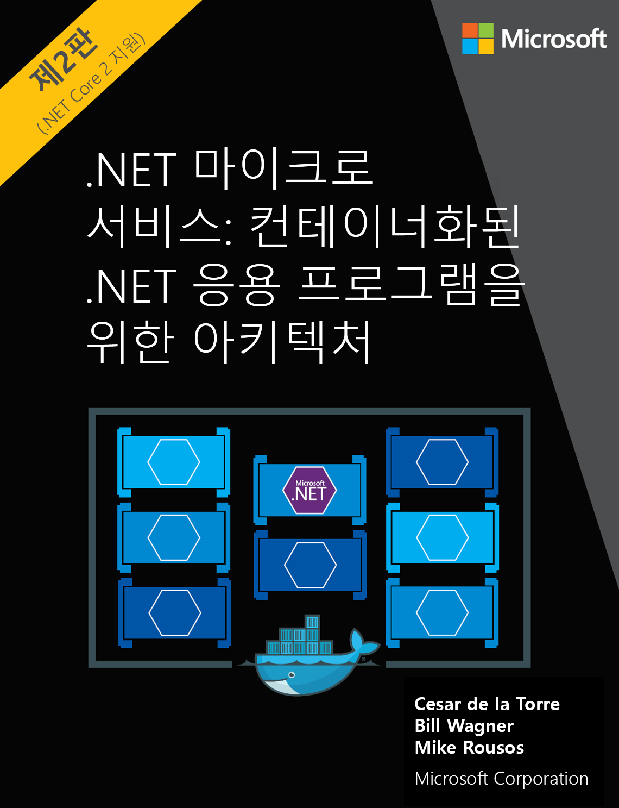

이제 메일용 유통업 서버에 게시 하는 기존 이미지에서 텍스트를 읽는 한다고 가정 합니다. 포함 하는 판촉 스티커 원하는 제품을 검색 하려면 특히 판매 가격입니다. Computer Vision API의 OCR (광학 문자 인식) 기능을 사용해 볼 차례입니다. 

## <a name="calling-the-computer-vision-api-to-extract-printed-text"></a>인쇄 된 텍스트를 추출할 Computer Vision API를 호출 합니다.

`ocr` 작업 이미지에서 텍스트를 감지 하 고 인식 된 문자를 기계에서 사용 가능한 문자 스트림으로 추출 합니다. 요청 URL의 형식은:

`https://[location].api.cognitive.microsoft.com/vision/v2.0/ocr[?language][&detectOrientation ] `

늘 그렇듯이 계정이 만들어진 위치에 대 한 모든 호출 수 있어야 합니다. 두 선택적 매개 변수를 허용 하는 호출 합니다.

- **언어**: 이미지에서 검색할 텍스트의 언어 코드입니다. 기본값은 `unk`, 또는 알 수 없음. 이 서비스 자동 이미지에서 텍스트의 언어를 감지 하는 보겠습니다.
- **detectOrientation**: true 이면 서비스가 이미지 방향을 확인 하 고 추가 처리 전에 해결 하려고, 예를 들어, 여부를 이미지 경우 거꾸로입니다. 

[!INCLUDE [get-key-note](./get-key.md)]

## <a name="extract-printed-text-from-an-image-using-ocr"></a>OCR을 사용 하 여 이미지에서 인쇄 된 텍스트를 추출 합니다.

OCR(광학 인식)에 사용할 이미지는 *.NET Microservices: Architecture for Containerized .NET Applications(.NET 마이크로 서비스: 컨테이너화된 .NET 응용 프로그램용 아키텍처)* 이라는 책의 표지입니다.



1. Azure Cloud Shell에서 다음 명령을 실행 합니다.

```azurecli
curl "https://westus2.api.cognitive.microsoft.com/vision/v2.0/ocr" \
-H "Ocp-Apim-Subscription-Key: $key" \
-H "Content-Type: application/json"  \
-d "{'url' : 'https://raw.githubusercontent.com/MicrosoftDocs/mslearn-process-images-with-the-computer-vision-service/master/images/ebook.png'}" \
 | jq '.'
```

다음 JSON은이 호출에서 얻게 응답의 예입니다. 몇 줄의 JSON 코드 조각 페이지에 더 적합 하도록 제거 되었습니다.

```json
{
  "language": "en",
  "orientation": "Up",
  "textAngle": 0,
  "regions" : [
        /*... snipped*/
        {
          "boundingBox": "766,1419,302,33",
          "words": [
            {
              "boundingBox": "766,1419,126,25",
              "text": "Microsoft"
            },
            {
              "boundingBox": "903,1420,165,32",
              "text": "Corporation"
            }
          ]
        }]
}
```

이 응답을 자세히 살펴보겠습니다. 

- 서비스에 대 한 텍스트를 영어를 식별 합니다. 값을 `language` 필드 이미지에서 검색 된 텍스트의 BCP-47 언어 코드를 포함 합니다. 이 예제 **en**, 또는 영어입니다. 
- 합니다 `orientation` 것으로 감지 **위로**합니다. 이 속성은 방향으로 검색 된 텍스트 각도 따라 중심 이미지 회전 된 후 인식된 된 텍스트의 맨 위에 연결 됩니다. 
- `textAngle` 각도으로 텍스트를 가로 또는 세로 회전 해야 합니다. 이 예제에서는 텍스트를 완벽 하 게 가로 반환 된 값 이므로 **0**합니다.  
- `regions` 속성 텍스트가 있는 위치에 그림을 표시 하는 데 사용 되는 값 및 이미지의 해당 부분에서 찾은 단어의 목록을 포함 합니다. 
- 네 개의 정수는 `boundingBox` 값: 
    - 왼쪽된 가장자리의 x 좌표 
    - 위쪽 가장자리의 y 좌표
    - 경계 상자의 너비
    - 경계 상자의 높이 
   
    모든 부분 이미지에 있는 텍스트 상자에 그릴 이러한 값을 사용할 수 있습니다.

이 연습에서는 알 수 있듯이 `ocr` 서비스는 이미지에서 인쇄 되는 텍스트에 대 한 자세한 정보를 제공 합니다. 

에 대 한 자세한 내용은 합니다 `ocr` 작업 참조를 [OCR](https://westus.dev.cognitive.microsoft.com/docs/services/5adf991815e1060e6355ad44/operations/56f91f2e778daf14a499e1fc) 설명서를 참조 합니다.