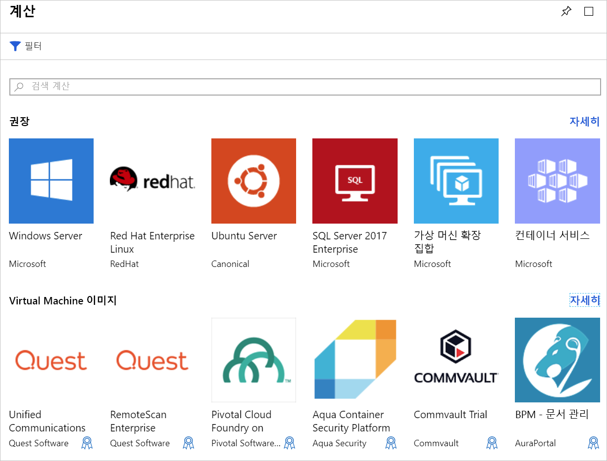

로컬 Ubuntu Linux 서버에서 실행 중인 기존 웹 사이트가 있습니다. 우리의 목표는 최신 Ubuntu 이미지를 사용 하 여 Azure 가상 머신 (VM) 만들기를 다음 사이트를 클라우드로 마이그레이션 하는 것입니다. 이 단위에 Azure에서 가상 컴퓨터를 만들 때 평가 해야 하는 옵션에 대 한 배우게 됩니다.

## Azure Virtual Machines 소개

Azure Virtual Machines를 주문형으로 확장 가능한 클라우드 컴퓨팅 리소스는 합니다. 프로세서, 메모리, 저장소 및 네트워킹 리소스 포함 됩니다. 시작 하 고 및 가상 컴퓨터를 중지 하 고, Azure portal에서 또는 Azure CLI를 사용 하 여 관리할 수 있습니다. 또한 실행 중인 VM에 직접 연결 하 고 로컬 컴퓨터에서 것 처럼 명령을 실행 하는 원격 SSH (보안 셸)를 사용할 수 있습니다.

### Azure에서 Linux 실행

Azure에서는 Linux 기반 VM을 쉽게 만들 수 있습니다. Microsoft는 유수의 Linux 공급 업체와 협력하여 해당사의 배포판이 Azure 플랫폼에 대해 최적화될 수 있도록 하고 있습니다. Ubuntu, SUSE, Red Hat 등의 인기 있는 Linux 배포의 다양 한 미리 빌드된 이미지에서 가상 컴퓨터를 만들 수도 있고 고유한 Linux 배포판은 클라우드에서 실행을 빌드할 수 있습니다.

## Azure VM 만들기

정의 하 고 여러 가지 방법으로 Azure에 배포 된 Vm: Azure portal, (Azure CLI 또는 Azure PowerShell 사용), 스크립트 또는 Azure Resource Manager 템플릿을입니다. 모든 경우에는 몇 가지 곧 다룰는 정보를 제공 해야 합니다.

또한 Azure Marketplace OS 및 특정 시나리오에 대 한 설치 즐겨 찾는 소프트웨어 도구를 포함 하는 미리 구성 된 이미지를 제공 합니다.

## Linux VM에서 사용되는 리소스

Azure에서 Linux VM을 만드는 경우 VM을 호스팅할 리소스도 만듭니다. 이러한 리소스는 함께 작동하여 컴퓨터를 가상화하고 Linux 운영 체제를 실행합니다. 이러한 존재 해야 합니다 (및 VM 만드는 중에 선택) 또는 VM을 사용 하 여 생성 됩니다.

- CPU 및 메모리 리소스를 제공하는 가상 머신
- 가상 하드 디스크를 보관하는 Azure Storage 계정
- OS, 응용 프로그램 및 데이터를 보관하는 가상 디스크
- VM을 다른 Azure 서비스 또는 자체 온-프레미스 하드웨어에 연결하는 VNet(가상 네트워크)
- VNet과 통신하는 네트워크 인터페이스
- VM에 액세스할 수 있도록 하는 선택적인 공용 IP 주소

다른 Azure 서비스와 마찬가지로 VM이 포함되는 **리소스 그룹**이 필요합니다(필요한 경우 관리를 위해 이러한 리소스를 그룹화함). 새 VM을 만드는 경우 기존 리소스 그룹을 사용하거나 리소스 그룹을 새로 만들 수 있습니다.

## VM 이미지 선택

이미지 선택은 VM을 만들 때 처음 내리는 가장 중요한 결정 중 하나입니다. 이미지는 VM을 만드는 데 사용되는 템플릿입니다. 이러한 템플릿에는 OS가 포함되어 있으며, 개발 도구 또는 웹 호스팅 환경과 같은 기타 소프트웨어가 포함된 경우도 많습니다.

컴퓨터에서 설치할 수 있는 모든 요소가 이미지에 포함될 수 있습니다. Apache HTTP Server에서 웹 앱을 호스트 하는 등 필요한 작업을 정확 하 게 하도록 구성 된 이미지에서 VM을 만들 수 있습니다.

> [!TIP]
> 또한 만들 하 고 사용자 지정 디스크 이미지를 업로드할 수 있습니다.

## VM 크기 지정

물리적 머신과 마찬가지로 가상 머신에는 일정한 양의 메모리와 CPU 처리 능력이 있습니다. Azure는 크기와 가격이 다양한 여러 VM을 제공합니다. 선택 하는 크기는 VM의 처리 능력, 메모리 및 최대 저장소 용량을 결정 합니다.

> [!WARNING]
> VM을 만드는 데 영향을 줄 수 있는 각 구독에 대한 할당량 한도가 있습니다. 기본적으로 한 지역 내의 모든 VM에서 20개를 초과하는 가상 _코어_를 사용할 수 없습니다. 지역 간에 VM을 분할하거나 [온라인 요청](https://docs.microsoft.com/azure/azure-supportability/resource-manager-core-quotas-request)을 제출하여 한도를 늘릴 수 있습니다.

VM 크기는 기본 테스트를 위한 B 시리즈부터 시작하여 대규모 컴퓨팅 작업을 위한 H 시리즈까지의 범주로 그룹화됩니다. 수행하려는 워크로드에 따라 VM의 크기를 선택해야 합니다. 이 만들어진 후 VM를 먼저 중지 해야 VM의 크기를 변경 하는 것이 가능 합니다. 따라서 크기 조정 하 고 적절 하 게부터 가능한 경우는 것이 좋습니다.

#### 다음은 대상으로 하는 시나리오에 따라 몇 가지 지침

| 수행하는 작업 | 다음 크기를 고려합니다.
|-------|------------------|
| **범용 컴퓨팅/웹**: 테스트 및 개발, 중소 규모 데이터베이스 또는 트래픽이 적거나 중간 정도인 웹 서버입니다. | B, Dsv3, Dv3, DSv2, Dv2 |
| **과도 한 계산 작업**: 트래픽이 적거나 중간 정도인 웹 서버, 네트워크 어플라이언스, 일괄 처리 프로세스 및 응용 프로그램 서버. | Fsv2, Fs, F |
| **메모리 사용량이**: 관계형 데이터베이스 서버, 중대형 캐시 및 메모리 내 분석입니다. | Esv3, Ev3, M, GS, G, DSv2, Dv2 |
| **데이터 저장소 및 처리**: 해당 필요 높은 디스크 처리량 및 I/O 빅 데이터, SQL 및 NoSQL 데이터베이스입니다. | Ls |
| **고급 그래픽 렌더링** 또는 비디오 편집 및 심층 학습을 통한 모델 ND(학습 및 추론) | NV, NC, NCv2, NCv3, ND |
| **고성능 컴퓨팅 (HPC)**: 워크 선택적 처리량이 높은 네트워크 인터페이스를 사용 하 여 빠르고 강력한 CPU 가상 컴퓨터를 해야 합니다. | H |

## 저장소 옵션 선택

저장소를 중심으로 이어지는 결정 합니다. 먼저 디스크 기술을 선택할 수 있습니다. 기존의 플래터 기반 HDD(하드 디스크 드라이브) 또는 최신 SSD(반도체 드라이브)를 선택할 수 있습니다. 구매한 하드웨어와 마찬가지로 SSD 저장소의 경우 더 많은 비용을 들이지만 더 나은 성능을 제공합니다.

> [!TIP]
> 사용 가능한 SSD 저장소에는 표준 및 프리미엄이라는 두 가지 수준이 있습니다. 워크로드는 정상이지만 더 나은 성능을 원하는 경우 표준 SSD 디스크를 선택합니다. 데이터를 매우 빠르게 처리해야 하는 I/O 집약적인 워크로드 또는 중요 업무용 시스템이 있는 경우 프리미엄 SSD 디스크를 선택합니다.

### 저장소를 디스크에 매핑

Azure는 가상 하드 디스크 (Vhd)를 사용 하 여 VM에 대 한 실제 디스크를 나타냅니다. VHD는 디스크 드라이브의 논리 형식과 데이터를 복제하지만 Azure Storage 계정에 페이지 Blob으로 저장됩니다. 선택할 수 있습니다 디스크 당 저장소의 입력 (SSD 또는 HDD)를 사용 해야 합니다. 이렇게 하면 수행할 I/O에 따라 각 디스크의 성능을 제어할 수 있습니다.

Linux VM에 대해 기본적으로 다음 두 개의 VHD(가상 하드 디스크)가 만들어집니다.

1. 합니다 **운영 체제 디스크**: 이것은 기본 드라이브에 있고 2,048GB의 최대 용량입니다. 기본적으로 `/dev/sda`라는 레이블이 지정됩니다.

1. A **임시 디스크**:이 OS 또는 모든 앱에 대 한 임시 저장소를 제공 합니다. Linux Virtual Machines에서 디스크는 일반적으로 `/dev/sdb`이며, Azure Linux 에이전트에 의해 `/mnt`로 포맷되고 탑재됩니다. VM 크기에 기반하여 크기가 지정되며 스왑 파일을 저장하는 데 사용됩니다.

> [!WARNING]
> 임시 디스크는 영구적이지 않습니다. 이 디스크에는 시스템에 중요하지 않은 데이터만 기록해야 합니다.

#### 데이터의 경우는 어떨까요?

OS와 함께 기본 드라이브에 데이터를 저장할 수 있지만, 더 나은 방법은 전용 _데이터 디스크_를 만드는 것입니다. 추가 디스크를 만들고 VM에 연결할 수 있습니다. 각 디스크에는 최대 4,095GB의 데이터를 저장할 수 있으며, 선택한 VM 크기에 따라 최대 저장 용량이 결정됩니다.

> [!NOTE]
> 흥미로운 기능은 실제 디스크에서 VHD 이미지를 만드는 것입니다. 이렇게 하면 쉽게 마이그레이션할 수 있습니다 _기존_ 클라우드로 온-프레미스 컴퓨터에서 정보입니다.

### 비관리 디스크와 관리 디스크 비교

최종적으로, 저장소에서 **관리되지 않는** 디스크 또는 **관리** 디스크를 사용할지 여부를 선택합니다.

관리되지 않는 디스크의 경우 VM 디스크에 해당하는 VHD를 유지하는 데 사용되는 저장소 계정을 사용자가 관리해야 합니다. 사용하는 공간에 대한 저장소 계정 요금을 사용자가 지불해야 합니다. 단일 저장소 계정의 고정 속도 제한은 20,000 I/O 작업 수/초입니다. 즉 하나의 저장소 계정이 전체 제한에서 40개의 표준 가상 하드 디스크를 지원할 수 있습니다. 규모를 확장해야 하는 경우에는 저장소 계정이 둘 이상 필요하기 때문에 복잡해질 수 있습니다.

관리 디스크는 권장되는 최신 디스크 저장소 모델입니다. 저장소 계정을 관리하는 부담이 Azure에서 해결되기 때문에 복잡한 업무가 원활하게 해결됩니다. 디스크 유형 (프리미엄 또는 표준) 및 디스크의 크기를 지정 하 고 Azure에서 만들고 관리 디스크를 모두 _및_ 저장소를 사용 합니다. 저장소 계정 제한에 대해 걱정할 필요가 없으므로 규모 확장이 쉬워집니다. 또한 여러 가지 다른 이점도 제공됩니다.

- **신뢰성 향상**: Azure에서는 높은 안정성 Vm과 연결 된 Vhd는 비슷한 수준의 복원 력 제공 하는 Azure Storage의 다른 부분에 배치 됩니다.
- **보안 강화**: 관리 디스크는 리소스 그룹에서 실제 관리되는 리소스입니다. 즉 역할 기반 액세스 제어를 사용하여 VHD 데이터로 작업할 수 있는 사용자를 제한할 수 있습니다.
- **스냅숏 지원**: 스냅숏을 사용하여 VHD의 읽기 전용 복사본을 만들 수 있습니다. 소유 VM을 종료 해야 하지만 몇 초 소요 스냅숏 만들기. 완료 되 면 VM 전원을 켜고는 스냅숏을 사용 하 여 프로덕션 문제를 해결 하거나 VM으로 롤백할 시점 스냅숏을 만든 시점의 중복 된 VM을 만들 수 있습니다.
- **지원 백업**: Managed disks 백업할 수 있습니다 자동으로 Azure Backup을 사용 하 여 재해 복구를 위해 서로 다른 지역에 VM의 서비스에 영향을 주지 않고 합니다.

## 네트워크 통신

가상 머신은 VNet(가상 네트워크)을 사용하여 외부 리소스와 통신합니다. VNet은 리소스가 통신하는 단일 지역의 사설 네트워크를 나타냅니다. 가상 네트워크는 온-프레미스에서 관리하는 네트워크와 같습니다. 가상 네트워크를 서브넷으로 분할하여 리소스를 격리시키고, 다른 네트워크(온-프레미스 네트워크 포함)에 연결하고, 인바운드 및 아웃바운드 연결을 제어하는 트래픽 규칙을 적용할 수 있습니다.

### 네트워크 계획

새 VM을 만들 때 새 가상 네트워크를 만들거나 해당 지역의 기존 VNet을 사용할 수 있습니다.

Azure에서 VM과 함께 네트워크가 생성되도록 하는 것이 간단하지만 대부분의 시나리오에 적합하지 않을 수 있습니다. 네트워크 요구 사항을 계획 하는 것이 좋습니다 _인덱싱한_ 아키텍처의 모든 구성 요소에 대 한 VNet 구조를 개별적으로 만듭니다. 그런 다음 Vm을 만들 및 이미 만든 Vnet에 배치 합니다. 이 모듈의 뒷부분에서 가상 네트워크를 더 자세히 알아보겠습니다.

가상 머신을 만들기 전에 VM을 어떻게 관리할지 결정해야 합니다. 이제 옵션을 살펴보겠습니다.