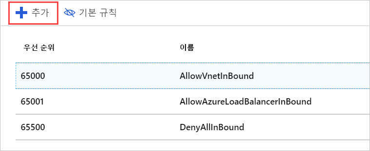
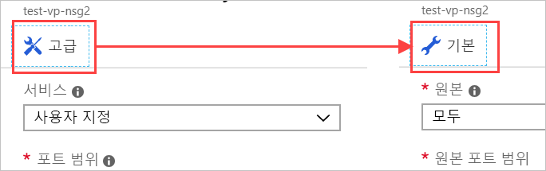

서버를 통해 HTTP 트래픽을 있도록 되도록이 네트워크에 네트워크 보안 그룹을 적용 해 보겠습니다.

## 네트워크 보안 그룹 만들기

SSH 액세스가 필요하다고 지정했으니, Azure에서 보안 그룹이 생성되었을 것입니다. 하지만 전체 프로세스를 진행할 수 있도록 새 보안 그룹을 만들어 보겠습니다. 이 작업은 VM에 _앞서_ 가상 네트워크를 만들려는 경우 특히 중요합니다. 앞서 설명한 것처럼, 보안 그룹은 _선택 사항_이며 반드시 네트워크를 통해 만들어야 하는 것은 아닙니다.

1. 에 [Azure portal](https://portal.azure.com?azure-portal=true), 클릭 합니다 **리소스 만들기** 새 리소스 만들기를 시작 하려면 왼쪽 모퉁이 세로 막대의 단추.

1. 형식 **네트워크 보안 그룹** 필터 상자에 목록에서 일치 하는 항목을 선택 합니다.

1. **Resource Manager** 배포 모델이 선택되었는지 확인하고 **만들기**를 클릭합니다.

1. 보안 그룹에 대한 **이름**을 입력합니다. 마찬가지로 명명 규칙은 여기는 것이 좋습니다. 사용 하 여 보겠습니다 **테스트 웹-eus nsg1** 에 대 한 **테스트 웹 네트워크 보안 그룹의에서 1 번 미국 동부**합니다. 가능성이 위치에 대 한 부분 보안 그룹을 배치 하는 위치를 반영 하도록 이름 변경 합니다.

1. 적절한 **구독**을 선택하고 기존 **리소스 그룹**을 사용합니다.

1. 마지막으로, 동일한에 넣습니다 **위치** VM과 / 가상 네트워크. 이 작업이 중요한 것은 이 리소스가 다른 위치에 있는 경우 적용할 수 없기 때문입니다.

1. **만들기**를 클릭하여 그룹을 만듭니다.

## 네트워크 보안 그룹에 새 인바운드 규칙 추가

배포를 신속하게 완료해야 합니다. 완료 되 면 보안 그룹을 대상으로 새 규칙을 추가할 수 있습니다.

1. 새 보안 그룹 리소스를 찾고 Azure Portal에서 선택합니다.

1. 개요 페이지에서 네트워크를 잠글 수 있도록 만든 몇 가지 기본 규칙을 찾을 수 있습니다.

    인바운드 쪽:

    - 하나의 VNet에서 다른 VNet으로 들어오는 모든 트래픽이 허용됩니다. 이렇게 하면 VNet의 리소스가 서로 통신할 수 있습니다.
    - Azure Load Balancer **프로브** 유지 되는 VM을 확인 하는 요청입니다.
    - 그 외의 인바운드 트래픽은 거부됩니다.  

    아웃바운드 측:  
    - VNet에서 모든 네트워크 내 트래픽이 허용됩니다.
    - 모든 아웃 바운드 인터넷 트래픽이 허용 됩니다.
    - 그 외의 아웃바운드 트래픽은 거부됩니다.

    > [!NOTE]  
    > 즉, 계산 가져오기는 이러한 기본 규칙 우선 순위가 높은 값으로 설정 됩니다 _마지막_합니다. 변경하거나 삭제할 수는 없지만 트래픽이 우선 순위가 낮은 값과 일치하도록 구체적인 규칙을 더 만들어서 _재정의_할 수 있습니다.

1. 보안 그룹에 대한 **설정** 패널에서 **인바운드 보안 규칙** 섹션을 클릭합니다.

1. **+ 추가**를 클릭하여 새 보안 규칙을 추가합니다.

    

    보안 규칙에 필요한 정보를 입력하는 방법에는 기본 및 고급 두 가지가 있습니다. 맨 위에 있는 단추를 클릭 하 여 레이아웃 간에 전환할 수 있습니다 합니다 **추가** 패널입니다.

    

    고급 모드 규칙을 완전히 사용자 지정 하는 기능을 제공 합니다. 그러나 알려진된 프로토콜을 구성 해야 할 경우 기본 모드는 사용 하기 쉽습니다.

1. 기본 모드로 전환 합니다.

1. 이 HTTP 규칙에 대 한 정보를 추가 합니다.

    - **서비스**를 HTTP로 설정합니다. 그러면 포트 범위가 자동으로 설정됩니다.
    - 설정 된 **우선 순위** 하 **1000**합니다. 이 값은 기본 **거부** 규칙보다 작은 숫자여야 합니다. 모든 값의 범위를 시작할 수 있지만 부여 하는 일부 공간 경우 예외를 나중에 작성 해야 하는 것이 좋습니다.
    - 규칙을 이름을 지정 합니다. 사용 하 여 **-http-트래픽 허용**합니다.
    - 규칙에 설명을 지정합니다.

1. **고급** 모드로 다시 전환합니다. 설정이 계속 표시됩니다. 이 패널을 사용하여 보다 세분화된 설정을 만들 수 있습니다. 특히 **원본**을 특정 IP 주소 또는 카메라 관련 IP 주소 범위로 제한할 수 있습니다. 로컬 컴퓨터의 현재 IP 주소를 아는 경우에는 시도해 볼 수 있습니다. 그렇지 않으면으로 설정을 그대로 둡니다 **모든**이므로 규칙을 테스트할 수 있습니다.

1. **추가**를 클릭하여 규칙을 만듭니다. 그러면 인바운드 규칙 목록이 업데이트되고 우선 순위가 결정됩니다. 이것은 규칙이 어떻게 검사될지를 나타냅니다.

## 보안 그룹 적용

단일 VM을 보호 하는 네트워크 인터페이스 또는 서브넷은 해당 서브넷의 모든 리소스에 적용 되는 위치에 보안 그룹을 적용할 수 것을 기억 하십시오. 후자 경향이 가장 일반적인 해 서 작업을 수행 합니다. Virtual network 리소스 중 하나를 통해 Azure에서이 리소스를 가져올 수 있습니다 또는 직접 VM을 통해 사용 하는 하지 가상 네트워크.

1. 가상 머신에 대한 **개요** 패널로 전환합니다. VM은 **모든 리소스** 아래에 있습니다.

1. **설정** 섹션에서 **네트워킹** 항목을 선택합니다.

1. 네트워킹 속성에서 VM에 적용 된 네트워킹에 대 한 정보를 찾을 수 있습니다 포함 된 **가상 네트워크/서브넷**합니다. 이것은 리소스로 이동되는 클릭 가능한 링크입니다. 이 링크를 클릭하여 가상 네트워크를 엽니다. 이 링크는 VM의 **개요** 패널_에서도_ 사용할 수 있습니다. 두 가지 링크 중 하나를 클릭하면 가상 네트워크의 **개요**가 열립니다.

1. **설정** 섹션에서 **서브넷** 항목을 선택합니다.

1. 앞에서 VM + 네트워크를 만들었을 때 단일 서브넷(기본값)이 정의되어 있습니다. 목록에서 해당 항목을 클릭하여 세부 정보를 엽니다.

1. **네트워크 보안 그룹** 항목을 클릭합니다.

1. 새 보안 그룹인 **test-web-eus-nsg1**을 선택합니다. VM으로 만든 다른 그룹도 여기에 있습니다.

1. **저장**을 클릭하여 변경 내용을 저장합니다. 네트워크에 적용하는 데 1분이 소요됩니다.

## 규칙 확인

변경 내용을 확인해 보겠습니다.

1. 가상 머신의 **개요** 패널로 다시 전환합니다. VM은 **모든 리소스** 아래에 있습니다.

1. **설정** 섹션에서 **네트워킹** 항목을 선택합니다.

1. 네트워크 인터페이스 정보에는 대 한 링크 **효과적인 보안 규칙** 는 신속 하 게 보여주는 평가할 규칙 방법을 합니다. 링크를 클릭하여 분석을 열고 새 규칙이 표시되는지 확인합니다.

    

1. 물론, 규칙이 모두 작동하는지 검사하는 가장 좋은 방법은 서버에 HTTP 요청을 보내는 것입니다. 이제 작동 해야 합니다.

    

## 추가 사항

제대로 이해하기 까다로운 보안 규칙이 있습니다. 이 보안 그룹을 새로 적용하면서 실수가 있어서 SSH에 액세스할 수 없게 되었습니다. 이 문제를 해결하려면 보안 그룹에 SSH 액세스를 지원하는 다른 규칙을 추가하면 됩니다. 규칙에 대한 인바운드 TCP/IP 주소를 소유하는 주소로 제한해야 합니다.

> [!WARNING]  
> 관리 액세스에 사용되는 포트는 항상 잠가야 합니다. 더 나은 방법은 개인 네트워크에 가상 네트워크를 연결하고 해당 주소 범위의 RDP 또는 SSH 요청만 허용하도록 VPN을 만드는 것입니다. SSH에 사용되는 포트를 기본값 이외의 포트로 변경할 수도 있습니다. 포트 변경 공격을 중지 하는 데 충분 하지 임을 염두에 두어야 합니다. 이 단순히 조금 어렵게 만드는 검색할 합니다.