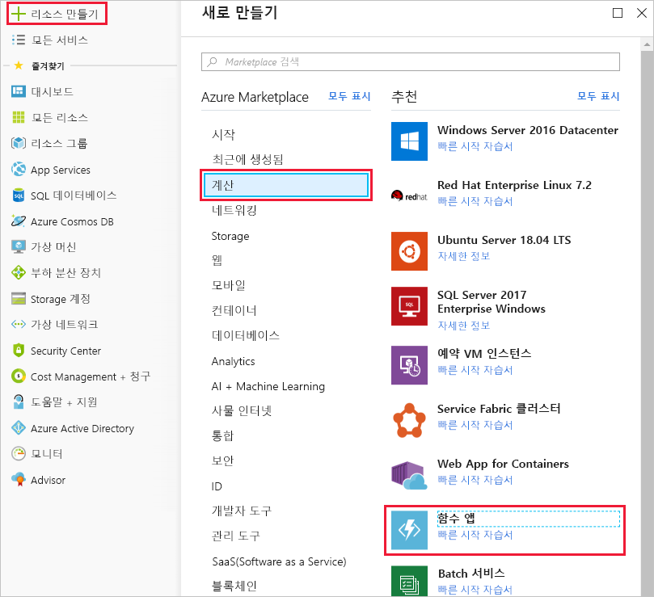
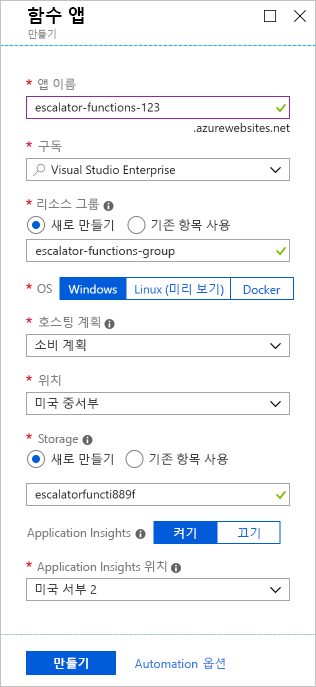

이제 온도 서비스 구현을 시작할 준비가 되었습니다.You are now ready to start implementing the temperature service. 이전 단원에서 요구 사항에 서버리스 솔루션이 가장 적절한지 판단했습니다.In the previous unit, you determined that a serverless solution would best fit your needs. 먼저 Azure 함수를 보관할 함수 앱을 만들어 보겠습니다.Let's start by creating a function app to hold our Azure Function.

[!include]

## 함수 앱이란?What is a function app?

함수는 **함수 앱**이라는 실행 컨텍스트에서 호스트됩니다.Functions are hosted in an execution context called a **function app**. 함수 앱을 정의하여 Azure에서 함수 및 계산 리소스를 논리적으로 그룹화하고 구조화합니다.You define function apps to logically group and structure your functions and a compute resource in Azure. 엘리베이터 예에서, 에스컬레이터 드라이브 기어 온도 서비스를 호스트하는 함수 앱을 만듭니다.In our elevator example, you would create a function app to host the escalator drive gear temperature service. 함수 앱을 만들려면 몇 가지 결정해야 할 일이 있습니다. 서비스 계획을 선택하고, 호환되는 저장소 계정을 선택해야 합니다.There are a few decisions that need to be made to create the function app; you need to choose a service plan and select a compatible storage account.

### 서비스 계획 선택Choosing a service plan

함수 앱은 두 가지 유형의 서비스 계획 중 하나를 사용할 수 있습니다.Function apps may use one of two types of service plans. 첫 번째 서비스 계획은 **소비 서비스 계획**으로,The first service plan is the **Consumption service plan**. Azure 서버리스 응용 프로그램 플랫폼을 사용할 때 선택하는 플랜입니다.This is the plan that you choose when using the Azure serverless application platform. 소비 서비스 계획은 자동 크기 조정을 제공하며 함수를 실행할 때 비용이 청구됩니다.The Consumption service plan provides automatic scaling and bills you when your functions are running. 소비 플랜에서는 함수 실행에 대해 구성 가능한 제한 시간이 제공됩니다.The Consumption plan comes with a configurable timeout period for the execution of a function. 기본적으로 5분이지만 시간 제한을 최대 10분까지 구성할 수 있습니다.By default, it is 5 minutes, but may be configured to have a timeout as long as 10 minutes.

두 번째 계획은 **Azure App Service 계획**이라고 하며,The second plan is called the **Azure App Service plan**. 이 계획을 통해 정의한 VM에서 함수를 계속 실행하여 시간 제한 기간을 방지할 수 있습니다.This plan allows you to avoid timeout periods by having your function run continuously on a VM that you define. App Service 계획을 사용하는 경우 함수가 실행되는 앱 리소스를 관리해야 하므로 이는 기술적으로 서버리스 계획이 아닙니다.When using an App Service plan, you are responsible for managing the app resources the function runs on, so this is technically not a serverless plan. 그러나 함수가 지속적으로 사용되는 경우 또는 함수에 소비 계획이 제공할 수 있는 것보다 많은 처리 능력 또는 실행 시간이 필요한 경우에는 더 나은 선택일 수 있습니다.However, it may be a better choice if your functions are used continuously or if your functions require more processing power or execution time than the Consumption plan can provide.

### 저장소 계정 요구 사항Storage account requirements

함수 앱을 만들 때 저장소 계정에 연결되어 있어야 합니다.When you create a function app, it must be linked to a storage account. 기존 계정을 선택하거나 새 계정을 만들 수 있습니다.You can select an existing account or create a new one. 함수 앱은 함수 실행 로깅 및 실행 트리거 관리 등과 같은 내부 작업을 위해 이 저장소 계정을 사용합니다.The function app uses this storage account for internal operations such as logging function executions and managing execution triggers. 소비 서비스 계획의 경우 함수 코드 및 구성 파일이 이 계정에 저장됩니다.On the Consumption service plan, this is also where the function code and configuration file are stored.

## 함수 앱 만들기Create a function app

Azure Portal에서 함수 앱을 만들어 보겠습니다.Let's create a function app in the Azure portal.

1. 샌드박스를 활성화한 동일한 계정을 사용하여 [Azure Portal](https://portal.azure.com/triplecrownlabs.onmicrosoft.com?azure-portal=true)에 로그인합니다.Sign into the [Azure portal](https://portal.azure.com/triplecrownlabs.onmicrosoft.com?azure-portal=true) using the same account you activated the sandbox with.

1. Azure Portal의 왼쪽 위 모서리에서 **리소스 만들기** 단추를 선택한 후 **시작 > 서버리스 함수 앱**을 선택하여 함수 앱 *만들기* 블레이드를 엽니다.Select the **Create a resource** button found on the upper left-hand corner of the Azure portal, and then select **Get started > Serverless Function App** to open the Function App *Create* blade. 또는 **계산 > 함수 앱** 옵션을 사용하여 같은 블레이드를 열 수 있습니다.Alternatively, you can use the **Compute > Function App** option, which will open the same blade.

  

1. 전역으로 고유한 앱 이름을 선택합니다.Choose a globally unique app name. 서비스의 기준 URL 역할을 합니다.This will serve as the base URL of your service. 예를 들어 **escalator-functions-xxxxxxx**로 이름을 지정할 수 있습니다. 여기서 xxxxxxx는 이니셜 및 출생 연도로 바꿀 수 있습니다.For example, you can name it **escalator-functions-xxxxxxx**, where the x's can be replaced with your initials and your birth year. 이 값이 전역적으로 고유하지 않은 경우 다른 조합을 사용해 볼 수 있습니다.If this isn't globally unique, you can try any other combination. 유효한 문자는 a-z, 0-9 및 -입니다.Valid characters are a-z, 0-9 and -.

1. 함수 앱을 호스트할 Azure 구독을 선택합니다.Select the Azure subscription where you would like the function app hosted.

1. "**<rgn>[샌드박스 리소스 그룹 이름]</rgn>**"이라는 기존 리소스 그룹을 선택합니다.Select the existing resource group called "**<rgn>[Sandbox resource group name]</rgn>**".

1. OS로 **Windows**를 선택합니다.Select **Windows** for OS.

1. **호스팅 계획**의 경우 서버리스 호스팅 옵션인 **소비 계획**을 선택합니다.For **Hosting Plan**, select **Consumption Plan**, which is the serverless hosting option.

1. 아래 목록에서 자신과 가장 가까운 위치를 선택합니다.Select the geographical location closest to you from the list below. 프로덕션 시스템에서 고객 또는 함수 고객과 가까운 위치를 선택합니다.In a production system, you would want to select a location near your customers or consumers of the function.

    [!include]

1. 새 저장소 계정을 만듭니다.Create a new storage account. Azure는 앱 이름을 기반으로 이름을 지정합니다.Azure will give it a name based on the app name. 이름은 원하는 경우 변경할 수 있지만 고유해야 합니다.You can change it if you like, but it must also be unique.

1. Azure Application Insights가 **켜져** 있는지 확인하고 자신(또는 고객)과 가장 가까운 지역을 선택합니다.Make sure that Azure Application Insights is **On** and select the region closest to you (or your customers).
  완료한 후 구성이 다음 스크린샷의 구성과 유사해야 합니다.When you're finished, your configuration should look like the config in the following screenshot.

  

1. **만들기**를 선택합니다. 배포에 몇 분 정도 걸립니다.Select **Create**; deployment will take a few minutes. 완료되면 알림이 표시됩니다.You'll receive a notification once it's complete.

## Azure 함수 앱 확인Verify your Azure function app

1. Azure Portal의 왼쪽 메뉴에서 **리소스 그룹**을 선택합니다.From the Azure portal left-hand menu, select **Resource groups**. 사용 가능한 그룹 목록에 **<rgn>[샌드박스 리소스 그룹 이름]</rgn>** 이라는 리소스 그룹이 보일 것입니다.You should then see a resource group named **<rgn>[Sandbox resource group name]</rgn>** in the list of available groups.

  ![리소스 그룹 메뉴 항목 및 <rgn>[샌드박스 리소스 그룹 이름]</rgn> 목록 항목이 강조 표시된 리소스 그룹 블레이드를 보여주는 Azure Portal의 스크린샷입니다.](../media/3-resource-group.png)

1. **<rgn>[샌드박스 리소스 그룹 이름]</rgn>** 이라는 리소스 그룹을 선택합니다.Select the resource group **<rgn>[Sandbox resource group name]</rgn>**. 그러면 다음 목록과 같은 리소스 목록이 표시됩니다.You should then see a resource list like the following list.

  ![App Service 계획, Storage 계정, Application Insights 리소스 및 App Service에 대한 항목을 포함하여 <rgn>[샌드박스 리소스 그룹 이름]</rgn> 그룹에 있는 모든 리소스를 보여 주는 Azure Portal의 스크린샷입니다.](../media/3-resource-list.png)

App Service로 나열된 번개 함수 아이콘이 있는 항목은 새로운 함수 앱입니다.The item with the lightning bolt Function icon, listed as an App Service, is your new function app. 항목을 클릭하면 할당된 공용 URL이 포함된 새 함수에 대한 세부 정보가 열립니다. 브라우저에서 열 경우에는 함수 앱이 실행 중임을 나타내는 기본 웹 페이지가 표시됩니다.You can click on it to open the details about the new function - it has a public URL assigned to it, if you open that in a browser, you should get a default web page that indicates your Function App is running.
