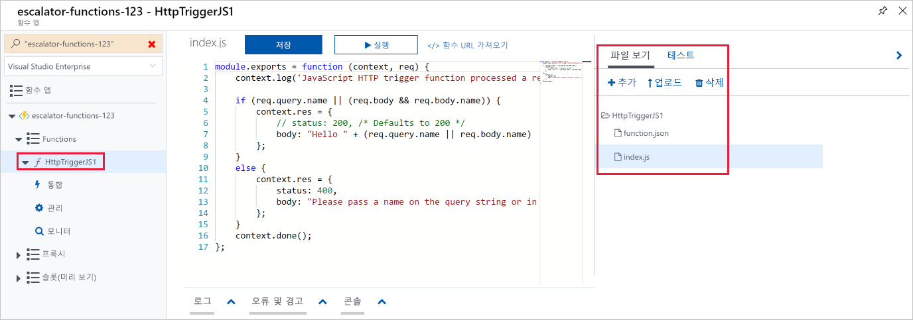
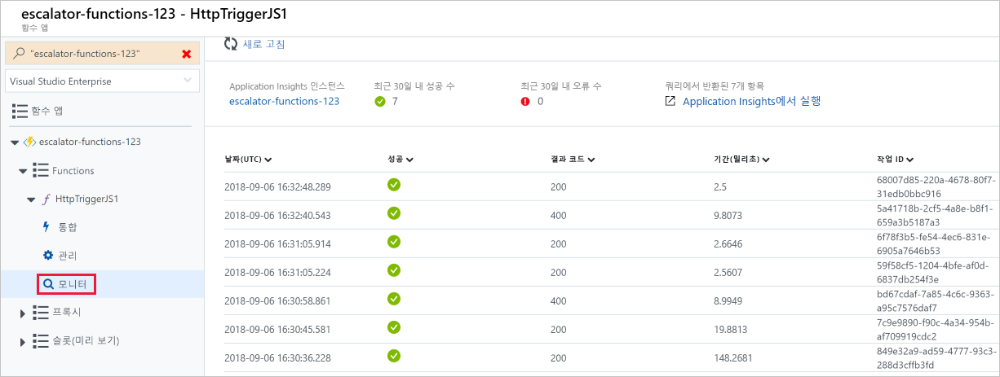

지금까지 함수 앱을 만들었으므로 이제 함수를 빌드, 구성 및 실행하는 방법을 살펴보겠습니다.

### <a name="triggers"></a>트리거

함수는 이벤트로 구동됩니다. 즉, 이벤트에 대한 응답으로 실행됩니다.

함수를 시작하는 이벤트 유형을 **‘트리거’** 라고 합니다. 정확히 하나의 트리거로 함수를 구성해야 합니다.

Azure는 다음 서비스에 대한 트리거를 지원합니다.

| 서비스                 | 트리거 설명  |
|-------------------------|---------|
| Blob Storage            | 새 BLOB 또는 업데이트된 BLOB이 검색될 때 함수를 시작합니다.       |
| Cosmos DB               | 삽입 및 업데이트가 검색될 때 함수를 시작합니다.      |
| Event Grid              | Event Grid에서 이벤트를 수신할 때 함수를 시작합니다.       |
| HTTP                    | HTTP 요청으로 함수를 시작합니다.      |
| Microsoft Graph 이벤트  | Microsoft Graph에서 들어오는 웹후크에 대한 응답으로 함수를 시작합니다. 이 트리거의 각 인스턴스는 한 가지 Microsoft Graph 리소스 종류에 대응할 수 있습니다.       |
| Queue Storage           | 큐에서 새 항목을 수신할 때 함수를 시작합니다. 큐 메시지는 함수에 입력으로 제공됩니다.      |
| Service Bus             | Service Bus 큐의 메시지에 대한 응답으로 함수를 시작합니다.       |
| 타이머                   | 일정에 따라 함수를 시작합니다.       |
| Webhook                | 웹후크 요청으로 함수를 시작합니다.       |

### <a name="bindings"></a>바인딩

바인딩은 데이터와 서비스를 함수에 연결하는 선언적인 방법입니다. 바인딩은 다른 서비스와 통신하는 방법을 알고 있으므로, 데이터 원본에 연결하고 연결을 관리하기 위해 함수에서 코드를 작성할 필요가 없습니다. 플랫폼은 바인딩 코드의 일부로 복잡성을 관리합니다. 각 바인딩에는 방향이 있습니다. 코드는 ‘입력’ 바인딩에서 데이터를 읽고 ‘출력’ 바인딩에 데이터를 씁니다. 각 함수는 함수에 의해 처리된 입력 및 출력 데이터를 관리하기 위해 0개 이상의 바인딩을 포함할 수 있습니다.

트리거는 실행을 시작하는 추가 기능이 있는 특수한 형식의 입력 바인딩입니다.

Azure는 다양한 저장소 및 메시징 서비스에 연결할 [많은 바인딩](https://docs.microsoft.com/azure/azure-functions/functions-triggers-bindings#supported-bindings)을 제공합니다.

### <a name="a-sample-binding-definition"></a>샘플 바인딩 정의

입력 바인딩(트리거)과 출력 바인딩을 사용하여 함수를 구성하는 예를 살펴보겠습니다. Blob Storage의 데이터를 읽고, 함수에서 처리한 다음, 큐에 메시지를 기록하도록 하겠습니다. *Blob* 형식의 _입력 바인딩_과 *queue* 형식의 _출력 바인딩_을 구성합니다.

바인딩은 Azure Portal에서 정의될 수 있으며, 직접 편집할 수도 있는 JSON 파일로 저장됩니다. 다음 JSON은 함수에 대한 트리거 및 바인딩의 샘플 정의입니다.

```json
{
  "bindings": [
    {
      "name": "order",
      "type": "queueTrigger",
      "direction": "in",
      "queueName": "myqueue-items",
      "connection": "MY_STORAGE_ACCT_APP_SETTING"
    },
    {
      "name": "$return",
      "type": "table",
      "direction": "out",
      "tableName": "outTable",
      "connection": "MY_TABLE_STORAGE_ACCT_APP_SETTING"
    }
  ]
}
```

이 예제는 **myqueue-items**라는 큐에 추가되는 메시지에 의해 트리거되는 함수를 보여줍니다. 그런 다음, 함수의 반환 값을 Azure Table Storage의 **outTable** 테이블로 보냅니다. 매우 간단한 예제이며, SendGrid 바인딩을 사용하여 출력을 메일로 변경하거나, 이벤트를 Service Bus에 넣어 아키텍처의 다른 구성 요소에 알리거나, 여러 출력 바인딩을 포함하여 데이터를 다양한 서비스에 푸시할 수 있습니다.

## <a name="creating-a-function-in-the-azure-portal"></a>Azure Portal에서 함수 만들기

Azure는 일반적인 시나리오를 위해 여러 가지 미리 만든 함수 템플릿을 제공합니다.

### <a name="quickstart-templates"></a>빠른 시작 템플릿

첫 번째 함수를 추가할 때 빠른 시작 화면이 표시됩니다. 이 화면에서는 트리거 형식(HTTP, Timer 또는 Data) 및 프로그래밍 언어(C#, JavaScript, F# 또는 Java)를 선택할 수 있습니다. 그런 다음, 선택 사항에 따라 Azure는 로그에 수신된 입력 데이터를 표시하기 위해 제공된 일부 샘플 코드를 사용하여 함수 코드 및 구성을 생성합니다.

### <a name="custom-function-templates"></a>사용자 지정 함수 템플릿

빠른 시작 템플릿을 선택하여 가장 일반적인 시나리오에 쉽게 액세스할 수 있습니다. 그러나 Azure는 시작할 수 있는 30개 이상의 추가 템플릿을 제공합니다. 이러한 템플릿은 후속 함수를 만들 때 템플릿 목록에서 선택하거나 빠른 시작 화면에서 **사용자 지정 함수** 옵션을 사용하여 선택할 수 있습니다.

- C#, F# 또는 JavaScript를 사용한 HTTP 트리거
- C#, F# 또는 JavaScript를 사용한 타이머 트리거
- C#, F# 또는 JavaScript를 사용한 큐 트리거
- C#, F# 또는 JavaScript를 사용한 Service Bus 큐 트리거
- C# 또는 JavaScript를 사용한 Cosmos DB 트리거
- C#, F# 또는 JavaScript를 사용한 IoT Hub(이벤트 허브)
- ...기타 등등

## <a name="navigating-to-your-function-and-files"></a>함수 및 파일 탐색

템플릿에서 함수를 만들면 여러 파일이 생성됩니다. 예를 들어, JavaScript를 사용하는 웹후크 + API 빠른 시작을 사용하도록 선택하는 경우 구성 파일인 **function.json** 및 소스 코드 파일인 **index.js**가 생성됩니다. 함수 앱에서 생성하는 함수는 함수 앱 포털의 **함수** 메뉴 항목 아래에 표시됩니다.

함수 앱에서 함수를 선택하면 다음 스크린샷에 설명된 대로 코드 편집기가 열리고 함수에 대한 코드가 표시됩니다.



이전 스크린샷에서 볼 수 있듯이 오른쪽에 **파일 보기**에 대한 탭을 포함하는 플라이아웃 메뉴가 있습니다. 이 탭을 선택하면 함수를 구성하는 파일 구조가 표시됩니다.

## <a name="testing-your-azure-function"></a>Azure 함수 테스트

함수가 생성되면 이를 테스트하게 됩니다. 수동 실행, Azure Portal 내에서 테스트 등 몇 가지 방법이 있습니다.

### <a name="manual-execution"></a>수동 실행

구성된 트리거를 수동으로 트리거하여 함수를 시작할 수 있습니다. 예를 들어 HTTP 트리거를 사용하는 경우 Postman이나 cURL과 같은 도구를 사용하여, HTTP 트리거 정의에서 사용할 수 있는(**함수 URL 가져오기**) 함수 엔드포인트 URL에 대한 HTTP 요청을 시작할 수 있습니다.

### <a name="testing-in-the-azure-portal"></a>Azure Portal에서 테스트

포털은 또한 함수를 테스트하는 편리한 방법을 제공합니다. 코드 창의 오른쪽에는 플라이아웃 탭 방식의 탐색 메뉴가 있습니다. 이 메뉴에 **테스트** 항목이 있습니다. 메뉴를 확장하고 이 탭을 선택하면 함수를 실행하고 결과를 볼 수 있습니다. 이 테스트 창에서 **실행**을 클릭하면 결과가 상태 코드와 함께 출력 창에 표시됩니다.

## <a name="monitoring-dashboard"></a>모니터링 대시보드

함수를 모니터링하는 기능은 개발 과정과 프로덕션에서 매우 중요합니다. Application Insights 통합을 켜면 Azure Portal에서 모니터링 대시보드를 사용할 수 있습니다. 함수 앱 탐색 메뉴에서 함수 노드를 확장하면 **모니터** 메뉴 항목이 표시됩니다. 이 모니터 대시보드는 함수 실행의 기록을 보고 Application Insights에 의해 채워진 타임스탬프, 결과 코드, 기간 및 작업 ID를 표시하는 빠른 방법을 제공합니다.



## <a name="streaming-log-window"></a>스트리밍 로그 창

또한 Azure Portal에서 디버그하도록 함수에 로깅 문을 추가할 수 있습니다. 각 언어에 대한 호출된 메서드는 코드 창의 맨 아래에 있는 탭 플라이아웃 메뉴에 있는 로그 창에 정보를 기록하는 데 사용할 수 있는 “로깅” 개체에 전달됩니다.

다음 JavaScript 코드 조각은 `context.log` 메서드를 사용하여 메시지를 로그하는 방법을 보여 줍니다(`context` 개체가 처리기에 전달됨).

```javascript
  context.log('Enter your logging statement here');
```

`log.Info` 메서드를 사용하여 C#에서 동일한 작업을 수행할 수 있습니다. 이 경우 `log` 개체는 함수를 처리하는 C# 메서드 처리로 전달됩니다.

```csharp
  log.Info("Enter your logging statement here");
```

### <a name="errors-and-warnings-window"></a>오류 및 경고 창

로그 창과 동일한 플라이아웃 메뉴에서 오류 및 경고 창 탭을 찾을 수 있습니다. 이 창에는 코드 내의 컴파일 오류 및 경고가 표시됩니다.
