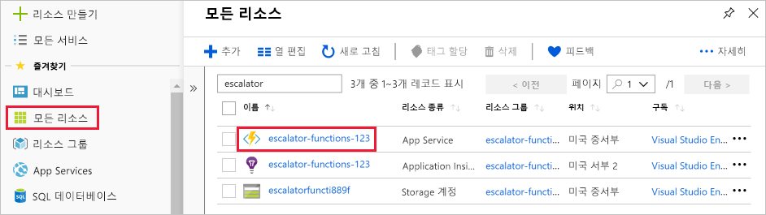
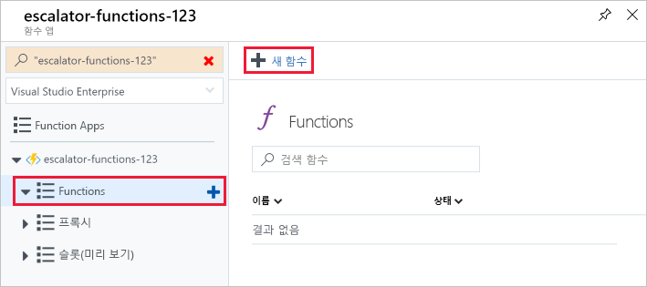
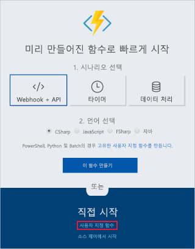
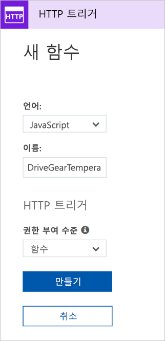
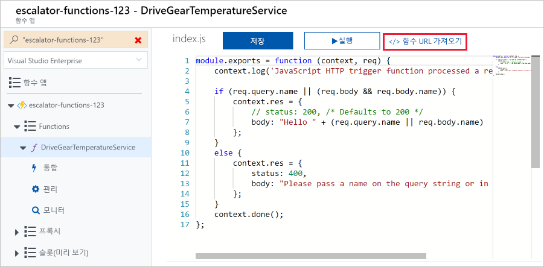
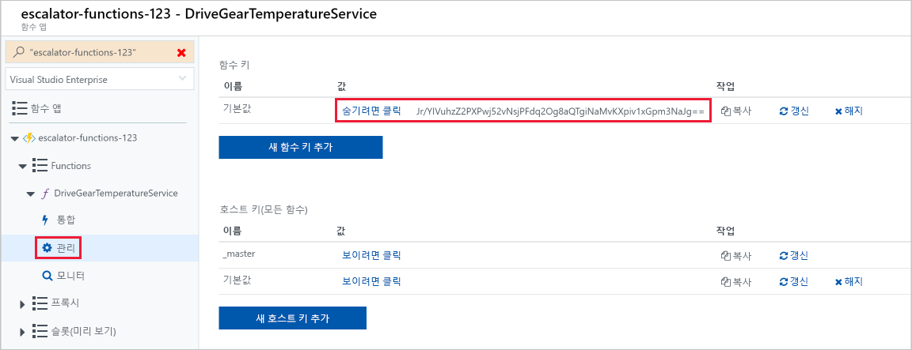
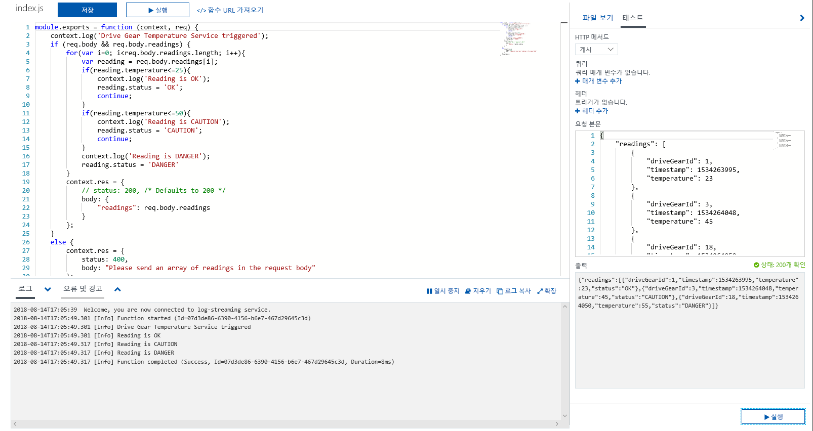
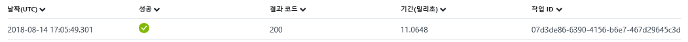

<span data-ttu-id="2d827-101">기어 드라이브 예를 계속 사용하여 온도 서비스의 논리를 추가합니다.</span><span class="sxs-lookup"><span data-stu-id="2d827-101">Let's continue with our gear drive example and add the logic for the temperature service.</span></span> <span data-ttu-id="2d827-102">특히 HTTP 요청에서 데이터를 수신하겠습니다.</span><span class="sxs-lookup"><span data-stu-id="2d827-102">Specifically, we're going to receive data from an HTTP request.</span></span>

## <a name="function-requirements"></a><span data-ttu-id="2d827-103">함수 요구 사항</span><span class="sxs-lookup"><span data-stu-id="2d827-103">Function requirements</span></span>

<span data-ttu-id="2d827-104">먼저 논리에 대한 몇 가지 요구 사항을 정의해야 합니다.</span><span class="sxs-lookup"><span data-stu-id="2d827-104">First, we need to define some requirements for our logic:</span></span>

- <span data-ttu-id="2d827-105">0-25 사이의 온도를 **OK**로 플래그 지정해야 합니다.</span><span class="sxs-lookup"><span data-stu-id="2d827-105">Temperatures between 0-25 should be flagged as **OK**.</span></span>
- <span data-ttu-id="2d827-106">26-50 사이의 온도를 **CAUTION**으로 플래그를 지정해야 합니다.</span><span class="sxs-lookup"><span data-stu-id="2d827-106">Temperatures between 26-50 should be flagged as **CAUTION**.</span></span>
- <span data-ttu-id="2d827-107">50을 넘는 온도를 **DANGER**로 플래그 지정해야 합니다.</span><span class="sxs-lookup"><span data-stu-id="2d827-107">Temperatures above 50 should be flagged as **DANGER**.</span></span>

## <a name="add-a-function-to-our-function-app"></a><span data-ttu-id="2d827-108">함수 앱에 함수 추가</span><span class="sxs-lookup"><span data-stu-id="2d827-108">Add a function to our function app</span></span>

<span data-ttu-id="2d827-109">앞에서 설명한 대로 Azure에서는 함수를 빌드하기 시작하는 데 도움이 되는 템플릿을 제공합니다.</span><span class="sxs-lookup"><span data-stu-id="2d827-109">As we discussed in the preceding unit, Azure provides templates that help you get started building functions.</span></span> <span data-ttu-id="2d827-110">이 단원에서는 `HttpTrigger` 템플릿을 사용하여 온도 서비스를 구현합니다.</span><span class="sxs-lookup"><span data-stu-id="2d827-110">In this unit, we'll use the `HttpTrigger` template to implement the temperature service.</span></span>

1. <span data-ttu-id="2d827-111">Azure 계정을 사용하여 [Azure Portal](https://portal.azure.com?azure-portal=true)에 로그인합니다.</span><span class="sxs-lookup"><span data-stu-id="2d827-111">Sign in to the [Azure portal](https://portal.azure.com?azure-portal=true) using your Azure account.</span></span>

2. <span data-ttu-id="2d827-112">왼쪽 메뉴에서 **모든 리소스**를 선택한 후 **escalator-functions-group**을 선택하여 첫 번째 연습에서 만든 리소스 그룹을 선택합니다.</span><span class="sxs-lookup"><span data-stu-id="2d827-112">Select the resource group you created in the first exercise by choosing **All resources** in the left-hand menu, and then selecting **escalator-functions-group**.</span></span>

3. <span data-ttu-id="2d827-113">그러면 그룹의 리소스가 표시됩니다.</span><span class="sxs-lookup"><span data-stu-id="2d827-113">The resources for the group will then be displayed.</span></span> <span data-ttu-id="2d827-114">**escalator-functions-xxxxxxx** 항목(번개 아이콘으로도 표시됨)을 선택하여 이전 연습에서 만든 함수 앱의 이름을 클릭합니다.</span><span class="sxs-lookup"><span data-stu-id="2d827-114">Click the name of the function app that you created in the previous exercise by selecting the **escalator-functions-xxxxxxx** item (also indicated by the lightning bolt Function icon).</span></span>

  

4. <span data-ttu-id="2d827-116">왼쪽 메뉴에는 함수 앱 이름과 하위 메뉴가 표시되며, 하위 메뉴에는 *함수*, *프록시* 및 *슬롯*이라는 세 항목이 있습니다.</span><span class="sxs-lookup"><span data-stu-id="2d827-116">The left-side menu displays your function app name and a submenu with three items: *Functions*, *Proxies*, and *Slots*.</span></span>  <span data-ttu-id="2d827-117">첫 번째 함수를 만들기 시작하려면 **함수**를 선택하고 결과 페이지의 맨 위에 있는 **새 함수** 단추를 클릭합니다.</span><span class="sxs-lookup"><span data-stu-id="2d827-117">To start creating our first function, select **Functions** and click  the **New function** button at the top of the resulting page.</span></span>

  

5. <span data-ttu-id="2d827-119">다음 스크린샷에 나와 있는 것처럼 빠른 시작 화면에서 **직접 만든 함수로 시작** 섹션에 있는 **사용자 지정 함수** 링크를 선택합니다.</span><span class="sxs-lookup"><span data-stu-id="2d827-119">In the Quickstart screen, select the **Custom function** link in the **Get started on your own** section as shown in the following screenshot.</span></span> <span data-ttu-id="2d827-120">빠른 시작 화면이 표시되지 않으면 페이지의 맨 위에 있는 **빠른 시작으로 이동** 링크를 클릭합니다.</span><span class="sxs-lookup"><span data-stu-id="2d827-120">If you don't see the Quickstart screen, click on the **go to the quickstart** link at the top of the page.</span></span>

  

6. <span data-ttu-id="2d827-122">다음 스크린샷에 나와 있는 것처럼 화면에 표시된 템플릿 목록에서 **HTTP 트리거** 템플릿의 **JavaScript** 구현을 선택합니다.</span><span class="sxs-lookup"><span data-stu-id="2d827-122">From the list of templates displayed on the screen, select the **JavaScript** implementation of the **HTTP trigger** template as shown in the following screenshot.</span></span>

7. <span data-ttu-id="2d827-123">나타나는 **새 함수** 대화 상자의 이름 필드에 **DriveGearTemperatureService**를 입력합니다.</span><span class="sxs-lookup"><span data-stu-id="2d827-123">Enter **DriveGearTemperatureService** in the name field of the **New Function** dialog that appears.</span></span> <span data-ttu-id="2d827-124">권한 부여 수준을 "함수"로 유지하고 **만들기** 단추를 눌러 함수를 만듭니다.</span><span class="sxs-lookup"><span data-stu-id="2d827-124">Leave the Authorization level as "Function" and press the **Create** button to create the function.</span></span>

  

8. <span data-ttu-id="2d827-126">함수 만들기가 완료되면 *index.js* 코드 파일의 내용과 함께 코드 편집기가 열립니다.</span><span class="sxs-lookup"><span data-stu-id="2d827-126">When your function creation completes, the code editor opens with the contents of the *index.js* code file.</span></span> <span data-ttu-id="2d827-127">템플릿이 생성한 기본 코드가 다음 코드 조각에 나열되어 있습니다.</span><span class="sxs-lookup"><span data-stu-id="2d827-127">The default code that the template generated for us is listed in the following snippet.</span></span>

```javascript
module.exports = function (context, req) {
    context.log('JavaScript HTTP trigger function processed a request.');

    if (req.query.name || (req.body && req.body.name)) {
        context.res = {
            // status: 200, /* Defaults to 200 */
            body: "Hello " + (req.query.name || req.body.name)
        };
    }
    else {
        context.res = {
            status: 400,
            body: "Please pass a name on the query string or in the request body"
        };
    }
    context.done();
};
```

<span data-ttu-id="2d827-128">함수는 HTTP 요청 쿼리 문자열을 통해 또는 요청 본문의 일부로 이름이 전달될 것이라고 예상합니다.</span><span class="sxs-lookup"><span data-stu-id="2d827-128">Our function expects a name to be passed in either through the HTTP request query string or as part of the request body.</span></span> <span data-ttu-id="2d827-129">이 함수는 **Hello, {name}** 메시지를 반환하고, 요청에서 보낸 이름을 다시 에코하여 응답합니다.</span><span class="sxs-lookup"><span data-stu-id="2d827-129">The function responds by returning the message  **Hello, {name}**, echoing back the name that was sent in the request.</span></span>

<span data-ttu-id="2d827-130">원본 보기의 오른쪽에 두 개의 탭이 표시됩니다.</span><span class="sxs-lookup"><span data-stu-id="2d827-130">On the right-hand side of the source view, you'll find two tabs.</span></span> <span data-ttu-id="2d827-131">**파일 보기** 탭에는 함수에 대한 코드 및 구성 파일이 나열됩니다.</span><span class="sxs-lookup"><span data-stu-id="2d827-131">The **View files** tab lists the code and config file for your function.</span></span>  <span data-ttu-id="2d827-132">**function.json**을 선택하여 함수의 구성을 보면 다음과 같습니다.</span><span class="sxs-lookup"><span data-stu-id="2d827-132">Select **function.json** to view the configuration of the function, which should look like the following:</span></span>

```javascript
{
    "disabled": false,
    "bindings": [
    {
        "authLevel": "function",
        "type": "httpTrigger",
        "direction": "in",
        "name": "req"
    },
    {
        "type": "http",
        "direction": "out",
        "name": "res"
    }
    ]
}
```

<span data-ttu-id="2d827-133">이 구성은 HTTP 요청을 수신할 때 함수가 실행되도록 선언합니다.</span><span class="sxs-lookup"><span data-stu-id="2d827-133">This configuration declares that the function runs when it receives an HTTP request.</span></span> <span data-ttu-id="2d827-134">출력 바인딩은 응답이 HTTP 응답으로 전송될 것임을 선언합니다.</span><span class="sxs-lookup"><span data-stu-id="2d827-134">The output binding declares that the response will be sent as an HTTP response.</span></span>

## <a name="test-the-function-using-curl"></a><span data-ttu-id="2d827-135">cURL을 사용하여 함수 테스트</span><span class="sxs-lookup"><span data-stu-id="2d827-135">Test the function using cURL</span></span>

> [!TIP]
> <span data-ttu-id="2d827-136">**cURL**은 파일을 주고받는 데 사용할 수 있는 명령줄 도구입니다.</span><span class="sxs-lookup"><span data-stu-id="2d827-136">**cURL** is a command line tool that can be used to send or receive files.</span></span> <span data-ttu-id="2d827-137">Linux, macOS 및 Windows 10에 포함되어 있으며 대부분의 다른 운영 체제에 다운로드할 수 있습니다.</span><span class="sxs-lookup"><span data-stu-id="2d827-137">It's included with Linux, macOS, and Windows 10, and can be downloaded for most other operating systems.</span></span> <span data-ttu-id="2d827-138">cURL은 HTTP, HTTPS, FTP, FTPS, SFTP, LDAP, TELNET, SMTP, POP3 등과 같은 많은 프로토콜을 지원합니다. 자세한 내용은 아래 링크를 참조하세요.</span><span class="sxs-lookup"><span data-stu-id="2d827-138">cURL supports numerous protocols like HTTP, HTTPS, FTP, FTPS, SFTP, LDAP, TELNET, SMTP, POP3, etc. For more information, please refer to the links below:</span></span>
>
>- <https://en.wikipedia.org/wiki/CURL>
>- <https://curl.haxx.se/docs/>

<span data-ttu-id="2d827-139">함수를 테스트하려면 명령줄에서 cURL을 사용하여 함수 URL로 HTTP 요청을 전송할 수 있습니다.</span><span class="sxs-lookup"><span data-stu-id="2d827-139">To test the function, you can send an HTTP request to the function URL using cURL on the command line.</span></span> <span data-ttu-id="2d827-140">함수의 엔드포인트 URL을 찾으려면 다음 스크린샷에 나와 있는 대로 함수 코드로 돌아가서 **함수 URL 가져오기** 링크를 선택합니다.</span><span class="sxs-lookup"><span data-stu-id="2d827-140">To find the endpoint URL of the function, return to your function code and select the **Get function URL** link, as shown in the following screenshot.</span></span> <span data-ttu-id="2d827-141">이 링크를 일시적으로 저장합니다.</span><span class="sxs-lookup"><span data-stu-id="2d827-141">Save this link temporarily.</span></span>

 

### <a name="securing-http-triggers"></a><span data-ttu-id="2d827-143">HTTP 트리거 보호</span><span class="sxs-lookup"><span data-stu-id="2d827-143">Securing HTTP triggers</span></span>

<span data-ttu-id="2d827-144">HTTP 트리거를 사용하면 API 키를 사용하여 각 요청에 대한 키가 필요하도록 설정하여 알 수 없는 호출자를 차단할 수 있습니다.</span><span class="sxs-lookup"><span data-stu-id="2d827-144">HTTP triggers let you use API keys to block unknown callers by requiring the key to be present on each request.</span></span> <span data-ttu-id="2d827-145">함수를 만들 때 _권한 부여 수준_을 선택합니다.</span><span class="sxs-lookup"><span data-stu-id="2d827-145">When you create a function, you select the _authorization level_.</span></span> <span data-ttu-id="2d827-146">기본적으로 함수별 API 키가 필요한 "함수"로 설정되지만, "관리자"로 설정하여 글로벌 "마스터" 키를 사용하거나 "익명"으로 설정하여 키가 필요하지 않도록 지정할 수도 있습니다.</span><span class="sxs-lookup"><span data-stu-id="2d827-146">By default, it's set to "Function", which requires a function-specific API key, but it can also be set to "Admin" to use a global "master" key, or "Anonymous" to indicate that no key is required.</span></span> <span data-ttu-id="2d827-147">생성 후에 함수 속성을 통해 권한 부여 수준을 변경할 수도 있습니다.</span><span class="sxs-lookup"><span data-stu-id="2d827-147">You can also change the authorization level through the function properties after creation.</span></span>

<span data-ttu-id="2d827-148">이 함수를 만들 때 “함수”를 지정했으므로 HTTP 요청을 보낼 때 키를 제공해야 합니다.</span><span class="sxs-lookup"><span data-stu-id="2d827-148">Since we specified "Function" when we created this function, we will need to supply the key when we send the HTTP request.</span></span> <span data-ttu-id="2d827-149">`code`라는 쿼리 문자열 매개 변수로 또는 `x-functions-key`라는 HTTP 헤더(기본 설정)로 보낼 수 있습니다.</span><span class="sxs-lookup"><span data-stu-id="2d827-149">You can send it as a query string parameter named `code`, or as an HTTP header (preferred) named `x-functions-key`.</span></span>

<span data-ttu-id="2d827-150">함수 및 마스터 키는 함수가 확장될 때 **관리** 섹션에 있습니다.</span><span class="sxs-lookup"><span data-stu-id="2d827-150">The function and master keys are found in the **Manage** section when the function is expanded.</span></span> <span data-ttu-id="2d827-151">기본적으로 이러한 키는 숨겨져 있으며 사용자가 표시해야 합니다.</span><span class="sxs-lookup"><span data-stu-id="2d827-151">By default, they are hidden, and you need to display them.</span></span>

1. <span data-ttu-id="2d827-152">함수를 확장하고, **관리** 섹션을 선택하고, 기본 함수 키를 표시하고, 클립보드에 복사합니다.</span><span class="sxs-lookup"><span data-stu-id="2d827-152">Expand your function and select the **Manage** section, show the default Function Key, and copy it to the clipboard.</span></span>



1. <span data-ttu-id="2d827-154">다음으로, 함수의 URL과 함수 키를 사용하여 cURL 명령의 형식을 지정합니다.</span><span class="sxs-lookup"><span data-stu-id="2d827-154">Next, format a cURL command with the URL for your function, and the Function key.</span></span>

    - <span data-ttu-id="2d827-155">`POST` 요청을 사용합니다.</span><span class="sxs-lookup"><span data-stu-id="2d827-155">Use a `POST` request.</span></span>
    - <span data-ttu-id="2d827-156">`application/json` 형식의 `Content-Type` 헤더 값을 추가합니다.</span><span class="sxs-lookup"><span data-stu-id="2d827-156">Add a `Content-Type` header value of type `application/json`.</span></span>
    - <span data-ttu-id="2d827-157">아래 URL을 자신만의 URL로 바꿉니다.</span><span class="sxs-lookup"><span data-stu-id="2d827-157">Make sure to replace the URL below with your own.</span></span>
    - <span data-ttu-id="2d827-158">함수 키를 헤더 값 `x-functions-key`로 전달합니다.</span><span class="sxs-lookup"><span data-stu-id="2d827-158">Pass the Function Key as the header value `x-functions-key`.</span></span>

    ```bash
    curl --header "Content-Type: application/json" --header "x-functions-key: <your-function-key>" --request POST --data "{\"name\": \"Azure Function\"}" https://<your-url-here>/api/DriveGearTemperatureService
    ```

<span data-ttu-id="2d827-159">이 함수는 다시 텍스트 `"Hello Azure Function"`으로 응답합니다.</span><span class="sxs-lookup"><span data-stu-id="2d827-159">The function will respond back with the text `"Hello Azure Function"`.</span></span>

## <a name="add-business-logic-to-the-function"></a><span data-ttu-id="2d827-160">함수에 비즈니스 논리 추가</span><span class="sxs-lookup"><span data-stu-id="2d827-160">Add business logic to the function</span></span>

<span data-ttu-id="2d827-161">그런 다음, 수신하는 온도 값을 확인하고 각각의 상태를 설정하는 함수에 비즈니스 논리를 추가해 보겠습니다.</span><span class="sxs-lookup"><span data-stu-id="2d827-161">Next, let's add the logic to the function that checks temperature readings that it receives and sets a status for each.</span></span>

<span data-ttu-id="2d827-162">만든 함수는 다양한 온도 값을 수신할 것으로 예상됩니다.</span><span class="sxs-lookup"><span data-stu-id="2d827-162">Our function is expecting an array of temperature readings.</span></span> <span data-ttu-id="2d827-163">다음 JSON 코드 조각은 함수에 전송할 요청 본문의 예입니다.</span><span class="sxs-lookup"><span data-stu-id="2d827-163">The following JSON snippet is an example of the request body that we'll send to our function.</span></span> <span data-ttu-id="2d827-164">각 `reading` 항목에는 ID, 타임스탬프 및 온도가 있습니다.</span><span class="sxs-lookup"><span data-stu-id="2d827-164">Each `reading` entry has an ID, timestamp, and temperature.</span></span>

```json
{
    "readings": [
        {
            "driveGearId": 1,
            "timestamp": 1534263995,
            "temperature": 23
        },
        {
            "driveGearId": 3,
            "timestamp": 1534264048,
            "temperature": 45
        },
        {
            "driveGearId": 18,
            "timestamp": 1534264050,
            "temperature": 55
        }
    ]
}
```

<span data-ttu-id="2d827-165">이번에는 함수의 기본 코드를 비즈니스 논리를 구현하는 다음 코드로 바꿉니다.</span><span class="sxs-lookup"><span data-stu-id="2d827-165">Next, we'll replace the default code in our function with the following code that implements our business logic.</span></span>

1. <span data-ttu-id="2d827-166">**index.js** 파일을 열고 다음 코드로 바꿉니다.</span><span class="sxs-lookup"><span data-stu-id="2d827-166">Open the **index.js** file and replace it with the following code.</span></span>

```javascript
module.exports = function (context, req) {
    context.log('Drive Gear Temperature Service triggered');
    if (req.body && req.body.readings) {
        req.body.readings.forEach(function(reading) {

            if(reading.temperature<=25) {
                reading.status = 'OK';
            } else if (reading.temperature<=50) {
                reading.status = 'CAUTION';
            } else {
                reading.status = 'DANGER'
            }
            context.log('Reading is ' + reading.status);
        });

        context.res = {
            // status: 200, /* Defaults to 200 */
            body: {
                "readings": req.body.readings
            }
        };
    }
    else {
        context.res = {
            status: 400,
            body: "Please send an array of readings in the request body"
        };
    }
    context.done();
};
```

<span data-ttu-id="2d827-167">추가한 논리는 간단합니다.</span><span class="sxs-lookup"><span data-stu-id="2d827-167">The logic we added is straightforward.</span></span> <span data-ttu-id="2d827-168">값의 배열을 반복하고 온도 필드를 확인합니다.</span><span class="sxs-lookup"><span data-stu-id="2d827-168">We iterate over the array of readings and check the temperature field.</span></span> <span data-ttu-id="2d827-169">해당 필드의 값에 따라 **OK**, **CAUTION** 또는 **DANGER**의 상태를 설정합니다.</span><span class="sxs-lookup"><span data-stu-id="2d827-169">Depending on the value of that field, we set a status of **OK**, **CAUTION**, or **DANGER**.</span></span> <span data-ttu-id="2d827-170">그런 다음, 각 항목에 추가된 상태 필드와 함께 값의 배열을 다시 전송합니다.</span><span class="sxs-lookup"><span data-stu-id="2d827-170">We then send back the array of readings with a status field added to each entry.</span></span>

<span data-ttu-id="2d827-171">`log` 문을 확인합니다.</span><span class="sxs-lookup"><span data-stu-id="2d827-171">Notice the `log` statements.</span></span> <span data-ttu-id="2d827-172">함수가 실행되면 로그 창에 메시지가 추가됩니다.</span><span class="sxs-lookup"><span data-stu-id="2d827-172">When the function runs, these statements will add messages in the log window.</span></span>

## <a name="test-our-business-logic"></a><span data-ttu-id="2d827-173">비즈니스 논리 테스트</span><span class="sxs-lookup"><span data-stu-id="2d827-173">Test our business logic</span></span>

<span data-ttu-id="2d827-174">이 경우 포털의 **테스트** 창을 사용하여 함수를 테스트해 보겠습니다.</span><span class="sxs-lookup"><span data-stu-id="2d827-174">In this case, we're going to use the **Test** pane in the portal to test our function.</span></span>

1. <span data-ttu-id="2d827-175">오른쪽 플라이아웃 메뉴에서 **테스트** 창을 엽니다.</span><span class="sxs-lookup"><span data-stu-id="2d827-175">Open the **Test** window from the right-hand side flyout menu.</span></span>

1. <span data-ttu-id="2d827-176">샘플 요청을 요청 본문 텍스트 상자에 붙여넣습니다.</span><span class="sxs-lookup"><span data-stu-id="2d827-176">Paste the sample request into the request body text box.</span></span>

    ```json
    {
        "readings": [
            {
                "driveGearId": 1,
                "timestamp": 1534263995,
                "temperature": 23
            },
            {
                "driveGearId": 3,
                "timestamp": 1534264048,
                "temperature": 45
            },
            {
                "driveGearId": 18,
                "timestamp": 1534264050,
                "temperature": 55
            }
        ]
    }
    ```

1. <span data-ttu-id="2d827-177">**실행**을 선택하고 출력 창에서 응답을 확인합니다.</span><span class="sxs-lookup"><span data-stu-id="2d827-177">Select **Run** and view the response in the output pane.</span></span> <span data-ttu-id="2d827-178">로그 메시지를 보려면 페이지의 맨 아래 플라이아웃에서 **로그** 탭을 엽니다.</span><span class="sxs-lookup"><span data-stu-id="2d827-178">To see log messages, open the **Logs** tab in the bottom flyout of the page.</span></span> <span data-ttu-id="2d827-179">다음 스크린샷에서는 출력 창의 예제 응답 및 **로그** 창의 메시지를 보여줍니다.</span><span class="sxs-lookup"><span data-stu-id="2d827-179">The following screenshot shows an example response in the output pane and messages in the  **Logs** pane.</span></span>



<span data-ttu-id="2d827-182">상태 필드가 각 정보에 올바르게 추가되었음을 출력 창에서 확인할 수 있습니다.</span><span class="sxs-lookup"><span data-stu-id="2d827-182">You can see in the output pane that our status field has been correctly added to each of the readings.</span></span>

<span data-ttu-id="2d827-183">**모니터** 대시보드로 이동하면 Application Insights에 요청이 기록되었음을 알 수 있습니다.</span><span class="sxs-lookup"><span data-stu-id="2d827-183">If you navigate to the **Monitor** dashboard, you'll see that the request has been logged to Application Insights.</span></span>


