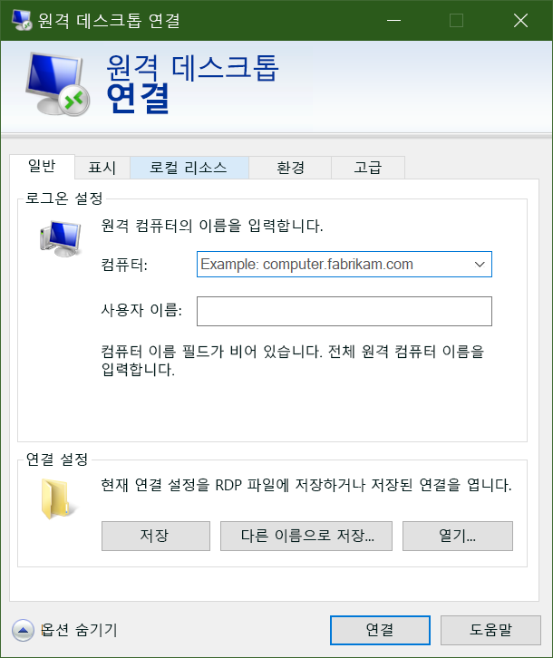

이제 Azure에 Windows VM이 생성되었으므로 다음으로는 트래픽 비디오 처리를 위해 응용 프로그램과 데이터를 해당 VM에 배치하겠습니다.Now that we have a Windows VM in Azure, the next thing you’ll do is put your applications and data on those VMs to process our traffic videos. 

하지만 Azure에 대해 사이트 간 VPN을 설정하지 않았다면 로컬 네트워크에서 Azure VM에 액세스할 수 없습니다.However, unless you’ve set up a site-to-site VPN to Azure, your Azure VMs won’t be accessible from your local network. Azure 사용을 처음 시작하는 경우에는 사이트 간 VPN이 작동하지 않을 가능성이 높습니다.If you’re just getting started with Azure, it’s unlikely that you have a working site-to-site VPN. 그렇다면 Azure VM으로 어떻게 파일을 전송할 수 있을까요?So how can you transfer files to Azure VMs? 쉬운 방법 중 하나는 Azure의 원격 데스크톱 연결 기능을 사용하여 새 Azure VM과 로컬 드라이브를 공유하는 것입니다.One easy way is to use Azure’s Remote Desktop Connections feature to share your local drives with your new Azure VMs.

새 Windows 가상 머신을 생성했으므로 사용자 지정 소프트웨어를 해당 가상 머신에 설치해야 합니다.Now that we have a new Windows virtual machine, we need to install our custom software on to it. 이 경우 두 가지 방법을 사용할 수 있습니다.There are two ways we can use:

- RDP(원격 데스크톱 프로토콜)Remote Desktop Protocol (RDP)
- 사용자 지정 스크립트Custom scripts
- 소프트웨어가 미리 설치된 사용자 지정 VM 이미지Custom VM images (with the software preinstalled)

그러면 Windows VM에서 사용할 수 있는 가장 간단한 방식인 원격 데스크톱에 대해 알아보겠습니다.Let's look at the simplest approach for Windows VMs: Remote Desktop.

## 원격 데스크톱 프로토콜이란 무엇인가요?What is the Remote Desktop Protocol?

RDP(원격 데스크톱)는 Windows 기반 컴퓨터의 UI에 대한 원격 연결을 제공합니다.Remote Desktop (RDP) provides remote connectivity to the UI of Windows-based computers. RDP를 사용하면 물리적 또는 가상 Windows 컴퓨터에 원격으로 로그인하여 마치 콘솔에서 작업하는 것처럼 해당 컴퓨터를 제어할 수 있습니다.RDP enables you to sign in to a remote physical or virtual Windows computer and control that computer as if you were seated at the console. RDP 연결을 사용하면 일부 전원 및 하드웨어 관련 기능을 제외하고는 물리적 컴퓨터의 콘솔에서 수행할 수 있는 작업을 대부분 수행할 수 있습니다.An RDP connection enables you to carry out the vast majority of operations that you can do from the console of a physical computer, with the exception of some power and hardware-related functions.

RDP 연결에는 RDP 클라이언트가 필요합니다.An RDP connection requires an RDP client. Microsoft는 다음 운영 체제에 대해 RDP 클라이언트를 제공합니다.Microsoft provides RDP clients for the following operating systems:

- Windows(기본 제공)Windows (built-in)
- MacOSMacOS
- iOSiOS
- AndroidAndroid

다음 스크린샷에는 Windows 10의 원격 데스크톱 프로토콜 클라이언트가 표시되어 있습니다.The following screenshot displays the Remote Desktop Protocol client in Windows 10.

Ubuntu 배포에서 Windows PC에 연결할 수 있도록 해주는 Remmina 같은 오픈 소스 Linux 클라이언트도 있습니다.There are also open source Linux clients, such as Remmina that enable you to connect to a Windows PC from an Ubuntu distribution.

## Azure VM에 연결Connecting to an Azure VM

조금 전에 살펴본 것처럼 Azure VM은 가상 네트워크에서 통신을 합니다.As we saw a moment ago, Azure VMs communicate on a virtual network. 또한 공용 IP 주소(선택 사항)가 할당될 수도 있습니다.They can also have an optional public IP address assigned to them. 공용 IP가 있으면 인터넷을 통해 VM과 통신할 수 있습니다.With a public IP, we can communicate with the VM over the Internet. 온-프레미스 네트워크를 Azure에 연결하는 VPN(가상 사설망)을 설정할 수도 있습니다. 그러면 공용 IP를 표시하지 않고도 VM에 안전하게 연결할 수 있습니다.Alternatively, we can setup a virtual private network (VPN) that connects our on-premises network to Azure - letting us securely connect to the VM without exposing a public IP. 이 방식에 대한 내용은 다른 모듈에 포함되어 있으며, 해당 옵션에 대해 살펴보려는 사용자를 위해 전체 설명이 문서로 작성되어 있습니다.This approach is covered in another module and is fully documented if you are interested in exploring that option.

Azure에서 공용 IP 주소를 사용할 때 기억해야 할 한 가지 사항은, 공용 IP는 동적으로 할당되는 경우가 많다는 것입니다.One thing to be aware of with public IP addresses in Azure is they are often dynamically allocated. 즉, 시간이 지나면 IP 주소가 변경될 수 있습니다. VM의 경우에는 VM을 다시 시작하면 IP 주소가 변경됩니다.That means the IP address can change over time - for VMs this happens when the VM is restarted. 이름 대신 특정 IP 주소에 직접 연결하고 IP 주소가 변경되지 않도록 하려는 경우 추가 요금을 결제하고 고정 주소를 할당할 수 있습니다.You can pay more to assign static addresses if you want to connect directly to an IP address instead of a name and need to ensure that the IP address will not change.

### Azure에서 RDP를 사용하여 VM에 연결하는 방법은 무엇인가요?How do you connect to a VM in Azure using RDP?

Azure에서 RDP를 사용하여 VM에 연결하는 작업은 간단한 프로세스입니다.Connecting to a VM in Azure using RDP is a simple process. Azure Portal에서 VM 속성으로 이동하여 맨 위에 있는 **연결**을 클릭합니다.In the Azure portal, you go to the properties of your VM, and at the top, click **Connect**. 그러면 VM에 할당된 IP 주소가 표시되며, 미리 구성된 **.rdp** 파일을 다운로드하는 옵션이 제공됩니다. Windows는 RDP 클라이언트에서 이 파일을 엽니다.This will show you the IP addresses assigned to the VM and give you the option to download a preconfigured **.rdp** file that Windows then opens in the RDP client. RDP 파일에서 VM의 공용 IP 주소를 통해 연결하도록 선택할 수 있습니다.You can choose to connect over the public IP address of the VM in the RDP file. VPN 또는 ExpressRoute를 통해 연결하는 경우에는 내부 IP 주소를 선택할 수 있습니다.Alternatively, if you're connecting over VPN or ExpressRoute, you can select the internal IP address. 연결할 포트 번호도 선택할 수 있습니다.You can also select the port number for the connection.

VM의 정적 공용 IP 주소를 사용하는 경우 **.rdp** 파일을 데스크톱에 저장할 수 있습니다.If you're using a static public IP address for the VM, you can save the **.rdp** file to your desktop. 동적 IP 주소를 사용하는 경우에는 VM이 실행 중인 동안에만 **.rdp** 파일이 유효합니다.If you're using dynamic IP addressing, the **.rdp** file only remains valid while the VM is running. VM을 중지했다가 다시 시작하는 경우 다른 **.rdp** 파일을 다운로드해야 합니다.If you stop and restart the VM, you must download another **.rdp** file.

> [!TIP]
> VM의 공용 IP 주소를 Windows RDP 클라이언트에 입력하고 **연결**을 클릭할 수도 있습니다.You can also enter the public IP address of the VM into the Windows RDP client and click **Connect**.

연결하는 경우 일반적으로 두 개의 경고를 받게 됩니다.When you connect, you will typically receive two warnings. 해당 경고는 다음과 같습니다.These are:

-**게시자 경고** - 공개적으로 서명되지 않은 **.rdp** 파일 때문에 발생합니다.-**Publisher warning** - caused by the **.rdp** file not being publicly signed.
- **인증서 경고** - 신뢰할 수 없는 머신 인증서 때문에 발생합니다.**Certificate warning** - caused by the machine certificate not being trusted.

테스트 환경에서는 이러한 경고를 무시할 수 있습니다.In test environments, these warnings can be ignored. 프로덕션 환경에서는 **RDPSIGN.EXE**를 사용하여 **.rdp** 파일에 서명하고 클라이언트의 **신뢰할 수 있는 루트 인증 기관** 저장소에 머신 인증서를 배치할 수 있습니다.In production environments, the **.rdp** file can be signed using **RDPSIGN.EXE** and the machine certificate placed in the client's **Trusted Root Certification Authorities** store.

RDP를 사용하여 VM에 연결해 보겠습니다.Let's try using RDP to connect to our VM.