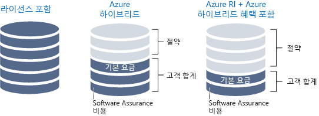

여러분은 솔루션 설계자입니다.You are a solution architect. 여러분이 일하는 Lamna Healthcare에서 워크로드를 클라우드로 이동했습니다.Your organization, Lamna Healthcare has moved its workloads to the cloud. 최근에 Lamna의 예상보다 더 많은 리소스 및 워크플로 요금이 청구되었습니다.Recently, the bill for these resources and workflows has increased more than Lamna had anticipated. 여러분은 이 비용 증가가 효율적인 성장에 따른 자연스러운 것인지 아니면 조직의 클라우드 리소스 효율성을 높여서 비용을 줄일 수 있는지 확인해 달라는 요청을 받았습니다.You have been asked to determine whether the increase is natural, efficient growth, or whether the cost can be reduced by being more efficient with the organization's cloud resources.

#### 클라우드 지출 효율성 최대화Maximize efficiency of cloud spend

> [!VIDEO https://www.microsoft.com/videoplayer/embed/RWjTgy]

## 클라우드 사용으로 비용이 달라지는 원리How the cloud changes your expenses

공용 클라우드와 온-프레미스 인프라의 차이점 중 하나는 사용하는 서비스의 요금입니다.One of the differences between the public cloud and on-premises infrastructure is how you pay for the services you use. 온-프레미스 데이터 센터의 경우 하드웨어 조달 시간이 길고 하드웨어를 최대 용량으로 구성하며, 리소스를 사용하는 사업부가 전력 및 공간 같은 일부 비용을 간과할 수 있습니다.In an on-premises datacenter, hardware procurement time is long, hardware is sized for maximum capacity, and some of the costs, such as power and space, can be hidden from the business unit consuming the resources. 물리적 인프라를 구입하면 투자 비용이 장기 자산에 묶여서 리소스 민첩성이 떨어집니다.Purchasing physical infrastructure ties up investments in long-term assets, hindering your ability to be agile with your resources.

클라우드로 전환하면 종량제 비용 모델이 적용됩니다.Shifting to the cloud introduces a pay-for-what-you-use cost model. 더 이상 투자 비용을 자산에 묶어둘 필요가 없으며, 리소스 요구 사항이 바뀌면 그에 맞게 리소스를 추가, 이동 또는 제거할 수 있습니다.You no longer need to tie up investments in assets, and if your resource requirements change, you can respond by adding, moving, or removing resources. 워크로드는 서비스마다 그리고 서비스 내에서 달라지고, 수요는 예측 불가능하며, 성장 패턴은 시간에 따라 달라집니다.Workloads vary between and within services, demand can be unpredictable, and your growth patterns shift over time. 클라우드에서 사용한 만큼만 지불하므로 리소스가 변경되면 비용 구조도 그에 따라 바뀝니다.Since you only pay for what you use in the cloud, your cost structure can move in sync with the changes in resources.

클라우드 인프라는 변동되는 리소스 사용량 시나리오를 처리할 수 있습니다.Cloud infrastructure can handle fluctuating resource usage scenarios. 장기간 비활성화된 리소스를 사용하지 않는 경우 종료하면 비용이 전혀 발생하지 않습니다.Resources that have significant periods of inactivity can be shut down when not in use and not incur any cost at all. 다음 조달 주기를 기다리지 않고, 서비스의 성장에 따라 리소스를 늘릴 수 있습니다.Resources can grow with a successful service as it grows, rather than having to wait for the next procurement cycle. 리소스를 동적으로 추가하고 제거하여 예측 가능한 수요와 예측 불가능한 수요 급증에 대응할 수 있습니다.More resources can be dynamically added and removed to respond to predictable and unpredictable bursts of demand. 다음 일러스트레이션에서는 온-프레미스 인프라가 이러한 변동되는 모든 시나리오를 처리할 수 없는 이유를 보여줍니다.The following illustration shows why the on-premises infrastructure cannot handle all these fluctuating scenarios.

효율적인 아키텍처에서는 프로비전된 리소스가 해당 리소스에 대한 수요와 일치합니다.In an efficient architecture, provisioned resources match the demand for those resources. 대부분의 시간 동안 가상 머신의 사용률이 10% 미만이면 계산의 측면에서 그리고 비용의 측면에서 리소스를 낭비하고 있는 것입니다.If a virtual machine is less than 10% utilized the majority of the time, you are wasting resources, both in compute and cost. 반대로, 사용률이 90%인 가상 머신은 가용 리소스를 대부분 사용하고 있으므로 비용을 효율적으로 사용하는 것입니다.Conversely, a virtual machine that is running 90% utilized is using the majority of the available resources and is an efficient use of money. 시스템 사용률이 100%이면 성능 문제가 발생할 위험이 있습니다.Running a system to 100% utilization runs the risk of introducing performance issues. 효율성 극대화가 시스템 성능에 악영향을 주지 않도록 주의해야 합니다.It is important to ensure that maximizing efficiency doesn't negatively impact the performance of your system. 수요는 일정하지 않으므로, 가능하다면 수요에 맞게 리소스를 조정하여 효율을 높이는 것이 중요합니다.Demand is rarely constant, so adjusting resources when possible to match demand is important to ensure efficiency.

## 클라우드 지출 추적Track your cloud spend

합리적 의사 결정을 내리려면 데이터가 필요합니다.In order to make intelligent decisions, you need data. 돈이 어디에 사용되는지 살펴보면 사용률과 비교하여 환경 내에서 낭비 요인을 파악할 수 있습니다.By looking at where your money is going, you can start comparing that to utilization to uncover where you may have waste within your environment.

언제든지 청구 데이터를 내보낼 수 있습니다.An export of your billing data is available at any time. 청구 데이터를 사용하여 어디에 비용이 사용되는지, 리소스에 어떻게 할당되는지 추적할 수 있습니다.Using your billing data, you can track where your costs are going and how they're allocated across your resources. 하지만 청구 데이터는 비용을 보여줄 뿐, 사용률을 보여주지 않는다는 문제가 있습니다.The challenge is that the billing data shows cost but not utilization. 대규모 VM에 대한 비용을 지불하고 있다는 것을 보여주지만, 실제 사용률이 얼마나 되는지는 보여주지 않습니다.You'll have data that indicates you're paying for that large VM, but how much are you actually using it?

Azure Cost Management는 비용이 어디에 투입되는지는 물론이고 사용률이 낮은 리소스까지 보여줍니다.Azure Cost Management gives you insights where your spend is going, as well as underutilized resources. Azure Cost Management는 총 비용, 서비스별 비용, 시간별 비용을 추적합니다.Azure Cost Management tracks your total spend, cost by service, and cost over time. 리소스 종류 및 인스턴스를 드릴다운할 수 있습니다.You can drill down into resource types and instances. 해당 범주를 리소스 태그로 지정하여 조직 또는 비용 센터별로 비용을 분류할 수도 있습니다.You can also break down your costs by organization or cost center by tagging resources with those categories.

또한 Azure Advisor는 비용 구성 요소를 갖고 있습니다.Azure Advisor also has a cost component. VM 크기 조정을 추천하고, 예약 인스턴스가 종량제 인스턴스보다 비용 효율적인 경우 예약 인스턴스 구매를 추천합니다.It recommends VM resizing, buying reserved instances when more cost effective than pay-as-you-go instances. 사용되지 않는 ExpressRoute 회로와 유휴 상태의 가상 네트워크 게이트웨이를 식별합니다.It identifies unused ExpressRoute circuits and idle virtual network gateways. Advisor는 성능, 고가용성 및 보안 영역에서 추가 권장 사항을 생성합니다.Advisor makes additional recommendations in the areas of performance, high availability, and security.

비용을 검토하고 돈이 어디에 투입되는지 평가하는 것이 중요합니다.The important part is to take time to review your spend and evaluate where your money is going. 비효율적인 부분을 파악하여 운영 효율성을 최대한 높여야 합니다.Identify areas of inefficiency to ensure you're operating as efficiently as possible.

## 구성을 통한 최적화Organize to optimize

리소스를 구성하면 어디에 비용이 투입되는지 추적하는 데 도움이 됩니다.Putting some organization to your resources can help track where some of your costs are going. 비용이 어디에 관련되어 있는지 알 수 있도록 리소스를 그룹화하고 관계를 설정하는 여러 가지 방법이 있습니다.There are ways to group resources together, establishing a relationship so you know where your costs are related. 요금 청구의 관점에서, 다음과 같은 방법으로 리소스를 간편하게 그룹화할 수 있습니다.From a billing perspective, resources can be easily grouped by:

- 리소스를 여러 구독에 할당합니다.Assigning resources to different subscriptions.
- 리소스를 여러 리소스 그룹에 할당합니다.Assigning resources to different resource groups.
- 리소스에 태그를 적용합니다.Applying tags to resources.

구독 및 리소스 그룹을 사용하여 리소스를 구성하면 간단하게 리소스를 논리적으로 그룹화하여 청구 데이터를 진행할 때 활용할 수 있습니다.Using subscriptions and resource groups to organize resources is an easy way to logically group resources and can be leveraged when going through billing data. 태그는 리소스 관계가 구독과 리소스 그룹의 경계에 걸쳐 있을 때 중요한 역할을 합니다.Tags come into play when resource relationships span the boundaries of subscriptions and resource groups. 태그는 모든 리소스에 추가할 수 있는 키/값 쌍으로, 청구 데이터에 공개되며 부서 또는 비용 센터를 리소스와 연결할 수 있게 해줍니다.Tags are key/value pairs that can be added to any resource, and are exposed in billing data, allowing you to associate a department or cost center with your resource. 태그는 비용에 대한 보고 기능을 향상할 뿐 아니라 조직의 각 부서에 고유한 비용에 대한 책임을 부여합니다.Tags improve your ability to report on cost, as well as giving each department in your organization accountability for their own costs. 다음 일러스트레이션에서는 다른 리소스 그룹 및 다른 구독에서도 리소스에 동일한 태그를 적용할 수 있는 방법을 보여줍니다.The following illustration shows how you can apply the same tag to resources in different resource groups and even in different subscriptions.

리소스에 일부 조직을 추가하면 많은 도움이 될 수 있으며 비용이 어디에 투입되는지 이해하는 데 매우 큰 도움이 될 수 있습니다.Adding some organization to your resources can go a long way and can really aid in your ability to understand where your costs are going. 이번에는 비용을 최적화하는 몇 가지 방법을 살펴보겠습니다.Now let's take a look at some ways to optimize costs.

## IaaS 비용 최적화Optimizing IaaS costs

가상 머신을 사용하는 조직의 경우 가상 머신과 관련된 비용이 지출에서 가장 큰 부분을 차지하는 경우가 종종 있습니다.For organizations using virtual machines, the cost associated with virtual machines is often the biggest portion of spend. 일반적으로는 계산 비용이 지출에서 가장 큰 부분을 차지하고 그 다음은 저장소입니다.The compute costs are typically the biggest piece, followed by storage. 종량제 리소스를 최적화하면 월별 청구 비용에 큰 영향을 미칠 수 있습니다.Taking time to optimize pay-for-what-you-use resources can have a large impact on the size of your monthly bill.

계산 및 저장소 비용을 절감하는 몇 가지 모범 사례를 살펴보겠습니다.Let's take a look at best practices to reduce your compute and storage costs.

### 계산Compute

가상 머신의 비용을 절감할 수 있는 여러 가지 옵션이 있습니다.There are different options available to achieve cost savings for virtual machines.

- 가상 머신 인스턴스 크기를 작게 선택합니다.Choose a smaller virtual machine instance size.
- 가상 머신이 실행되는 시간을 줄입니다.Reduce the number of hours a virtual machine runs.
- 계산 비용 할인을 이용합니다.Use discounts for the compute costs.

#### 적절한 크기의 가상 머신Right size virtual machines

가상 머신을 적절한 크기로 조정하는 것은 가상 머신 크기를 VM에서 요구하는 리소스 수요와 일치시키는 프로세스입니다.Right sizing a virtual machine is the process of matching the virtual machine size with the resource demand required of the VM. VM이 25% 유휴 상태인 경우 VM 크기를 줄이면 즉시 비용이 절감됩니다.If a VM is running 25% idle, reducing the size of the VM will immediately reduce your cost. 가상 머신 비용은 인스턴스 패밀리 내에서 선형적이며, 크기가 한 단계 커질 때마다 비용이 두 배로 늘어납니다.Virtual machine costs are linear within an instance family; each next size larger will double your cost. 반대로, VM을 단일 인스턴스 크기로 줄이면 비용이 절반으로 감소합니다.Conversely, reducing a VM by a single instance size will reduce your cost in half. 다음 일러스트레이션은 동일한 시리즈 내에서 크기를 한 단계 아래로 바꿔서 비용의 50%를 절감하는 것을 보여줍니다.The following illustration shows a 50% savings achieved by moving one size down within the same series.

Azure Advisor는 사용률이 낮은 가상 머신을 식별합니다.Azure Advisor identifies which virtual machines are underutilized. Advisor는 14일 동안 가상 머신 사용량을 모니터링하여 사용률이 낮은 가상 머신을 식별합니다.Advisor monitors your virtual machine usage for 14 days and then identifies underutilized virtual machines. 4일 이상 CPU 사용률이 5% 이하이고 네트워크 사용량이 7MB 이하인 가상 머신은 사용률이 낮은 가상 머신으로 간주됩니다.Virtual machines whose CPU utilization is 5 percent or less and network usage is 7 MB or less for four or more days are considered underutilized virtual machines.

#### 가상 머신의 종료 예약 구현Implement shutdown schedules for virtual machines

주기적으로 사용되는 VM 워크로드를 지속적으로 실행하고 있다면 비용을 낭비하고 있는 것입니다.If you have VM workloads that are only used periodically, but are running continuously, you're wasting money. VM이 사용되지 않는 시간에는 종료하여 VM이 할당 취소된 동안 계산 비용을 절감할 수 있습니다.These VMs can be shut down when not in use saving you compute costs while the VM is deallocated. 예를 들어, 개발 환경은 좋은 옵션입니다. 일반적으로 개발은 업무 시간 동안에만 이루어지기 때문입니다.For example, a development environment is a good candidate because development generally happens only during business hours.

VM을 할당 취소하는 여러 가지 옵션이 있습니다.You have several options to deallocate a VM. Azure Automation을 사용하여 VM 실행 시간을 워크로드에 필요한 시간으로 제한할 수 있습니다.You can use Azure Automation to run your VMs only during those times that your workloads require. 가상 머신에서 자동 종료 기능을 사용하여 일회성 자동 종료를 예약할 수 있습니다.You can use the auto-shutdown feature on a virtual machine to schedule a one-off automated shutdown. 마지막으로, Azure Portal에서 수동으로 VM을 중지할 수 있습니다.Finally, you can stop a VM manually in the Azure portal. VM을 중지하려면 항상 Azure 컨트롤을 사용해야 합니다. VM 내에서 OS를 종료할 경우 Azure 리소스의 할당이 취소되지 않으므로 비용이 계속 누적됩니다.You should always use the Azure controls to stop your VMs; shutting down the OS from inside a VM does not deallocate its Azure resource so you will continue to accrue costs.

#### 계산 비용 할인 적용Apply compute cost discounts

Azure 하이브리드 혜택을 사용하면 Software Assurance를 통해 온-프레미스 Windows Server 또는 SQL Server 라이선스를 VM 계산 비용 할인에 사용하여 Windows Server 및 SQL Server 비용을 더욱 최적화할 수 있으며, 활성화된 인스턴스의 Windows 및 SQL Server 비용을 없앨 수 있습니다.The Azure Hybrid Benefit allows you to further optimize your costs for both Windows Server and SQL Server by allowing you to use your on-premises Windows Server or SQL Server licenses with Software Assurance to be used as a discount toward the compute cost of these VMs, eliminating the costs for Windows and SQL Server on enabled instances.

일부 가상 머신은 항상 가동해야 합니다.Some virtual machines need to be up and running all the time. 프로덕션 워크로드에 대한 웹 응용 프로그램 서버 팜이 있거나 가상 네트워크에서 다양한 서버를 지원하는 도메인 컨트롤러가 있을 수도 있습니다.Maybe you have a web application server farm for a production workload or maybe a domain controller supporting various servers on a virtual network. 가상 머신이 내년까지 또는 그보다 더 길게 실행될 것이 확실한 경우 예약 인스턴스를 구매하여 비용을 더욱 절감할 수 있습니다.If you know with certainty that these virtual machines will run over the coming year or maybe longer, you can get further cost savings by purchasing a reserved instance. Azure Reserved Virtual Machine Instances는 종량제 계산 리소스보다 할인된 가격에 1년 또는 3년 계산 용량을 구입할 수 있습니다.Azure Reserved Virtual Machine Instances can be purchased for one year or three years of compute capacity, at a discount compared to pay-as-you-go compute resources. Azure Reserved Virtual Machine Instances는 1년 또는 3년 선불 약정을 통해 최소 종량제 가격의 72%로 가상 머신 비용을 크게 줄일 수 있습니다.Azure Reserved Virtual Machine Instances can significantly reduce your virtual machine costs, up to 72 percent on pay-as-you-go prices, with one-year or three-year upfront commitment. 다음 일러스트레이션은 Azure Hybrid Benefit과 온-프레미스 라이선스를 결합하는 경우와 Azure RI 및 Azure Hybrid Benefit과 온-프레미스 라이선스를 결합하는 경우 절감한 비용을 보여줍니다.The following illustration shows savings achieved when you combine your on-premises license with the Azure Hybrid Benefit and when you combine your on-premises license with both Azure RI and the Azure Hybrid Benefit.

### 가상 머신 디스크 저장소 비용 최적화Virtual machine disk storage cost optimization

높은 안정성 및 성능 디스크가 필요 없는 워크로드의 경우 저렴한 표준 저장소를 사용해도 됩니다.For workloads that do not require high reliability and performance disks, you can use the reduced-cost standard storage. 프로덕션 워크로드와 똑같을 필요가 없는 개발 및 테스트 환경에 표준 저장소를 사용하도록 선택할 수 있습니다.You might choose to use standard storage for development and test environments that are not required to be an identical match for a production workload.

환경에 분리된 디스크가 남아 있으면 안 됩니다.Ensure you don't have any orphaned disks remaining in your environment. VM과 연결되지 않은 디스크는 계속해서 저장소 비용을 발생시킵니다.Disks that aren't associated with a VM still incur storage costs. VM만 제거하고 디스크를 제거하지 않은 경우 분리된 디스크에서 저장소 비용을 줄일 수 있습니다.If you've removed a VM but not the disks, the orphaned disks may be a place to reduce your storage cost.

분리된 디스크와 마찬가지로, 분리된 스냅숏이 남아 있는 경우 완전히 정리해야 합니다.Similar to orphaned disks, if you have any orphaned snapshots lingering around, take some time to clean them up. 디스크 자체보다는 비용이 저렴하지만, 불필요한 리소스 비용을 아끼는 것이 좋습니다.Pricing for these is lower than the disks themselves, but it's still a good practice to eliminate costs of unnecessary resources.

## PaaS 비용 최적화Optimizing PaaS costs

PaaS 서비스는 일반적으로 IaaS보다 비용 최적화되지만, 낭비 요인을 식별하여 비용을 최소화할 수 있습니다.PaaS services are typically optimized for costs over IaaS services, but there are opportunities to identify waste and optimize for minimal costs. Azure SQL Database 및 Azure Blob 저장소 비용을 절감하는 방법을 살펴보겠습니다.Let's take a look at ways to reduce Azure SQL Database and Azure Blob storage costs.

### Azure SQL Database 비용 최적화Optimizing Azure SQL Database costs

Azure SQL 데이터베이스를 만들 때 Azure SQL Server를 선택하고 성능 계층을 결정해야 합니다.When creating an Azure SQL database, you have to select an Azure SQL Server and decide on a performance tier. 각 계층은 DTU(데이터베이스 트랜잭션 단위) 또는 vCore(가상 코어)에 성능 수준을 제공합니다.Each tier provides a performance level either in database transaction units (DTUs) or virtual cores (vCores). 데이터베이스 로드가 고정적인 경우 필요한 성능에 따라 적절한 크기의 계층을 선택하여 간단하게 최적화할 수 있습니다.For database loads that are steady, it's easy to optimize by selecting the properly sized tier for the needed performance. 그러나 데이터베이스 사용량이 예기치 않게 급증한다면 어떻게 될까요?But what if your database has unpredictable bursts or spikes in activity? 탄력적 풀은 예기치 않은 워크로드 비용을 줄일 수 있습니다.Elastic pools can reduce costs for unpredictable workloads.

SQL Database 탄력적 풀은 사용 요구가 다양하고 예측하기 어려운 여러 데이터베이스를 관리하고 크기를 조정하기 위한 간단하고 비용 효과적인 솔루션입니다.SQL Database elastic pools are a simple, cost-effective solution for managing and scaling several databases that have varying and unpredictable usage demands. 탄력적 풀의 데이터베이스는 단일 Azure SQL Database 서버에 있으며 설정된 가격으로 설정된 수의 리소스를 공유합니다.The databases in an elastic pool are on a single Azure SQL Database server and share a set number of resources at a set price. 풀은 특정 사용 패턴을 보이는 여러 데이터베이스에 적합합니다.Pools are well suited for a large number of databases with specific utilization patterns. 특정 데이터 베이스에서, 이 패턴은 평균 사용률이 낮고 사용률 급증 빈도가 비교적 적은 특징을 보입니다.For a given database, this pattern is characterized by low average utilization with relatively infrequent utilization spikes.
풀에 더 많은 데이터베이스를 추가할수록 비용이 절감됩니다.The more databases you can add to a pool, the greater your savings become. 다음 일러스트레이션에서는 기본, 표준 및 프리미엄이라는 세 가지 형식의 Elastic Database 풀 기능을 보여 줍니다.The following illustration shows the capabilities of the three types of Elastic Database Pools: basic, standard, and premium.  기본은 DB당 최대 5eDTU까지, 표준은 DB당 100eDTU까지, 프리미엄은 DB당 최대 1000eDTU까지 자동으로 조정합니다.Basic auto scales up to 5 eDTUs per DB, standard auto scales up to 100 eDTUs per DB, and Premium that auto scales up to 1000 eDTUs per DB.

탄력적 풀은 비용을 여러 데이터베이스에 분산하여 Azure SQL Database 비용을 대폭 절감할 수 있는 매우 좋은 방법입니다.Elastic pools are a great way to spread costs across multiple databases and can make a significant impact on reducing your Azure SQL Database costs.

### Blob 저장소 비용 최적화Optimizing Blob storage costs

Blob 저장소는 데이터를 저장하는 효율적인 방법이지만, 데이터 양이 많아지면 데이터 저장 방식을 최적화하여 비용을 줄일 수 있습니다.Blob storage is a cost-effective way to store data, but as the amount of data grows, your bill can benefit from optimizing how the data is stored.

다시 Lamna Healthcare로 돌아갑시다.Let's return to Lamna Healthcare. Lamna Healthcare에서는 이미지를 Blob 저장소에 저장하는 의료용 이미지 응용 프로그램을 사용합니다.You have a medical-imaging application that stores images in blob storage. 이미지의 수량과 크기 때문에 결국에는 응용 프로그램의 저장소 비용이 많이 발생하게 됩니다.Due to the quantity and size of the images, the storage ends up being a notable cost for the application. 환자의 이미지를 만들면 첫 번째 주에는 해당 이미지를 수차례 검토할 가능성이 높고, 이미지 검색 성능이 높을 것으로 예상할 수 있습니다.When an image has been taken for a patient, it's likely that in the first week, that image will be viewed several times, and the performance of image retrieval is expected to be high. 반대로, 2년 전에 만든 이미지는 액세스 빈도가 적고 검색 성능이 낮을 것으로 예상할 수 있습니다.Conversely, an image taken two years ago may be accessed infrequently and has a lower retrieval performance expectation. 이미지가 오래 될수록 필요한 성능이 낮아지므로 저장소 계층화를 사용하여 이미지 검색 비용을 최적화할 수 있습니다.You can use storage tiering to optimize the cost of image retrieval, given the reduced performance required as the image ages.

Azure Storage는 Blob 개체 저장소에 다음 세 가지 저장소 계층을 제공합니다.Azure Storage offers three storage tiers for blob object storage. Azure 핫 저장소 계층은 자주 액세스하는 데이터 저장에 최적화되어 있습니다.The Azure hot storage tier is optimized for storing data that is accessed frequently. Azure 쿨 저장소 계층은 드물게 액세스되고 최소 30일 동안 저장되는 데이터를 저장하는 데 최적화되어 있습니다.The Azure cool storage tier is optimized for storing data that is infrequently accessed and stored for at least 30 days. Azure 보관 저장소 계층은 거의 액세스하지 않고 유연한 대기 시간을 요구하며 최소 180일 동안 저장되는 데이터 저장에 최적화되어 있습니다.The Azure archive storage tier is optimized for storing data that is rarely accessed and stored for at least 180 days with flexible latency requirements.

- **핫 액세스 계층** - 저장소 비용은 가장 높지만 액세스 비용은 가장 낮습니다.**Hot access tier** - Highest storage costs but the lowest access costs.
- **쿨 액세스 계층** - 핫 저장소에 비해 저장소 비용이 낮고 액세스 비용이 높습니다.**Cool access tier** - Lower storage costs and higher access costs compared to hot storage. 이 계층은 최소 30일 동안 쿨 계층에 유지되는 데이터를 위한 계층입니다.This tier is intended for data that will stay in the cool tier for at least 30 days.
- **보관 액세스 계층** - 저장소 비용이 가장 낮고 핫 및 쿨 저장소에 비해 데이터 검색 비용이 가장 높습니다.**Archive access tier** - Lowest storage cost and highest data retrieval costs compared to hot and cool storage. 이 계층은 몇 시간의 검색 대기 시간을 허용할 수 있고 적어도 180일 동안 보관 계층에 남아 있는 데이터를 위한 계층입니다.This tier is intended for data that can tolerate several hours of retrieval latency and will stay in the archive tier for at least 180 days.

Lamna Healthcare의 경우 최근 이미지를 최대한 신속하게 볼 수 있도록 새 이미지를 한 달 동안 핫 액세스 계층에 보관하는 것이 좋습니다.For Lamna Healthcare, keeping new images on the hot access tier for a month makes sense, so that viewing the most recent images performs as fast as possible. 그리고 만든 지 1년이 넘은 이미지는 검색 빈도가 낮을 것으로 예상되므로 보관 계층으로 이동할 수 있습니다.You could then move images over one year old to the archive tier since it is likely that these images will not be retrieved. 이렇게 하면 이미지 저장과 관련된 비용을 줄일 수 있습니다.This would reduce their costs associated with storing these images.

### 소비 가격 책정 모델 활용Leverage consumption pricing models

PaaS 서비스로 전환하면 종량제 모델을 우수한 소비 가격 책정 모델로 만들 수도 있습니다.Moving to PaaS services can also take the pay-as-you-go model even further into a true consumption pricing model. Azure Functions와 같은 서비스에는 _소비 계획_을 사용하는 기능이 있습니다.Services such as Azure Functions have the ability to use _Consumption plans_. 소비 계획을 사용하는 경우 Azure Functions 호스트의 인스턴스는 들어오는 이벤트의 수에 따라 동적으로 추가되고 제거됩니다.When you're using a Consumption plan, instances of the Azure Functions host are dynamically added and removed based on the number of incoming events. 이 서버리스 계획은 자동으로 규모를 조정하며, 함수를 실행하는 경우에만 계산 리소스에 대한 요금이 청구됩니다.This serverless plan scales automatically, and you're charged for compute resources only when your functions are running. 소비 계획에서 구성 가능한 기간 후에 함수 실행 시간이 초과됩니다.On a Consumption plan, a function execution times out after a configurable period of time.

청구는 실행 횟수, 실행 시간 및 사용된 메모리를 기반으로 하며,Billing is based on number of executions, execution time, and memory used. 함수 앱 내의 모든 함수에 대해 집계됩니다.Billing is aggregated across all functions within a function app.

소비 가격 책정 모델을 사용하는 서비스로 전환하면 비용 절감에 대한 새로운 방법을 아키텍처에 적용할 수 있습니다.Moving to services that use a consumption pricing model can bring a new approach to cost savings into your architecture.

## Lamna Healthcare의 비용 최적화Cost optimization at Lamna Healthcare

Lamna Healthcare는 비용 절감에서 큰 진전을 이루고 있습니다.Lamna Healthcare is making strides on reducing their costs. 월간 비용을 검토를 구성했으며, 각 부서에서 Azure Cost Management에 액세스하여 월 전체 비용을 검토할 수 있습니다.They have organized a monthly review of their costs, and each department has access to Azure Cost Management, where they can review their costs throughout the month. 예약 인스턴스를 사용할 수 있는 여러 위치를 파악하고 예약 인스턴스를 여러 개 구입하여 할인 혜택을 이용했습니다.They've identified a number of places where reserved instances can be used and have purchased several to take advantage of this discount. 업무 외 시간에는 개발 환경을 중지하는 자동화 프로세스를 구현하여 리소스가 사용되지 않은 시간의 비용을 절감했습니다.They have implemented automated processes to stop development environments in off-hours, saving them additional costs during times when these resources were not being used. 

이미지 저장에 사용되는 Blob 저장소를 최적화하여 지난 수개월 동안 비용을 대폭 줄였습니다.Along with the optimization of blob storage for their imaging storage, they've managed to drop their bill notably over the past couple of months.

## 요약Summary

클라우드 인프라 비용을 최적화하려면 비용을 추적하여 리소스 사용률과 워크로드 수요를 일치시켜야 합니다.Optimizing the cost of your cloud infrastructure involves tracking your spend and ensuring that your resource utilization matches the demands of your workloads. 리소스에 적합한 품질 및 성능 계층을 사용하면 클라우드 비용을 더욱 최적화할 수 있습니다.Using the right quality and performance tier for your resources further optimizes your cloud costs.