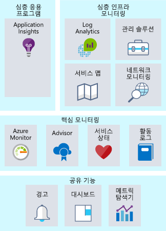
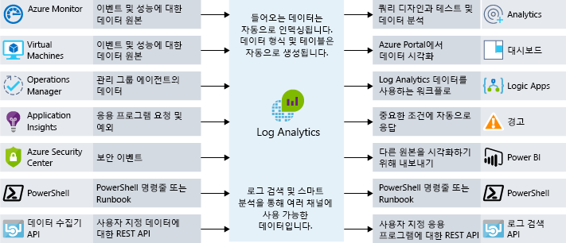
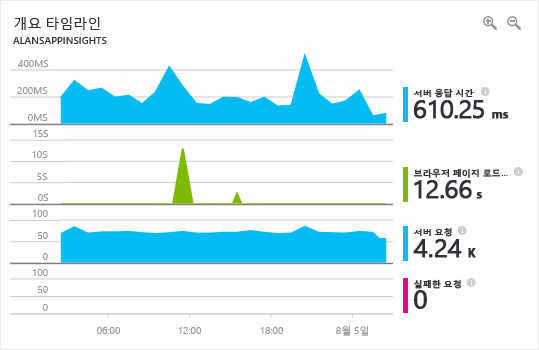

모니터링이란 비즈니스 응용 프로그램 그리고 비즈니스 응용 프로그램이 사용하는 리소스의 성능, 상태 및 가용성을 확인하기 위해 데이터를 수집하고 분석하는 행위를 말합니다.Monitoring is the act of collecting and analyzing data to determine the performance, health, and availability of your business application and the resources that it depends on. Azure에서 실행되는 리소스를 담당하는 운영 팀을 보유하고 있다면 어떨까요?What if you ran an operations team responsible for resources running on Azure? 시스템 상태에 대한 가시성을 확보하려면 어떻게 해야 할까요?What would you do to ensure you had visibility into the health of your systems? 어떤 일이 발생할 때 가장 먼저 발견하는 사람은 누구인가요? 여러분의 팀인가요 아니면 최종 사용자인가요?If something happens, who finds out first, your team or your end users? 효과적인 모니터링 전략이 있으면 응용 프로그램 상태에 집중할 수 있습니다.An effective monitoring strategy helps you focus on the health of your application. 또한 중요한 문제를 사전에 알려줘서 문제가 커지기 전에 해결하여 작동 시간을 늘리는 데 도움이 됩니다.It also helps you increase your uptime by proactively notifying you of critical issues, so that you can resolve them before they become problems. 

Azure의 모니터링 및 분석 기능을 사용하면 서비스를 심층 응용 프로그램 모니터링, 심층 인프라 모니터링 및 코어 모니터링의 세 가지 포커스 영역으로 번들할 수 있습니다.When it comes to monitoring and analytics on Azure, we can bundle services into three specific areas of focus: deep application monitoring, deep infrastructure monitoring, and core monitoring. 여기서는 각 번들을 살펴보고 Azure 서비스가 아키텍처에 이러한 기능을 지원하는 방법을 알아보겠습니다.In this unit, we'll take a look through each of these bundles and how Azure services enable these capabilities for your architecture. 이러한 서비스를 그룹화하기는 했지만, 서비스 사이에 여러 통합 지점이 있으므로 중요한 모니터링 데이터 지점을 통합 지점 간에 공유할 수 있습니다.Even though we've grouped these services together, there are several integration points between them, allowing for sharing of important monitoring data points between them. 다음 그림은 논리 그룹으로 어셈블된 사용 가능한 모니터링 서비스를 보여 줍니다.The following illustration shows the available monitoring services assembled into logical groups.

## 코어 모니터링Core monitoring

코어 모니터링은 Azure 리소스 전반에 걸쳐 필수적이고 기본적인 모니터링을 제공합니다.Core monitoring provides fundamental, required monitoring across Azure resources. 기본 모니터링이란 Azure 플랫폼 수준에서 리소스에 발생하는 일을 살펴보는 것으로 생각하시면 됩니다.When we talk about fundamental monitoring, you can think of this as monitoring what is happening with your resources at the Azure platform level. 이 포커스 영역은 Azure 플랫폼 상태, 리소스 변경 정보, 성능 메트릭 등에 대한 인사이트를 제공합니다.This area of focus gives you insight into things like the health of the Azure platform, insight into changes being made to your resources, and performance metrics. 이 영역의 서비스를 사용하면 응용 프로그램을 계속 실행하기 위해 필요한 기본 요소를 모니터링할 수 있습니다.Using services from this area gives you the ability to monitor the basic pieces you need to keep your application running.

Azure는 활동 로깅, 서비스 상태, 메트릭 및 진단, 모범 사례에 대한 권장 사항이라는 네 가지 코어 모니터링 영역에 대한 가시성을 제공합니다.Azure provides services to give you visibility into four key core monitoring areas: activity logging, the health of services, metrics and diagnostics, and recommendations on best practices. 이러한 서비스가 Azure에 기본 제공되며 서비스를 사용하기 위한 별도의 구성 작업이 거의 또는 전혀 필요 없습니다.These services are built in to Azure and take little to no configuration to enable and set up. 좀 더 자세히 알아봅시다.Let's take a closer look.

### 활동 로깅Activity logging

활동 로깅은 Azure 플랫폼 수준에서 리소스에 어떤 일이 벌어지고 있는지 파악하는 데 있어서 매우 중요한 역할을 합니다.Activity logging is incredibly important to get information on what is happening with your resources at the Azure platform level. Azure 플랫폼에 제출되는 모든 변경 작업이 Azure 활동 로그에 기록되므로 리소스에서 수행된 작업을 추적할 수 있습니다.Every change submitted to the Azure platform is logged to the Azure Activity Log, giving you the ability to trace any action taken on your resources. 활동 로그에는 다음과 같은 질문에 대답할 수 있는 자세한 정보가 포함됩니다.Activity Log will contain detailed information on activities to help you answer questions like:

- 이 가상 머신에 디스크를 연결한 사람은 누구인가요?Who has attached a disk to this virtual machine?
- 이 머신은 언제 종료되었나요?When was this machine shut down?
- 부하 분산 장치 구성을 누가 변경했나요?Who changed the load balancer configuration?
- 가상 머신 확장 집합에서 자동 크기 조정 작업이 실패한 이유는 무엇인가요?Why did the autoscale operation on my virtual machine scale set fail?

활동 로그를 사용하여 이러한 질문에 대답하면 문제를 해결하고, 변경 내용을 추적하고, Azure 환경에서 발생하는 일을 감사하는 데 도움이 됩니다.Using Activity Log to answer these types of questions will help you troubleshoot issues, track changes, and provide auditing of what's happening in your Azure environment. 활동 로그 데이터는 90일 동안만 보관되며, 저장소 계정에 보관하거나 Azure Log Analytics로 전송하면 더 오래 보관하고 추가로 분석할 수 있습니다.Activity Log data is only retained for 90 days and can be archived to a storage account or sent to Azure Log Analytics for longer retention and further analysis.

### 클라우드 서비스 상태Health of cloud services

어떤 시스템이든 문제가 발생할 수 있으며 Azure 서비스 역시 예외가 아닙니다.At some point, any system can have issues, and that's true for Azure services as well. Azure 서비스 상태를 지속적으로 파악하고 있으면 Azure 서비스에 영향을 주는 문제가 환경에 영향을 미치고 있는지 여부 및 시기를 파악하는 데 도움이 됩니다.Staying informed of the health of Azure services will help you understand if and when an issue impacting an Azure service is impacting your environment. 지역화 문제인 것처럼 보이는 문제가 사실은 보다 광범위한 문제의 결과물일 수 있으며, Azure Service Health는 이 인사이트를 제공합니다.What may seem like a localized issue could be the result of a more widespread issue, and Azure Service Health provides this insight. Azure Service Health는 응용 프로그램에 영향을 줄 수 있는 Azure 서비스의 문제를 식별합니다.Azure Service Health identifies any issues with Azure services that might affect your application. Service Health는 예약된 유지 관리를 계획하는 데에도 도움이 됩니다.Service Health also helps you plan for scheduled maintenance.

### 메트릭 및 진단Metrics and diagnostics

본질적으로 좀 더 지역화된 문제의 경우 시스템 또는 서비스 인스턴스에서 어떤 일이 발생하고 있는지 파악할 수 있는 가시성이 중요합니다.For issues that are more localized in nature, it's important to have visibility into what is happening on your system or service instance. 메트릭 및 진단 정보를 보는 기능은 성능 문제를 해결하고 문제 발생 시 지속적으로 알림을 받는 데 있어서 중요합니다.The ability to view metrics and diagnostic information is critical to troubleshoot performance issues and stay notified when something goes wrong. 이러한 가시성을 제공하기 위해 Azure 서비스는 일반적인 방법으로 상태, 메트릭 또는 진단 정보를 표시합니다.To provide this visibility, Azure services have a common way of showing health, metric, or diagnostic information. Azure Monitor를 사용하면 메트릭, 활동 로그 및 진단 로그를 수집, 집계, 시각화하여 Azure 서비스에 대한 핵심 모니터링을 수행할 수 있습니다.Azure Monitor enables core monitoring for Azure services by allowing the collection, aggregation, and visualization of metrics, activity logs, and diagnostic logs.

다양한 리소스와 가상 머신 내부의 운영 체제에 대한 성능 통계를 제공하는 메트릭을 사용할 수 있습니다.Metrics are available that provide performance statistics for different resources and even the operating system inside a virtual machine. Azure Portal에서 탐색기 중 하나를 사용하여 이 데이터를 살펴보고, 이러한 메트릭을 기반으로 경고를 만들 수 있습니다.You can view this data with one of the explorers in the Azure portal and create alerts based on these metrics. Azure Monitor는 가장 빠른 메트릭 파이프라인을 제공하므로(5분에서 1분으로) 시간이 중요한 경고 및 알림에 사용해야 합니다.Azure Monitor provides the fastest metrics pipeline (5 minutes down to 1 minute), so you should use it for time-critical alerts and notifications.

### 모범 사례에 대한 권장 사항Recommendations on best practices

모니터링이라고 하면, 일반적으로 리소스의 현재 상태를 생각합니다.When we think of monitoring, we typically think of the current health of a resource. 그러나 리소스가 정상인 경우에도 조정을 통해 가용성을 높이고 비용을 절감하고 보안을 강화할 수 있습니다.But even when a resource is healthy, there could be adjustments that would result in greater availability, reduced cost, or improved security. Azure Advisor는 리소스 내부의 잠재적인 성능, 비용, 고가용성 또는 보안 문제를 지속적으로 감시하여 도움을 줍니다.Azure Advisor can help by keeping an eye out for potential performance, cost, high availability, or security issues within your resources. Advisor는 리소스 구성 및 원격 분석 데이터를 기반으로 맞춤형 권장 사항을 작성하여 대부분의 기존의 모니터링 플랫폼이 제공하지 않는 지침을 제공합니다.Advisor makes personalized recommendations based on resource configuration and telemetry, providing guidance that most traditional monitoring platforms don't provide.

## 심층 인프라 모니터링Deep infrastructure monitoring

지금까지 살펴본 모니터링 구성 요소는 인사이트를 제공하는 데 매우 유용하지만, Azure 플랫폼에 대한 가시성만 제공합니다.While the monitoring components we've covered thus far are great at offering insights, they only give visibility to the Azure platform. 일반적인 IaaS 워크로드의 경우 네트워크 또는 실제 운영 체제에서 더 많은 메트릭 및 진단 정보를 수집할 수 있습니다.For typical IaaS workloads, there's more metrics and diagnostic information to gather from the network or the actual operating systems. Log Analytics는 서버를 올바르게 구성하기 위해 SQL Server에서 정보를 끌어오거나, 환경 내 모든 서버의 사용 가능한 디스크 공간을 분석하거나, 시스템과 서비스 간의 네트워크 종속성을 시각화하는 등의 방법으로 심층 인사이트를 제공할 수 있습니다.Pulling information from SQL Server to ensure it's properly configured, analyzing free disk space across all the servers in your environment, or visualizing the network dependencies between your systems and services are all examples where Log Analytics can provide deep insights.

모니터링 전략을 설계할 때 서비스 및 리소스의 이벤트를 상호 연결할 수 있도록 모든 구성 요소를 응용 프로그램 체인에 포함해야 합니다.When designing a monitoring strategy, it's important to include every component in the application chain, so you can correlate events across services and resources. Azure Monitor를 지원하는 서비스의 경우 간단하게 Log Analytics 작업 영역으로 데이터를 보내도록 구성할 수 있습니다.For services that support Azure Monitor, they can be easily configured to send their data to a Log Analytics workspace. Log Analytics로 데이터를 보내는 에이전트를 가상 머신(클라우드 및 온-프레미스 모두)에 설치할 수 있습니다.Virtual machines (both in the cloud and on-premises) can have an agent installed to send data to Log Analytics. Log Analytics API를 통해 Log Analytics에 사용자 지정 데이터를 제출할 수 있습니다.You can submit custom data to Log Analytics through the Log Analytics API. 다음 그림은 Log Analytics가 모니터링 데이터의 중앙 허브 역할을 수행하는 방법을 보여 줍니다.The following illustration shows how Log Analytics acts as a central hub for monitoring data. Log Analytics는 Azure 리소스에서 모니터링 데이터를 받아 소비자가 분석 또는 시각화에 사용할 수 있도록 합니다.Log Analytics receives monitoring data from your Azure resources and makes it available to consumers for analysis or visualization.

Log Analytics의 이 데이터를 사용하여 문제 해결, 근본 원인 파악 및 감사를 목적으로 원시 데이터를 쿼리할 수 있습니다.With this data in Log Analytics, you can query the raw data for troubleshooting, root cause identification, and auditing purposes. 몇 가지 알려진 서비스(SQL Server, Windows Server Active Directory)의 경우 모니터링 데이터를 시각화하고 모범 사례 준수를 파악하는 관리 솔루션을 즉시 사용할 수 있습니다.For several known services (SQL Server, Windows Server Active Directory), there are management solutions readily available that visualize monitoring data and uncover compliance with best practices.

Log Analytics를 사용하면 쿼리를 만들어 해당 쿼리에 따라 다른 시스템과 상호 작용할 수 있습니다.Log Analytics allows you to create queries and interact with other systems based on those queries. 가장 일반적인 예는 경고입니다.The most common example is an alert. 고객은 시스템의 디스크 공간이 부족하거나 더 이상 SQL Server 모범 사례를 따르지 않을 때 이메일을 받을 수 있기를 원합니다.Maybe you want to receive an email when a system runs out of disk space or a best practice on SQL Server is no longer followed. Log Analytics는 경고를 보내고, 자동화를 시작하고, 심지어 ITSM(IT 서비스 관리)과의 통합 등을 위해 사용자 지정 API에 연결할 수 있습니다.Log Analytics can send alerts, kick off automation, and even hook into custom APIs for things like integration with IT service management (ITSM).

## 심층 응용 프로그램 모니터링Deep application monitoring

핵심 서비스 및 인프라가 어떻게 수행되는지 이해하는 것도 중요하지만, 응용 프로그램을 심층적으로 조사하여 개발하고 사용하는 서비스의 성능 문제, 사용량 추세, 전반적인 가용성을 파악하면 모니터링 기능의 수준을 한 차원 높일 수 있습니다.It's important to understand how core services and infrastructure are performing, but you can take your monitoring capabilities even further by looking deep into your applications to identify performance issues, usage trends, and overall availability of services you develop and depend on. 응용 프로그램 성능 관리 도구를 사용하면 웹앱 및 서비스 내에서 발생하는 문제를 보다 잘 검색하고 진단할 수 있습니다.By using an application performance management tool, you can better detect and diagnose issues that occur within your web apps and services.

Azure Application Insights를 사용하면 이 작업을 정확하게 수행할 수 있습니다.Azure Application Insights allows you to do exactly that. Application Insights는 원격 분석 컬렉션, 쿼리 및 시각화 기능을 제공합니다.Application Insights provides telemetry collection, query, and visualization capabilities. 코드 변경은 거의 또는 전혀 필요 없습니다.Little to no code changes are required. 응용 프로그램에 작은 계측 패키지 하나만 설치하면 됩니다.You only have to install a small instrumentation package into your application. Application Insights는 .NET, Node.js 또는 Java를 지 원하는 크로스 플랫폼입니다.Application Insights is cross platform, supporting .NET, Node.js, or Java.

예를 들어 응용 프로그램의 응답 시간도 해결 방법이 복잡할 수 있습니다.For instance, the response time of the application might be complex to troubleshoot. 웹 서버에 과부하가 걸리나요?Is it the web server being overloaded? 특정 SQL 쿼리가 최적화되지 않았나요?Is it a specific SQL query that's not optimized? 호출하려는 API가 평소보다 느리게 작동하나요?Is the API that you're calling performing slower than usual? 응용 프로그램 성능 모니터링 솔루션은 기본적인 메트릭 모니터링으로는 알 수 없는 실제 문제를 파악하는 데 도움이 됩니다.Application performance monitoring solutions can help uncover the actual issues that basic metric monitoring can't expose. 다음 스크린샷은 Azure Application Insights에서 제공하는 응용 프로그램의 성능 세부 정보에 대한 그래픽 표시를 보여줍니다.The following screenshot shows a graphical display of an application’s performance details provided by Azure Application Insights.

응용 프로그램 성능 모니터링 솔루션을 사용하면 사용량, 성능 및 가용성을 모니터링하다가 오류 발생 시 훨씬 신속하게 대응할 수 있으므로 모든 모니터링 전략에 포함되어야 합니다.An application performance monitoring solution will help you monitor usage, performance, and availability, allowing you to respond to failure much faster, and should be included in any monitoring strategy.

## Lamna Healthcare의 모니터링Monitoring at Lamna Healthcare

Lamna Healthcare는 리소스를 클라우드로 이동한 이후 모니터링 전략을 개선해 왔습니다.Lamna Healthcare has been revamping their monitoring strategy since moving their resources to the cloud. Monitor를 사용하여 성능 문제가 리소스에 영향을 미칠 수 있으면 문제를 해결하고 경고를 보냅니다.They're using Monitor for troubleshooting and alerting when performance issues may be impacting their resources. 운영 팀에 서비스 상태 알림을 보내서 즉시 대응할 수 있도록 알림을 구성했습니다.They have notifications configured to send any service health notifications to their operations team for immediate engagement. Lamna Healthcare는 권장 사항이 적용 가능한 경우 해당 환경에 구현되는지 확인하기 위해 Advisor를 주기적으로 검토하는 프로세스를 갖추었습니다.They have a process in place to regularly review Advisor to ensure the recommendations are implemented into their environment where applicable. 

모든 Azure 및 온-프레미스 리소스의 로그 데이터를 Log Analytics 작업 영역으로 보냄으로써 Lamna Healthcare는 로그 원본을 검색하여 이벤트 상관 관계를 찾아낼 수 있으며 Windows Server Active Directory 및 SQL Server에 관리 솔루션을 사용하고 있습니다.They send log data from all Azure and on-premises resources to a Log Analytics workspace, so they have the ability to search across log sources for event correlation and are using management solutions for Windows Server Active Directory and SQL Server.

Lamna Healthcare 개발 팀은 Application Insights를 응용 프로그램과 통합하는 작업을 시작했으며, 성능에 영향을 주지만 이전에는 발견하지 못했던 두 가지 결함을 찾아냈습니다.Their development team has started integrating Application Insights into their applications, and they've already uncovered two defects that were impacting performance that had previously gone undetected.

## 요약Summary

인프라 지원부터 심층적인 응용 프로그램 원격 분석까지 여러 아키텍처 레이어를 살펴보는 것이 좋은 모니터링 전략입니다.A good monitoring strategy looks across multiple layers of an architecture, from supporting infrastructure to deep application telemetry. 좋은 모니터링 전략은 여러 응용 프로그램 구성 요소의 세부 작업을 이해하는 데 도움이 됩니다.It will help you understand the detailed operation of the different components of your application. 문제가 발생하기 전에 미리 해결할 수 있도록 중대한 문제를 사전에 알려서 가동 시간을 늘리고, 시스템의 로그와 원격 분석 간에 상관 관계를 지정하여 문제를 발견할 수 있습니다.It increases your uptime by proactively notifying you of critical issues, so that you can resolve them before they become problems, and allows you to correlate logs and telemetry across systems to uncover issues. 모니터링 전략에 활용할 수 있는 Azure의 여러 서비스를 살펴보았습니다.We've taken a look at a number of services on Azure that you can leverage in your monitoring strategy.