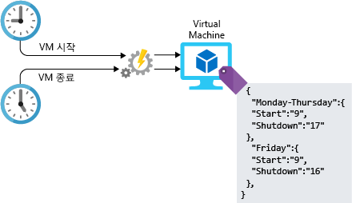

모든 종류의 워크로드 인프라는 관리에 구성 작업이 개입됩니다. 이 구성을 수동으로 할 수 있지만, 수동 단계는 손이 많이 가고 오류가 발생하기 쉽고 비효율적입니다. Azure에서 수백 개의 시스템을 배포해야 하는 프로젝트를 맡았다면 어떻게 해야 할까요? 이러한 리소스를 어떻게 빌드하고 구성하시겠습니까? 시간이 얼마나 걸릴까요? 시스템 간에 조금의 편차도 없이 각 시스템을 올바르게 구성할 수 있습니까? 아키텍처 설계에 자동화를 사용하면 이러한 과제를 해결할 수 있습니다. Azure에서 자동화할 수 있는 몇 가지 방법을 살펴보겠습니다.

## <a name="infrastructure-as-code"></a>코드로써의 인프라

서비스 및 인프라 배포를 자동화할 때 두 가지 방식이 있는데, 하나는 명령적이고 다른 하나는 선언적입니다. 명령적 방식에서는 원하는 결과를 얻기 위해 실행할 명령을 명시적으로 서술합니다. 선언적 방식에서는 원하는 결과를 얻기 위해 실행할 방법을 지정하는 것이 아니라 어떤 결과를 원하는지를 지정합니다. 둘 다 좋은 방법이므로 무엇을 선택해도 괜찮습니다. 이러한 차이점이 Azure에서 어떤 모습으로 나타날까요? 또 이러한 차이점을 어떻게 이용할 수 있을까요?

### <a name="imperative-automation"></a>명령적 자동화

명령적 자동화부터 시작하겠습니다. 명령적 자동화에서는 _어떻게_ 할 것인지를 지정합니다. 일반적으로 이 작업은 언어 또는 SDK 스크립팅을 통해 프로그래밍 방식으로 수행됩니다. Azure 리소스의 경우 Azure CLI 또는 Azure PowerShell을 사용 수 있습니다. Azure CLI를 사용하여 저장소 계정을 만드는 예제를 살펴보겠습니다.

```azure-cli
az group create --name storage-resource-group --location westus
az storage account create --resource-group storage-resource-group --name mystorageaccount --kind BlobStorage --access-tier hot
```

이 예제에서는 이러한 리소스를 만드는 방법을 지정합니다. 리소스 그룹을 만드는 명령을 실행합니다. 저장소 계정을 만드는 또 다른 명령을 실행합니다. 원하는 결과를 얻기 위해 어떤 명령을 실행할 것인지 Azure에 명시적으로 지시합니다.

이 방식을 사용하면 인프라를 완전히 자동화할 수 있습니다. 입력 및 출력에 대한 영역을 제공할 수 있고, 매번 동일한 명령이 실행되게 할 수 있습니다. 리소스를 자동화하여 프로세스에서 수동 단계를 제거하고, 리소스 관리가 보다 효율적으로 운영되도록 만들었습니다. 그러나 이 방식에는 몇 가지 단점이 있습니다. 아키텍처가 복잡해지면 리소스를 만드는 스크립트가 금방 복잡해질 수 있습니다. 완전 실행을 보장하기 위해 오류 처리 및 입력 유효성 검사를 추가해야 할 수도 있습니다. 명령이 변경될 수 있고, 스크립트의 지속적인 유지 관리가 필요합니다.

### <a name="declarative-automation"></a>선언적 자동화

선언적 자동화를 사용하는 경우 _어떤 결과_를 원하는지를 지정하고, 구체적인 실행 방법은 사용하는 시스템에 맡겨 둡니다. Azure에서 선언적 자동화는 Azure Resource Manager 템플릿을 사용하여 수행됩니다.

Resource Manager 템플릿은 무엇을 만들 것인지를 지정하는 JSON 구조 파일입니다. 아래 예제에서는 우리가 지정하는 이름과 속성을 사용하여 저장소 계정을 만들도록 Azure에 지시합니다. 이 저장소 계정을 만들기 위해 실행되는 실제 단계는 Azure에 맡겨 둡니다. 템플릿에는 매개 변수, 변수, 리소스 및 출력의 4개 섹션이 있습니다. 매개 변수는 템플릿 내에서 사용할 입력을 처리합니다. 변수는 템플릿 전체에서 사용할 값을 저장하는 방법을 제공합니다. 리소스는 생성된 것이고, 출력은 생성된 것에 대한 세부 정보를 사용자에게 제공하는 방법입니다.

```json
{
    "$schema": "https://schema.management.azure.com/schemas/2015-01-01/deploymentTemplate.json#",
    "contentVersion": "1.0.0.0",
    "parameters": {
        "name": {
            "type": "string"
        },
        "location": {
            "type": "string"
        },
        "accountType": {
            "type": "string",
            "defaultValue": "Standard_RAGRS"
        },
        "kind": {
            "type": "string"
        },
        "accessTier": {
            "type": "string"
        },
        "httpsTrafficOnlyEnabled": {
            "type": "bool",
            "defaultValue": true
        }
    },
    "variables": {
    },
    "resources": [
        {
            "apiVersion": "2018-02-01",
            "name": "[parameters('name')]",
            "location": "[parameters('location')]",
            "type": "Microsoft.Storage/storageAccounts",
            "sku": {
                "name": "[parameters('accountType')]"
            },
            "kind": "[parameters('kind')]",
            "properties": {
                "supportsHttpsTrafficOnly": "[parameters('httpsTrafficOnlyEnabled')]",
                "accessTier": "[parameters('accessTier')]",
                "encryption": {
                    "services": {
                        "blob": {
                            "enabled": true
                        },
                        "file": {
                            "enabled": true
                        }
                    },
                    "keySource": "Microsoft.Storage"
                }
            },
            "dependsOn": []
        }
    ],
    "outputs": {
        "storageAccountName": {
            "type": "string",
            "value": "[parameters('name')]"
        }
    }
}
```

템플릿은 Azure에서 모든 서비스를 만들고 조작하는 데 사용할 수 있습니다. 코드 리포지토리 및 제어되는 소스에 저장할 수 있으며, 개발 중인 인프라가 실제로 프로덕션 중인 인프라와 일치하도록 환경 간에 공유됩니다. 배포를 자동화하고 일관성을 유지하고 배포 구성 오류를 제거하고 작업 속도를 높일 수 있는 좋은 방법입니다.

인프라 배포 자동화는 훌륭한 첫 번째 단계이지만, 가상 머신을 배포하는 경우 할 일이 더 있습니다. 배포 후 구성을 자동화화는 몇 가지 방법을 살펴보겠습니다.

## <a name="vm-customization-images-vs-post-deployment-configuration"></a>VM 사용자 지정: 이미지 vs 배포 후 구성

많은 가상 머신 배포에서, 머신이 실행 중인 동안에는 작업이 수행되지 않습니다. VM이 실제로 목표를 달성하려면 추가 구성이 필요할 가능성이 높습니다. 디스크 추가 시 포맷이 필요할 수 있고, VM을 도메인에 조인해야 할 수 있고, 관리 소프트웨어용 에이전트를 설치해야 할 수 있고, 실제 워크로드를 설치하고 구성해야 할 가능성이 높습니다.

VM 자체의 구성으로 간주되는 구성 작업에 적용되는 두 가지 일반적인 전략이 있는데, 전략마다 장점과 단점이 있습니다.

- 사용자 지정 이미지
- 배포 후 스크립팅

가상 머신을 배포한 후 실행 중인 인스턴스에서 소프트웨어를 구성 또는 설치하면 사용자 지정 이미지가 생성됩니다. 모든 것을 올바르게 구성한 후 머신을 종료하면 VM에서 이미지가 만들어집니다. 생성된 이미지를 다른 새 가상 머신의 기준으로 사용할 수 있습니다. 사용자 지정 이미지를 사용하면 전체 배포 시간을 줄일 수 있습니다. 가상 머신을 배포하고 실행하면 추가 구성이 필요 없기 때문입니다. 배포 속도가 중요한 경우 사용자 지정 이미지를 잘 살펴볼 필요가 있습니다.

배포 후 스크립팅은 일반적으로 기본 기준 이미지를 활용하며, VM이 배포된 후에는 스크립팅 또는 구성 관리 플랫폼을 사용하여 구성 작업을 수행합니다. Azure 스크립트 확장을 통해 VM에서 스크립트를 실행하여 또는 Azure Automation DSC(Desired State Configuration) 같은 견고한 솔루션을 활용하여 배포 후 스크립트를 수행할 수 있습니다.

방법마다 고려해야 할 사항이 있습니다. 이미지를 사용하는 경우 이미지 업데이트, 보안 패치 및 이미지 자체의 인벤토리 관리를 처리하기 위한 프로세스가 있는지 확인해야 합니다. 배포 후 스크립팅을 사용하는 경우 빌드가 완료되기 전에는 실시간 워크로드에 VM을 추가할 수 없으므로 빌드 시간이 길어질 수 있습니다. 독립 실행형 시스템에서는 이것이 별 문제가 아닐 수 있지만, 가상 머신 확장 집합처럼 자동으로 크기가 조정되는 서비스를 사용하는 경우 빌드 시간이 길어지면 크기 조정 시간에 영향을 줄 수 있습니다. 두 방법 모두 구성 드리프트를 해결해야 합니다. 새 구성이 롤아웃되면 그에 따라 기존 시스템을 업데이트해야 하기 때문입니다.

리소스 배포를 자동화하면 환경에 엄청난 도움이 될 수 있습니다. 시간의 양 저장 하 고 감소 하는 오류 다른 수준으로 작동 하는 기능을 이동할 수 있습니다.

## <a name="automation-of-operational-tasks"></a>운영 작업의 자동화

솔루션이 시작 및 실행되면 지속적인 운영 작업을 자동화할 수 있습니다. Azure Automation을 사용하여 이러한 작업을 자동화하면 수동 워크로드가 감소하고, 계산 리소스의 구성 및 업데이트 관리를 사용할 수 있고, 일정/자격 증명/인증서 같은 공유 리소스를 중앙 집중화하고, 모든 종류의 Azure 작업을 실행하는 프레임워크가 제공됩니다.

Lamna Healthcare 작업의 경우 다음이 포함될 수 있습니다.

- 분리된 디스크를 주기적으로 검색합니다.
- VM에 최신 보안 패치를 설치합니다.
- 업무 외 시간에 가상 머신을 검색하고 종료합니다.
- 고위 임원에게 보고할 일일 보고서를 실행하고 대시보드를 생성합니다.

구체적인 예로 업무 시간 중에 가상 머신만을 실행한다고 가정합니다. 아침에 VM을 시작하고 저녁에는 종료하는 스크립트를 작성할 수 있습니다. 설정된 시간에 스크립트를 실행하도록 Azure Automation을 구성할 수 있습니다. 다음 일러스트레이션에서는 이 프로세스에서 Azure Automation의 역할을 보여줍니다.



## <a name="automating-development-environments"></a>개발 환경 자동화

클라우드 인프라의 반대편 파이프라인에는 개발자가 비즈니스의 핵심이 되는 응용 프로그램 및 서비스를 작성하기 위해 사용하는 개발 머신이 있습니다. 개발자는 적절한 도구 및 필요한 리포지토리와 함께 Azure DevTest Labs를 사용하여 VM에 스탬프를 지정할 수 있습니다. 여러 서비스를 작업하는 개발자는 새 머신을 직접 프로비전할 필요 없이 개발 환경 간에 전환할 수 있습니다. 이러한 개발 환경은 사용하지 않을 때에는 종료하고 다시 필요하게 되면 다시 시작할 수 있습니다.

## <a name="automation-at-lamna-healthcare"></a>Lamna Healthcare의 자동화

Lamna Healthcare가 자동화를 사용한 후 어떻게 달라졌는지 살펴보겠습니다. 자동화를 처음 시작할 당시에는 인프라 배포 및 서버 빌드가 완전히 수동이었습니다. 엔지니어들은 포털을 통해 모든 것을 배포했습니다. 테스트 및 프로덕션 환경 간에 편차와 오류가 발생했으며, 이러한 편차로 인해 코드를 프로덕션하기 전에는 문제를 감지할 수 없었습니다.

이제 Lamna Healthcare는 Resource Manager 템플릿을 통해 모든 인프라를 배포합니다. 이러한 템플릿은 GitHub 리포지토리에 체크 인 되고, 배포용으로 릴리스되기 전에 미리 코드를 검토합니다. 또한 개발, 테스트 및 프로덕션 환경에서 똑같은 인프라를 빌드할 수 있으므로 모든 환경에서 구성의 유효성을 검사할 수 있습니다.

가상 머신을 사용하는 대부분의 서비스에서, 표준 기본 이미지를 보유하고 있으며 DSC를 사용하여 배포 후 시스템을 구성합니다. 가상 머신 확장 집합의 확장성이 필요한 웹 팜의 경우 코드를 체크 인하고 새 이미지를 빌드하는 프로세스를 완전히 자동화하고, 필요한 구성을 모두 내장하여 확장 집합에서 사용할 수 있게 만들었습니다.

업무 외 시간에는 식별된 가상 머신을 종료하는 자동화 작업을 통해 비용을 줄였으며, VM 패치도 자동화했습니다.

이제 개발자는 최신 이미지 및 구성을 통해 개발할 수 있는 DevTest Labs에서 셀프 서비스 환경을 사용하므로 이들이 개발하는 것이 프로덕션의 구성과 일치합니다.

이를 위해 약간의 사전 노력이 필요했지만, 결국에는 노력에 대한 보상을 충분히 받았습니다. 운영 팀이 환경을 유지하기 위해 드는 노력과 오류 발생률이 현저하게 감소했습니다. 개발자는 개발에 필요한 리소스를 간편하게 프로비전할 수 있게 되어, 환경을 만들기 위해 왔다 갔다 할 필요가 없습니다.

## <a name="summary"></a>요약

아키텍처에 자동화 기능을 도입하는 여러 가지 방법을 살펴보았습니다. 인프라를 코드로 배포할 수 있는 점부터 랩 환경을 통해 개발자 생산성을 높일 수 있는 점까지, 환경을 자동화하여 얻을 수 있는 수많은 이점이 있습니다. 오류를 줄이고, 편차를 줄이고, 운영 비용을 절감할 수 있다는 것은 조직에 엄청난 이점을 주며 클라우드 환경을 한 차원 높은 수준으로 발전시킬 수 있습니다.