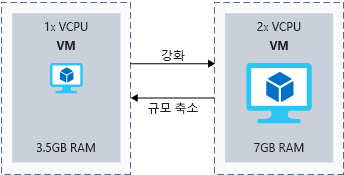
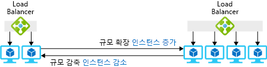
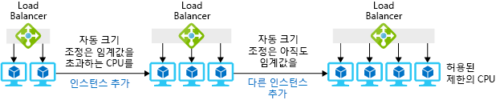

시스템에 대한 부하를 정확히 예측할 수 있는 경우는 드뭅니다. 공용 응용 프로그램이 빠르게 늘어나거나 내부 응용 프로그램이 비즈니스 성장에 따라 더 큰 사용자 기반을 지원해야 할 수도 있기 때문입니다.It's rare that we can exactly predict the load on our system: public facing applications might grow rapidly or an internal application might need to support a larger user base as the business grows. 부하를 예측할 수 있더라도, 균일한 수준인 경우가 거의 없습니다. 소매점에는 휴일에 더 많은 수요가 발생하고, 스포츠 웹 사이트는 플레이오프 기간에 최대 수요가 몰립니다.Even when we can predict load, it's rarely flat: retailers have more demand during the holidays and sports websites peak during playoffs. 여기서는 _확장/축소_ 및 _스케일 아웃/스케일 인_을 정의하고, Azure에서 크기 조정 기능을 향상하는 몇 가지 방법을 소개하고, 서버리스 및 컨테이너 기술로 아키텍처의 크기 조정 기능을 향상하는 방법을 알아봅니다.Here, we'll define _scaling up/down_ and _scaling out/in_, cover some ways Azure can improve your scaling capabilities, and look at how serverless and container technologies can improve your architecture's ability to scale.

## 크기 조정이란?What is scaling?

_크기 조정_은 응용 프로그램이 성능 요구 사항 집합을 충족하도록 돕기 위해 리소스를 관리하는 프로세스입니다._Scaling_ is the process of managing your resources to help your application meet a set of performance requirements.  사용자를 지원하는 리소스가 너무 많으면 효율적으로 사용하지 못하게 되고 돈을 낭비하게 됩니다.When we have too many resources serving users, we won't be using it efficiently and we'll be wasting money. 사용 가능한 리소스가 너무 적으면 응용 프로그램의 성능에 영향을 줄 수 있습니다.Too few available resources means that the performance of our application could be impacted. 목표는 비용을 최적화하면서 정의된 성능 요구 사항을 충족하는 것입니다.The goal is to meet our defined performance requirements while optimizing for cost. 

“_리소스_”는 응용 프로그램을 실행하기 위해 관리해야 하는 모든 것을 의미합니다."_Resources_" can refer to anything we need to manage to run our applications. 가상 머신용 메모리 및 CPU는 가장 분명한 리소스이지만, 일부 Azure 서비스를 사용하기 위해서는 대역폭 또는 Cosmos DB 요청 단위와 같은 추상적인 측면을 고려해야 할 수도 있습니다.Memory and CPU for virtual machines are the most obvious resources, but some Azure services might require you to consider bandwidth or abstractions, like Cosmos DB Request Units.

응용 프로그램 수요가 일정한 세계에서는 필요한 리소스의 양을 쉽게 예측할 수 있습니다.In a world where application demand is constant, it's easy to predict the right amount of resources you'll need. 현실 세계에서는 응용 프로그램 요구 사항이 시간에 따라 변하기 때문에 필요한 리소스의 정확한 양을 예측하는 것이 더 어렵습니다.In the real world, the demands of applications change over time, so the right amount of resources you'll need can be harder to predict. 운이 좋아 이러한 변화가 예측 가능하거나 계절별 특성일 수 있지만, 모든 응용 프로그램에서 일반적인 것은 아닙니다.If you're lucky, that change will be predictable or seasonal, but that is not typical of all applications. 이상적으로는 수요를 맞출 수 있는 적절한 양의 리소스를 프로비전하고, 수요가 변화하면 조정하는 것이 좋습니다.Ideally, you want to provision the right amount of resources to meet demand and adjust as demand changes.

자체 서버를 구매하여 관리하는 온-프레미스 시나리오에서는 크기 조정이 어렵습니다.Scaling is difficult in an on-premises scenario, where you purchase and manage your own servers. 리소스를 추가하게 되면 비용이 많이 들 수 있으며 온라인 상태로 전환하는 데 시간이 너무 오래 걸리는 경우도 있습니다. 때로는 늘어난 용량에 실제로 필요한 시간보다 더 많은 시간이 걸리기도 합니다.Adding resources can be costly and often takes too much time to bring online, sometimes longer than your actual need for the increased capacity. 시스템에서 수요가 낮은 시간 동안 용량을 줄이는 것도 마찬가지로 어려우므로 어쩔 수 없이 비용이 늘어날 수 있습니다.It can be just as difficult to then reduce capacity during times of low demand on the system, so you may be stuck with the increased cost.

크기 조정이 용이하다는 사실이 Azure의 핵심적인 이점입니다.Easy scaling is a key benefit of Azure. 대부분의 Azure 리소스는 수요 변화에 따라 리소스를 쉽게 추가하거나 제거할 수 있도록 하며, 많은 서비스가 자동화된 옵션을 제공하므로 수요를 모니터링하고 자동으로 조정됩니다.Most Azure resources let you easily add or remove resources as demand changes, and many services have automated options so they monitor demand and adjust for you. 이러한 자동 크기 조정 기능을 사용하면 사용 가능한 인스턴스의 최소 및 최대 수준 임계값을 설정하고 성능 메트릭(예: CPU 사용률)을 기준으로 인스턴스를 추가 또는 제거할 수 있습니다.This automatic scaling capability, commonly known as autoscaling, lets you set thresholds for the minimum and maximum level of instances that should be available, and will add or remove instances based upon a performance metric (for example, CPU utilization).

#### 강화 및 확장Scaling up and out

> [!VIDEO https://www.microsoft.com/videoplayer/embed/RE2yBWi]

## 강화 또는 축소란?What is scaling up or down?

강화는 주어진 인스턴스의 용량을 늘리는 프로세스입니다.Scaling up is the process where we increase the capacity of a given instance. 더 많은 처리 용량을 제공하기 위해 가상 머신을 1개의 vCPU와 3.5GB RAM에서 2개의 vCPU와 7GB RAM으로 늘릴 수 있습니다.A virtual machine could be increased from 1 vCPU and 3.5 GB of RAM to 2 vCPUs and 7 GB of RAM to provide more processing capacity. 반면에, 축소는 지정된 인스턴스의 용량을 낮추는 프로세스입니다.On the other hand, scaling down is the process where we lower the capacity of a given instance. 예를 들어, 가상 머신의 용량을 2개의 vCPU와 7GB RAM에서 1개의 vCPU와 3.5GB RAM으로 줄여 용량과 비용을 모두 절약할 수 있습니다.For example, reducing a virtual machine's capacity from 2 vCPUs and 7 GB of RAM to 1 vCPU and 3.5 GB of RAM, reducing both capacity and cost. 다음 일러스트레이션에서는 가상 머신의 크기를 변경하는 예제를 보여줍니다.The following illustration shows an example of changing the size of a virtual machine.

Azure 리소스의 컨텍스트에서 확장 또는 축소의 의미를 알아보겠습니다.Let's take a look at what scaling up or down means in the context of Azure resources:

- Azure Virtual Machines에서는 가상 머신 크기에 따라 크기를 조정합니다.In Azure virtual machines, you scale based upon a virtual machine size. 이 크기에는 특정 크기의 vCPU, RAM 및 로컬 저장소가 연결되어 있습니다.That size has a certain amount of vCPUs, RAM, and local storage associated with it. 예를 들어, Standard_DS1_v2 가상 머신(1개의 vCPU와 3.5GB RAM)에서 Standard_DS2_v2 가상 머신(2개의 vCPU와 7GB RAM)으로 확장할 수 있습니다.For example, we could scale up from a Standard_DS1_v2 virtual machine (1 vCPU and 3.5 GB of RAM) to a Standard_DS2_v2 virtual machine (2 vCPUs and 7 GB of RAM).
- Azure SQL Database는 PaaS(Platform as a Service) 방식으로 구현된 Microsoft SQL Server입니다.Azure SQL Database is a platform as a service (PaaS) implementation of Microsoft SQL Server.  DTU(데이터베이스 트랜잭션 단위) 또는 vCPU 수에 따라 데이터베이스를 확장할 수 있습니다.You can scale up a database based upon the number of database transaction units (DTUs) or vCPUs. DTU는 기본 리소스의 추상화로, CPU, IO 및 메모리가 혼합된 것입니다.DTUs are an abstraction of underlying resources and are a blend of CPU, IO, and memory. 예를 들어 Azure SQL 데이터베이스를 P2, 250 DTU에서 P4, 500 DTU까지 확장하여 데이터베이스에 더 많은 처리량과 용량을 제공할 수 있습니다.For instance, you could scale your Azure SQL database from a size of P2 with 250 DTUs up to a P4 with 500 DTUs to give the database more throughput and capacity.
- Azure App Service는 Azure의 PaaS 웹 사이트 호스팅 서비스입니다.Azure App Service is a PaaS website-hosting service on Azure. 웹 사이트는 App Service 계획이라고도 하는 가상 서버 팜에서 실행됩니다.Websites run on a virtual server farm, also known as an App Service plan. App Service 계획을 계층 간에 강화하거나 축소하고, 계층 내에 용량 옵션을 제공할 수 있습니다.You can scale the App Service plan up or down between tiers and have capacity options within tiers. 예를 들어 S1 App Service 계획에는 인스턴스당 1개의 vCPU 및 1.75GB RAM이 있습니다.For example, an S1 App Service plan has 1 vCPU and 1.75 GB of RAM per instance. 인스턴스당 2개의 vCPU와 3GB RAM을 포함하는 S2 App Service 계획으로 강화할 수 있습니다.We could scale up to an S2 App Service plan, which has 2 vCPUs and 3 GB of RAM per instance.

온-프레미스 환경에서 이러한 기능을 사용하려면 일반적으로 새 수준의 확장을 사용하기 위해 먼저 필요한 하드웨어 및 설치가 조달될 때까지 기다려야 합니다.To have these capabilities in an on-premises environment you typically have to wait for procurement of the needed hardware and installation before you can start using the new level of scale. Azure에서는 물리적 리소스가 이미 배포되어 사용이 가능합니다.In Azure, the physical resources are already deployed and available for you. 사용하려는 대체 수준의 규모만 선택하면 됩니다.You simply need to select the alternate level of scale that you are looking to use.

선택한 클라우드 서비스에 따라 솔루션에서 확장이 미치는 영향을 고려해야 할 수 있습니다.You may need to consider the impact of scaling up in your solution, depending upon the cloud services that you have chosen.

예를 들어 Azure SQL Database에서 확장하도록 선택한 경우에는 서비스가 개별 노드의 확장을 처리하고 서비스 작업을 계속 진행합니다.For example, if you choose to scale up in Azure SQL Database, the service deals with scaling up individual nodes and continues the operation of your service. 서비스 계층 및/또는 데이터베이스의 성능 수준을 변경하게 되면 새 성능 수준에서 원본 데이터베이스의 복제본을 만들고 연결을 복제본으로 전환합니다.Changing the service tier and/or performance level of a database creates a replica of the original database at the new performance level, and then switches connections over to the replica. 이 프로세스 중에는 데이터가 손실되지 않으며, 서비스가 복제본으로 전환할 때만 잠시 중단됩니다(일반적으로 4초 미만).No data is lost during this process, and there's only a brief interruption (typically less than four seconds) when the service switches over to the replica.

또는 가상 머신을 강화 또는 축소하도록 선택하는 경우 다른 인스턴스 크기를 선택하면 됩니다.Alternatively, if you choose to scale up or down a virtual machine, you do so by selecting a different instance size. 대부분의 경우 VM을 다시 시작해야 하므로, 재부팅이 필요하리라고 예상하는 것이 가장 좋으며 이 작업을 수행할 때 이러한 사실을 고려해야 합니다.In most cases this requires a restart of the VM, so it's best to have the expectation that a reboot will be required and you'll need to account for when performing this activity.

마지막으로 축소를 사용할 수 있는 경우를 항상 고려해야 합니다.Finally, you should always look for places where scaling down is an option. 응용 프로그램에서 더 낮은 가격 계층에 적절한 성능을 제공할 수 있는 경우 Azure 청구 비용이 크게 절감될 수 있습니다.If your application can provide adequate performance at a lower price tier, your Azure bill could be significantly reduced.

## 확장 또는 감축이란?What is scaling out or in?

강화 및 축소는 단일 인스턴스가 사용할 수 있는 리소스 양을 조정하지만, 확장 및 감축은 총 인스턴스 수를 조정합니다.Where scaling up and down adjusts the amount of resources a single instance has available, scaling out and in adjusts the total number of instances.

_확장_은 솔루션의 부하를 지원하기 위해 인스턴스를 더 추가하는 프로세스입니다._Scaling out_ is the process of adding more instances to support the load of your solution. 예를 들어 웹 사이트 프런트 엔드가 가상 머신에 호스팅된 경우, 부하 수준이 증가하면 가상 머신 수를 늘릴 수 있습니다.For example, if our website front end were hosted on virtual machines, we could increase the number of virtual machines if the level of load increased.

_감축_은 솔루션 부하를 지원하는 데 더 이상 필요하지 않은 인스턴스를 제거하는 프로세스입니다._Scaling in_ is the process of removing instances that are no longer needed to support the load of your solution. 웹 사이트 프런트 엔드의 사용량이 낮은 경우 인스턴스 수를 줄여 비용을 절약할 수 있습니다.If the website front ends have low usage, we may want to lower the number of instances to save cost. 다음 일러스트레이션에서는 가상 머신 인스턴스의 수를 변경하는 예제를 보여줍니다.The following illustration shows an example of changing the number of virtual machine instances.

Azure 리소스의 컨텍스트에서 확장/축소의 의미를 나타내는 몇 가지 예제는 다음과 같습니다.Here are some examples of what scaling out or in means in the context of Azure resources:

- 인프라 계층의 경우 가상 머신 확장 집합을 사용하여 인스턴스의 추가 및 제거를 자동화할 수 있습니다.For the infrastructure layer, you would likely use virtual machine scale sets to automate the addition and removal of extra instances.
  - Virtual Machine Scale Sets를 사용하면 부하 분산된 동일한 VM 그룹을 만들고 관리할 수 있습니다.Virtual machine scale sets let you create and manage a group of identical, load balanced VMs.
  - VM 인스턴스의 수는 요구 또는 정의된 일정에 따라 자동으로 늘리거나 줄일 수 있습니다.The number of VM instances can automatically increase or decrease in response to demand or a defined schedule.
- Azure SQL Database 구현에서는 분할하여 데이터베이스 인스턴스 간에 부하를 공유할 수 있습니다.In an Azure SQL Database implementation, you could share the load across database instances by sharding. _분할_이란 동일하게 구조화된 대량의 데이터를 독립적인 여러 데이터베이스에 분산하는 기술입니다._Sharding_ is a technique to distribute large amounts of identically structured data across a number of independent databases.
- Azure App Service에서 App Service 계획은 콘텐츠를 호스팅하는 가상 웹 서버 팜입니다.In Azure App Service, the App Service plan is the virtual web server farm hosting your application. 이러한 방식으로 확장한다는 것은 팜의 가상 머신 수를 늘리는 것을 의미합니다.Scaling out in this way means that you're increasing the number of virtual machines in the farm. 가상 머신 확장 집합을 사용할 때와 마찬가지로, 인스턴스 수는 특정 메트릭 또는 일정에 따라 자동으로 늘어나거나 줄어들 수 있습니다.As with virtual machine scale sets, the number of instances can be automatically raised or lowered in response to certain metrics or a schedule.

확장은 일반적으로 Azure Portal, 명령줄 도구 또는 Resource Manager 템플릿에서 간단하게 수행되며, 대부분의 경우 최종 사용자에 대해 원활하게 수행됩니다.Scaling out is typically easily performed in the Azure portal, command-line tools, or Resource Manager templates, and in most cases is seamless to the end user.

### 자동 크기 조정Autoscale

이러한 서비스 중 일부를 자동 크기 조정이라는 기능을 사용하도록 구성할 수 있습니다.You can configure some of these services to use a feature called autoscale. 자동 크기 조정을 사용하면 더 이상 서비스 크기를 수동으로 조정할 필요가 없습니다.With autoscale you no longer have to worry about scaling services manually. 대신, 인스턴스의 최소 및 최대 임계값을 설정하고, 특정 메트릭(큐 길이, CPU 사용률) 또는 일정(주중 오후 5시-오후 7시 사이)에 따라 크기를 조정할 수 있습니다.Instead, you can set a minimum and maximum threshold of instances and scale based upon specific metrics (queue length, CPU utilization) or schedules (weekdays between 5:00 PM and 7:00 PM). 다음 일러스트레이션에서는 자동 크기 조정 기능을 통해 인스턴스를 관리하여 부하를 처리하는 방법을 보여줍니다.The following illustration shows how the autoscale feature manages instances to handle the load.

### 확장 및 축소 시 고려 사항Considerations when scaling in and out

스케일 아웃 시, 응용 프로그램의 시작 시간은 응용 프로그램이 스케일 아웃되는 속도에 영향을 줄 수 있습니다.When scaling out, the startup time of your application can impact how quickly your application can scale. 웹앱이 시작되어 사용할 수 있을 때까지 2분이 걸린다면 사용자가 각 인스턴스를 사용할 수 있을 때까지 2분이 걸립니다.If your web app takes two minutes to start up and be available for users, that means each of your instances will take two minutes until they are available to your users. 원하는 스케일 아웃 속도를 결정할 때 이러한 시작 시간을 고려할 수 있습니다.You'll want to take this startup time into consideration when determining how fast you want to scale.

또한 응용 프로그램이 상태를 처리하는 방법도 고려해야 합니다.You'll also need to think about how your application handles state. 응용 프로그램이 감축되면 머신에 저장된 모든 상태를 더 이상 사용할 수 없게 됩니다.When the application scales in, any state stored on the machine is no longer available. 사용자가 해당 상태가 없는 인스턴스에 연결될 경우, 강제로 로그인되거나 데이터가 다시 선택되어 사용자 환경의 품질이 저하될 수 있습니다.If a user connects to an instance that doesn't have its state, it could force them to sign in or re-select data, leading to a poor user experience. 일반적인 패턴은 Redis Cache 또는 SQL Database 등의 다른 서비스에 대해 상태를 외장화하여 웹 서버를 상태 비저장으로 만드는 것입니다.A common pattern is to externalize state to another service like Redis Cache or SQL Database, making your web servers stateless. 이제 웹 프런트 엔드가 상태 비저장이므로, 어떤 개별 인스턴스가 사용 가능한지 걱정할 필요가 없습니다.Now that our web front ends are stateless, we don't need to worry about which individual instances are available. 모두 동일한 작업을 수행하며 동일한 방법으로 배포됩니다.They are all doing the same job and are deployed in the same way.

## 제한Throttling

응용 프로그램의 부하가 시간에 따라 달라지게 설정했습니다.We've established that the load on an application will vary over time. 이러한 부하는 활성 또는 동시 사용자 수와 수행 중인 활동 때문에 발생할 수 있습니다.This may be due to the number of active or concurrent users and the activities being performed. 자동 크기 조정을 사용하여 용량을 추가할 수 있지만 제한 메커니즘을 사용하여 소스의 요청 수를 제한할 수도 있습니다.While we could use autoscaling to add capacity, we could also use a throttling mechanism to limit the number of requests from a source. 알려진 제한을 응용 프로그램 수준에서 적용하여 성능 제한을 유지함으로써 응용 프로그램이 중단되지 않도록 할 수 있습니다.We can safeguard performance limits by putting known limits into place at the application level, preventing the application from breaking. 제한 기능은 API 엔드포인트를 노출하는 응용 프로그램에서 가장 자주 사용됩니다.Throttling is most frequently used in applications exposing API endpoints.

응용 프로그램이 한계를 위반한 것으로 확인되면 제한 기능이 시작되고 전체 시스템 SLA가 위반되지 않도록 할 수 있습니다.Once the application has identified that it would breach a limit, throttling could begin and ensure the overall system SLA isn't breached. 예를 들어, 고객이 데이터를 얻을 수 있도록 API를 노출한 경우 요청 수를 분당 100개로 제한할 수 있습니다.For example, if we exposed an API for customers to get data, we could limit the number of requests to 100 per minute. 단일 고객이 이 제한을 초과하면 다른 요청을 제출할 수 있을 때까지의 대기 시간을 포함하여 HTTP 429 상태 코드로 응답할 수 있습니다.If any single customer exceeded this limit, we could respond with an HTTP 429 status code, including the wait time before another request can successfully be submitted.

## 서버를 사용하지 않음Serverless

서버리스 컴퓨팅은 앱을 실행하는, 클라우드에 호스트된 실행 환경을 제공하지만 기본 환경을 완전히 추상화합니다.Serverless computing provides a cloud-hosted execution environment that runs your apps but completely abstracts the underlying environment. 서비스 인스턴스를 만들고 코드를 추가하기만 하면 됩니다. 인프라 관리 또는 유지 관리가 필요하지 않거나 허용되지 않습니다.You create an instance of the service, and you add your code; no infrastructure management or maintenance is required, or even allowed.

이벤트에 응답하도록 서버리스 앱을 구성합니다.You configure your serverless apps to respond to events. 이 이벤트는 REST 엔드포인트, 타이머 또는 다른 Azure 서비스로부터 받은 메시지일 수 있습니다.This could be a REST endpoint, a timer, or a message received from another Azure service. 서버리스 앱은 이벤트에 의해 트리거된 경우에만 실행됩니다.The serverless app runs only when it's triggered by an event.

인프라는 사용자의 책임이 아닙니다.Infrastructure isn't your responsibility. 크기 조정 및 성능이 자동으로 처리되며, 사용하는 리소스에 대해서만 요금이 청구됩니다.Scaling and performance are handled automatically, and you are billed only for the exact resources you use. 용량을 예약할 필요도 없습니다.There's no need to even reserve capacity. Azure Functions, Azure Container Instances 및 Logic Apps는 Azure에서 사용할 수 있는 서버리스 컴퓨팅의 예입니다.Azure Functions, Azure Container Instances, and Logic Apps are examples of serverless computing available on Azure.

Lamna Healthcare 예제를 다시 살펴보겠습니다.Let's revisit the Lamna Healthcare example. 비용 절감 및 관리 용이성을 구현할 가능성이 있습니다.There could be some potential for cost saving and ease of management. API 엔드포인트를 고려하세요.Consider an API endpoint. 예약된 용량에 대해 비용을 지불해야 하는 Azure App Service에서 API를 호스팅하는 대신, HTTP 요청에 의해 트리거되는 Azure 함수 앱을 사용할 수 있습니다.Instead of hosting the API in Azure App Service, where they must pay for reserved capacity, they could use an Azure Function App triggered by an HTTP request. Azure 함수를 사용하면 팀에서 각 트랜잭션을 처리하는 데 필요한 리소스에 대해서만 비용을 지불할 수 있습니다.Azure functions would enable the team to pay only for the resources required to process each transaction. 비용 및 크기 조정은 시스템의 트랜잭션 수와 직접적으로 관련이 있습니다.The cost and scale would be directly in line with the number of transactions in the system.

## 컨테이너Containers

컨테이너는 가상화된 환경에서 응용 프로그램을 실행하는 방법입니다.A container is a method running applications in a virtualized environment. 가상 머신은 하이퍼바이저가 하나의 물리적 서버에서 가상화된 여러 운영 체제를 실행할 수 있도록 하드웨어 수준에서 가상화됩니다.A virtual machine is virtualized at the hardware level, where a hypervisor makes it possible to run multiple virtualized operating systems on a single physical server. 컨테이너는 가상화를 한 수준 올려줍니다.Containers take the virtualization up a level. OS 수준에서 가상화가 수행되어 동일한 OS 내에서 동일한 응용 프로그램 인스턴스를 여러 개 실행할 수 있습니다.The virtualization is done at the OS level, making it possible to run multiple identical application instances within the same OS.

컨테이너는 확장 시나리오에 적합합니다.Containers are well suited to scale out scenarios. 또한 컨테이너는 기본적으로 경량이며, 환경 및 수요의 변화에 따라 동적으로 생성, 확장 및 중지되도록 설계되었습니다.They are meant to be lightweight and are designed to be created, scaled out, and stopped dynamically as environment and demand change.

컨테이너를 사용할 경우 각 가상 머신에서 여러 개의 격리된 응용 프로그램을 실행할 수 있다는 혜택이 있습니다.A benefit of using containers is the ability to run multiple isolated applications on each virtual machine. 컨테이너 자체가 커널 수준에서 보안이 유지되고 격리되므로 워크로드마다 별도의 VM을 만들지 않아도 됩니다.Since containers themselves are secured and isolated at a kernel level, you don't necessarily need separate VMs for separate workloads.

가상 머신에서 컨테이너를 실행할 수 있지만 컨테이너의 관리 용이성 및 크기 조정에 중점을 두는 몇 가지 Azure 서비스가 있습니다.While you can run containers on virtual machines, there are a couple of Azure services that focus on easing the management and scaling of containers:

- **AKS(Azure Kubernetes Service)****Azure Kubernetes Service (AKS)**

  Azure Container Service를 사용하면 가상 머신이 노드로 작동하도록 설정할 수 있습니다.Azure Kubernetes Service allows you to set up virtual machines to act as your nodes. Azure는 Kubernetes 관리 평면을 호스트하고, 컨테이너를 호스트하는 실행 중인 작업자 노드에 대해서만 요금을 청구합니다.Azure hosts the Kubernetes management plane and only bills for the running worker nodes that host your containers.

  Azure의 작업자 노드 수를 늘리려면 Azure CLI를 사용하여 수동으로 늘릴 수 있습니다.To increase the number of your worker nodes in Azure, you could use the Azure CLI to increase that manually. 쓰기 시, 작업자 노드의 자동 크기 조정을 사용 가능하게 하는 AKS의 클러스터 자동 크기 조정기가 미리 보기로 제공됩니다.At time of writing, there is a preview of Cluster Autoscaler on AKS available that enables autoscaling of your worker nodes. Kubernetes 클러스터에서는 Horizontal Pod Autoscaler를 사용하여 배포할 컨테이너의 인스턴스 수를 스케일 아웃할 수 있습니다.On your Kubernetes cluster, you could use the Horizontal Pod Autoscaler to scale out the number of instances of the container to be deployed.

  또한 AKS는 아래에 설명된 Virtual Kubelet으로도 크기를 조정할 수 있습니다.AKS can also scale with the Virtual Kubelet described below.

- **ACI(Azure Container Instances)****Azure Container Instances (ACI)**
  
  Azure Container Instances는 주문 시 컨테이너를 만들고 실행하는 서버리스 접근 방식입니다.Azure Container Instances is a serverless approach that lets you create and execute containers on demand. 초당 실행 시간에 대해서만 요금이 청구됩니다.You're charged only for the execution time per second.

  Virtual Kubelet을 사용하여 Azure Container Instances를 AKS를 포함하는 Kubernetes 환경에 연결할 수 있습니다.You can use Virtual Kubelet to connect Azure Container Instances into your Kubernetes environment, including AKS. Virtual Kubelet을 사용하면 Kubernetes 클러스터에 추가 컨테이너 인스턴스가 필요한 경우 ACI에서 이러한 수요를 충족시킬 수 있습니다.With Virtual Kubelet, when your Kubernetes cluster demands additional container instances, those demands can be met from ACI. ACI는 서버리스이므로 예약된 용량을 유지할 필요가 없습니다.Since ACI is serverless, there is no need to have reserved capacity. 따라서 서버리스의 초당 요금으로 Kubernetes 크기 조정의 제어 능력 및 유연성을 활용할 수 있습니다.You can therefore take advantage of the control and flexibility of Kubernetes scaling with the per-second-billing of serverless. 쓰기 시, Virtual Kubelet은 실험적 소프트웨어로 설명되며, 프로덕션 시나리오에서는 사용하면 안 됩니다.At time of writing, the Virtual Kubelet is described as experimental software and should not be used in production scenarios.

## Lamna Healthcare에서 크기 조정Scaling at Lamna Healthcare

Lamna Healthcare는 환자 관리 및 예약 시스템을 운영합니다.Lamna Healthcare operates a patient management and booking system. 관리 시스템은 수십 개의 병원 및 의료 시설에서 진료 예약 및 환자 기록을 처리합니다.The management system handles appointment bookings and patient records across dozens of hospitals and medical facilities. 로컬 의료 서비스는 최대치로 운영되고 있으며 현재로서는 성장의 조짐이 보이지 않고 있습니다.The local health service is running at full capacity, and no growth is expected at the moment. 이 시스템은 Azure App Service에 호스팅된 PHP 웹 사이트에서 실행되고 있습니다.The system is running on a PHP website hosted in Azure App Service.

주로 월요일부터 금요일, 9시부터 5시까지 운영되므로 응용 프로그램의 부하 패턴을 예측할 수 있습니다.The load pattern of the application is predictable, as they primarily operate Monday to Friday between the hours of 9 to 5.  화요일부터 금요일까지 전체 시스템에서 시간당 평균 1,200개의 트랜잭션이 처리됩니다.From Tuesday through to Friday, the system averages 1,200 transactions per hour across the entire system. 주말 동안에는 시간당 500개의 트랜잭션을 처리합니다.During the weekend, it handles 500 transactions per hour. 평온하게 주말이 지나간 후에 월요일은 시간당 평균 2,000개 트랜잭션이 바쁘게 진행됩니다.After the quiet of the weekend, Mondays are busy with an average of 2,000 transactions per hour.

응용 프로그램은 S1 App Service 계획에 호스팅되지만, 운영 팀은 모든 인스턴스에서 CPU 사용률이 높게 유지된다는 사실을 알았습니다(95% 초과).The application is hosted on an S1 App Service plan, but the operations team have noticed a high level of CPU utilization (over 95%) across all instances. 사용률이 높으면 응용 프로그램의 처리 및 로드 시간에 영향을 줍니다.The high usage is having an impact on the processing and loading times of the application. 클라우드 환경에서는 활용률이 높은 리소스가 꼭 나쁜 것만은 아닙니다.In a cloud environment, having highly utilized resources is not necessarily a bad thing. 배포된 리소스가 잘 사용되고 있으므로 비용 가치를 뽑아내고 있다는 것을 의미합니다.It means that they are getting value for their money, as the resources deployed are being well used. 

팀은 배포된 인스턴스의 App Service 계획 수준을 S1(1개 vCPU와 1.75GB RAM)에서 S2(2개 vCPU와 3GB RAM)로 _강화_하기로 결정합니다.The team decide to _scale up_ the App Service plan level for the deployed instances from S1 (1 vCPU and 1.75 GB of RAM) to S2 (2 vCPUs and 3 GB of RAM). Azure Portal을 사용하여 이 작업을 쉽게 수행할 수 있지만 Azure CLI, Azure PowerShell에서 단일 명령을 사용하거나 Resource Manager 템플릿을 사용하여 같은 작업을 수행할 수도 있습니다.They easily achieve this using the Azure portal, but could have achieved the same thing using a single command in the Azure CLI, Azure PowerShell, or using Resource Manager templates.

부하 프로필이 예측 가능하기 때문에, 팀은 일정에 따라 배포된 인스턴스 수를 자동화하기로 합니다.The team decide that they want to automate the number of instances deployed based upon a schedule, as their load profile is predictable. App Service 계획의 자동 크기 조정 일정을 구성합니다.They configure the App Service plan's autoscale schedule. 두 개의 인스턴스가 시간당 500개의 트랜잭션을 충분히 처리한다고 가정하겠습니다.Let's assume two instances sufficiently handle 500 transactions per hour. 팀은 부하 테스트를 통해 얻은 인사이트 및 모니터링 결과에 따라 요구 사항을 충족하기 위해 화요일에서 금요일까지는 6개 인스턴스로, 월요일에는 8개 인스턴스로 크기를 조정할 수 있습니다.The team could then scale to six instances for Tuesday - Friday and eight instances for a Monday to meet the requirements (based upon insight and monitoring from load tests).

또한 자동 크기 조정은 예측할 수 없는 시나리오를 대비할 수 있는 추가적인 혜택도 제공합니다.Autoscale also gives them an added benefit, preparing for those unforeseen scenarios. 이 사이트의 부하는 주말에 갑자기 예상된 것보다 훨씬 더 높아졌습니다(감기 및 독감 때문에 겨울에 예약이 더 많음).The site may suddenly take higher than expected load on the weekend (more appointments in the winter season because of colds and flu). 팀은 CPU 비율이 70%를 초과할 때 인스턴스를 하나씩 늘리고, 사용량이 15% 미만일 때 인스턴스를 하나씩 줄여 자동으로 크기를 조정하도록 설정할 수 있습니다.The team can set up autoscale to increase by one instance when CPU percentage is above 70% and reduce by one instance when usage is below 15%.

팀은 Azure API Management 인스턴스를 기준으로 하는 환자 예약 API 내에서 제한 패턴을 사용했습니다.The team have used the throttling pattern inside of the patient booking API they have exposed behind an Azure API Management instance. 이 패턴은 시스템에서 특정 크기의 처리량만 허용하여 시스템 성능이 저하되지 않도록 방지하는 데 도움이 됩니다.This helps prevent the system from performing poorly by only allowing a certain volume of throughput through the system.

확대 및 축소와 스케일 인 및 스케일 아웃에 대해 알아보았으며, 아키텍처에서 이러한 옵션을 활용하는 방법을 살펴보았습니다.We've talked about scaling up and down and scaling in and out, and how you can leverage these options in your architecture. 또한 서버리스 기술과 컨테이너로 크기 조정 기능을 어떻게 발전시킬 수 있는지도 살펴보았습니다.We've also looked at how serverless technologies and containers can help evolve your scaling capabilities.