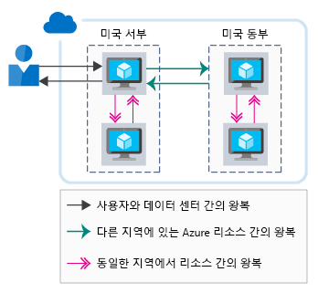

네트워크 성능은 사용자 환경에 상당한 영향을 미칠 수 있습니다. 많은 서비스가 있는 복합 아키텍처에서 각 홉의 대기 시간을 최소화하면 전체 성능에 큰 영향을 미칠 수 있습니다. 이 단원에서는 네트워크 대기 시간의 중요성과 아키텍처 내에서 이 시간을 줄이는 방법을 설명합니다. 또한 Lamna Healthcare에서 Azure 리소스 간에, 사용자와 Azure 간에 네트워크 대기 시간을 최소화하기 위한 전략을 채택하는 방법도 알아봅니다.

## 네트워크 대기 시간의 중요성

대기 시간은 지연 시간을 측정한 것입니다. 네트워크 대기 시간은 일부 네트워크 인프라에서 원본에서 대상으로 이동하는 데 필요한 시간입니다. 이 기간은 일반적으로 왕복 지연 또는 원본에서 대상으로 갔다가 다시 반대로 이동하는 데 걸리는 시간으로 알려져 있습니다.

기존 데이터 센터 환경에서는 리소스가 종종 동일한 위치와 공통 인프라 집합을 공유하기 때문에 대기 시간이 최소화될 수 있습니다. 리소스가 물리적으로 서로 가깝게 있는 경우 원본에서 대상으로 이동하는 데 걸리는 시간이 줄어듭니다.

비교해보면 클라우드 환경은 확장을 위해 구축된 환경입니다. 클라우드 호스트형 리소스는 동일한 랙, 데이터 센터 또는 지역에 있지 않을 수 있습니다. 이 분산형 접근 방식은 네트워크 통신의 왕복 시간에 영향을 줄 수 있습니다. 모든 Azure 지역은 고속 파이버 백본으로 상호 연결되어 있지만 빛의 속도는 여전히 물리적 한계입니다. 여러 다른 물리적 위치에 있는 서비스 간 호출에서는 여전히 두 서비스 간 거리와 직접적으로 상호 연관된 네트워크 대기 시간이 작용합니다.

그뿐 아니라, 응용 프로그램의 통신량이 많을수록 더 많은 왕복 시간이 필요합니다. 각 왕복에는 전체 대기 시간에 각 왕복 시간이 추가되는 대기 시간 세금이 붙습니다. 다음 그림에서는 사용자가 인식 하는 대기는 요청을 처리 하는 데 필요한 왕복의 조합 하는 방법을 보여 줍니다.

이제 최종 사용자에서 Azure 리소스까지 및 Azure 리소스 간의 성능을 개선하는 방법을 살펴보겠습니다.

## 여러 Azure 리소스 간 대기 시간

Lamna Healthcare가 유럽 서부 Azure 지역에서 하나의 웹 서버와 하나의 데이터베이스를 사용하는 새로운 환자 예약 시스템을 시험 사용한다고 가정해보세요. 이 웹 사이트는 동일한 지역의 Azure Blob 저장소에서 고정 미디어 자산(이미지, JavaScript, 스타일시트)을 검색하고 있습니다. 리소스가 Azure 지역 내에 공동 배치되므로 이 아키텍처는 전송되는 데이터 시간을 최소화합니다.

시스템의 파일럿이 잘 진행되어 오스트레일리아의 사용자까지 확장되었다고 가정해보세요. 이러한 사용자가 웹 사이트를 보려면 아일랜드에서 오스트레일리아까지 왕복 대기 시간이 발생하며, 네트워크 대기 시간으로 인해 해당 최종 사용자 환경의 질이 낮아집니다.

Lamna Healthcare 팀은 사용자 대기 시간을 줄이기 위해 오스트레일리아 동부 지역에서 다른 프런트 엔드 인스턴스 및 저장소 계정을 호스트하기로 결정했습니다. 이 디자인은 웹 서버가 최종 사용자에게 콘텐츠를 반환하는 시간을 줄이는 데 도움이 되지만, 오스트레일리아 동부에 있는 프런트 엔드 웹 서버와 유럽 서부에 있는 데이터베이스 간 통신에 상당한 대기 시간이 발생하므로 해당 환경은 여전히 좋지 않습니다.

나머지 대기 시간을 줄일 수 있는 다음과 같은 몇 가지 방법이 있습니다.

- 오스트레일리아 동부에서 데이터베이스의 읽기 복제본을 만듭니다. 이렇게 하면 읽기 성능이 개선되지만, 쓰기 시 여전히 대기 시간이 발생합니다. Azure SQL Database 지역 복제는 읽기 복제본에 사용할 수 있습니다.
- Azure SQL 데이터 동기화를 사용하여 지역 간에 데이터를 동기화합니다.
- Azure Cosmos DB와 같은 전역 분산된 데이터베이스를 사용합니다. 이를 통해 위치와 관계없이 읽기 및 쓰기가 발생할 수 있습니다.

여기서 목표는 응용 프로그램의 각 계층 간 네트워크 대기 시간을 최소화하는 것입니다. 이러한 문제를 해결하는 방법은 응용 프로그램 및 데이터 아키텍처에 따라 다르지만, Azure는 여러 서비스에서 이 문제를 해결하는 메커니즘을 제공합니다.

## 사용자 컨텍스트에서 Azure에 대한 대기 시간

Azure 리소스 간 대기 시간을 살펴보았지만 사용자와 클라우드 응용 프로그램 간의 대기 시간도 고려해야 합니다. 사용자에 대한 최종 사용자 인터페이스 전송을 최적화하려고 합니다. 최종 사용자와 응용 프로그램 간의 네트워크 성능을 개선하는 몇 가지 방법을 살펴보겠습니다.

### 엔드포인트 경로 최적화를 위해 DNS 부하 분산 장치 사용

Lamna Healthcare 예제에서는 팀이 오스트레일리아 동부에서 추가 웹 프런트 엔드 노드를 만들다는 사실을 확인했습니다. 그러나 최종 사용자는 사용할 프런트 엔드 엔드포인트를 명시적으로 지정해야 합니다. 솔루션의 디자이너로서 Healthcare Healthcare는 사용자에게 원활한 환경을 제공하려고 합니다.

Azure Traffic Manager가 도움이 될 수 있습니다. Traffic Manager는 DNS 기반 부하 분산 장치를 Azure 지역 내에서 트래픽을 분산할 수 있습니다. 웹 프런트 엔드의 특정 인스턴스로 이동 하는 사용자 대신 Traffic Manager 특성 집합을 기준으로 사용자를 라우팅할 수 있습니다.

- **우선 순위** - 순서가 지정된 프런트 엔드 인스턴스 목록을 지정합니다. 우선 순위가 가장 높은 인스턴스를 사용할 수 없는 경우, Traffic Manager는 사용자를 사용 가능한 다음 인스턴스로 라우팅합니다.
- **가중치 적용** - 각 프런트 엔드 인스턴스에 대해 가중치를 설정합니다. 그러면 Traffic Manager는 정의된 비율에 따라 트래픽을 분산합니다.
- **성능** -Traffic Manager는 사용자를 네트워크 대기 시간에 따라 가장 가까운 프런트 엔드 인스턴스로 라우팅합니다.
- **지리** - 프런트 엔드 배포를 위한 지리적 지역을 설정하여 데이터 주권 위임 또는 콘텐츠 지역화에 따라 사용자를 라우팅할 수 있습니다.

Traffic Manager 프로필을 중첩할 수도 있습니다. 먼저 지리적 라우팅을 사용하여 여러 지역(예: 유럽 및 오스트레일리아)에 사용자를 라우팅한 다음, 성능 라우팅 방법을 사용하여 사용자를 로컬 프런트 엔드 배포로 라우팅할 수 있습니다.

Lamna Healthcare에서 유럽 서부와 오스트레일리아에 웹 프런트 엔드를 배포했다고 생각해보세요. Azure SQL Database를 유럽 서부의 기본 배포에 배포했고, 읽기 복제본을 오스트레일리아 동부에 배포했다고 가정합니다. 또한 응용 프로그램이 읽기 쿼리를 위해 로컬 SQL 인스턴스에 연결할 수 있다고 가정합니다.

팀 성능 모드에서 Traffic Manager 인스턴스를 배포 하 고 Traffic Manager 프로필 두 프런트 엔드 인스턴스를 추가 합니다. 최종 사용자와 Traffic Manager로 라우팅하는 사용자 지정 도메인 이름 (예를 들어 lamnahealthcare.com)으로 이동 합니다. Traffic Manager에는 다음 최상의 네트워크 대기 시간 성능에 따라 유럽 서 부 또는 오스트레일리아 동부 프런트 엔드의 DNS 이름을 반환 합니다.

이 부하 분산은 DNS를 통해서만 처리되며, 여기에서 발생하는 인라인 부하 분산이나 캐싱은 없습니다. Traffic Manager는 사용자에게 가장 가까운 프런트 엔드의 DNS 이름을 반환하기만 합니다.

### CDN을 사용하여 사용자에게 가까운 콘텐츠 캐시

웹 사이트에서는 특정 형식의 정적 콘텐츠(전체 페이지나 이미지 및 비디오와 같은 자산)를 사용하기 쉽습니다. 이 콘텐츠는 Azure CDN과 같은 CDN(콘텐츠 배달 네트워크)을 사용하여 사용자에게 더 빨리 전달될 수 있습니다. 

Lamna가 Azure CDN에 콘텐츠를 배포하면 해당 항목이 전 세계의 여러 서버에 복사됩니다. 이러한 항목 중 하나에는 Blob 저장소에서 제공되는 비디오(`HowToCompleteYourBillingForms.MP4`)가 있습니다. 팀은 비디오에 대한 각 사용자 링크가 실제로 Blob 저장소를 참조하지 않고 사용자에게 가장 가까운 CDN 에지 서버를 참조하도록 웹 사이트를 구성합니다. 이 접근 방식은 콘텐츠를 대상에 더 가깝게 배치하여 대기 시간을 줄이고 사용자 환경을 향상시킵니다. 다음 그림에서는 어떻게 Azure CDN을 사용 하 여 대기 시간을 줄이고 사용자 환경을 개선 하는 대상에 더 가깝게 콘텐츠 배치를 보여 줍니다.

콘텐츠 전송 네트워크는 캐시된 동적 콘텐츠를 호스트하는 데 사용될 _수_도 있습니다. 그러나 캐시된 콘텐츠가 원본과 비교하여 오래된 버전일 수 있으므로 추가적인 측면을 고려해야 합니다. 컨텍스트 만료는 TTL(Time to Live)을 설정하여 제어할 수 있습니다. TTL이 너무 크면 오래된 콘텐츠가 표시될 수 있으며 캐시를 비워야 합니다.

캐시된 콘텐츠를 처리하는 한 가지 방법은 **동적 사이트 가속** 기능을 사용하는 것입니다. 이 기능을 사용하면 동적 콘텐츠가 있는 웹 페이지의 성능이 향상될 수 있습니다. 동적 사이트 가속은 솔루션의 추가 서비스(예: API 엔드포인트)에 낮은 대기 시간 경로를 제공할 수도 있습니다.

### 온-프레미스에서 Azure로의 연결에 ExpressRoute 사용

온-프레미스 환경에서 Azure로의 네트워크 연결을 최적화하는 것도 중요합니다. 가상 머신 또는 PaaS 제품(예: Azure App Service)에 호스팅되는 응용 프로그램에 연결하는 사용자가 응용 프로그램에 대해 최상의 연결을 설정하도록 보장할 수 있습니다. 

항상 공용 인터넷을 사용하여 사용자를 서비스에 연결할 수 있지만 인터넷 성능이 다를 수 있으며 외부 문제의 영향을 받을 수 있습니다. 그뿐 아니라 인터넷을 통해 모든 서비스를 노출하지 않으려고 할 수 있으며 Azure 리소스에 대한 사설 연결을 사용하려 할 수 있습니다.

인터넷을 통한 사이트 간 VPN도 사용 가능한 옵션이지만, 높은 처리량의 아키텍처에서는 VPN 오버헤드와 인터넷 가변성으로 인해 대기 시간이 눈에 띄게 늘어날 수 있습니다.

Azure ExpressRoute가 도움이 될 수 있습니다. ExpressRoute는 네트워크와 Azure 간의 전용 연결 전용로, Azure는 보장된 성능을 제공하고, 최종 사용자에게 모든 Azure 리소스에 대한 최상의 경로가 제공되도록 합니다. 다음 그림에서는 ExpressRoute 회로 온-프레미스 응용 프로그램 및 Azure 리소스 간의 연결을 제공 하는 방법을 보여 줍니다.

해당 시나리오를 다시 살펴보면 Lamna에서는 오스트레일리아 동부와 유럽 서부 둘 다에서 ExpressRoute 회로를 프로비전하여 해당 시설에 있는 사용자에게 더욱 개선된 최종 사용자 환경을 제공하기로 합니다. 이렇게 하면 최종 사용자에게 예약 시스템에 대한 직접적인 연결을 제공하고, 응용 프로그램에 대해 가능한 가장 낮은 대기 시간을 보장합니다.

## 요약

최종 사용자에게 최상의 성능을 보장하기 위해서는 네트워크 대기 시간이 아키텍처에 미치는 영향을 고려하는 것이 중요합니다. 최종 사용자와 Azure 간 및 Azure 리소스 간의 네트워크 대기 시간을 줄이는 몇 가지 옵션을 살펴보았습니다. 이제, 저장소 성능 최적화에 대해 알아보겠습니다.