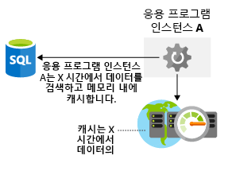

아키텍처에 저장소 성능 고려 사항을 포함하는 것이 중요합니다.It's important to include storage performance considerations in your architecture. 네트워크 대기 시간과 마찬가지로, 저장소 계층의 성능이 저하되면 최종 사용자 환경에 영향을 미칠 수 있습니다.Just like network latency, poor performance at the storage layer can impact your end-users' experience. 데이터 저장소는 어떻게 최적화하나요?How would you optimize your data storage? 아키텍처에 저장소 병목 상태를 발생하지 않도록 하려면 어떤 사항을 고려해야 하나요?What things do you need to consider to ensure that you're not introducing storage bottlenecks into your architecture? 여기서는 아키텍처에서 저장소 성능을 최적화하는 방법을 살펴보겠습니다.Here, we'll take a look at how to optimize your storage performance in your architecture.

## 가상 머신 저장소 성능 최적화Optimize virtual machine storage performance

먼저 가상 머신의 저장소 최적화에 대해 알아보겠습니다.Let's first look at optimizing storage for virtual machines. 디스크 저장소는 가상 머신의 성능에 중요한 역할을 하며, 응용 프로그램에 적합한 디스크 유형을 선택하는 것은 중요한 결정 사항입니다.Disk storage plays a critical role in the performance of your virtual machines, and selecting the right disk type for your application is an important decision.

응용 프로그램마다 저장소 요구 사항이 다릅니다.Different applications are going to have different storage requirements. 응용 프로그램은 디스크 읽기 및 쓰기 대기 시간에 민감하거나, 많은 수의 IOPS(초당 입/출력 작업)를 처리하는 능력 또는 더 큰 전체 디스크 처리량을 요구할 수 있습니다.Your application may be sensitive to latency of disk reads and writes or it may require the ability to handle a large number of input/output operations per second (IOPS) or greater overall disk throughput.

IaaS 워크로드를 빌드할 때 사용해야 하는 디스크 유형은 무엇인가요?When building an IaaS workload, which type of disk should you use? 디스크 유형에는 다음 네 가지 옵션이 있습니다.There are four options:

- **로컬 SSD 저장소** - 각 VM에는 로컬 SSD 저장소가 지원하는 임시 디스크가 있습니다.**Local SSD storage** - Each VM has a temporary disk that is backed by local SSD storage. 이 디스크의 크기는 가상 머신의 크기에 따라 달라집니다.The size of this disk varies depending on the size of the virtual machine. 이 디스크는 로컬 SSD이므로 성능은 높지만 유지 관리 이벤트 또는 VM 재배포 시 데이터가 손실될 수 있습니다.Since this disk is local SSD, the performance is high, but data may be lost during a maintenance event or a redeployment of the VM. 이 디스크는 영구적으로 필요하지 않은 데이터의 임시 저장소로만 적합합니다.This disk is only suitable for temporary storage of data that you do not need permanently. 이 디스크는 페이지 또는 스왑 파일과 SQL Server의 tempdb와 같은 항목에 유용합니다.This disk is great for the page or swap file, and for things like tempdb in SQL Server. 이 저장소에는 요금이 부과되지 않습니다.There is no charge for this storage. VM 비용에 포함됩니다.It's included in the cost of the VM.

- **표준 저장소 HDD** - 스핀들 디스크 저장소로, 대기 시간의 일관성이 없거나 처리량이 낮아 응용 프로그램이 구속되지 않는 경우에 적합합니다.**Standard storage HDD** - This is spindle disk storage and may fit well where your application is not bound by inconsistent latency or lower levels of throughput. 성능이 보장될 필요가 없는 개발/테스트 워크로드가 이 디스크 유형에 적합한 사용 사례입니다.A dev/test workload where guaranteed performance isn't needed is a great use case for this disk type.

- **표준 저장소 SSD** - SSD 백업 저장소로, SSD는 대기 시간이 짧지만 처리량 수준은 더 낮습니다.**Standard storage SSD** - This is SSD backed storage and has the low latency of SSD but lower levels of throughput. 비프로덕션 웹 서버가 이 디스크 유형에 적합한 사용 사례입니다.A non-production web server would be a good use case for this disk type.

- **프리미엄 저장소 SSD** - 이 SSD 백업 저장소는 프로덕션으로 이동될 예정이거나, 최대의 안정성 및 일관되게 적은 대기 시간이 필요하거나, 높은 수준의 처리량 및 IOPS가 필요한 워크로드에 적합합니다.**Premium storage SSD** - This SSD backed storage is well-suited for those workloads that are going into production, require the greatest reliability and demand consistent low latency, or need high levels of throughput and IOPS. 이러한 디스크는 성능과 안정성이 뛰어나기 때문에 모든 프로덕션 워크로드에 좋습니다.Since these disks have greater performance and reliability capabilities, they are recommended for all production workloads.

프리미엄 저장소는 특정 크기의 VM(가상 머신)에만 연결될 수 있습니다.Premium storage can attach only to specific virtual machine (VM) sizes. 프리미엄 저장소 가능 크기는 이름에 "s"가 지정됩니다(예: D2**s**_v3 또는 Standard_F2**s**_v2).Premium storage capable sizes are designated with an "s" in the name, for example D2**s**_v3 or Standard_F2**s**_v2. 모든 가상 머신 유형(이름에 “s” 포함 여부는 관계없음)은 표준 저장소 HDD 또는 SSD 드라이브를 연결할 수 있습니다.Any virtual machine type (with or without an "s" in the name) can attach standard storage HDD or SSD drives.

스트라이프 기술(Windows의 저장소 공간 다이렉트, Linux의 mdadm)을 사용하여 디스크를 스트라이프하면 여러 디스크에 디스크 활동을 분산시켜 처리량과 IOPS를 높일 수 있습니다.Disks can be striped using a striping technology (such as Storage Spaces Direct on Windows or mdadm on Linux) to increase the throughput and IOPS by spreading disk activity across multiple disks. 디스크 스트라이프는 실제로 디스크의 성능 제한을 끌어올릴 수 있도록 하며, 고성능 데이터베이스 시스템 및 저장소 요구 수준이 높은 기타 시스템에서 주로 확인됩니다.Using disk striping allows you to really push the limits of performance for disks, and is often seen in high-performance database systems and other systems with intensive storage requirements.

가상 머신 워크로드에 의존하는 경우 응용 프로그램의 성능 요구 사항을 평가하여 가상 머신에 대해 프로비전할 기본 저장소를 확인해야 합니다.When relying on virtual machine workloads, you'll need to evaluate the performance requirements of your application to determine the underlying storage you'll provision for your virtual machines.

## 응용 프로그램의 저장소 성능 최적화Optimize storage performance for your application

다른 저장소 기술을 사용하여 원시 디스크 성능을 향상할 수 있지만 응용 프로그램 계층에서 데이터에 대한 액세스 성능을 해결할 수도 있습니다.While you can use differing storage technologies to improve the raw disk performance, you can also address the performance of access to data at the application layer. 가능한 몇 가지 방법은 다음과 같습니다.Let's take a look at a few ways you can do this.

### 캐싱Caching

응용 프로그램 성능을 향상하는 일반적인 방법은 응용 프로그램과 데이터 저장소 사이에 캐싱 계층을 통합하는 것입니다.A common approach to improve application performance is to integrate a caching layer between your application and your data store. 캐시는 일반적으로 메모리에 데이터를 저장하고 빠른 검색을 허용합니다.A cache typically stores data in memory and allows for fast retrieval. 이러한 데이터는 자주 액세스하는 데이터, 데이터베이스에서 지정한 데이터 또는 임시 데이터(예: 사용자 상태)일 수 있습니다.This data can be frequently accessed data, data you specify from a database, or temporary data such as user state. 저장된 데이터의 유형, 새로 고침 빈도 및 만료 시기를 제어할 수 있습니다.You'll have control over the type of data stored, how often it refreshes, and when it expires. 이 캐시를 응용 프로그램과 데이터베이스가 동일한 지역에 함께 배치하여 둘 사이의 전반적인 대기 시간이 줄어 듭니다.By co-locating this cache in the same region as your application and database, you'll reduce the overall latency between the two. 캐시에서 데이터를 끌어오는 것이 데이터베이스에서 동일한 데이터를 검색하는 것보다 더 빠르므로, 캐싱 계층을 사용하여 응용 프로그램의 전반적인 성능을 상당히 향상할 수 있습니다.Pulling data out of the cache will almost always be faster than retrieving the same data from a database, so by using a caching layer you can substantially improve the overall performance of your application. 다음 일러스트레이션은 응용 프로그램이 데이터베이스에서 데이터를 검색하고, 캐시에 저장하고, 필요에 따라 캐시된 값을 사용하는 방법을 보여줍니다.The following illustration shows how an application retrieves data from a database, stores it in a cache, and uses the cached value as needed.

Azure Redis Cache는 메모리에 데이터를 저장하는 Azure의 캐싱 서비스입니다.Azure Redis Cache is a caching service on Azure that stores data in memory. 오픈 소스 Redis 캐시를 기반으로 하며 Microsoft에서 제공하는 완전한 관리 서비스 제품입니다.It's based upon the open-source Redis cache and is a fully managed service offering by Microsoft. 필요한 성능 계층을 선택하고 서비스를 사용하도록 응용 프로그램을 구성하세요.You select the performance tier that you require and configure your application to use the service.

### 다중저장소 지속성Polyglot persistence

다중저장소 지속성은 다양한 데이터 저장소 기술을 사용하여 저장소 요구 사항을 처리합니다.Polyglot persistence is the usage of different data storage technologies to handle your storage requirements.

전자상거래를 예로 들면,Consider an e-commerce example. 응용 프로그램 자산을 Blob 저장소에 저장하고, 제품 리뷰 및 권장 사항을 NoSQL 저장소에 저장하고, 사용자 프로필 또는 계정 데이터를 SQL 데이터베이스에 저장할 수 있습니다.You may store application assets in a blob store, product reviews and recommendations in a NoSQL store, and user profile or account data in a SQL database. 다음 일러스트레이션은 응용 프로그램이 다중 데이터 저장소 기술을 사용하여 다양한 형식의 데이터를 저장하는 방법을 보여줍니다.The following illustration shows how an application might use multiple data storage techniques to store different types of data.

이 방식은 각 데이터 저장소가 특정 사용 사례에 맞게 설계되거나, 비용 때문에 더 많이 액세스될 수 있으므로 중요합니다.This is important, as different data stores are designed for certain use cases or may be more accessible because of cost. 예를 들어 SQL 데이터베이스에 Blob을 저장하면 Blob 저장소에서 직접 액세스하는 것보다 비용이 많이 들고 속도가 느릴 수 있습니다.As an example, storing blobs in a SQL database may be costly and slower to access than directly from a blob store.

분산형 데이터 저장소에서 데이터 일관성을 유지하기가 매우 어려울 수 있습니다.Maintaining data consistency across distributed data stores can be a significant challenge. serialization 및 잠금 같은 전략은 모든 응용 프로그램 인스턴스가 동일한 데이터 저장소를 공유하고 응용 프로그램이 잠금을 매우 짧은 기간 동안만 유지하도록 설계된 경우에만 제대로 작동한다는 문제가 있습니다.The issue is that strategies such as serialization and locking only work well if all application instances share the same data store, and the application is designed to ensure that the locks are very short-lived. 그러나 데이터를 여러 데이터 저장소에 분할 또는 복제하는 경우에는 일관성을 유지하기 위해 데이터를 잠그고 serialization하는 비용이 많이 발생하여 시스템의 처리량, 응답 시간 및 확장성에 영향을 줄 수 있습니다.However, if data is partitioned or replicated across different data stores, locking and serializing data access to maintain consistency can become an expensive overhead that impacts the throughput, response time, and scalability of a system. 그러므로 대부분의 최신 분산형 응용 프로그램은 수정하는 데이터를 잠그지 않으며, 최종 일관성이라고 하는 보다 부드러운 방법으로 일관성을 유지합니다.Therefore, most modern distributed applications do not lock the data that they modify, and they take a rather more relaxed approach to consistency, known as eventual consistency.

최종 일관성이란 복제본 데이터 저장소는 쓰기가 더 이상 없으면 결국 수렴된다는 의미입니다.Eventual consistency means that replica data stores will eventually converge if there are no further writes. 데이터 저장소 중 하나에 쓰기가 수행되는 경우 다른 데이터 저장소에서 읽게 되면 약간 오래된 데이터가 제공될 수 있습니다.If a write is made to one of the data stores, reads from another may provide slightly out-of-date data. 최종 일관성은 모드 저장소에서 정보의 일관성이 확인될 때까지 기다리지 않아서 읽기 및 쓰기 대기 시간이 짧기 때문에 규모의 확장이 가능합니다.Eventual consistency enables higher scale because there is a low latency for reads and writes, rather than waiting to check if information is consistent across all stores.

## Lamna Healthcare 예제Lamna Healthcare example

Lamna Healthcare의 환자 예약 시스템은 두 Azure 지역인 유럽 서부와 오스트레일리아 동부에서 호스트됩니다.Lamna Healthcare's patient booking system is hosted across two Azure regions, West Europe and Australia East. 가상 머신을 웹 사이트 배포를 위한 프런트 엔드 노드로 사용하고 있으며, 유럽 서부에서는 Azure SQL DB가 기본 데이터베이스로, 오스트레일리아 동부에서는 읽기 가능한 보조 데이터베이스로 배포되어 있습니다.They're using virtual machines as the front-end nodes to deploy their website, and have Azure SQL DB deployed in West Europe as primary and Australia East as a readable secondary. 해당 프런트 엔드 노드는 높은 수준의 디스크 처리량이 필요하지 않지만, 일관된 대기 시간 성능 및 프로덕션 안정성이 필요하므로 프리미엄 SSD 백업 저장소를 사용했습니다.Their front-end nodes don't require high levels of disk throughput, but do require consistent latency performance and production reliability and have used Premium SSD backed storage.

일반적인 사용자 요청 및 의사 진료 가능 여부를 저장하기 위해 Azure 지역마다 로컬에서 Azure Redis Cache를 호스팅하고 있습니다.They are hosting an Azure Redis Cache locally in each Azure region to store the common user requests and availability of doctors. 응용 프로그램에서 확인된 가장 일반적인 데이터 읽기 작업의 성능을 최적화하기 위해 캐싱이 구현되었습니다.Caching has been implemented to optimize the performance of the most common data read activities observed on the application.

적절한 디스크 아키텍처를 선택하고 응용 프로그램 수준에서 캐시를 사용하고 데이터에 적합한 데이터 플랫폼을 선택하여 인프라 계층에서 저장소 성능을 향상시키는 방법에 대한 몇 가지 예제를 살펴보았습니다.We've covered a few examples of how you can improve storage performance in your infrastructure layer by choosing the right disk architecture and at the application level through the use of caching and selecting the right data platform for your data. 솔루션이 잘 설계되면 데이터에 대한 액세스가 가능한 한 제대로 수행될 수 있습니다.A properly architected solution will ensure that access to data performs as well as possible.