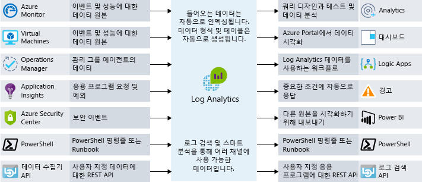

최종 사용자는 응용 프로그램에서 더 많은 기능을 기대합니다.End users are expecting more from their applications. 뛰어난 사용자 환경에서 작업하고 성능 문제의 영향을 받지 않기 원합니다.They want to have a great user experience and not be impacted by performance issues. 성능 병목 상태 확인 기능을 아키텍처에 통합하려면 어떻게 해야 하나요?How do you integrate performance bottleneck identification into your architecture? 이 단원에서는 응용 프로그램이 잘 작동되도록 하고 성능이 좋지 않을 때 이유를 추적하는 데 도움이 되는 프로세스와 도구를 살펴봅니다.In this unit, we will look at both processes and tools that can help ensure that your application performs well, and help you track down why if it doesn't.

## 요구 사항의 중요성Importance of requirements

성과를 논의하기 전에 요구 사항을 파악하는 것이 중요합니다.Before we talk about performance, it's important to talk about requirements. 이론상으로는 확장성과 성능을 계속해서 끝없이 향상할 수 있습니다.In theory, we could keep improving scalability and performance further and further without end. 그러나 특정 시점에서 추가로 향상하는 데 비용이 많이 들고 어려워지며, 가치 있는 비즈니스 영향력도 줄어들게 됩니다.At some point, however, more improvement is prohibitively expensive, difficult, and doesn't have enough business impact to be worthwhile. 

Microsoft의 **NFR(비기능적 요구 사항)** 은 이러한 시점을 파악하는 데 도움이 됩니다.Our **non-functional requirements** help us find that point. 이러한 특정 요구 사항은 앱이 *수행*해야 하는 작업을 알려주지 않습니다.These particular requirements don't tell us what our app must *do*. 대신, 충족해야 하는 품질 수준을 알려줍니다.Instead, they tell us what quality levels it must meet. 예를 들어 이러한 비기능적 요구 사항을 정의하여 알려줄 수 있습니다.As examples, we can define these non-functional requirements to tell us:

- 트랜잭션이 지정된 부하에서 결과를 반환해야 하는 속도.How fast a transaction must return under a given load.
- 오류를 반환하기 전까지 지원해야 하는 동시 연결 수.How many simultaneous connections we need to support before we start returning errors.
- 서버 실패 시, 백업이 온라인 상태가 되기 전에 응용 프로그램 작동 중지가 허용되는 최대 시간.In the event of server failure, what is the maximum amount of time our application is allowed be down before a back-up is online.

솔루션 빌드 전에 이러한 요구 사항을 정의하는 것은 응용 프로그램이 기대 수준을 충족하면서도 필요한 것보다 더 큰 노력이 필요하거나 더 큰 비용을 투입하지 않도록 하는 데 중요합니다.Defining these requirements in advance of building your solution is critical to ensure that the application meets expectations but doesn't require more effort or expend more money than necessary. 또한 이러한 비기능적 요구 사항에 대한 모니터링 및 운영 규칙을 계획할 수도 있습니다.We can also plan our monitoring and operations rules around these non-functional requirements. 

이해 관계자 또는 고객과 함께 요구 사항에 대해 논의하고, 문서로 기록한 후, 널리 알려서 모든 사람이 “적절한 성능”의 의미에 동의할 수 있도록 보장합니다.Discuss requirements with your stakeholders or customers, document them, and communicate them broadly to ensure that everyone agrees on what "good performance" means.

## DevOps 및 응용 프로그램 성능DevOps and application performance

DevOps 개발 이면에는 Microsoft 조직에 개발 및 인프라 사일로(silo)가 없다는 개념이 자리하고 있습니다.The idea behind DevOps is that we don't have development and infrastructure silos in our organization. 대신, 효율적인 프로세스에서 앱을 효과적으로 빌드, 배포, 모니터링 및 유지 관리하기 위해 노력합니다.Instead, they work together to effectively build, deploy, monitor, and maintain apps in streamlined process.

계획, 개발, 테스트 및 모니터링은 반복적인 접근 방식으로 수행됩니다.The planning, development, testing, and monitoring is carried out in an iterative approach. 응용 프로그램의 성능 및 품질은 라이브 환경에 배포하는 경우처럼 추가 작업이 아닌, 소프트웨어 개발 수명 주기에 포함됩니다.Performance and quality of our application become a part of our software development life cycle, rather than an afterthought as we deploy into a live environment. 다음 그림에서는 소프트웨어 개발 수명 주기에서 공동 작업의 기회가 있는 경우를 보여줍니다.The following illustration shows where opportunities for collaboration exist in the software development lifecycle.

이 접근 방식은 “shifting left”라고 하는 DevOps 개념과 일치합니다.This approach aligns with a DevOps concept called "shifting left". 즉, 품질 제어 검사를 배포 및 릴리스 프로세스 초기에 실시하는 것을 의미합니다.In other words, bring your quality control checks earlier into your deployment and release process. 이렇게 하면 최종 사용자에게 영향을 미치는 문제를 프로세스 초기에 찾아낼 수 있습니다.This allows you to catch end-user impacting issues earlier in the process. 연속 주기로 작업하므로 수동 상호 작용의 양을 제한하고 가능한 많은 작업을 자동화합니다.As we operate in a continuous cycle, we limit the amount of manual interaction and automate as much as possible. 

성능을 DevOps 프로세스의 일부로 만드는 한 가지 방법은 프로덕션 환경으로 배포하기 전에 성능 또는 부하 테스트를 수행하여 응용 프로그램이 비기능적 요구 사항을 충족하는지 유효성을 검사하는 것입니다.One way we make performance part of our DevOps process is to carry out performance or load tests to validate that the application meets the non-functional requirements prior to a deployment into production.

되도록 실제 프로덕션 서버에 영향을 주지 않으면서 프로덕션 환경과 정확히 동일한 환경에서 성능 및 부하 테스트를 수행할 수 있습니다.Ideally, we could carry out performance and load tests in an environment that is exactly like production while not impacting our actual production servers. 클라우드를 활용하는 경우 이 기능을 완전히 사용할 수 있습니다.When leveraging the cloud, you fully have this ability. 프로덕션 유사 환경 생성을 자동화하고, 테스트를 수행한 후, 해당 환경을 삭제하여 비용을 최소화할 수 있습니다.You can automate the creation of a production-like environment, perform testing, and then destroy the environment to minimize cost. 이러한 자동화 접근 방법은 응용 프로그램이 사용자가 지금 요구하는 확장을 처리하고, 향후 성장에 대응할 수 있다는 확신을 줄 수 있습니다.This approach to automation can provide reassurance that your application can handle the scale you require now, as well as respond to future growth.

응용 프로그램 성능 모니터링은 이러한 기능의 핵심 부분이 됩니다.Application performance monitoring becomes a core part of this. 응용 프로그램에 대해 성능 및 부하 테스트를 실행하고 있거나 프로덕션 성능을 계속 확인하려는 경우 응용 프로그램의 어떤 부분이 비최적화 상태로 작동할 수 있는지 이해하려고 합니다.If we're running performance and load tests on our application or want to keep our production performance in check, we want to understand what parts of our application may be performing non-optimally. 이 작업을 수행하기 위한 몇 가지 방법을 살펴보겠습니다.Let's take a look at some ways to do this.

## Azure의 성능 모니터링 옵션Performance monitoring options in Azure

모니터링은 비즈니스 응용 프로그램 및 관련 리소스의 성능, 상태 및 가용성을 결정하기 위해 데이터를 수집 및 분석하는 작업입니다.Monitoring is the act of collecting and analyzing data to determine the performance, health, and availability of your business application and associated resources.

응용 프로그램이 원활하게 실행되고 있다는 정보를 계속 제공받고 싶습니다.We want to be kept informed that our application is running smoothly. 자동 관리 알림을 사용하여 발생하는 중요한 문제에 대해 알림을 받을 수 있습니다.Proactive notifications can be used to inform about critical issues that arise. 고려할 모니터링 계층이 다양하며, 특히 인프라 계층과 응용 프로그램 계층에 유의해야 합니다.There are many layers of monitoring to consider, mainly the infrastructure layer and the application layer.

### Azure MonitorAzure Monitor

Azure Monitor는 인프라 수준 로그에 대한 단일 관리 지점과 대부분의 Azure 서비스에 대한 모니터링을 제공합니다.Azure Monitor provides a single management point for infrastructure-level logs and monitoring for most of your Azure services. Azure Monitor는 메트릭, 활동 로그, 진단 로그 등을 수집합니다.It collects metrics, activity logs, and diagnostic logs and more. Azure Monitor는 다음을 포함한 다양한 기능을 제공합니다.Azure Monitor provides us with a range of features including:

- Azure는 발생하는 메트릭 또는 활동 위반을 사전에 알리거나 조치를 취하도록 경고합니다.Azure alerts to proactively notify or take action on any breaches to metrics or activities arising.
- Azure 대시보드를 사용하여 여러 모니터링 원본을 응용 프로그램의 단일 보기로 결합합니다.Use Azure Dashboards to combine many monitoring sources into one view of our application.

Azure Monitor는 거의 실시간으로 모든 리소스 메트릭 인사이트를 확인하기에 적절한 시작점입니다.Azure Monitor is the place to start for all your near real-time resource metric insights. 많은 Azure 리소스가 배포 후에 자동으로 메트릭 출력을 시작합니다.Many Azure resources will start outputting metrics automatically once deployed. 예를 들어, Azure 웹앱 인스턴스는 계산 및 응용 프로그램 요청 메트릭을 출력합니다.For example, Azure Web App instances will output compute and application request metrics. VM 호스트 진단 메트릭 외에 Application Insights의 메트릭도 여기에서 수집 및 분석됩니다.Metrics from Application Insights are also collated here in addition to VM host diagnostic metrics. 옵트인(Opt-In)하면 VM 게스트 진단 메트릭도 표시됩니다.VM guest diagnostic metrics will also appear once you opt in.

### Log AnalyticsLog Analytics

중앙 집중식 로깅은 추적하기 어려운 숨겨진 문제를 찾아내는 데 도움이 될 수 있습니다.Centralized logging can help you uncover hidden issues that may be difficult to track down. Log Analytics를 사용하여 로그 간에 데이터를 쿼리하고 집계할 수 있습니다.With Log Analytics you can query and aggregate data across logs. 이러한 원본 간 상관 관계는 로그 또는 메트릭을 개별적으로 볼 경우 명확하지 않을 수 있는 문제 또는 성능 문제를 식별하는 데 도움이 될 수 있습니다.This cross-source correlation can help you identify issues or performance problems that may not be evident when looking at logs or metrics individually. 다음 그림은 Log Analytics가 모니터링 데이터의 중앙 허브 역할을 하는 방법을 보여 줍니다.The following illustration shows how Log Analytics acts as a central hub for monitoring data. Log Analytics는 Azure 리소스에서 모니터링 데이터를 받아 소비자가 분석 또는 시각화에 사용할 수 있도록 합니다.Log Analytics receives monitoring data from your Azure resources and makes it available to consumers for analysis or visualization.

광범위한 데이터 원본, 보안 로그, Azure 활동 로그, 서버, 네트워크 및 응용 프로그램 로그를 수집 및 분석할 수 있습니다.You can collate a wide range of data sources, security logs, Azure activity logs, server, network, and application logs. 하이브리드 배포 시나리오에서 온-프레미스 System Center Operations Manager 데이터를 Log Analytics에 밀어넣고, 자세한 성능 모니터링을 위해 Azure SQL Database에서 Log Analytics로 직접 진단 정보를 보내도록 할 수도 있습니다.You can also push on-premises System Center Operations Manager data to Log Analytics in hybrid deployment scenarios and have Azure SQL Database send diagnostic information directly into Log Analytics for detailed performance monitoring.

중앙 집중식 로깅은 성능 문제를 비롯한 모든 유형의 시나리오를 해결하는 데 큰 도움이 될 수 있습니다.Centralized logging can be massively beneficial for troubleshooting all types of scenarios, including performance issues. 모든 아키텍처에 적합한 모니터링 전략의 핵심 부분에 해당합니다.It's a key part of a good monitoring strategy for any architecture.

## 응용 프로그램 성능 관리Application performance management

심층적인 응용 프로그램 문제는 종종 추적하기 어렵습니다.Deep application issues are often tricky to track down. 이러한 경우 APM(응용 프로그램 성능 관리) 솔루션을 사용하여 원격 분석을 응용 프로그램으로 통합함으로써 하위 레벨 응용 프로그램 성능 및 동작을 추적하는 방식이 도움이 될 수 있습니다.This is where integrating telemetry into an application by using an application performance management solution (APM) to track down low-level application performance and behavior can be beneficial. 이 원격 분석에는 개별 페이지 요청 시간, 응용 프로그램 내의 예외 및 비즈니스 논리를 추적하기 위한 사용자 지정 메트릭도 포함될 수 있습니다.This telemetry can include individual page request times, exceptions within your application, and even custom metrics to track business logic. 이 원격 분석은 응용 프로그램 내에서 진행 중인 작업에 대한 풍부한 인사이트를 제공할 수 있습니다.This telemetry can provide a wealth of insight into what is going on within your application.

Azure에서 Application Insights는 이러한 심층 응용 프로그램 성능 관리를 제공하는 서비스입니다.On Azure, Application Insights is a service that provides this deep application performance management. 응용 프로그램에 작은 계측 패키지를 설치하고 Microsoft Azure Portal에서 Application Insights 리소스를 설정합니다.You install a small instrumentation package in your application, and set up an Application Insights resource in the Microsoft Azure portal. 이 계측 기능이 앱을 모니터링하여 포털에 원격 분석 데이터를 보냅니다.The instrumentation monitors your app and sends telemetry data to the portal.

호스트 환경(예: 성능 카운터, Azure 진단 및 Docker 로그)에서 원격 분석 데이터를 수집할 수 있습니다.Telemetry from the host environments, such as performance counters, Azure diagnostics, and Docker logs, can be ingested. 웹 서비스에 주기적으로 가상 요청을 보내는 웹 테스트를 설정할 수도 있습니다.You can also set up web tests that periodically send synthetic requests to your web service. 클라이언트 또는 서버 코드에 사용자가 직접 작성하는 사용자 지정 이벤트 및 메트릭을 전송하도록 응용 프로그램을 구성할 수도 있습니다.You could even configure your application to send custom events and metrics that you write yourself in the client or server code. 판매된 아이템 또는 승리한 게임 같은 응용 프로그램 고유의 이벤트를 예로 들 수 있습니다.For example, application-specific events such as items sold or games won.

Application Insights는 공통 리포지토리에 해당 데이터를 저장하며, 메트릭은 Azure Monitor와 공유됩니다.Application Insights stores its data in a common repository, and metrics are shared with Azure Monitor. Log Analytics 쿼리 언어를 사용하여 경고, 대시보드 및 심층 분석과 같은 공유된 기능을 활용할 수 있습니다.It can take advantage of shared functionality such as alerts, dashboards, and deep analysis with the Log Analytics query language.

웹 응용 프로그램의 가용성을 판별하는 데 사용되는 공통 패턴은 상태 엔드포인트 모니터링 패턴입니다.A common pattern used in determining the availability of a web application is the health endpoint monitoring pattern. 이 패턴은 웹 응용 프로그램 및 연결된 백 엔드 서비스를 모니터링하여 사용 가능한지와 제대로 작동되는지를 확인하는 데 사용됩니다.This pattern is used to monitor web applications and associated back-end services, to ensure that they're available and performing correctly. 패턴은 특정 URI를 쿼리하여 구현됩니다.The pattern is implemented by querying a particular uri. 엔드포인트는 프런트 엔드 자체의 가용성이 아닌 앱이 의존하는 백 엔드 서비스를 포함하는 많은 구성 요소의 상태를 확인합니다.The endpoint checks on the status of many components, including the back-end services that the app depends on, rather than just the availability of the front end itself. 이 엔드포인트는 서비스의 전체 상태 표시를 반환하는 서비스 수준 상태 검사로 작동합니다.This acts as a service-level health check that returns an indication of the overall health of the service.

Application Insights와 같은 APM 솔루션을 사용하여 응용 프로그램을 깊이 이해하고, 응용 프로그램 간 활동을 상호 연결합니다.Use an APM solution such as Application Insights to gain a deep understanding of your application and correlate activity across your application. 이렇게 하면 클라이언트 브라우저 및 서버에서 다운스트림 서비스까지 특정 작업이 작동하는 방식을 이해하는 데 도움이 됩니다.This can help you understand how a specific action works in the client browser, on the server, and through to downstream services. 또한 추세에 대한 인사이트를 제공하고, 문제가 있을 때 알려주며, 사용자가 인식하기 전에 문제 발생 위치 및 해결 방법을 파악하는 데 도움이 됩니다.It will also provide insight into trends, provide notifications when there is a problem, and help identify where the problem is and how to fix it, before your users are aware.

## Lamna Healthcare의 성능 모니터링Performance monitoring at Lamna Healthcare

Lamna Healthcare는 두 Azure 지역에서 가상 머신 및 Azure SQL 데이터베이스를 사용하여 웹 기반 환자 예약 시스템을 구현했습니다.Lamna Healthcare has implemented a web-based patient booking system using virtual machines and an Azure SQL database across two Azure regions. VM 에이전트 및 Log Analytics를 사용하여 기본 프런트 엔드 가상 머신의 성능을 모니터링하기로 결정했습니다.They've decided to use the VM Agent and Log Analytics to monitor the performance of the underlying front-end virtual machines.

Azure Monitor를 사용하여 Azure SQL 데이터베이스의 성능을 이해하고, CPU % 및 교착 상태와 같은 주요 성능 메트릭을 캡처합니다.They use Azure Monitor to understand the performance of their Azure SQL databases and capture key performance metrics including CPU % and deadlocks.

Application Insights는 가용성 및 원격 분석 정보를 캡처하도록 구성되었습니다.Application Insights has been configured to capture availability and telemetry information. 팀은 사용자 지정 이벤트 원격 분석을 Application Insights로 전송하도록 새 예약 기능을 변경했습니다.The team has changed their new booking functionality to send custom event telemetry to Application Insights. 이제 팀에서는 발생하는 비즈니스 관련 이벤트의 용량을 이해하는 방식을 갖추게 되었으며 해당 응용 프로그램 내에서 진행되는 작업에 대해 더 나은 인사이트를 얻을 수 있습니다.The team now has an approach to understanding the volume of business-related events taking place, and they can get much better insight into what's going on within their application.

일부 프로세스, 도구 및 모범 사례를 검토하여 성능 문제를 추적하고 응용 프로그램이 최적 상태에서 작동하고 있는지 확인했습니다.We've looked at some processes, tools, and best practices to help you track down performance issues and ensure that your application is performing at its best.