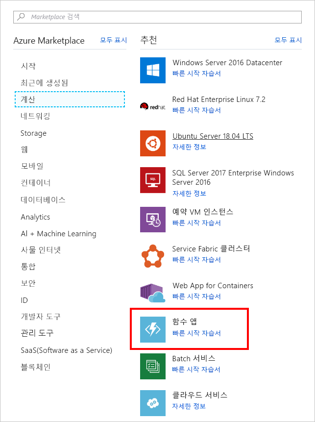

<span data-ttu-id="67538-101">이 단원에서는 타이머 트리거를 사용하여 20초마다 호출되는 Azure 함수 앱을 만듭니다.</span><span class="sxs-lookup"><span data-stu-id="67538-101">In this unit, we create an Azure function app that's invoked every 20 seconds using a timer trigger.</span></span>

[!include[](../../../includes/azure-sandbox-activate.md)]

## <a name="create-an-azure-function-app"></a><span data-ttu-id="67538-102">Azure 함수 앱 만들기</span><span class="sxs-lookup"><span data-stu-id="67538-102">Create an Azure function app</span></span>

<span data-ttu-id="67538-103">먼저 포털에서 Azure Function 앱을 만들어 보겠습니다.</span><span class="sxs-lookup"><span data-stu-id="67538-103">Let’s start by creating an Azure Function app in the portal.</span></span>

1. <span data-ttu-id="67538-104">샌드박스를 활성화한 동일한 계정을 사용하여 [Azure Portal](https://portal.azure.com/learn.docs.microsoft.com?azure-portal=true)에 로그인합니다.</span><span class="sxs-lookup"><span data-stu-id="67538-104">Sign into the [Azure portal](https://portal.azure.com/learn.docs.microsoft.com?azure-portal=true) using the same account you activated the sandbox with.</span></span>

1. <span data-ttu-id="67538-105">왼쪽 탐색에서 **리소스 만들기**를 선택합니다.</span><span class="sxs-lookup"><span data-stu-id="67538-105">In the left navigation, select **Create a resource**.</span></span>

1. <span data-ttu-id="67538-106">**계산**을 선택합니다.</span><span class="sxs-lookup"><span data-stu-id="67538-106">Select **Compute**.</span></span>

1. <span data-ttu-id="67538-107">**함수 앱**을 찾아 선택합니다.</span><span class="sxs-lookup"><span data-stu-id="67538-107">Locate and select **Function App**.</span></span> <span data-ttu-id="67538-108">필요에 따라 검색 줄을 사용하여 템플릿을 찾을 수도 있습니다.</span><span class="sxs-lookup"><span data-stu-id="67538-108">You can also optionally use the search bar to locate the template.</span></span>

    

1. <span data-ttu-id="67538-110">글로벌로 고유한 **앱 이름**을 입력합니다.</span><span class="sxs-lookup"><span data-stu-id="67538-110">Enter a globally unique **App name**.</span></span>

1. <span data-ttu-id="67538-111">**구독**을 선택합니다.</span><span class="sxs-lookup"><span data-stu-id="67538-111">Select a **Subscription**.</span></span>

1. <span data-ttu-id="67538-112">기존 **리소스 그룹** <rgn>[샌드박스 리소스 그룹 이름]</rgn>을 선택합니다.</span><span class="sxs-lookup"><span data-stu-id="67538-112">Select the existing **Resource group** <rgn>[sandbox resource group name]</rgn>.</span></span>

1. <span data-ttu-id="67538-113">**OS**로 **Windows**를 선택합니다.</span><span class="sxs-lookup"><span data-stu-id="67538-113">Choose **Windows** as your **OS**.</span></span>

1. <span data-ttu-id="67538-114">**호스팅 플랜**에 대한 **사용 플랜**을 선택합니다.</span><span class="sxs-lookup"><span data-stu-id="67538-114">Choose **Consumption Plan** for your **Hosting Plan**.</span></span> <span data-ttu-id="67538-115">각 함수 실행에 대한 요금이 청구됩니다.</span><span class="sxs-lookup"><span data-stu-id="67538-115">You're charged for each execution of your function.</span></span> <span data-ttu-id="67538-116">리소스는 응용 프로그램 워크로드에 따라 자동으로 할당됩니다.</span><span class="sxs-lookup"><span data-stu-id="67538-116">Resources are automatically allocated based on your application workload.</span></span>

1. <span data-ttu-id="67538-117">사용 가능한 아래 목록에서 **위치**를 선택합니다.</span><span class="sxs-lookup"><span data-stu-id="67538-117">Select a **Location** from the available list below.</span></span>

    [!include[](../../../includes/azure-sandbox-regions-first-mention-note-friendly.md)]

1. <span data-ttu-id="67538-118">새 **저장소** 계정을 만들고, 원하는 경우 이름을 변경할 수 있습니다. 그러면 변경된 앱 이름이 기본값이 됩니다.</span><span class="sxs-lookup"><span data-stu-id="67538-118">Create a new **Storage** account, you can change the name if you like - it will default to a variation of the App name.</span></span>

1. <span data-ttu-id="67538-119">**만들기**를 선택합니다.</span><span class="sxs-lookup"><span data-stu-id="67538-119">Select **Create**.</span></span> <span data-ttu-id="67538-120">함수 앱을 배포한 후 포털에서 **모든 리소스**로 이동합니다.</span><span class="sxs-lookup"><span data-stu-id="67538-120">Once the function app is deployed, go to **All resources** in the portal.</span></span> <span data-ttu-id="67538-121">함수 앱이 **App Service** 형식으로 나열되며 사용자가 지정한 이름을 사용합니다.</span><span class="sxs-lookup"><span data-stu-id="67538-121">The function app will be listed with type **App Service** and has the name you gave it.</span></span>

## <a name="create-a-timer-trigger"></a><span data-ttu-id="67538-122">타이머 트리거 만들기</span><span class="sxs-lookup"><span data-stu-id="67538-122">Create a timer trigger</span></span>

<span data-ttu-id="67538-123">이제 함수 내에 타이머 트리거를 만들겠습니다.</span><span class="sxs-lookup"><span data-stu-id="67538-123">Now we're going to create a timer trigger inside our function.</span></span>

1. <span data-ttu-id="67538-124">함수를 만든 후 왼쪽 탐색에서 **모든 리소스**를 선택합니다.</span><span class="sxs-lookup"><span data-stu-id="67538-124">After the function is created, select **All resources** from the left navigation.</span></span>

1. <span data-ttu-id="67538-125">목록에서 함수 앱을 찾아 선택합니다.</span><span class="sxs-lookup"><span data-stu-id="67538-125">Find your function app in the list and select it.</span></span>

1. <span data-ttu-id="67538-126">새 블레이드에서 **함수**를 가리키고 더하기(+) 아이콘을 선택합니다.</span><span class="sxs-lookup"><span data-stu-id="67538-126">On the new blade, point to **Functions** and select the plus (+) icon.</span></span>

    

1. <span data-ttu-id="67538-128">**타이머**를 선택합니다.</span><span class="sxs-lookup"><span data-stu-id="67538-128">Select **Timer**.</span></span>

1. <span data-ttu-id="67538-129">언어로 **CSharp**를 선택합니다.</span><span class="sxs-lookup"><span data-stu-id="67538-129">Select **CSharp** as the language.</span></span>

1. <span data-ttu-id="67538-130">**이 함수 만들기**를 선택합니다.</span><span class="sxs-lookup"><span data-stu-id="67538-130">Select **Create this function**.</span></span>

## <a name="configure-the-timer-trigger"></a><span data-ttu-id="67538-131">타이머 트리거 구성</span><span class="sxs-lookup"><span data-stu-id="67538-131">Configure the timer trigger</span></span>

<span data-ttu-id="67538-132">로그 창에 메시지를 인쇄하는 논리가 포함된 Azure 함수 앱이 있습니다.</span><span class="sxs-lookup"><span data-stu-id="67538-132">We have an Azure function app with logic to print a message to the log window.</span></span> <span data-ttu-id="67538-133">20초마다 실행하도록 타이머 일정을 설정하겠습니다.</span><span class="sxs-lookup"><span data-stu-id="67538-133">We're going to set the schedule of the timer to execute every 20 seconds.</span></span>

1. <span data-ttu-id="67538-134">**통합**을 선택합니다.</span><span class="sxs-lookup"><span data-stu-id="67538-134">Select **Integrate**.</span></span>

1. <span data-ttu-id="67538-135">**일정** 상자에 다음 값을 입력합니다.</span><span class="sxs-lookup"><span data-stu-id="67538-135">Enter the following value into the **Schedule** box:</span></span>

    ```log
    */20 * * * * *
    ```

1. <span data-ttu-id="67538-136">**저장**을 선택합니다.</span><span class="sxs-lookup"><span data-stu-id="67538-136">Select **Save**.</span></span>

## <a name="test-the-timer"></a><span data-ttu-id="67538-137">타이머 테스트</span><span class="sxs-lookup"><span data-stu-id="67538-137">Test the timer</span></span>

<span data-ttu-id="67538-138">이제 타이머를 구성했으므로 정의한 간격으로 함수를 호출합니다.</span><span class="sxs-lookup"><span data-stu-id="67538-138">Now that we've configured the timer, it will invoke the function on the interval we defined.</span></span>

1. <span data-ttu-id="67538-139">**TimerTriggerCSharp1**을 선택합니다.</span><span class="sxs-lookup"><span data-stu-id="67538-139">Select **TimerTriggerCSharp1**.</span></span>

    > [!NOTE]
    > <span data-ttu-id="67538-140">**TimerTriggerCSharp1**은 기본 이름입니다.</span><span class="sxs-lookup"><span data-stu-id="67538-140">**TimerTriggerCSharp1** is a default name.</span></span> <span data-ttu-id="67538-141">트리거를 만들 때 자동으로 선택됩니다.</span><span class="sxs-lookup"><span data-stu-id="67538-141">It's automatically selected when you create the trigger.</span></span>

1. <span data-ttu-id="67538-142">화면의 맨 아래에서 **로그** 창을 엽니다.</span><span class="sxs-lookup"><span data-stu-id="67538-142">Open the **Logs** panel at the bottom of the screen.</span></span>

1. <span data-ttu-id="67538-143">로그 창에서 새 메시지가 20초마다 도착하는지 관찰합니다.</span><span class="sxs-lookup"><span data-stu-id="67538-143">Observe new messages arrive every 20 seconds in the log window.</span></span>

1. <span data-ttu-id="67538-144">함수 실행을 중지하려면 **관리**를 선택한 다음, **함수 상태**를 *사용 안 함*으로 전환합니다.</span><span class="sxs-lookup"><span data-stu-id="67538-144">To stop the function from running, select **Manage** and then switch **Function State** to *Disabled*.</span></span>
