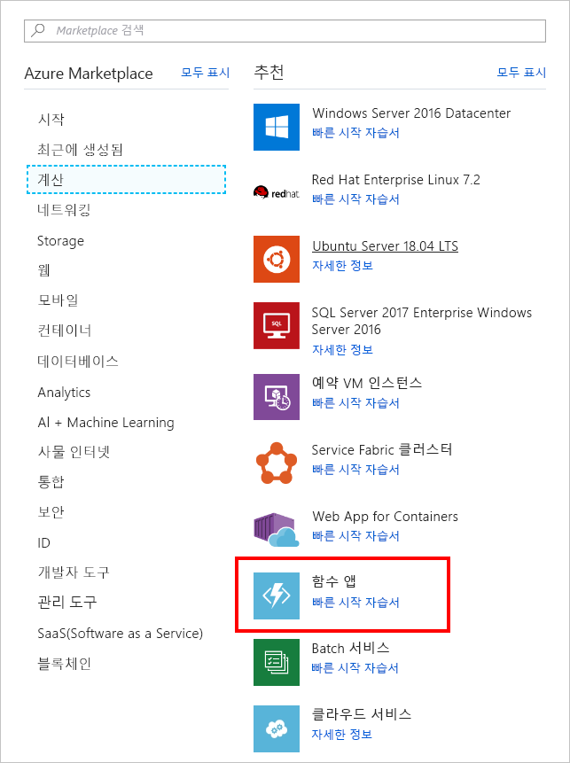

이 연습에서는 타이머 트리거를 사용하여 20초마다 호출되는 Azure 함수를 만듭니다.

> [!NOTE] 
> 이 연습을 완료하려면 유효한 계정으로 [Azure Portal](https://portal.azure.com/)에 로그인했는지 확인하세요.

## <a name="create-an-azure-function"></a>Azure Function 만들기

먼저 포털에서 Azure 함수를 만들어 보겠습니다.

1. 왼쪽 탐색에서 **리소스 만들기**를 선택합니다.

1. **계산**을 선택합니다.

1. **함수 앱**을 찾아 선택합니다. 필요한 경우 검색 창을 사용하여 템플릿을 찾을 수도 있습니다.

    

1. 고유한 **앱 이름**을 입력합니다.

1. **구독**을 선택합니다.

1. 새 **리소스 그룹**을 만듭니다.

1. **OS**로 **Windows**를 선택합니다.

1. **호스팅 플랜**에 대한 **사용 플랜**을 선택합니다. 각 함수 실행에 대한 요금이 청구됩니다. 리소스는 응용 프로그램 워크로드에 따라 자동으로 할당됩니다.

1. **위치**를 선택합니다.

1. 새 **저장소** 계정을 만듭니다. 이 값은 필수이나 앞으로 사용하지 않습니다.

1. **Application Insights**를 끕니다.

1. **만들기**를 선택합니다.

## <a name="create-a-timer-trigger"></a>타이머 트리거 만들기

이제 Azure 함수 내에 타이머 트리거를 만들겠습니다.

1. Azure 함수를 만든 후 왼쪽 탐색에서 **모든 리소스**를 선택합니다.

1. Azure 함수를 찾아 선택합니다.

1. 새 블레이드에서 **함수**를 가리키고 더하기(+) 아이콘을 선택합니다.

    

1. **타이머**를 선택합니다.

1. 언어로 **CSharp**를 선택합니다.

1. **이 함수 만들기**를 선택합니다.

## <a name="configure-the-timer-trigger"></a>타이머 트리거 구성

로그 창에 메시지를 인쇄하는 논리가 포함된 Azure 함수가 있습니다. 20초마다 실행하도록 타이머 일정을 설정하겠습니다.

1. **통합**을 선택합니다.

1. **일정** 상자에 다음 값을 입력합니다.

    ```
    */20 * * * * *
    ```

1. **저장**을 선택합니다.

## <a name="start-the-timer"></a>타이머 시작

이제 타이머를 구성했으므로 시작할 준비가 되었습니다.

1. **TimerTriggerCSharp1**을 선택합니다. 

    > [!NOTE]
    > **TimerTriggerCSharp1**은 기본 이름입니다. 트리거를 만들 때 자동으로 선택됩니다.

1. **실행**을 선택합니다. 

이때 로그 창에 20초마다 메시지가 표시됩니다.

## <a name="clean-up"></a>정리

이 함수에 대해 요금이 청구되지 않도록 하려면 로그 창 위에 있는 **일시 중지**를 선택하여 타이머를 중지합니다.


