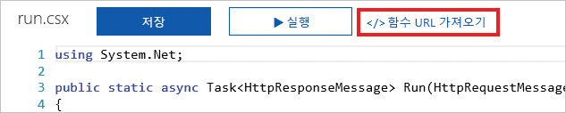

HTTP 요청은 대부분의 플랫폼 및 장치에서 공통적인 작업입니다. 사전에서 단어를 조회하거나 지역 날씨를 가져오는 요청인지에 관계없이 항상 HTTP 요청을 보냅니다. Azure Functions를 사용하면 HTTP 요청을 수신할 때 실행할 하나의 논리를 신속하게 만들 수 있습니다.  

여기서는 HTTP 트리거를 사용하여 Azure 함수를 만들고 호출하는 방법을 알아봅니다. 또한 사용 가능한 일부 사용자 지정 옵션을 살펴봅니다.

## HTTP 트리거란?

HTTP 트리거는 HTTP 요청을 수신할 때 함수를 실행하는 트리거입니다. HTTP 트리거에는 다음을 포함한 많은 기능과 사용자 지정이 있습니다.

- 키를 제공하여 권한 부여된 액세스를 제공합니다.
- 지원되는 HTTP 동사를 제한합니다.
- 데이터를 다시 호출자에게 반환합니다.
- 쿼리 문자열 매개 변수 또는 요청 본문을 통해 데이터를 수신합니다.
- 함수 URL을 수정하기 위한 URL 경로 템플릿을 지원합니다.

HTTP 트리거를 만들 때 프로그래밍 언어를 선택하고, 트리거 이름을 제공하고, 권한 수준을 선택합니다.

## HTTP 트리거 권한 수준이란?

HTTP 트리거 권한 수준은 인증상 이유로 들어오는 HTTP 요청에 API 키가 필요한지를 나타내는 플래그입니다.

다음과 같은 세 가지 권한 수준이 있습니다.

- 함수
- 익명
- 관리자

**함수** 및 **관리자** 수준은 “키”를 기반으로 합니다. HTTP 요청을 보내려면 인증용 키를 제공해야 합니다. 두 가지 형식의 키는 ‘함수’ 및 ‘호스트’입니다. 두 키 사이의 차이점은 범위입니다. ‘함수’ 키는 함수에만 해당합니다. ‘호스트’ 키는 전체 Azure Functions 응용 프로그램 내의 모든 함수에 적용됩니다. 권한 수준이 **함수**로 설정된 경우 ‘함수’ 또는 ‘호스트’ 키를 사용할 수 있습니다. 권한 수준이 **관리자**로 설정된 경우 ‘호스트’ 키를 제공해야 합니다.

**익명** 수준은 필요한 인증이 없음을 의미합니다. 연습에서 이 수준을 사용합니다.

## HTTP 트리거를 만드는 방법

타이머 트리거처럼 Azure Portal을 통해 HTTP 트리거를 만들 수 있습니다. Azure 함수 내의 미리 정의된 트리거 형식 목록에서 **HTTP 트리거**를 선택합니다. 그런 다음, 실행할 논리를 입력하고 특정 HTTP 동사의 사용을 제한하는 것과 같은 사용자 지정을 만듭니다. 

알고 있어야 하는 하나의 설정은 **요청 매개 변수 이름**입니다. 이 설정은 들어오는 HTTP 요청에 대한 정보를 포함하는 매개 변수의 이름을 나타내는 문자열입니다. 기본적으로 매개 변수의 이름은 *req*입니다.

## HTTP 트리거를 호출하는 방법

HTTP 트리거를 호출하려면 HTTP 요청을 함수의 URL로 보냅니다. 이 URL을 가져오려면 함수의 코드 페이지로 이동하여 **함수 URL 가져오기** 링크를 선택합니다.

함수의 URL을 가져온 후 HTTP 요청을 보낼 수 있습니다. 함수가 데이터를 수신하는 경우 쿼리 문자열 매개 변수를 사용하거나 요청 본문을 통해 데이터를 제공할 수 있습니다.

## 요약

HTTP 트리거는 함수 URL에 대한 HTTP 요청을 수신할 때 Azure 함수를 호출합니다. HTTP 트리거를 사용하면 데이터를 수신하고 데이터를 다시 호출자에게 반환할 수 있습니다.
