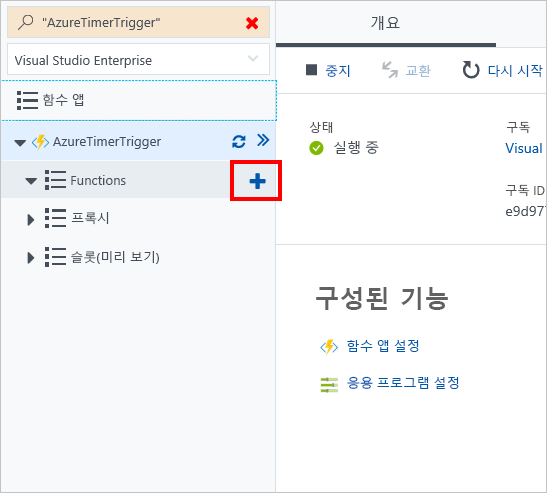

이 연습에서는 만들거나 업데이트될 때 Blob의 이름과 크기를 표시하는 Azure 함수를 만들겠습니다.In this exercise, we're going to create an Azure function that displays the name and size of a blob when it's created or updated. 

> [!NOTE]
> 이 연습을 완료하려면 유효한 계정으로 [Azure Portal](https://portal.azure.com/)에 로그인했는지 확인하세요.To complete this exercise, make sure you're signed in to the [Azure portal](https://portal.azure.com/) with a valid account.

## Blob 트리거 만들기Create a blob trigger

다시 기존 Azure Functions 응용 프로그램을 계속 사용하고 Blob 트리거를 추가해 보겠습니다.Again, let's continue using our existing Azure Functions application and add a blob trigger.

1. **함수**를 가리키고 더하기(+) 아이콘을 선택합니다.Point to **Functions** and select the plus (+) icon.

    

1. **Blob 트리거**를 선택합니다.Select **Blob trigger**.

1. 언어로 **C#** 을 선택합니다.Select **C#** as the language. 

1. **이름**은 기본값으로 그대로 둡니다.Leave the **Name** set to the default value.

1. **경로**는 기본값으로 그대로 둡니다.Leave the **Path** set to the default value.

1. 기존 Azure Storage 계정을 선택하거나, Azure에서 새 계정을 만들려면 **만들기**를 선택합니다.Select an existing Azure Storage account, or select **Create** if you want Azure to create a new account for you.

## Storage 탐색기 다운로드Download Storage explorer

이제 Blob 트리거를 만들었으므로 Blob을 쉽게 만들 수 있는 Storage 탐색기를 다운로드해 보겠습니다.Now that we've created a blob trigger, let's download Storage explorer, which will allow us to easily create a blob.

- [Storage 탐색기](http://storageexplorer.com)를 다운로드합니다.Download [Storage explorer](http://storageexplorer.com).

## Azure Storage 계정에 연결Connect to your Azure Storage account

이제 Storage 탐색기를 다운로드했습니다.We now have Storage explorer downloaded. 제공된 자격 증명을 사용하여 로그인해 보겠습니다.Let's sign in using the credentials that were supplied.

1. Storage 탐색기에서 왼쪽에 있는 더하기(+) 아이콘을 선택합니다.In Storage explorer, select the plus (+) icon on the left.

1. **저장소 계정 이름 및 키 사용**을 선택합니다.Select **Use a storage account name and key**.

1. **다음**을 선택합니다.Select **Next**.

1. Azure의 Blob 트리거 아래에서 **통합**을 선택합니다.In Azure, under your blob trigger, select **Integrate**.

1. **문서**를 선택하여 보기를 확장합니다.Select **Documentation** to expand the view.

1. **계정 이름** 및 **계정 키**를 복사합니다.Copy the **Account Name** and **Account Key**.

1. Storage 탐색기로 돌아가 **계정 이름** 및 **계정 키**에 붙여넣습니다.Back in Storage explorer, paste in the **Account Name** and **Account Key**.

1. **표시 이름**을 입력합니다.Enter a **Display name**. 이 값은 Storage 탐색기의 연결 이름입니다.This value is the name of the connection in Storage explorer.

1. **다음**을 선택합니다.Select **Next**.

1. **연결**을 선택합니다.Select **Connect**. 

## Blob 컨테이너 만들기Create a blob container

Azure Storage 계정에 연결되어 있지 않습니다.We aren't connected to our Azure Storage account. Blob 트리거는 **경로** 필드에 설명된 위치만 모니터링합니다.Remember that our blob trigger is monitoring only the location described in the **Path** field. 기본적으로 경로는 다음과 같아야 합니다.By default, our path should be:

> samples-workitems/{name}samples-workitems/{name}

**samples-workitems**라는 컨테이너를 만들어야 합니다.We need to create a container called **samples-workitems**.

1. Storage 탐색기에서 저장소 계정을 확장합니다.In Storage explorer, expand your storage account. 이름은 연결 프로세스 중에 제공한 **표시 이름**이어야 합니다.The name should be the **Display name** that you provided during the connection process.

1. **Blob 컨테이너**를 마우스 오른쪽 단추로 클릭하고 **Blob 컨테이너 만들기**를 선택합니다.Right-click **Blob Containers** and select **Create blob container**.

1. **samples-workitems**를 입력합니다.Enter **samples-workitems**.

## Blob 트리거 켜기Turn on your blob trigger

이제 모니터링할 컨테이너를 만들었으므로 Blob을 만들 때 출력을 볼 수 있도록 함수를 실행해 보겠습니다.Now that we've created our container to monitor, let's run our function so we can see output when a blob is created.

1. Blob 트리거를 선택하여 코드 화면을 엽니다.Select your blob trigger to open the code screen.

1. **실행**을 선택합니다.Select **Run**.

## Blob 만들기Create a blob

이제 Blob 트리거가 시작되어 작업을 수신 대기합니다.Our blob trigger is now up and listening for activity. 로그 메시지를 가져올지 확인하는 Blob을 만들어 보겠습니다.Let's create a blob to see if we get a log message.

1. Storage 탐색기에서 **samples-workitems** 컨테이너를 선택합니다.In Storage explorer, select the **samples-workitems** container.

1. **업로드**를 선택합니다.Select **Upload**. 

1. **파일 업로드**를 선택합니다.Select **Upload Files**.

1. 컴퓨터에서 파일을 선택합니다.Select any file from your computer.

1. **업로드**를 선택합니다.Select **Upload**.

1. Azure로 돌아갑니다.Go back to Azure. 로그에서 업로드된 파일을 표시하는 메시지를 확인합니다.Check your logs for a message that displays what file was uploaded.

## 정리Clean up

이 함수에 대해 요금이 청구되지 않도록 하려면 로그 창 위에 있는 **일시 중지**를 선택합니다.To ensure that you aren't charged for this function, select **Pause** above the log window.

