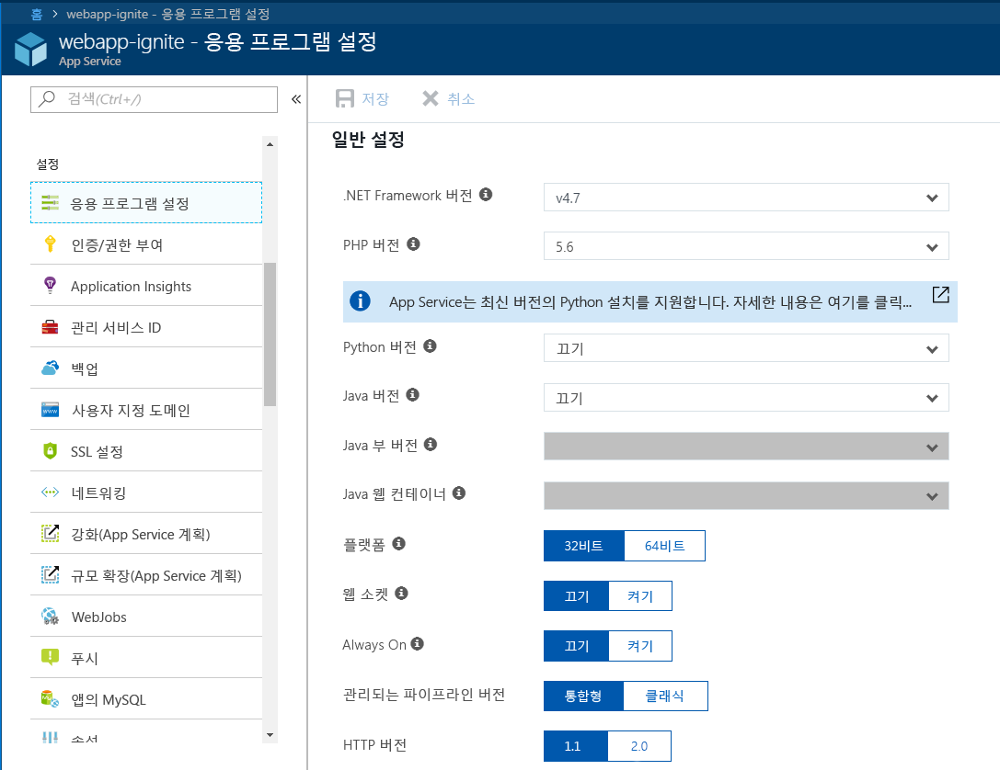
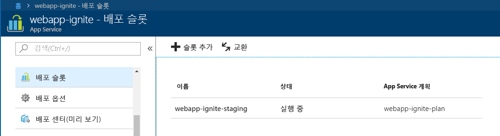
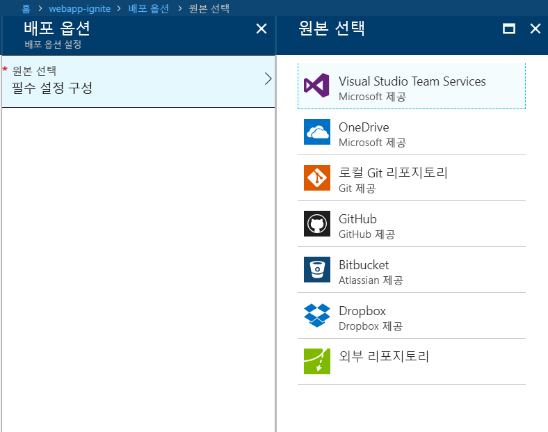

여기서는 Azure Portal을 사용하여 Azure App Service에서 웹앱을 만드는 방법에 대해 알아봅니다.Here, you'll learn how to create a web app in Azure App Service using the Azure portal.

## Azure Portal을 사용하는 이유는 무엇인가요?Why use the Azure portal?

웹 응용 프로그램을 호스트하는 첫 번째 단계는 Azure 구독 내부에 웹앱(App Service 앱)을 만드는 것입니다.The first step in hosting your web application is to create a web app (an App Service app) inside your Azure subscription.

웹앱을 만들 수 있는 여러 가지 방법이 있습니다.There are several ways you can create a web app. Azure Portal, Azure CLI, 스크립트 또는 IDE를 사용할 수 있습니다.You can use the Azure portal, the Azure CLI, a script, or an IDE.

여기서는 좋은 학습 도구가 될 수 있는 그래픽 환경인 포털을 사용합니다.Here, we are going to use the portal because it's a graphical experience, which makes it a great learning tool. 포털을 통해 사용 가능한 기능을 검색하고, 다른 리소스를 추가하고, 기존 리소스를 사용자 지정할 수 있습니다.The portal helps you discover available features, add additional resources, and customize existing resources.

## Azure App Service란?What is Azure App Service?

Azure App Service는 Azure 환경 내에서 완전히 관리되는 컴퓨팅 플랫폼으로, 웹앱, REST API 및 모바일 백 엔드를 호스트하는 데 최적화되어 있습니다.Azure App Service is a fully managed computing platform within the Azure environment that is optimized for hosting web apps, REST APIs, and mobile back ends.

Microsoft Azure에서 제공하는 이 PaaS(Platform as a Service)를 사용하면 Azure가 응용 프로그램을 실행하고 크기를 조정하기 위한 인프라를 관리하는 동안 빌드 측면에 초점을 맞출 수 있습니다.This platform as a service (PaaS) offered by Microsoft Azure allows you to focus on the build side of things while Azure takes care of the infrastructure to run and scale your applications.

## 웹앱을 만드는 방법How to create a web app

사용자 고유의 앱을 호스트해야 하면 Azure Portal을 방문하여 **Web App**을 만듭니다.When it's time to host your own app, you visit the Azure portal and create a **Web App**. Azure Portal에서 **Web App**을 만들면 실제로는 ASP.NET Core, Node.js, PHP 등인지와 관계없이 Azure에서 지원되는 웹 기반 응용 프로그램을 호스트하는 데 사용할 수 있는 App Service의 호스팅 리소스 집합을 만드는 것입니다. 아래 그림은 앱에서 사용하는 프레임워크/언어를 구성하기가 얼마나 쉬운지를 보여 줍니다.By creating a **Web App** in the Azure portal, you are actually creating a set of hosting resources in App Service, which you can use to host any web-based application that is supported by Azure, whether it be ASP.NET Core, Node.js, PHP, etc. The figure below shows how easy it is to configure the framework/language used by the app.

Azure Portal은 웹앱을 만들기 위한 템플릿을 제공합니다.The Azure portal provides a template to create a web app. 이 템플릿에는 다음 필드가 필요합니다.This template requires the following fields:

- **앱 이름**: 웹앱의 이름입니다.**App name**: The name of the web app.
- **구독**: 유효한 활성 구독입니다.**Subscription**: A valid and active subscription.
- **리소스 그룹**: 유효한 리소스 그룹입니다.**Resource group**: A valid resource group. 아래 섹션에서는 리소스 그룹의 개념을 자세히 설명합니다.The sections below explain in detail what a resource group is.
- **OS**: 운영 체제입니다.**OS**: The operating system. 옵션은 Windows, Linux 및 Docker 컨테이너입니다.The options are: Windows, Linux, and Docker containers. Windows에서는 다양한 기술을 기반으로 한 모든 형식의 응용 프로그램을 호스트할 수 있습니다.On Windows, you can host any type of application from a variety of technologies. 마찬가지로 Linux 호스트에도 적용되지만 Linux에서 ASP.NET 앱은 .NET Core 프레임워크에 대한 ASP.Net Core여야 합니다.The same applies to Linux hosting, though on Linux, any ASP.NET apps must be ASP.Net Core on the .NET Core framework. 마지막 옵션은 Docker 컨테이너입니다. 이 경우 Azure에서 호스트되고 유지 관리되는 컨테이너를 통해 컨테이너를 직접 배포할 수 있습니다.The final option is Docker containers, where you can deploy your containers directly over containers hosted and maintained by Azure. 
- **App Service 계획/위치**: 유효한 Azure App Service 계획입니다.**App Service plan/location**: A valid Azure App Service plan. 아래 섹션에서는 App Service 계획의 개념을 자세히 설명합니다.The sections below explain in detail what an App Service plan is.
- **Applications Insights**: Azure Application Insights 옵션을 켜고, 앱 성능을 모니터링하는 데 도움이 되도록 Azure Portal에서 제공하는 모니터링 및 메트릭 도구를 이용할 수 있습니다.**Applications Insights**: You can turn on the Azure Application Insights option and benefit from the monitoring and metric tools that the Azure portal offers to help you keep an eye on the performance of your apps.

Azure Portal에서 많은 사용 가능한 도구를 통해 효과적으로 웹앱을 관리, 모니터링 및 제어할 수 있습니다.The Azure portal gives you the upper hand in managing, monitoring, and controlling your web app through the many available tools.

### 배포 슬롯Deployment slots

Azure Portal을 사용하여 App Service 웹앱에 **배포 슬롯**을 쉽게 추가할 수 있습니다.Using the Azure portal, you can easily add **deployment slots** to an App Service web app. 예를 들어 Azure에서 테스트하기 위해 코드를 푸시할 수 있는 **스테이징** 배포 슬롯을 만들 수 있습니다.For instance, you can create a **staging** deployment slot where you can push your code to test on Azure. 코드에 만족할 경우 스테이징 배포 슬롯을 프로덕션 슬롯과 쉽게 **교환**할 수 있습니다.Once you are happy with your code, you can easily **swap** the staging deployment slot with the production slot. Azure Portal에서 마우스를 몇 번 클릭하면 이 작업을 모두 수행할 수 있습니다.You do all this with a few simple mouse clicks in the Azure portal.

### 지속적인 통합/배포 지원Continuous integration/deployment support

Azure Portal은 개발 머신에서 Visual Studio Team Services, GitHub, Bitbucket, Dropbox, OneDrive 또는 로컬 Git 리포지토리에 대한 지속적인 통합 및 배포를 기본적으로 제공합니다.The Azure portal provides out-of-the-box continuous integration and deployment with Visual Studio Team Services, GitHub, Bitbucket, Dropbox, OneDrive, or a local Git repository on your development machine. 웹앱을 위의 원본과 연결하면 App Service가 코드 및 코드의 이후 변경 내용을 웹앱에 자동 동기화하여 나머지 작업을 수행합니다.You connect your web app with any of the above sources and App Service will do the rest for you by auto-syncing code and any future changes on the code into the web app. 또한 Visual Studio Team Services를 통해 고유한 빌드 및 릴리스 프로세스를 정의하여 코드를 커밋할 때마다 소스 코드를 컴파일하고, 테스트를 실행하고, 릴리스를 빌드하고, 마지막으로 릴리스를 웹앱에 푸시할 수 있습니다.Furthermore, with Visual Studio Team Services, you can define your own build and release process that ends up compiling your source code, running the tests, building a release, and finally pushing the release into a web app every time you commit the code. 모든 작업은 개입 없이 자동으로 수행됩니다.All that happens implicitly without any need to intervene.

### 통합 Visual Studio 게시 및 FTP 게시Integrated Visual Studio publishing and FTP publishing

웹앱에 대한 연속 통합/지속적인 배포를 설정할 수 있을 뿐 아니라 언제든지 Visual Studio와 긴밀하게 통합하여 웹 배포 기술을 통해 웹앱을 Azure에 게시할 수 있습니다.In addition to being able to set up continuous integration/deployment for your web app, you can always benefit from the tight integration with Visual Studio to publish your web app to Azure via Web Deploy technology. 또한 Azure는 FTP를 지원합니다. 그러나 모든 것을 Azure에 게시하는 것이 아니라 변경되거나 추가된 파일만 선택하는 웹 배포의 일부 기능이 없기 때문에 게시에 FTP를 사용하지 않는 것이 좋습니다.Also, Azure supports FTP, although you are better off not using FTP for publishing because it lacks some capability in Web Deploy to pick and choose only those files that were changed or added, and not just publish everything to Azure!

### 기본 제공 자동 크기 조정 지원(실제 부하에 따라 자동으로 규모 확장)Built-in auto scale support (automatic scale-out based on real-world load)

강화/축소 또는 규모 확장 기능이 웹앱에 포함됩니다. 웹앱 사용량에 따라 웹앱을 호스트 중인 기본 머신의 리소스를 늘리거나 줄여 앱을 강화/축소할 수 있습니다.Baked into the web app is the ability to scale up/down or scale out. Depending on the usage of the web app, you can scale your app up/down by increasing/decreasing the resources of the underlying machine that is hosting your web app. 리소스는 사용 가능한 코어 수 또는 RAM 크기일 수 있습니다.Resources can be number of cores or the amount of RAM available.

이와 달리 규모 확장은 웹앱을 실행 중인 머신 인스턴스 수를 늘리는 기능입니다.Scaling out, on the other hand, is the ability to increase the number of machine instances that are running your web app.

## 리소스 그룹이란?What is a resource group?

리소스 그룹은 제공된 응용 프로그램 치 환경에 대한 가상 머신, 웹앱, 데이터베이스 등의 상호 종속적 리소스 및 서비스를 그룹화하는 방법입니다.A resource group is a method of grouping interdependent resources and services such as virtual machines, web apps, databases, and more for a given application and environment. 리소스 그룹은 앱의 요소를 그룹화하는 위치인 **폴더**로 생각하세요.Think of it as a **folder**, a place to group elements of your app.

리소스 그룹을 사용하여 리소스를 쉽게 관리하고 삭제할 수 있습니다.Resource groups allow you to easily manage and delete resources. 또한 응용 프로그램을 실행하는 데 필요하거나 클라이언트에서 사용되는 리소스 컬렉션에 대한 청구를 모니터링, 액세스 제어, 프로비전 및 관리하는 방법을 제공합니다.They also provide a way to monitor, control access, provision, and manage billing for collections of resources that are required to run an application or are used by a client.

## App Service 계획의 정의What is an App Service plan?

App Service 계획은 App Service 앱을 배포할 수 있는 실제 리소스 및 용량 집합입니다.An App Service plan is a set of physical resources and capacity available to deploy your App Service apps into.

Azure Portal은 새 App Service 계획을 만들기 위한 템플릿을 제공합니다.The Azure portal provides a template to create a new App Service plan. 이 템플릿에는 다음 기본 정보가 필요합니다.This template requires the following basic information:

- 지역(미국 서부, 미국 중부, 유럽 북부 등)Region (West US, Central US, North Europe, etc.)
- 확장 개수(1, 2, 3개 인스턴스 등)Scale count (one, two, three instances, etc.)
- 인스턴스 크기(소, 중, 대)Instance size (Small, Medium, or Large)
- SKU 또는 가격 책정 계층(무료, 공유, 기본, 표준, 프리미엄, PremiumV2 및 격리)SKU, or pricing tier (Free, Shared, Basic, Standard, Premium, PremiumV2, and Isolated)

Azure App Service에서 호스트되는 웹앱, 모바일 앱 및 API 앱은 물론 Azure Functions는 모두 App Service 계획에서 실행됩니다.Web apps, mobile apps, and API apps hosted in Azure App Service, as well as Azure Functions, all run in an App Service plan. 개수에 제한 없이 응용 프로그램을 App Service 계획에 배포할 수 있지만, 사용하는 개수는 배포된 응용 프로그램 유형 및 CPU 사용률에 필요한 리소스에 따라 크게 달라집니다.While you can deploy an unlimited number of applications into an App Service plan, the number you use greatly depends on the types of applications deployed and their required resources in CPU utilization.

응용 프로그램을 또 다른 App Service 계획으로 확장하거나 이동해야 하는지 결정하는 데 도움이 되도록 Azure Portal에서 App Service 계획을 사용하여 CPU 및 메모리 사용률을 시각화할 수 있습니다.You can always use your App Service plan in the Azure portal to visualize your CPU and memory utilization to help determine your needs for scaling or moving applications into another App Service plan.
