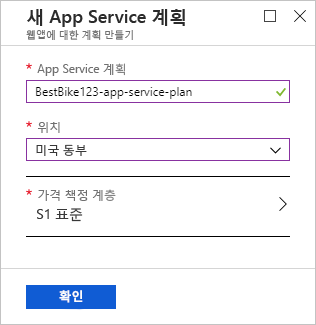
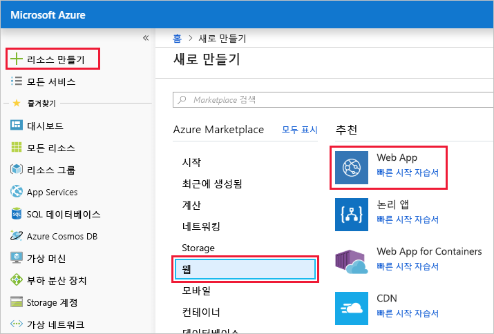
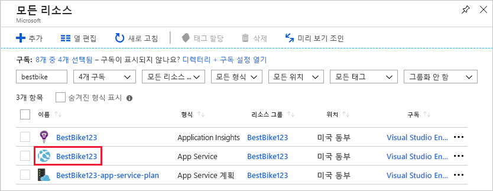
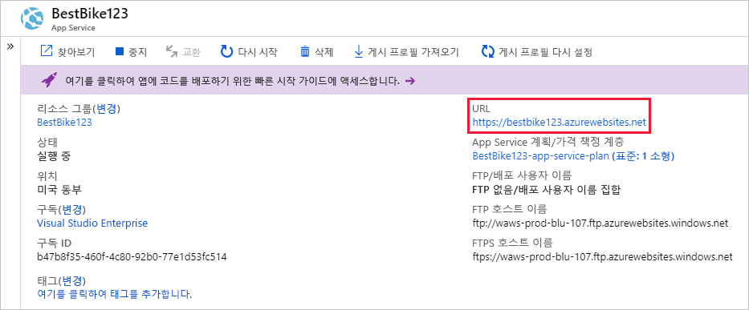

이 장치에서 웹 앱을 만들려면 Azure portal을 사용 합니다.

## Azure Portal에 로그인

[!include]

첫 번째 단계는 Azure Portal에 로그인하는 것입니다.

브라우저를 열고 [Azure Portal](https://portal.azure.com/?azure-portal=true)로 이동합니다.

## 웹앱 만들기

Azure portal에 로그인 하는 우리는 이제 웹 앱을 만들어 보겠습니다.

[!include]

1. 왼쪽 탐색 영역 상단에서 **리소스 만들기** 링크를 클릭합니다. Azure에서 만드는 모든 것은 리소스입니다.

1. 포털을 탐색 하는 **Marketplace** 페이지입니다. 여기에서 만들려는 리소스를 검색하거나 Azure Portal에서 사람들이 만드는 인기 있는 리소스 중 하나를 선택할 수 있습니다.

1. 클릭 **웹** > **웹 앱**합니다. 포털을 사용 하면로 리디렉션됩니다 합니다 **새 웹 앱 만들기** 페이지입니다.

1. 새 웹앱을 만들 때 Azure Portal에서 앱을 만드는 데 필요한 몇 가지 정보를 요청하는 메시지가 표시됩니다. 이 섹션에서는 다음과 같은 기본 정보를 제공해야 합니다.

    1. **앱 이름**: 클라이언트가 응용 프로그램 이름을 `BestBike`로 지정하려고 합니다. 이 필드에 이름을 입력합니다. 이 값은 Azure에서 호스팅되는 다른 모든 웹앱 중에서 전역적으로 고유해야 하며, 포털은 다른 사람이 같은 앱 이름을 사용하지 못하도록 합니다. 고유한 이름을 사용하려면 고유한 변형을 찾을 때까지 앱 이름에 숫자를 추가합니다.

    2. **구독**: 이 필드에서는 드롭다운 목록에서 활성 Azure 구독을 선택해야 합니다.

    3. **OS**: 이 필드에서는 새 웹앱을 호스트하는 데 **Windows** 또는 **Linux**를 사용할지 결정해야 합니다. 이 설정은 아래에서 선택하거나 만들려는 App Service 계획에 직접적인 영향을 줍니다. App Service 계획은 가상 머신에서 응용 프로그램을 실행하는 데 필요한 모든 리소스(CPU, RAM 등)가 포함된 운영 체제인 가상 머신과 비슷합니다. 이 경우 클라이언트는 Windows 머신을 통해 웹앱을 호스트하려고 합니다. 따라서 **Windows**를 선택합니다.

    4. **Application Insights**: Azure Application Insights는 웹앱 및 웹 서비스의 품질 문제를 검색 및 진단하고 사용자가 이 기능을 통해 실제로 수행하는 작업을 이해하는 데 도움이 됩니다. 고객의 요구 사항 중 하나는 웹 사이트를 통과하는 트래픽에 대한 통찰력 보고서를 볼 수 있는 기능과 트래픽이 높은 시기와 낮은 시기에 대한 추세를 학습할 수 있는 기능입니다. 여기에서는 **켜기** 옵션을 선택하여 이 웹앱에 대한 Application Insights를 켭니다. **켜기** 옵션을 선택하면 Application Insights 데이터를 저장할 위치 또는 지역도 선택해야 합니다. Application Insights는 제한된 수의 지역에서만 사용할 수 있습니다. 이 데모에서는 사용 가능한 지역 중 하나를 선택 합니다.

## 샌드박스 리소스 그룹 사용

Azure 웹앱은 리소스 그룹의 일부여야 합니다. 선택 **기존 항목 사용** 선택한 <rgn>[샌드박스 리소스 그룹 이름]</rgn>합니다.

## App Service 계획 만들기

응용 프로그램을 실행하려면 이 필드에서 App Service 계획을 선택해야 합니다. 기본적으로 포털 사용자가 만든 가장 최근 App Service 계획을 선택 합니다. 클릭 합니다 **App Service 계획/위치** 으로 이동 하도록 필드를 **App Service 계획** 페이지.

클릭 합니다 **새로 만들기** 으로 이동 하는 링크는 **새 App Service 계획** 페이지. 새 App Service 계획을 만들기 위해 포털에서 사용자에게 몇 가지 정보를 요청합니다.

1. **App Service 계획**: 새 App Service 계획에 대 한 이름을 지정 하면이 필드에 있습니다. 이 앱의 경우에는 위에서 선택했던 것과 같은 웹앱 이름을 입력하고, 이 리소스를 다른 리소스와 쉽게 구분할 수 있도록 `-app-service-plan` 접미사를 추가합니다.

2. **위치**: 이 필드에서 이 App Service 계획이 상주하는 지역을 선택해야 합니다. 다시 말해, App Service 계획에서 응용 프로그램을 실행하는 데 필요한 가상 머신이 설치되는 지리적 위치를 선택합니다. 여기에서는 목록에서 원하는 옵션을 선택할 수 있습니다.

3. **가격 책정 계층**: 이 필드에서 응용 프로그램을 호스트할 가상 머신의 크기를 선택해야 합니다. 클릭 합니다 **>** 로그인으로 이동 하는 **가격 책정 계층** 페이지입니다.

    여기에는 선택할 수 있는 옵션이 많이 있습니다. 포털은 필요한 워크로드 수준에 따라 해당 옵션을 그룹화합니다. 사용 가능한 세 개의 워크로드 범주는 개발/테스트, 프로덕션 및 격리입니다. Azure에 호스트할 응용 프로그램의 요구 사항에 따라 적절한 워크로드 범주를 선택합니다. **BestBike** 응용 프로그램이 빌드되고 구체화되면서 나에게 적합한 최소 워크로드 범주부터 시작합니다. 클라이언트의 요구 사항 중 하나는 응용 프로그램에서 발생하는 새로운 변경 사항을 실시간으로 테스트할 수 있는 기능입니다. 이후 단원에서는 이 요구 사항을 달성하기 위해 **배포 슬롯**을 추가해야 하는 상황을 볼 수 있습니다. 배포 슬롯은 최소 가격 계층 **S1**부터 제공됩니다. 따라서 **프로덕션 워크로드** 범주 아래에서 **S1** 가격 책정 계층을 선택합니다. 그런 다음, **적용**을 클릭하여 위에서 선택한 가격 책정 계층을 확인합니다.

    > [!NOTE]
    > 이 모듈 전체에서 **프로덕션** 및 **격리** 워크로드 범주만 웹앱에 **배포 슬롯**을 추가할 수 있음을 알게 됩니다.

    다시는 이제 합니다 **새 App Service 계획** 페이지입니다.

    

4. **확인** 단추를 클릭하면 새 App Service 계획을 사용할 수 있습니다.

    포털을 이동 하 여 다시 주 **웹 앱 만들기** 페이지입니다.

    

5. **만들기** 단추를 클릭하여 웹앱 만들기 프로세스를 시작합니다.

    > [!NOTE]
    > 웹앱이 만들어지고 사용할 준비가 되려면 몇 초 정도 걸릴 수 있습니다.

포털이 대시보드 페이지로 리디렉션되고 웹앱이 생성되면 알려줍니다.

앱이 준비되면 Azure Portal에서 새 앱으로 이동합니다.

1. 왼쪽 탐색 영역에서 **모든 리소스** 메뉴를 클릭합니다. 합니다 **모든 리소스** 페이지는 Azure portal에서 만든 모든 리소스를 나열 합니다.

2. 방금 생성된 BestBike App Service를 클릭합니다.

    > [!NOTE]
    > "BestBike"라는 이름으로 앱을 검색하면 새 웹앱용으로 생성된 Application Insights 및 App Service 계획 리소스도 찾을 수 있습니다. 유형이 **App Service**인 리소스를 클릭했는지 확인합니다.

    

포털에 **개요** 섹션이 선택된 웹앱 서비스 홈페이지가 열립니다.

새 웹앱의 기본 콘텐츠를 미리 보려면 Azure Portal 오른쪽 상단에서 **URL**을 클릭합니다. 자리 표시자 웹 페이지가 표시되면 웹앱이 정상적으로 생성된 것입니다.
