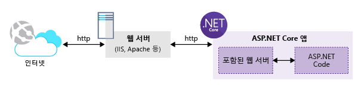

웹 응용 프로그램을 빌드하기 위해 오픈 소스 기술을 사용하기로 했습니다. ASP.NET Core는 플랫폼 간 및 오픈 소스 프레임워크임을 알고 있습니다. ASP.NET Core를 사용하여 Linux 개발 환경에서 웹앱을 개발하기로 합니다.

Azure App Service를 사용하면 Node.js, PHP 또는 .NET Core를 포함하여 즐겨 찾는 웹 기술을 사용할 수 있습니다.

여기서는 .NET CLI(명령줄 인터페이스)를 사용하여 ASP.NET Core 응용 프로그램을 만듭니다.

## <a name="what-is-aspnet-core"></a>ASP.NET Core란?

ASP.NET Core는 최신 클라우드 기반, 인터넷 연결 응용 프로그램을 빌드하기 위한 플랫폼 간 오픈 소스 프레임워크인 Microsoft의 인기 있는 ASP.NET 웹 프레임워크의 가장 진화된 모습입니다.

ASP.NET Core 응용 프로그램은 .NET Core Framework 또는 기존의 전체 .NET Framework를 대상으로 작성할 수 있습니다.

플랫폼 간 및 오픈 소스 프레임워크가 되면 Windows, macOS 및 Linux를 비롯한 다양한 플랫폼에서 ASP.NET Core 앱을 빌드할 수 있습니다. 지금까지 Microsoft는 Windows 및 macOS 환경용 Visual Studio IDE를 둘 다 제공합니다. 또한 Visual Studio Code 편집기는 플랫폼 간 편집기로 이러한 환경과 호환됩니다.

>다양한 플랫폼에서 ASP.NET Core 응용 프로그램 빌드를 지원하기 위해 Microsoft는 풍부하고 일관적인 플랫폼 간 API 집합을 사용하여 응용 프로그램을 빌드, 테스트 및 게시하는 데 도움이 되는 .NET Core CLI 도구를 도입했습니다.

ASP.NET Core를 사용하면 웹앱과 서비스, IoT 앱 및 모바일 백 엔드를 빌드할 수 있습니다. ASP.NET Core 응용 프로그램은 클라우드 또는 온-프레미스에서 호스트할 수 있습니다.

의도적으로 ASP.NET Core는 응용 프로그램 코드를 실행하는 런타임 환경 및 포함된 웹 서버로 구성됩니다. 응용 프로그램 코드는 더 작은 모듈과 패키지를 사용하는 재구성된 ASP.NET MVC 프레임워크를 사용하여 작성됩니다. 결과로 클라우드 환경을 통해 쉽게 유지 관리 및 호스팅할 수 있는 보다 작은 웹 응용 프로그램 청사진이 생성됩니다. 다음 그림에서는 인터넷 http 트래픽을 처리하는 외부 웹 서버 및 .NET Core에서 호스팅된 ASP.NET Core 응용 프로그램을 보여줍니다.



ASP.NET Core 응용 프로그램은 **dotnet** 드라이버 도구를 통해 호출된 독립 실행형 **콘솔** 응용 프로그램입니다. ASP.NET Core 응용 프로그램은 IIS 작업자 프로세스에 로드되지 않고, 외부 콘솔 응용 프로그램을 실행하는 **AspNetCoreModule**이라는 네이티브 IIS 모듈을 통해 로드됩니다.

## <a name="how-to-create-an-aspnet-core-web-project"></a>ASP.NET Core 웹 프로젝트를 만드는 방법

새 ASP.NET Core 프로젝트를 만들기 위한 몇 가지 옵션이 있습니다.

- Visual Studio(Windows 및 macOS 버전) 템플릿을 사용하여 새 프로젝트를 생성할 수 있습니다. Visual Studio에서는 웹 프로젝트를 만드는 데 사용할 수 있는 다양한 템플릿을 제공합니다. 예를 들어 **빈** 템플릿을 사용하면 기본 설정을 사용하여 기본적인 ASP.NET Core 프로젝트를 만들 수 있습니다. 또한 **웹 응용 프로그램(Modal-View-Controller)** 템플릿을 사용하면 응용 프로그램 코딩을 시작하는 데 도움이 될 수 있는 샘플 **컨트롤러** 및 **보기**를 사용하여 모든 기능을 갖춘 ASP.NET Core MVC 응용 프로그램을 생성할 수 있습니다. 가장 최근 제공된 템플릿은 기존 MVC 프로젝트 구조가 아닌 Razor 페이지를 기반으로 ASP.NET Core 프로젝트를 만드는 데 사용되는 **웹 응용 프로그램** 프로젝트 템플릿입니다.

- .NET Core CLI 도구를 사용하여 새 ASP.NET Core 프로젝트를 생성할 수 있습니다. Microsoft는 Visual Studio 및 CLI 도구에 둘 다 해당하는 거의 공통적인 ASP.NET Core 프로젝트 템플릿 집합을 유지 관리합니다. CLI 도구의 유일한 차이점은 새 ASP.NET Core 프로젝트를 만들려면 명령을 입력해야 한다는 점입니다.
> .NET CLI 도구는 **템플릿 엔진**을 사용하여 다양한 프로젝트 템플릿을 지원합니다.  자세한 내용을 보려면 .NET CLI 도구에서 내부적으로 사용하는 [템플릿 엔진](https://github.com/dotnet/templating)에 대한 GitHub 리포지토리를 방문하세요.

위의 템플릿 엔진은 ASP.NET Core 프로젝트를 생성하기 위한 상위 도구로 간주합니다. 그러나 검색하고 탐색할 수 있는 더 많은 도구가 있습니다.

서로 다른 도구에서 생성되는 프로젝트는 약간 다를 수 있지만, 모두 유효하고 최적화된 ASP.NET Core 프로젝트를 생성합니다.

## <a name="net-cli-tools"></a>.NET CLI 도구

.NET Core CLI라고도 하는 .NET CLI 도구는 패키지를 만들고 복원하기 위한 명령과 모든 기능을 갖춘 IDE 없이 명령줄에서 .NET 응용 프로그램을 빌드, 실행 및 게시할 수 있는 명령을 제공하는 플랫폼 간 도구입니다.

.NET CLI는 .NET Core SDK의 일부로 설치됩니다. 여러 버전의 CLI가 동일한 머신에 공존하고 나란히 실행될 수 있습니다.

.NET CLI 사용을 시작하려면 앱을 개발하는 데 사용 중인 환경인 Windows, macOS 또는 Linux를 기준으로 관련된 .NET Core SDK를 설치해야 합니다. [.NET 다운로드](https://www.microsoft.com/net/download?initial-os=linux)로 이동하고 Linux용 .NET Core SDK를 다운로드합니다. .NET CLI에서 제공하는 다양한 명령을 설명하기 위해 VMware Workspace Player 14를 사용하여 Windows 10 맨 위에서 실행되는 Ubuntu 18.04 OS를 사용 중입니다.

명령줄을 열고 다음을 입력합니다.

```console
dotnet --version
```

이 명령은 설치된 .NET CLI 버전을 표시합니다.

내 머신에서 위 명령을 실행하면 `2.1.302`가 표시됩니다.

.NET CLI의 인기 있는 몇 가지 명령을 살펴보겠습니다.

*dotnet* 명령에는 다음과 같은 일반 구문이 포함됩니다.

```console
dotnet [verb] [arguments]
```

동사는 실행할 작업을 나타냅니다. 인수는 실행하기 위해 동사에 필요한 입력 인수 목록을 나타냅니다.

*dotnet* 사용법 및 사용 가능한 모든 *동사* 목록에 대한 도움말을 보려면 다음 명령을 입력합니다.

```console
dotnet --help
```

이 명령은 다음을 표시합니다.

```console
.NET Command Line Tools (2.1.302)
Usage: dotnet [runtime-options] [path-to-application]
Usage: dotnet [sdk-options] [command] [arguments] [command-options]

path-to-application:
  The path to an application .dll file to execute.

SDK commands:
  new              Initialize .NET projects.
  restore          Restore dependencies specified in the .NET project.
  run              Compiles and immediately executes a .NET project.
  build            Builds a .NET project.
  publish          Publishes a .NET project for deployment (including the runtime).
  test             Runs unit tests using the test runner specified in the project.

...
```

**SDK 명령**에서 .NET Core SDK에 실행할 수 있는 전체 명령 목록을 볼 수 있습니다.

항상 가장 유용한 명령은 다음과 같습니다.

- **dotnet new**: 이 명령은 새 .NET 응용 프로그램을 스캐폴드/생성하는 데 사용됩니다.

- **dotnet restore**: 이 명령은 응용 프로그램에서 참조하는 모든 패키지를 복원/다운로드하는 데 사용됩니다.

- **dotnet run**: 이 명령은 .NET 응용 프로그램을 실행하는 데 사용됩니다.

이제 특정 명령 사용 방법에 대한 지원을 받으려면 다음을 입력합니다.

```console
dotnet new --help
```

이 명령은 다음을 수행합니다.

```console
Usage: new [options]

Options:
  -h, --help          Displays help for this command.
  -l, --list          Lists templates containing the specified name. If no name is specified, lists all templates.
  -n, --name          The name for the output being created. If no name is specified, the name of the current directory is used.
  -o, --output        Location to place the generated output.
  -i, --install       Installs a source or a template pack.
  -u, --uninstall     Uninstalls a source or a template pack.
  --nuget-source      Specifies a NuGet source to use during install.
  --type              Filters templates based on available types. Predefined values are "project", "item" or "other".
  --force             Forces content to be generated even if it would change existing files.
  -lang, --language   Filters templates based on language and specifies the language of the template to create.


Templates                                         Short Name         Language          Tags
----------------------------------------------------------------------------------------------------------------------------
Console Application                               console            [C#], F#, VB      Common/Console
Class library                                     classlib           [C#], F#, VB      Common/Library
...

Razor Page                                        page               [C#]              Web/ASP.NET
MVC ViewImports                                   viewimports        [C#]              Web/ASP.NET
MVC ViewStart                                     viewstart          [C#]              Web/ASP.NET
ASP.NET Core Empty                                web                [C#], F#          Web/Empty
ASP.NET Core Web App (Model-View-Controller)      mvc                [C#], F#          Web/MVC
ASP.NET Core Web App                              razor              [C#]              Web/MVC/Razor Pages
ASP.NET Core with Angular                         angular            [C#]              Web/MVC/SPA
...

Solution File                                     sln                                  Solution

Examples:
    dotnet new mvc --auth Individual
    dotnet new webapi
    dotnet new --help
```

이 명령은 `dotnet new` 명령과 함께 사용할 수 있는 모든 사용 가능한 옵션을 나열합니다. 또한 다음 .NET 응용 프로그램을 생성하는 데 사용할 수 있는 사용 가능한 모든 프로젝트 템플릿을 나열합니다. 마지막으로 섹션에는 명령을 사용하여 새 .NET 응용 프로그램을 생성하는 방법에 대한 예제가 표시됩니다.

.NET CLI에서 사용 가능한 모든 명령에 `--help` 인수를 사용하면 나머지 명령을 알아볼 수 있습니다.

## <a name="aspnet-core-installation-on-linux-environment"></a>Linux 환경의 ASP.NET Core 설치

ASP.NET Core의 최신 및 최대 버전은 v2.1입니다. 일반적으로 ASP.NET Core는 .NET Core SDK의 일부로 제공됩니다. 따라서 머신에 .NET Core SDK를 설치하면 ASP.NET Core 웹앱을 포함한 .NET Core 응용 프로그램으로 개발을 시작할 수 있습니다.

이 데모에서는 VMware Workstation Player의 지원을 통해 Windows 10에서 실행되는 Ubuntu 18.04 OS를 사용하고 있습니다.

.NET Core SDK를 다운로드하려면 [.NET 다운로드](https://www.microsoft.com/net/download) 홈페이지를 방문해야 합니다. 이 페이지에는 다양한 플랫폼(Windows, Linux 및 macOS)에서 .NET Core SDK를 다운로드하는 링크가 포함되어 있습니다.

**Linux** 탭을 클릭합니다. 다음 두 가지 옵션을 사용할 수 있습니다.

- .NET Core SDK
- .NET Core 런타임

.NET Core 런타임은 이미 .NET Core SDK에 포함되어 있습니다. 런타임은 응용 프로그램을 실행하는 데 사용됩니다. 개발, 테스트, 실행 및 게시하기 위한 모든 도구가 .NET Core SDK에 포함되어 있습니다. 따라서 **.NET Core SDK**를 클릭합니다.

Microsoft 웹 사이트는 다운로드 페이지로 리디렉션됩니다. 여기서 **Linux 배포**를 선택해야 합니다. 이 경우에는 **Ubuntu 18.04**를 선택합니다. 선택 시 자동으로 Ubuntu 18.04에서 .NET Core SDK를 설치하는 방법에 대한 지침이 표시됩니다.

## <a name="summary"></a>요약

웹 응용 프로그램을 빌드하려는 경우 많은 언어와 프레임워크를 선택할 수 있습니다. App Service는 Node.js, PHP 또는 .NET Core와 같은 다양한 유형의 응용 프로그램을 호스팅할 수 있어 더 쉽게 선택하는 데 유용합니다. 이 App Service를 사용하면 웹 호스트의 요구 사항을 충족하기 위해 변경하는 대신 가장 편안한 언어와 프레임워크를 사용할 수 있습니다.
