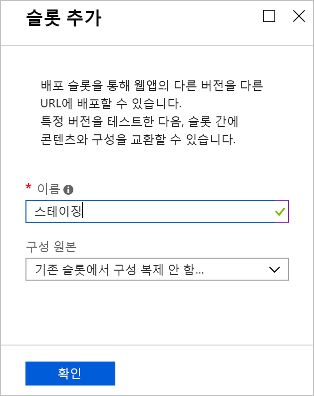
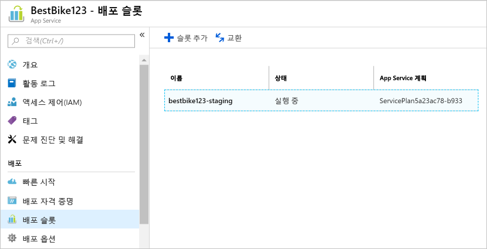
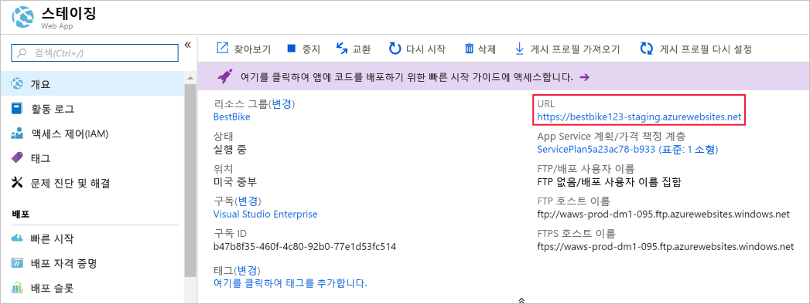
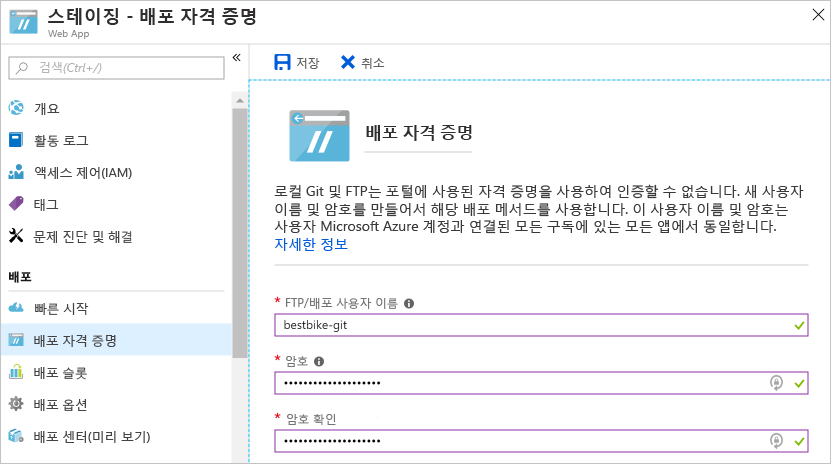
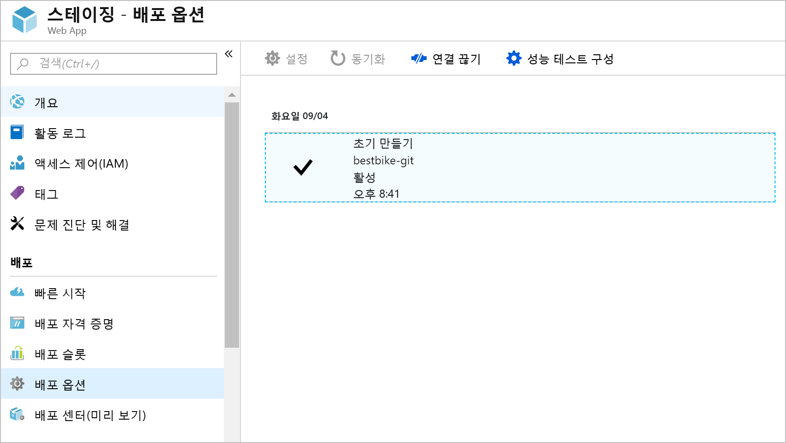
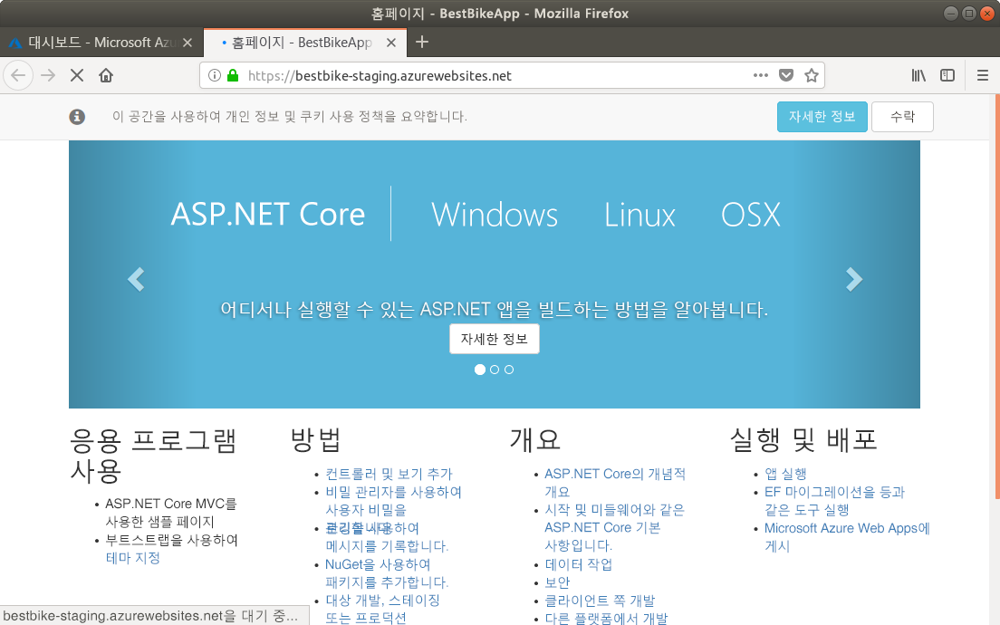
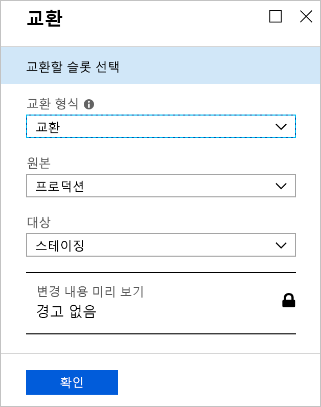
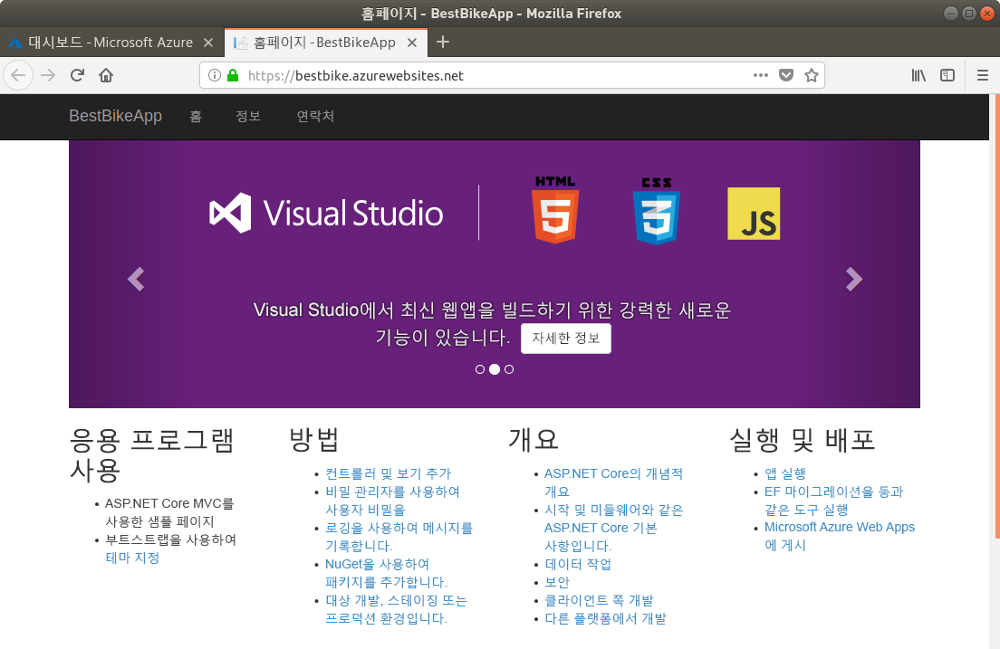
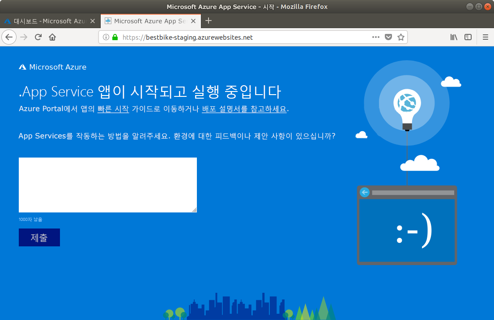

<span data-ttu-id="5a5ae-101">이 단원에서는 Azure App Service에 ASP.NET Core 응용 프로그램을 업로드합니다.</span><span class="sxs-lookup"><span data-stu-id="5a5ae-101">In this unit, you'll upload your ASP.NET Core application to Azure App Service.</span></span>

## <a name="create-a-staging-deployment-slot"></a><span data-ttu-id="5a5ae-102">스테이징 배포 슬롯 만들기</span><span class="sxs-lookup"><span data-stu-id="5a5ae-102">Create a staging deployment slot</span></span>

1. <span data-ttu-id="5a5ae-103">[Azure Portal](https://portal.azure.com/triplecrownlabs.onmicrosoft.com?azure-portal=true)로 다시 전환합니다.</span><span class="sxs-lookup"><span data-stu-id="5a5ae-103">Switch back to the [Azure portal](https://portal.azure.com/triplecrownlabs.onmicrosoft.com?azure-portal=true).</span></span>

1. <span data-ttu-id="5a5ae-104">이전에 만든 Azure Service 리소스(웹앱)를 엽니다.</span><span class="sxs-lookup"><span data-stu-id="5a5ae-104">Open the App Service resource (the web app) you created previously.</span></span> <span data-ttu-id="5a5ae-105">**모든 리소스** 또는 **리소스 그룹**에 포함된 리소스 그룹에서 앱을 검색하여 다시 찾을 수 있습니다.</span><span class="sxs-lookup"><span data-stu-id="5a5ae-105">You can find it again by searching for the app in **All resources** or the containing resource group in **Resource groups**.</span></span>

1. <span data-ttu-id="5a5ae-106">왼쪽 탐색 영역에서 **배포 슬롯** 메뉴 항목을 클릭합니다.</span><span class="sxs-lookup"><span data-stu-id="5a5ae-106">Click the **Deployment slots** menu item on the left-side navigation.</span></span>

1. <span data-ttu-id="5a5ae-107">**배포 슬롯** 페이지 내에서 배포 슬롯 페이지의 위쪽 탐색 모음에 있는 **슬롯 추가** 단추를 클릭합니다.</span><span class="sxs-lookup"><span data-stu-id="5a5ae-107">Inside the **Deployment slots** page, click the **Add Slot** button on the top navigation bar of the deployment slots page.</span></span>

1. <span data-ttu-id="5a5ae-108">Azure Portal에서는 아래와 같이 **슬롯 추가** 페이지를 엽니다.</span><span class="sxs-lookup"><span data-stu-id="5a5ae-108">The Azure portal opens the **Add a slot** page as shown below.</span></span>

    1. <span data-ttu-id="5a5ae-109">배포 슬롯에 이름을 지정합니다.</span><span class="sxs-lookup"><span data-stu-id="5a5ae-109">Give your deployment slot a name.</span></span> <span data-ttu-id="5a5ae-110">이 예제의 경우 `staging`입니다.</span><span class="sxs-lookup"><span data-stu-id="5a5ae-110">In this case, use `staging`.</span></span>

    2. <span data-ttu-id="5a5ae-111">**구성 원본**을 선택하려면 두 가지 옵션이 있습니다.</span><span class="sxs-lookup"><span data-stu-id="5a5ae-111">To choose a **Configuration Source**, you have two options.</span></span>

        * <span data-ttu-id="5a5ae-112">기존 배포 슬롯 또는 App Service 앱에서 구성 요소를 복제할 수 있습니다.</span><span class="sxs-lookup"><span data-stu-id="5a5ae-112">You can choose to clone the configuration elements from any existing deployment slot or App Service app.</span></span>
        * <span data-ttu-id="5a5ae-113">또는 구성 요소를 복제하지 않을 수도 있습니다.</span><span class="sxs-lookup"><span data-stu-id="5a5ae-113">Or you can choose not to clone any configuration elements.</span></span> <span data-ttu-id="5a5ae-114">**기존 슬롯에서 구성 복제 안 함** 옵션을 선택합니다.</span><span class="sxs-lookup"><span data-stu-id="5a5ae-114">Select the option **Don't clone configuration from an existing slot**.</span></span>

        <span data-ttu-id="5a5ae-115">이 배포 슬롯의 경우 두 번째 옵션인 **기존 슬롯에서 구성 복제 안 함**을 선택합니다.</span><span class="sxs-lookup"><span data-stu-id="5a5ae-115">For this deployment slot, choose the second option: **Don't clone configuration from an existing slot**.</span></span> <span data-ttu-id="5a5ae-116">여기서는 요소를 직접 구성합니다.</span><span class="sxs-lookup"><span data-stu-id="5a5ae-116">You will configure it directly.</span></span>

    

1. <span data-ttu-id="5a5ae-118">페이지 아래쪽의 **확인** 단추를 클릭하여 새 배포 슬롯을 만듭니다.</span><span class="sxs-lookup"><span data-stu-id="5a5ae-118">Click the **OK** button at the bottom of the page to create your new deployment slot.</span></span>

1. <span data-ttu-id="5a5ae-119">배포 슬롯이 성공적으로 만들어지면 Azure Portal은 다시 웹앱의 **배포 슬롯** 페이지로 이동합니다.</span><span class="sxs-lookup"><span data-stu-id="5a5ae-119">Once the deployment slot is successfully created, the Azure portal navigates you back to the **Deployment slots** page of your web app.</span></span>

    <span data-ttu-id="5a5ae-120">이제 방금 만든 새 배포 슬롯을 확인할 수 있습니다.</span><span class="sxs-lookup"><span data-stu-id="5a5ae-120">Now, you can see the new deployment slot that you have just created.</span></span>

    

1. <span data-ttu-id="5a5ae-122">새 배포 슬롯을 선택합니다.</span><span class="sxs-lookup"><span data-stu-id="5a5ae-122">Select the new deployment slot.</span></span>

1. <span data-ttu-id="5a5ae-123">Azure Portal에 새로 만든 배포 슬롯의 **개요** 페이지가 열립니다.</span><span class="sxs-lookup"><span data-stu-id="5a5ae-123">The Azure portal navigates to the **Overview** page of the newly created deployment slot.</span></span>

    

    <span data-ttu-id="5a5ae-125">스테이징 배포 슬롯의 **URL**을 확인합니다.</span><span class="sxs-lookup"><span data-stu-id="5a5ae-125">Notice the **URL** of the staging deployment slot.</span></span> <span data-ttu-id="5a5ae-126">이 URL은 이전에 확인했던 것과는 다르며 슬롯 이름이 추가됐습니다.</span><span class="sxs-lookup"><span data-stu-id="5a5ae-126">It is a different URL from what you saw previously, with the slot name appended.</span></span>

    <span data-ttu-id="5a5ae-127">배포 슬롯은 Azure 내의 전체 App Service 앱으로 처리됩니다.</span><span class="sxs-lookup"><span data-stu-id="5a5ae-127">A deployment slot is treated as a full App Service app inside Azure.</span></span> <span data-ttu-id="5a5ae-128">그러나 이는 원래 앱의 자식인 특수한 유형이며 원래 앱으로 교환될 수 있습니다.</span><span class="sxs-lookup"><span data-stu-id="5a5ae-128">However, it is a special type that is a child of the original app and can be swapped with the original app.</span></span>

    <span data-ttu-id="5a5ae-129">**URL**을 클릭하면 Azure Portal에서 처음 만들 때 Azure가 배포 슬롯 “앱”용으로 만든 것과 동일한 기본 페이지가 표시됩니다.</span><span class="sxs-lookup"><span data-stu-id="5a5ae-129">If you click the **URL**, you will see the same default page that Azure created for the deployment slot "app" the first time we created it in the Azure portal.</span></span>

<span data-ttu-id="5a5ae-130">이제 스테이징 배포 슬롯이 성공적으로 생성되었으므로 **배포 자격 증명**을 구성해야 합니다.</span><span class="sxs-lookup"><span data-stu-id="5a5ae-130">Now that the staging deployment slot is created successfully, you need to configure **deployment credentials**.</span></span>

## <a name="create-deployment-credentials"></a><span data-ttu-id="5a5ae-131">배포 자격 증명 만들기</span><span class="sxs-lookup"><span data-stu-id="5a5ae-131">Create deployment credentials</span></span>

<span data-ttu-id="5a5ae-132">실제 배포 프로세스를 시작하려면 먼저 Azure에서 배포 자격 증명을 설정해야 합니다.</span><span class="sxs-lookup"><span data-stu-id="5a5ae-132">Azure requires deployment credentials to be set up before you can start the actual deployment process.</span></span> <span data-ttu-id="5a5ae-133">이런 이유로 고유한 배포 자격 증명을 만드는 방법을 알아봅니다.</span><span class="sxs-lookup"><span data-stu-id="5a5ae-133">For that reason, you will learn how to create your own deployment credentials.</span></span>

1. <span data-ttu-id="5a5ae-134">왼쪽 탐색 영역에서 **배포 자격 증명** 메뉴 항목을 클릭합니다.</span><span class="sxs-lookup"><span data-stu-id="5a5ae-134">Click the **Deployment credentials** menu item on the left-side navigation.</span></span>

1. <span data-ttu-id="5a5ae-135">Azure Portal은 아래와 같이 **배포 자격 증명** 페이지로 이동합니다.</span><span class="sxs-lookup"><span data-stu-id="5a5ae-135">The Azure portal navigates to the **Deployment credentials** page as shown below.</span></span>

    <span data-ttu-id="5a5ae-136">선택한 **사용자 이름**과 **암호**를 입력한 다음, 암호를 다시 한번 확인합니다.</span><span class="sxs-lookup"><span data-stu-id="5a5ae-136">Enter a **username** and **password** of your choice, and then confirm your password once again.</span></span>

    > [!NOTE]
    > <span data-ttu-id="5a5ae-137">사용자 이름과 암호를 잊지 않도록 하세요.</span><span class="sxs-lookup"><span data-stu-id="5a5ae-137">Make sure you don't forget your username and password!</span></span> <span data-ttu-id="5a5ae-138">사용자 이름과 암호는 나중에 Azure에 코드 업로드 및 배포를 시작할 때 필요합니다.</span><span class="sxs-lookup"><span data-stu-id="5a5ae-138">You will need them later when we start uploading and deploying our code to Azure.</span></span>

    

1. <span data-ttu-id="5a5ae-140">**배포 자격 증명** 페이지의 위쪽에서 **저장** 단추를 클릭합니다.</span><span class="sxs-lookup"><span data-stu-id="5a5ae-140">Click the **Save** button at the top of the **Deployment credentials** page.</span></span>

<span data-ttu-id="5a5ae-141">이제 배포 자격 증명이 생성되었으므로 다른 배포 옵션을 구성해야 합니다.</span><span class="sxs-lookup"><span data-stu-id="5a5ae-141">Now that the deployment credentials are created successfully, you need to configure other deployment options.</span></span>

## <a name="use-a-local-git-repository-as-your-deployment-option"></a><span data-ttu-id="5a5ae-142">로컬 Git 리포지토리를 배포 옵션으로 사용</span><span class="sxs-lookup"><span data-stu-id="5a5ae-142">Use a local Git repository as your deployment option</span></span>

<span data-ttu-id="5a5ae-143">다음으로, 코드 업로드를 시작할 수 있도록 Azure에서 로컬 Git 리포지토리를 만듭니다.</span><span class="sxs-lookup"><span data-stu-id="5a5ae-143">Next, we'll create a local Git repository in Azure, so you can start uploading your code.</span></span>

1. <span data-ttu-id="5a5ae-144">**스테이징** 배포 슬롯 “앱” 내의 왼쪽 탐색 영역에서 **배포 옵션** 메뉴 항목을 클릭합니다.</span><span class="sxs-lookup"><span data-stu-id="5a5ae-144">Within the **staging** deployment slot "app", click the **Deployment options** menu item on the left-hand navigation.</span></span>

1. <span data-ttu-id="5a5ae-145">Azure Portal이 **배포 옵션** 페이지로 이동합니다.</span><span class="sxs-lookup"><span data-stu-id="5a5ae-145">The Azure portal navigates to the **Deployment options** page.</span></span>

1. <span data-ttu-id="5a5ae-146">**원본 선택**을 클릭하여 필수 설정을 구성합니다.</span><span class="sxs-lookup"><span data-stu-id="5a5ae-146">Click on the **Choose Source** to configure the required settings.</span></span>

1. <span data-ttu-id="5a5ae-147">Azure Portal에 구성하고 사용할 수 있는 사용 가능한 옵션이 표시됩니다.</span><span class="sxs-lookup"><span data-stu-id="5a5ae-147">The Azure portal displays the available options that you can configure and use.</span></span> <span data-ttu-id="5a5ae-148">이 경우 **로컬 Git 리포지토리** 옵션을 선택합니다.</span><span class="sxs-lookup"><span data-stu-id="5a5ae-148">In our case, choose the **Local Git Repository** option.</span></span>

1. <span data-ttu-id="5a5ae-149">**배포 옵션** 페이지로 돌아갑니다.</span><span class="sxs-lookup"><span data-stu-id="5a5ae-149">You will be returned to the **Deployment option** page.</span></span> <span data-ttu-id="5a5ae-150">페이지 아래쪽의 **확인** 단추를 클릭하여 배포 원본을 설정합니다.</span><span class="sxs-lookup"><span data-stu-id="5a5ae-150">Click the **OK** button at the bottom of the page to set up the deployment source.</span></span>

1. <span data-ttu-id="5a5ae-151">이제 왼쪽 탐색 영역에서 **개요** 섹션으로 이동합니다.</span><span class="sxs-lookup"><span data-stu-id="5a5ae-151">Now, navigate to the **Overview** section on the left-side navigation.</span></span>

    <span data-ttu-id="5a5ae-152">여기서 주목해야 하는 중요한 정보는 **Git Clone URI**입니다. 이 URI는 로컬 응용 프로그램 코드 리포지토리의 **원격** 항목으로 사용할 로컬 Git 리포지토리 URL입니다.</span><span class="sxs-lookup"><span data-stu-id="5a5ae-152">The important information to note here is the **Git Clone Uri**, which is the local Git repository URL that you will use as a **remote** for your local application code repository.</span></span>

<span data-ttu-id="5a5ae-153">이제 스테이징 배포 슬롯에 코드 업로드를 시작하겠습니다.</span><span class="sxs-lookup"><span data-stu-id="5a5ae-153">It is time to start uploading your code to the staging deployment slot.</span></span>

## <a name="set-up-git-on-cloud-shell"></a><span data-ttu-id="5a5ae-154">Cloud Shell에서 git 설정</span><span class="sxs-lookup"><span data-stu-id="5a5ae-154">Set up git on Cloud Shell</span></span>

<span data-ttu-id="5a5ae-155">Git가 이미 Azure Cloud Shell을 설치했지만 클라우드 셸 계정에 대한 사용자 이름과 이메일을 설정하려고 합니다.</span><span class="sxs-lookup"><span data-stu-id="5a5ae-155">Git is already installed Azure Cloud Shell but you'll want to set your username and email for your cloud shell account.</span></span>

1. <span data-ttu-id="5a5ae-156">오른쪽의 Cloud Shell에 다음 명령을 입력하고 `[your name]` 및 `[your email]` 자리 표시자를 사용자의 이름과 이메일(중괄호 제외)로 바꿉니다.</span><span class="sxs-lookup"><span data-stu-id="5a5ae-156">In the Cloud Shell on the right, type the following commands, replacing the `[your name]` and `[your email]` placeholders with your own name and email (without the braces):</span></span>

    ```bash
    git config --global user.name "[your name]"
    git config --global user.email "[your email]"
    ```

1. <span data-ttu-id="5a5ae-157">Git에 의해 정보가 기록되었는지 확인하려면 다음 명령을 입력합니다.</span><span class="sxs-lookup"><span data-stu-id="5a5ae-157">To verify that your information has been recorded by Git, type the following command:</span></span>

    ```bash
    cat ~/.gitconfig
    ```

   <span data-ttu-id="5a5ae-158">다음과 같이 표시된 이름과 메일과 함께 표시되어야 합니다.</span><span class="sxs-lookup"><span data-stu-id="5a5ae-158">You should be seeing the following, with your name and email shown:</span></span>

    ```output
    [user]
        name = {your name}
        email = {your email}
    ```

## <a name="initialize-a-local-git-repository-for-your-code"></a><span data-ttu-id="5a5ae-159">코드에 대한 로컬 Git 리포지토리 초기화</span><span class="sxs-lookup"><span data-stu-id="5a5ae-159">Initialize a local Git repository for your code</span></span>

<span data-ttu-id="5a5ae-160">Git 사용을 시작하려면 .NET Core 응용 프로그램 코드에 대한 로컬 Git 리포지토리를 초기화해야 합니다.</span><span class="sxs-lookup"><span data-stu-id="5a5ae-160">To start using Git, you need to initialize a local Git repository for your .NET Core application code.</span></span>

1. <span data-ttu-id="5a5ae-161">앞에서 만든 프로젝트 폴더에 있는지 확인합니다.</span><span class="sxs-lookup"><span data-stu-id="5a5ae-161">Make sure you are in the project folder you created earlier.</span></span>

    ```bash
    cd ~/BestBikeApp/
    ```

1. <span data-ttu-id="5a5ae-162">다음 명령을 실행하여 새 Git 리포지토리를 초기화합니다.</span><span class="sxs-lookup"><span data-stu-id="5a5ae-162">Initialize a new Git repository by issuing the following command:</span></span>

    ```bash
    git init
    ```

    <span data-ttu-id="5a5ae-163">명령이 성공하면 다음과 같은 메시지가 표시됩니다.</span><span class="sxs-lookup"><span data-stu-id="5a5ae-163">If the command is successful, you receive a message like the following:</span></span>

    ```output
    Initialized empty Git repository in /home/{your-user}/BestBikeApp/.git/
    ```

1. <span data-ttu-id="5a5ae-164">Git으로 모든 응용 프로그램 파일을 스테이징합니다.</span><span class="sxs-lookup"><span data-stu-id="5a5ae-164">Stage all the application files to Git.</span></span>

   <span data-ttu-id="5a5ae-165">다음 단계는 Git에 응용 프로그램 파일을 알리는 것입니다.</span><span class="sxs-lookup"><span data-stu-id="5a5ae-165">The next step is to let Git know about your application files.</span></span> <span data-ttu-id="5a5ae-166">Git에서 **준비**되도록 작업 디렉터리의 파일을 모두 추가하면 됩니다.</span><span class="sxs-lookup"><span data-stu-id="5a5ae-166">Do that by adding all the files of the working directory so that they get **staged** by Git.</span></span> <span data-ttu-id="5a5ae-167">다음 명령을 입력합니다.</span><span class="sxs-lookup"><span data-stu-id="5a5ae-167">Type the following command:</span></span>

    ```bash
    git add .
    ```

    <span data-ttu-id="5a5ae-168">위의 명령은 “.”로 표시되는 모든 파일을 Git의 스테이징 상태에 추가합니다.</span><span class="sxs-lookup"><span data-stu-id="5a5ae-168">The command above adds all files, represented by the ".", to the staging state of Git.</span></span>

1. <span data-ttu-id="5a5ae-169">이제 Git에 변경 내용을 커밋해야 합니다.</span><span class="sxs-lookup"><span data-stu-id="5a5ae-169">Now, you need to commit your changes to Git.</span></span>

   <span data-ttu-id="5a5ae-170">Git을 사용하여 파일을 준비한 후 해당 파일을 로컬 머신의 **Git 커밋 기록**에 커밋해야 합니다.</span><span class="sxs-lookup"><span data-stu-id="5a5ae-170">Once you stage the files with Git, you need to commit your files to the **Git commit history** on your local machine.</span></span> <span data-ttu-id="5a5ae-171">다음 명령을 입력하여 이를 수행합니다.</span><span class="sxs-lookup"><span data-stu-id="5a5ae-171">You do that by typing the following command:</span></span>

    ```bash
   git commit -m "Initial create"
    ```

   <span data-ttu-id="5a5ae-172">`commit` 명령은 만들고 있는 커밋에 메시지를 포함하도록 `-m` 인수를 허용합니다.</span><span class="sxs-lookup"><span data-stu-id="5a5ae-172">The `commit` command accepts  `-m` argument to include a message with the commit you are creating.</span></span> <span data-ttu-id="5a5ae-173">나중에 코드를 Azure에 푸시할 때 이 특정 커밋과 함께 저장된 동일한 메시지를 볼 수 있습니다.</span><span class="sxs-lookup"><span data-stu-id="5a5ae-173">Later on, when you push your code to Azure, you will be able to see the same message stored with this particular commit.</span></span>

## <a name="add-a-remote-for-the-local-git-repository"></a><span data-ttu-id="5a5ae-174">로컬 Git 리포지토리에 대한 원격 추가</span><span class="sxs-lookup"><span data-stu-id="5a5ae-174">Add a remote for the local Git repository</span></span>

<span data-ttu-id="5a5ae-175">현재 새 로컬 Git 리포지토리를 성공적으로 초기화했습니다.</span><span class="sxs-lookup"><span data-stu-id="5a5ae-175">At this point, you have successfully initialized a new local Git repository.</span></span> <span data-ttu-id="5a5ae-176">또한 모든 응용 프로그램 파일을 Git에 커밋했습니다.</span><span class="sxs-lookup"><span data-stu-id="5a5ae-176">In addition, you've committed all of your application files to Git.</span></span> <span data-ttu-id="5a5ae-177">마지막 단계는 Azure에서 호스팅되는 로컬 Git 리포지토리를 연결하도록 **원격**을 추가하는 것입니다.</span><span class="sxs-lookup"><span data-stu-id="5a5ae-177">What remains is to add a **remote** to connect your local Git repository to that hosted on Azure.</span></span>

<span data-ttu-id="5a5ae-178">이렇게 하려면 다음을 수행해야 합니다.</span><span class="sxs-lookup"><span data-stu-id="5a5ae-178">To do so, you need to:</span></span>

1. <span data-ttu-id="5a5ae-179">위에서 확인한 **Git 복제 URL**을 복사합니다.</span><span class="sxs-lookup"><span data-stu-id="5a5ae-179">Copy the **Git clone url** that you saw above.</span></span>

1. <span data-ttu-id="5a5ae-180">복사한 후 **터미널** 창으로 돌아가서 URL을 사용하여 다음 Git 명령을 실행합니다.</span><span class="sxs-lookup"><span data-stu-id="5a5ae-180">Once copied, you go back to the **Terminal** window and issue the following Git command with your url:</span></span>

    ```bash
    git remote add origin https://BESTBIKE-git@BESTBIKE-staging.scm.azurewebsites.net:443/BESTBIKE.git
    ```

    <span data-ttu-id="5a5ae-181">위의 Git 명령은 Azure에서 호스트된 항목에 로컬 Git 리포지토리를 연결합니다.</span><span class="sxs-lookup"><span data-stu-id="5a5ae-181">The above Git command hooks your local Git repository to the one hosted on Azure.</span></span> <span data-ttu-id="5a5ae-182">이제 로컬 및 원격 Git 리포지토리 간에 푸시 및 풀을 시작할 수 있습니다.</span><span class="sxs-lookup"><span data-stu-id="5a5ae-182">Now, you can start pushing and pulling between the local and remote Git repositories!</span></span>

1. <span data-ttu-id="5a5ae-183">위의 명령을 확인하려면 다음 Git 명령을 입력합니다.</span><span class="sxs-lookup"><span data-stu-id="5a5ae-183">To verify the above command, type the following Git command:</span></span>

    ```bash
    git remote -v
    ```

    <span data-ttu-id="5a5ae-184">위의 명령은 다음 출력을 생성합니다.</span><span class="sxs-lookup"><span data-stu-id="5a5ae-184">The command above generates the following output:</span></span>

    ```output
    origin  https://BESTBIKE-git@BESTBIKE-staging.scm.azurewebsites.net:443/BESTBIKE.git (fetch)
    origin  https://BESTBIKE-git@BESTBIKE-staging.scm.azurewebsites.net:443/BESTBIKE.git (push)
    ```

## <a name="push-your-code-to-azure"></a><span data-ttu-id="5a5ae-185">Azure에 코드 푸시</span><span class="sxs-lookup"><span data-stu-id="5a5ae-185">Push your code to Azure</span></span>

<span data-ttu-id="5a5ae-186">이제 Azure의 원격 Git 리포지토리에 로컬 Git 리포지토리를 연결했으므로 앱을 개발 및 빌드한 후, 응용 프로그램을 Azure에 푸시합니다.</span><span class="sxs-lookup"><span data-stu-id="5a5ae-186">Now that you have your local Git repository hooked to the remote Git repository on Azure, you will develop and build the app, and then push your application code to Azure.</span></span>

1. <span data-ttu-id="5a5ae-187">다음 Git 명령을 입력하여 Azure의 원격 Git 리포지토리에 **마스터** 분기를 푸시합니다.</span><span class="sxs-lookup"><span data-stu-id="5a5ae-187">Type the following Git command to push your **master** branch to the remote Git repository on Azure:</span></span>

    ```bash
    git push origin master
    ```

1. <span data-ttu-id="5a5ae-188">위의 **배포 자격 증명** 섹션에서 구성한 암호를 입력하라는 메시지가 표시됩니다.</span><span class="sxs-lookup"><span data-stu-id="5a5ae-188">You will be prompted to enter the password that you have configured in the **Deployment credentials** section above.</span></span> <span data-ttu-id="5a5ae-189">암호를 입력하고 Enter 키를 누릅니다.</span><span class="sxs-lookup"><span data-stu-id="5a5ae-189">Enter your password and hit Enter.</span></span> <span data-ttu-id="5a5ae-190">Git이 스테이징 배포 슬롯 아래에 구성된 Azure 원격 Git 리포지토리에 커밋된 파일을 업로드하기 시작합니다.</span><span class="sxs-lookup"><span data-stu-id="5a5ae-190">Git starts uploading your committed files to the Azure remote Git repository configured under the staging deployment slot.</span></span>

## <a name="verify-the-code-is-uploaded-to-azure"></a><span data-ttu-id="5a5ae-191">코드가 Azure에 업로드되었는지 확인</span><span class="sxs-lookup"><span data-stu-id="5a5ae-191">Verify the code is uploaded to Azure</span></span>

1. <span data-ttu-id="5a5ae-192">Azure Portal로 다시 전환합니다.</span><span class="sxs-lookup"><span data-stu-id="5a5ae-192">Switch back to the Azure portal.</span></span>

1. <span data-ttu-id="5a5ae-193">왼쪽 탐색 영역에서 **모든 리소스** 메뉴 항목을 클릭합니다.</span><span class="sxs-lookup"><span data-stu-id="5a5ae-193">Click on the **All Resources** menu item on the left-side navigation.</span></span>

1. <span data-ttu-id="5a5ae-194">Azure Portal은 지금까지 Azure에 생성된 모든 리소스 목록으로 이동합니다.</span><span class="sxs-lookup"><span data-stu-id="5a5ae-194">The Azure portal navigates you to the list of all resources created on Azure so far.</span></span>

1. <span data-ttu-id="5a5ae-195">위에서 생성된 스테이징 슬롯을 클릭합니다.</span><span class="sxs-lookup"><span data-stu-id="5a5ae-195">Click on the staging slot created above.</span></span> <span data-ttu-id="5a5ae-196">배포 슬롯은 앱으로 간주하므로 **모든 리소스** 아래에 App Service 리소스로 표시됩니다.</span><span class="sxs-lookup"><span data-stu-id="5a5ae-196">Remember, a deployment slot is considered as an app, and hence, it will appear as an App Service resource under **All Resources**.</span></span>

1. <span data-ttu-id="5a5ae-197">스테이징 배포 슬롯 페이지에 도착하면 **배포 옵션**으로 이동합니다.</span><span class="sxs-lookup"><span data-stu-id="5a5ae-197">Once you arrive to the staging deployment slot page, go to **Deployment options**.</span></span>

    <span data-ttu-id="5a5ae-198">이제 머신에 로컬로 있는 첫 번째 커밋이 Azure Portal에 업로드되었음이 표시됩니다.</span><span class="sxs-lookup"><span data-stu-id="5a5ae-198">You will see that your first commit that you have locally on your machine is now uploaded to the Azure portal.</span></span>

    <span data-ttu-id="5a5ae-199">코드를 App Service의 원격 Git 리포지토리에 로컬로 푸시할 때 Azure에서는 이 작업을 기록합니다.</span><span class="sxs-lookup"><span data-stu-id="5a5ae-199">When you push your code locally to the remote Git repository in App Service, Azure records this operation.</span></span>

    <span data-ttu-id="5a5ae-200">코드를 Azure에 푸시할 때마다 머신에서 로컬로 변경 내용을 커밋할 때 입력한 메시지와 함께 새 레코드가 표시됩니다.</span><span class="sxs-lookup"><span data-stu-id="5a5ae-200">Every time you push your code to Azure, you will see a new record, together with the message that you type when committing your changes locally on your machine.</span></span>

    

1. <span data-ttu-id="5a5ae-202">**스테이징 슬롯** URL을 방문하겠습니다.</span><span class="sxs-lookup"><span data-stu-id="5a5ae-202">Let's visit the **staging slot** URL.</span></span> <span data-ttu-id="5a5ae-203">위에서 언급한 URL이 기억나지 않는 경우에는 항상 스테이징 배포 슬롯의 **개요** 페이지로 이동하여 URL을 선택할 수 있습니다.</span><span class="sxs-lookup"><span data-stu-id="5a5ae-203">The URL was mentioned above, however, if you forget that URL, you can always go to the **Overview** page of the staging deployment slot and pick up the URL.</span></span>

1. <span data-ttu-id="5a5ae-204">브라우저 주소 표시줄에 URL [https://BESTBIKE-staging.azurewebsites.net/](https://BESTBIKE-staging.azurewebsites.net/)을 입력합니다.</span><span class="sxs-lookup"><span data-stu-id="5a5ae-204">Type the following URL in your browser address bar: [https://BESTBIKE-staging.azurewebsites.net/](https://BESTBIKE-staging.azurewebsites.net/).</span></span>

    

<span data-ttu-id="5a5ae-206">로컬 응용 프로그램 파일을 Azure의 스테이징 배포 슬롯에 성공적으로 업로드했습니다.</span><span class="sxs-lookup"><span data-stu-id="5a5ae-206">You have successfully uploaded your local application files to the staging deployment slot on Azure.</span></span>

## <a name="swapping-the-staging-and-production-deployment-slots"></a><span data-ttu-id="5a5ae-207">스테이징 및 프로덕션 배포 슬롯 교환</span><span class="sxs-lookup"><span data-stu-id="5a5ae-207">Swapping the staging and production deployment slots</span></span>

<span data-ttu-id="5a5ae-208">이제 Azure에서 호스트되는 스테이징 배포 슬롯에서 응용 프로그램이 시작하여 실행 중이므로 이 슬롯을 프로덕션 슬롯과 교환할 차례입니다.</span><span class="sxs-lookup"><span data-stu-id="5a5ae-208">Now that the application is up and running on the staging deployment slot hosted on Azure, it is time to swap this slot with the production one.</span></span> <span data-ttu-id="5a5ae-209">이렇게 하려면 다음 단계를 따르세요.</span><span class="sxs-lookup"><span data-stu-id="5a5ae-209">To do so, follow these steps:</span></span>

1. <span data-ttu-id="5a5ae-210">앞에서 생성된 원래 앱 페이지로 이동합니다.</span><span class="sxs-lookup"><span data-stu-id="5a5ae-210">Navigate to the original app page created earlier.</span></span> <span data-ttu-id="5a5ae-211">원래 웹앱은 **모든 리소스** 페이지에서 발견할 수 있습니다.</span><span class="sxs-lookup"><span data-stu-id="5a5ae-211">You can find the original web app from the **All resources** page.</span></span>

1. <span data-ttu-id="5a5ae-212">왼쪽 탐색 영역에서 **배포 슬롯** 메뉴 항목을 클릭합니다.</span><span class="sxs-lookup"><span data-stu-id="5a5ae-212">Click the **Deployment slots** menu item on the left-side navigation.</span></span>

1. <span data-ttu-id="5a5ae-213">페이지 위쪽에서 **교환** 단추를 클릭합니다.</span><span class="sxs-lookup"><span data-stu-id="5a5ae-213">Click on the **Swap** button at the top of the page.</span></span>

1. <span data-ttu-id="5a5ae-214">Azure Portal이 **교환** 페이지로 이동합니다.</span><span class="sxs-lookup"><span data-stu-id="5a5ae-214">The Azure portal navigates you to the **Swap** page.</span></span>

1. <span data-ttu-id="5a5ae-215">**교환** 필드에서 **교환**을 선택합니다.</span><span class="sxs-lookup"><span data-stu-id="5a5ae-215">For the **Swap** field, select **Swap**.</span></span>

1. <span data-ttu-id="5a5ae-216">**원본** 필드에서 **스테이징**을 선택합니다.</span><span class="sxs-lookup"><span data-stu-id="5a5ae-216">For the **Source** field, select **Staging**.</span></span>

1. <span data-ttu-id="5a5ae-217">**대상** 필드에서 **프로덕션**을 선택합니다.</span><span class="sxs-lookup"><span data-stu-id="5a5ae-217">For the **Destination** field, select **Production**.</span></span>

    

1. <span data-ttu-id="5a5ae-219">페이지 아래쪽에서 **확인** 단추를 클릭합니다.</span><span class="sxs-lookup"><span data-stu-id="5a5ae-219">Click on the **OK** button at the bottom of the page.</span></span>

1. <span data-ttu-id="5a5ae-220">Azure가 교환 프로세스를 시작합니다.</span><span class="sxs-lookup"><span data-stu-id="5a5ae-220">Azure starts the swapping process.</span></span> <span data-ttu-id="5a5ae-221">일반적으로 이 작업은 교환 중인 웹앱의 크기에 따라 몇 초 정도 걸립니다.</span><span class="sxs-lookup"><span data-stu-id="5a5ae-221">Usually, this operation takes a few seconds, depending on the size of the web app being swapped.</span></span>

1. <span data-ttu-id="5a5ae-222">작업이 종료되면 웹앱 URL을 방문하세요. [https://bestbike.azurewebsites.net/](https://bestbike.azurewebsites.net/) 포털의 앱 서비스에 대한 개요 페이지에서 찾을 수 있습니다.</span><span class="sxs-lookup"><span data-stu-id="5a5ae-222">Once the operation ends, visit your web app URL; you can find it in the Overview page for your app service in the portal: [https://bestbike.azurewebsites.net/](https://bestbike.azurewebsites.net/).</span></span>

    

    <span data-ttu-id="5a5ae-224">교환 작업이 성공했습니다.</span><span class="sxs-lookup"><span data-stu-id="5a5ae-224">The swapping operation has been successful!</span></span> <span data-ttu-id="5a5ae-225">이제 스테이징 배포 슬롯에 업로드한 코드도 프로덕션 슬롯에서도 호스트되고 있음을 볼 수 있습니다.</span><span class="sxs-lookup"><span data-stu-id="5a5ae-225">You can now see the code that you uploaded to the staging deployment slot also being hosted on the production slot.</span></span>

1. <span data-ttu-id="5a5ae-226">이제 스테이징 슬롯 URL [https://bestbike-staging.azurewebsites.net/](https://bestbike-staging.azurewebsites.net/)을 방문합니다.</span><span class="sxs-lookup"><span data-stu-id="5a5ae-226">Now, visit the URL of the staging slot: [https://bestbike-staging.azurewebsites.net/](https://bestbike-staging.azurewebsites.net/).</span></span>

    

    <span data-ttu-id="5a5ae-228">이제 스테이징 배포 슬롯은 프로덕션 슬롯에서 이전에 제공된 원래 기본 HTML 파일을 제공합니다.</span><span class="sxs-lookup"><span data-stu-id="5a5ae-228">The staging deployment slot now serves the original, default HTML files that were previously served from the production slot.</span></span>

<span data-ttu-id="5a5ae-229">축하합니다.</span><span class="sxs-lookup"><span data-stu-id="5a5ae-229">Congratulations!</span></span> <span data-ttu-id="5a5ae-230">응용 프로그램 코드를 Azure에 성공적으로 업로드하고 배포 슬롯을 교환했습니다.</span><span class="sxs-lookup"><span data-stu-id="5a5ae-230">You have successfully uploaded your application code to Azure and swapped deployment slots.</span></span>
