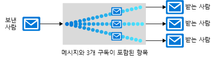

Azure 내에서 비롯 하 여 분산된 응용 프로그램의 안정성을 개선 하는 데 도움이 되는 다양 한 통신 플랫폼 이며 이러한 도구 각각은 다른 용도로 사용됩니다. 적절한 도구를 선택할 수 있도록 Azure의 각 도구를 검토해 보겠습니다.

피자 순서 지정 및 추적 응용 프로그램의 아키텍처에 여러 구성 요소가 필요 함: 웹 사이트, 데이터 저장소, 백 엔드 서비스, 등입니다. Azure에서는 다양한 방법으로 자사 응용 프로그램의 구성 요소를 함께 바인딩할 수 있으며, 단일 응용 프로그램은 여러 기술을 활용할 수 있습니다. 

Contoso Slices 응용 프로그램에서 사용할 기술을 결정해야 합니다. 첫 번째 단계로 여러 부분 간에 통신이 이뤄지는 각 위치를 평가합니다. 일부 구성 요소는 응용 프로그램이 언제든 해당 작업을 수행할 수 있도록 시기 적절하게 실행_돼야_ 합니다. 일부 중요 하지만 시간이 중요 하지 않습니다 수 있습니다. 마지막으로, 모바일 앱 알림 같은 기타 구성 요소는 좀 더 선택적입니다.

여기에서 응용 프로그램의 각 요구 사항에 적합한 플랫폼을 선택할 수 있도록 Azure에서 사용할 수 있는 통신 플랫폼에 대해 배웁니다.

## 메시지 및 이벤트 중 결정

메시지 및 이벤트는 한 구성 요소에서 다른 구성 요소로 전송된 데이터의 패키지인 모든 **datagrams**입니다. 이들은 처음에는 미묘하게 다르지만 응용 프로그램을 설계하는 방법에서 뚜렷한 차이를 보입니다. 

### 메시지

분산된 응용 프로그램의 용어에서 메시지의 특성은 응용 프로그램의 전체 무결성이 수신되는 메시지에 의존할 수 있는 것으로 정의됩니다. 워크플로의 배턴을 다른 구성 요소에 전달하는 하나의 구성 요소로 메시지 전송을 고려할 수 있습니다. 전체 워크플로는 중요한 비즈니스 프로세스일 수 있으며, 메시지는 구성 요소를 함께 포함하는 모르타르입니다.

일반적으로 메시지를 데이터 자체 뿐 아니라에 대 한 참조 (예: ID 또는 URL) 데이터를 포함합니다. 데이터그램의 일부로 데이터를 전송하면 참조를 전송할 때보다 더 안정적입니다. 메시징 아키텍처, 메시지 배달을 보장 하 고 필요 없는 추가 조회 이기 때문에 안정적으로 메시지 처리 합니다. 그러나 보내는 응용 프로그램을 포함 하도록, 불필요 한 작업을 위해 수신 구성 요소를 필요로 하는 너무 많은 데이터를 전송 하지 않도록 데이터 정확 하 게 확인 해야 합니다. 이러한 관점에서 메시지를 보낸 사람과 받는 사람은 종종 엄격한 데이터 계약을 체결하기도 합니다.

Contoso 조각 새로운 아키텍처에서는 피자 주문 입력 되 면 메시지 사용은 가능성이 높습니다. 웹 프런트 엔드 또는 모바일 앱 백 엔드 처리 구성 요소에 메시지를 보낼 됩니다. 백 엔드에서 단계 고객 근처 스토어로 라우팅 신용 카드 청구 등이 수행 됩니다.

### 이벤트

이벤트가 발생 하는 알림을 트리거합니다. 이벤트는 메시지 보다 "밝은" 하 고 브로드캐스트 통신에 대 한 가장 자주 사용 됩니다.

이벤트의 특성은 다음과 같습니다.
* 이벤트가 여러 수신자에게 발신되거나 전혀 발신되지 않을 수 있음
* 이벤트는 종종 각 게시자에 대한 다수의 구독자를 “팬아웃”하거나 포함해야 함
* 이벤트 게시자는 수신 구성 요소가 수행하는 작업에 대한 기대가 없음

피자 체인은 상태 변경에 대해 사용자에게 알리기 위해 이벤트를 사용할 수 있습니다. 상태 변경 이벤트에 대 한 Azure Notification hubs 및 Azure Functions에 로그온 한 다음 Azure Event Grid에 보낼 수는 완전히 _서버 리스_ 솔루션입니다.

통신 플랫폼이 일반적으로 둘 중 하나만 처리하도록 설계됐기 때문에 이벤트 및 메시지 간의 이 차이는 당연한 것입니다. Service Bus는 메시지를 처리하도록 설계되었습니다. 이벤트를 전송하려는 경우 Event Grid를 선택할 가능성이 높습니다. 

또한 azure는 Azure Event Hubs에 있지만 특정 유형의 분석을 위해 사용 하는 통신 스트림의 높은 흐름에 대 한 가장 자주 사용 됩니다. 예를 들어에서는 했습니다 센서는 피자 레인지에 네트워크로 연결 하는 경우 Azure Stream Analytics를 사용 하 여 결합 된 Event Hubs 수의 온도 변화를 원하지 않는 화재 또는 구성 요소 wear를 나타낼 수 있는 패턴을 사용 합니다.

## Service Bus 토픽, 큐 및 릴레이

Azure Service Bus는 세 가지 방법으로 메시지를 교환 하기: 큐, 토픽 및 릴레이 합니다.

### 큐 란?

**큐**는 메시지용 간단한 임시 저장소 위치입니다. 전송 구성 요소는 큐에 메시지를 추가합니다. 대상 구성 요소는 큐의 앞에서 메시지를 선택합니다. 일반적인 상황에서 각 메시지가 하나의 수신기에서 수신 됩니다.

큐는 많은 요구에서 대상 구성 요소를 보호하려면 원본 및 대상 구성 요소를 분리합니다. 

사용량이 많은 시간 동안 수에 들어오는 메시지 대상 구성 요소에서 처리 하는 보다 빠르게입니다. 원본 구성 요소를 대상에 직접 연결 되지 있으므로 원본에 영향을 받지 않습니다 및 큐 증가 합니다. 대상 구성 요소는 메시지를 처리할 수 있으므로 큐에서 메시지를 제거합니다. 요구가 감소하면 대상 구성 요소는 catch할 수 있으며 큐는 단축됩니다. 

큐는 시스템에 리소스를 추가하지 않고서도 이처럼 많은 요구에 응답할 수 있습니다. 그러나 비교적 신속하게 처리해야 하는 메시지의 경우 대상 구성 요소의 추가 인스턴스를 추가하면 로드를 공유할 수 있습니다. 각 메시지는 하나의 인스턴스에서만 처리됩니다. 이것이 실제로 리소스가 필요한 구성 요소에 리소스를 추가하는 동안만 전체 응용 프로그램을 확장할 수 있는 효과적인 방법입니다.

### 주제 란 무엇입니까?

**토픽**은 큐와 유사하지만 여러 구독이 있을 수 있습니다. 즉, 각 메시지가 여러 수신자에게 배달되도록 여러 대상 구성 요소가 단일 토픽을 구독할 수 있습니다. 구독은 관련이 있는 메시지만 수신하려면 토픽에서 메시지를 필터링할 수도 있습니다. 구독은 큐와 동일한 분리된 통신을 제공하고 동일한 방식으로 많은 요구에 응답합니다. 하나를 초과하는 대상 구성 요소에 각 메시지를 전달하려는 경우 토픽을 사용하세요.

토픽은 기본 가격 책정 계층에서 지원되지 않습니다.

### 릴레이 란?

**릴레이**는 응용 프로그램 간에 양방향 동기 통신을 수행하는 개체입니다. 큐 및 토픽과 같은 메시지의 임시 저장소 위치가 아닙니다. 대신, 양방향 방화벽과 같은 네트워크 경계를 넘어 버퍼링 되지 않은 연결을 제공합니다. 동일한 네트워크 세그먼트에 있는 된 않지만 네트워크 보안 장치를 구분 하는 경우에 따라 구성 요소 간의 직접 통신 하려는 경우에 릴레이 사용 합니다.

> [!NOTE]
> 릴레이 사용 하면 Azure Service Bus의 일부인, 있지만 느슨하게 결합 된 메시징 워크플로 구현 하지 않으며이 모듈에 대 한 자세한 고려 되지 않습니다.

## Service Bus 큐 및 저장소 큐

메시지 큐를 포함 하는 두 가지 Azure 기능이: Service Bus 및 Azure Storage 계정. 일반적으로 저장소 큐는 간단 하 게 사용 하지만 덜 복잡 하 고 Service Bus 큐 보다 유연 합니다.

Service Bus 큐의 주요 장점은 다음과 같습니다.

* 더 큰 메시지 크기(메시지당 256KB 대 64KB) 지원
* 최소 1회 및 최대 1회 배달 모두 지원 - 메시지가 손실되는 아주 드문 기회 또는 두 번 처리되는 아주 드문 기회 중에서 선택
* 보증 **선입 선출 (FIFO)** 순서-메시지를 동일한 추가 된 순서 대로 처리 됩니다 (FIFO 큐의 정상적인 작동을 있지만 반드시지 않습니다 모든 메시지에 대해)
* 여러 메시지를 한 트랜잭션으로 그룹화 가능 - 트랜잭션에서 한 메시지를 배달하지 못하는 경우 트랜잭션에서 모든 메시지가 배달되지 않음
* 역할 기반 보안 지원
* 큐를 계속 폴링하기 위해 대상 구성 요소가 필요하지 않음

Storage 큐의 이점은 다음과 같습니다.

* (Service Bus 큐에 80 GB 한계)와 무제한 큐 크기를 지원합니다.
* 모든 메시지의 로그 유지 관리

## 통신 기술을 선택하는 방법

Azure에서 제공하는 다양한 개념 및 구현을 살펴보았습니다. 의사 결정 과정이 각 통신에 대해 어떤 모습이어야 하는지를 살펴보겠습니다.

#### 다음과 같은 질문을 고려해보세요.

1. 통신이 이벤트인가요? 경우에 Event Grid 또는 Event Hubs를 사용 하는 것이 좋습니다.

1. 단일 메시지가 하나를 초과하는 대상에 배달되어야 하나요? 그렇다면 Service Bus 토픽을 사용합니다. 그렇지 않은 경우 큐를 사용 합니다.

큐가 필요하다고 결정하는 경우 다음을 수행합니다.

#### 다음과 같은 경우 Service Bus 큐를 선택합니다.

- 대부분 한 번 배달 보증 해야
- FIFO 보장 필요
- 메시지를 트랜잭션으로 그룹화해야 함
- 큐를 폴링하지 않고 메시지를 수신하려고 함
- 큐에 대 한 역할 기반 액세스를 제공 해야 합니다.
- 256KB 보다는 작습니다 64KB 보다 큰 메시지를 처리 해야 합니다.
- 큐 크기는 80GB보다 더 커지지 않음
- 일괄 처리 메시지를 게시하고 사용할 수 있기를 원함

#### 경우에 큐 저장소를 선택 합니다.
- 특정 추가 요구 사항 없는 간단한 큐 필요
- 큐를 통과하는 모든 메시지의 감사 추적 필요
- 큐의 크기가 80GB를 초과할 것으로 예상됨
- 큐 내부의 메시지 처리 진행률을 추적하려고 함

분산된 응용 프로그램의 구성 요소 직접 통신할 수 있지만 Azure Service Bus 또는 Azure Event Grid와 같은 중간 통신 플랫폼을 사용 하 여 종종 해당 통신의 안정성을 늘릴 수 있습니다.

Event Grid는 이벤트를 이벤트의만 받는 사람에 게 알리고 해당 이벤트와 연결 된 원시 데이터가 포함 되지 않습니다 설계 되었습니다. Azure Event Hubs는 이벤트 유형의 높은 흐름 분석에 대 한 설계 되었습니다. Azure Service Bus 및 저장소 큐는 응용 프로그램 워크플로의 핵심 부분을 바인딩하는 데 사용할 수 있는 메시지용입니다.

하나의 대상에 각 메시지를 전송 하려는 경우 또는 코드를 최대한 신속 하 게 작성 하려는 경우 요구 사항을 간단 경우 저장소 큐 가장 적합 한 옵션을 수 있습니다. 그렇지 않은 경우 Service Bus 큐에서 더 많은 옵션과 유연성을 제공합니다.

여러 구독자에게 메시지를 보내려는 경우 Service Bus 토픽을 사용합니다.
