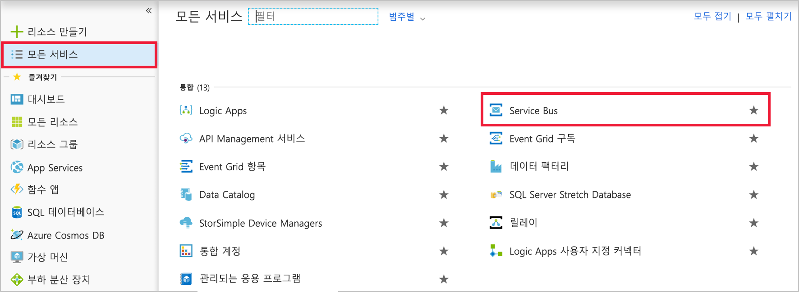
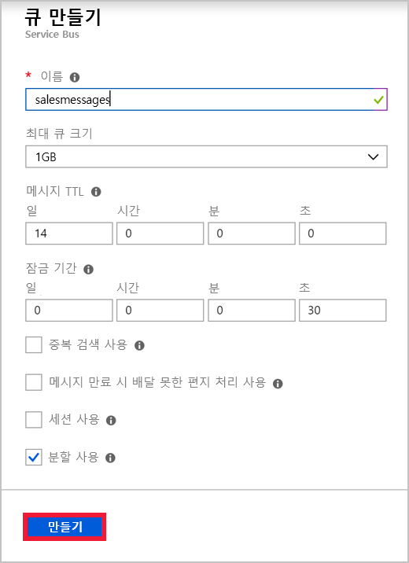
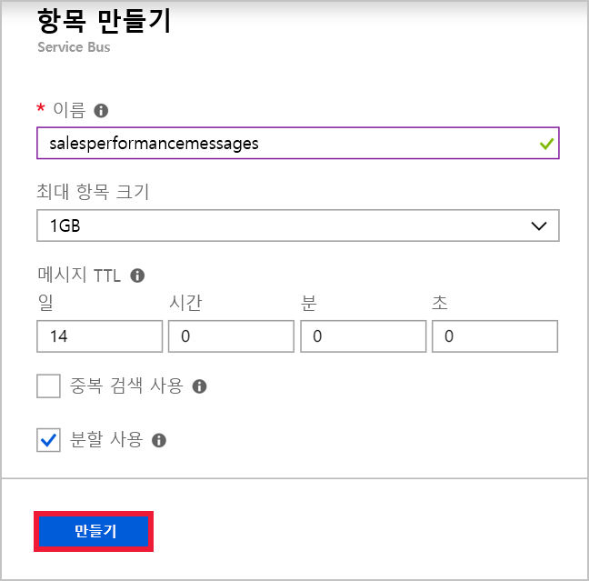

다국적 기업의 영업 팀에서 특정 응용 프로그램을 사용한다고 가정해 보겠습니다. 각 팀 멤버에게는 앱을 설치할 휴대폰이 있습니다. Azure에서 호스팅되는 웹 서비스가 응용 프로그램의 비즈니스 논리를 구현하고 정보를 Azure SQL Database에 저장합니다. 각 지역에는 웹 서비스 인스턴스가 하나씩 있습니다. 모바일 앱과 웹 서비스 간에 메시지를 보내는 용도는 다음과 같이 확인되었습니다.

- 개별 판매와 관련된 메시지는 사용자 지역의 웹 서비스 인스턴스로만 전송해야 합니다.
- 영업 성과 관련 메시지는 웹 서비스의 모든 인스턴스로 전송해야 합니다.

첫 번째 사용 사례에는 Service Bus 큐를, 두 번째 사용 사례에는 Service Bus 항목을 구현하기로 결정했습니다.

[!include]

이 연습에서는 구독과 함께 큐와 항목을 모두 포함할 Service Bus 네임스페이스를 만듭니다.

## Service Bus 네임스페이스 만들기

Azure Service Bus의 네임스페이스는 고유한 정규화된 도메인 이름이 지정된 큐, 항목 및 릴레이용 컨테이너입니다. 먼저 네임스페이스를 만들어야 합니다.

각 네임스페이스에는 기본 및 보조 공유 액세스 서명 암호화 키도 포함됩니다. 전송 또는 수신 구성 요소는 네임스페이스 내의 개체에 액세스하기 위해 연결할 때 이러한 키를 제공해야 합니다.

Azure Portal을 사용하여 Service Bus 네임스페이스를 만들려면 다음 단계를 수행하세요.

1. [Azure Portal](https://portal.azure.com/triplecrownlabs.onmicrosoft.com?azure-portal=true)에 로그인합니다.

1. 왼쪽 탐색 영역에서 **모든 서비스**를 클릭합니다.

1. **모든 서비스** 블레이드에서 아래쪽의 **통합** 섹션으로 스크롤한 다음, **Service Bus**를 클릭합니다.

    

1. **Service Bus** 블레이드의 왼쪽 위에서 **추가**를 클릭합니다.

1. **이름** 텍스트 상자에 네임스페이스의 고유한 이름을 입력합니다. 예: "salesteamapp" + *사용자 이니셜* + *현재 날짜*를 입력합니다.

1. **가격 책정 계층** 드롭다운 목록에서 **표준**을 선택합니다.

1. **구독** 드롭다운 목록에서 구독("Concierge 구독")을 선택합니다.

1. **리소스 그룹**에서 **기존 항목 사용**을 선택하고 “<rgn>[샌드박스 리소스 그룹 이름]</rgn>”을 선택합니다.

1. **위치** 드롭다운 목록의 아래 목록에서 가까운 위치를 선택합니다.

    [!include]

1. **만들기**를 클릭하여 Service Bus 네임스페이스를 만듭니다.

    

## Service Bus 큐 만들기

이제 네임스페이스를 만들었으므로 개별 판매 관련 메시지용으로 큐를 만들 수 있습니다. 이렇게 하려면 다음 단계를 수행하세요.

1. **Service Bus** 블레이드에서 **새로 고침**을 클릭합니다. 방금 만든 네임스페이스가 표시됩니다.

1. 방금 만든 네임스페이스를 클릭합니다.

1. 네임스페이스 블레이드의 왼쪽 위에서 **+ 큐**를 클릭합니다.

1. **큐 만들기** 블레이드의 **이름** 텍스트 상자에 **salesmessages**를 입력한 다음, **만들기**를 클릭합니다. Azure는 네임스페이스에 큐를 만듭니다.

    

## Service Bus 항목과 구독 만들기

영업 성과 관련 메시지에 사용할 항목도 만들려고 합니다. 그러면 여러 국가에서 사용되는 비즈니스 논리 웹 서비스의 복수 인스턴스가 이 항목을 구독하게 됩니다. 각 메시지는 여러 인스턴스로 배달됩니다.

다음 단계를 수행하세요.

1. **Service Bus 네임스페이스** 블레이드에서 **+ 항목**을 클릭합니다.

1. **항목 만들기** 블레이드의 **이름** 텍스트 상자에 **salesperformancemessages**를 입력한 다음, **만들기**를 클릭합니다. Azure는 네임스페이스에 항목을 만듭니다.

    

1. 항목이 생성되면 **Service Bus 네임스페이스** 블레이드의 **엔터티** 아래에서 **항목**을 클릭합니다.

1. 항목 목록에서 **salesperformancemessages**를 클릭한 다음, **+ 구독**을 클릭합니다.

1. **이름** 텍스트 상자에 **Americas**를 입력한 다음, **만들기**를 클릭합니다.

1. **+ 구독**을 클릭합니다.

1. **이름** 텍스트 상자에 **EuropeAndAfrica**를 입력한 다음, **만들기**를 클릭합니다.

영업용 분산 응용 프로그램의 복원 기능을 개선하기 위해 Service Bus를 사용하는 데 필요한 인프라를 빌드했습니다. 그리고 개별 판매 관련 메시지용 큐와 영업 성과 관련 메시지용 항목을 만들었습니다. 항목으로 전송되는 메시지는 전 세계의 여러 받는 사람 웹 서비스로 배달될 수 있으므로, 항목은 여러 구독을 포함합니다.
