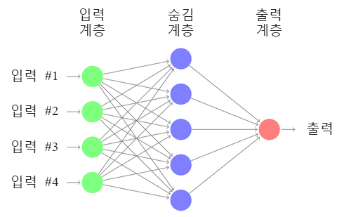
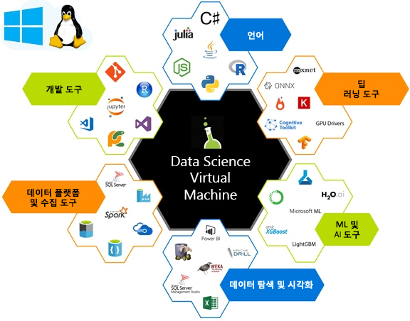

ML(Machine Learning)의 목표는 그림, 시계열, 오디오 등의 입력 데이터를 캡션, 가격 값, 전사 등의 지정된 출력으로 변환하는 모델을 학습시키는 기능을 찾는 것입니다. 기존 데이터 과학에서는 기능을 수동으로 만드는 경우가 많았습니다. 이렇게 수동으로 만든 기능은 다음 다이어그램에 표시된 네트워크와 같은 단순 학습 알고리즘에 공급됩니다. 

DL(딥 러닝)에서는 입력을 벡터로 표시하고 일련의 지능적 선형 대수 연산을 수행하여 지정된 출력으로 변환하는 과정을 통해 기능 추출 프로세스를 학습합니다.  모델 출력은 손실 함수라는 방정식을 사용하여 필요한 출력과 비교됩니다. 각 학습 입력의 손실 함수에서 반환하는 값이 모델에 기능 추출 방법을 안내하므로 다음 단계에서는 손실 값이 줄어듭니다. 이 프로세스를 *교육*이라고 합니다. 

이러한 알고리즘은 교육을 통해 지정된 데이터 집합에 대해 가장 성능이 탁월하고 가장 적합한 기능을 학습합니다. 네트워크 내의 여러 계층 때문에 이를 심층 학습이라고 부릅니다.  

선형 대수 구성 요소의 일부로 계산하는 일련의 행렬 작업은 계산상 비용이 많이 듭니다. 이러한 작업은 병렬로 처리되는 경우가 많으므로 효율적인 계산을 위해 GPU(그래픽 처리 장치) 등의 특화된 계산에 가장 적합한 후보가 될 수 있습니다.

딥 러닝을 수행하기 위한 환경을 설정하는 것은 간단하지 않습니다. 하드웨어를 어떻게 설정할 것인지, CPU 또는 GPU 중 어느 것을 사용하여 학습할 것인지, 이러한 머신에 필요한 메모리 양은 얼마나 되는지 등을 알아야 합니다. 딥 러닝 네트워크를 만들고 교육하기 위해서는 적합한 소프트웨어를 설치해야 합니다. 다양한 딥 러닝 프레임워크 중에서 선택할 수 있지만 각 구성 요소 간의 종속성에 주의해야 합니다. 이 설정 후에는 다른 프레임워크에서 만든 우수한 모델을 찾아서 사용해 볼 수 있습니다. 머신에 설정된 모든 종속성으로 새로운 딥 러닝 프레임워크에 오버헤드가 발생하기를 원치 않을 것입니다. Data Science Virtual Machine이 이러한 문제를 해결하는 데 도움을 줄 수 있습니다. 

## DSVM(Data Science Virtual Machine)이란?

Data Science Virtual Machine은 Azure에서의 VM(가상 머신) 이미지입니다. 여기에는 다수의 유명한 데이터 과학 및 딥 러닝 도구가 이미 설치 및 구성되어 있습니다. 이러한 이미지는 Microsoft R Server Developer Edition, Microsoft R Open, Anaconda Python, Julia, Jupyter Notebook, Visual Studio Code, RStudio, xgboost 등을 포함하여 유명한 데이터 과학 및 기계 학습 도구와 함께 제공됩니다.  필적할 만한 작업 영역을 직접 롤아웃하는 대신 DSVM을 프로비전하면 설치, 구성 및 패키지 관리 프로세스에 소요되는 시간을 절약할 수 있습니다. DSVM이 배포된 후 데이터 과학 프로젝트에 대한 작업을 즉시 시작할 수 있습니다.

DSVM은 GPU(그래픽 처리 장치) 하드웨어에서 딥 러닝 알고리즘을 사용하는 교육 모델에 사용할 수 있습니다. Azure 클라우드의 VM 크기 조정 기능을 활용하면 DSVM을 통해 필요에 따라 클라우드에서 GPU 기반 하드웨어를 사용할 수 있습니다. 큰 모델을 학습할 때 또는 동일한 OS 디스크를 유지하면서 고속 계산이 필요할 때 GPU 기반 VM으로 전환할 수 있습니다. Windows Server 2016 버전 DSVM에는 GPU 드라이버, 프레임워크 및 GPU 버전 딥 러닝 프레임워크가 미리 설치되어 있습니다. Linux에서는 GPU 딥 러닝이 CentOS 및 Ubuntu DSVM 모두에서 사용하도록 설정됩니다. 또한 Ubuntu, CentOS 또는 Windows 2016 버전의 Data Science VM을 CPU 기반 Azure 가상 머신에 배포할 수도 있습니다. 이 경우 모든 딥 러닝 프레임워크가 CPU 모드로 대체됩니다. 

DSVM을 사용하여 수행할 수 있는 작업에 대한 자세한 내용은 [Azure에서 Linux Data Science Virtual Machine을 사용한 데이터 과학](https://docs.microsoft.com/azure/machine-learning/data-science-virtual-machine/linux-dsvm-walkthrough)을 참조하세요.

